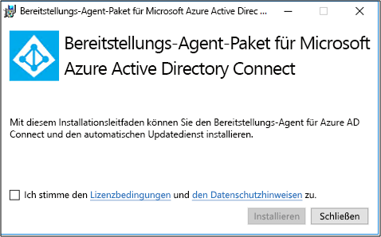
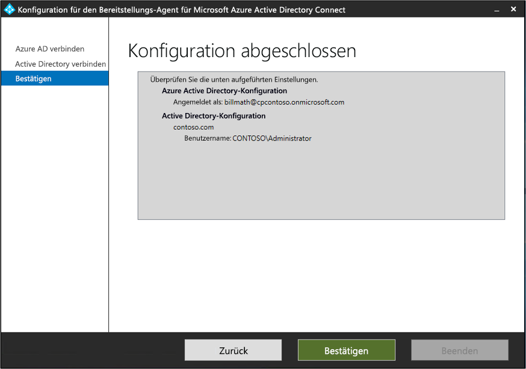

# Installieren des Azure AD Connect-Bereitstellungs-Agents
In diesem Dokument erhalten Sie Informationen zum Installationsvorgang für den Azure AD Connect-Bereitstellungs-Agent und dessen Konfiguration im Azure-Portal.

>[!IMPORTANT]
>In den folgenden Installationsanweisungen wird davon ausgegangen, dass alle [Voraussetzungen](how-to-prerequisites.md) erfüllt sind.

Unter den folgenden Links erhalten Sie Informationen zur Installation und Konfiguration des Azure AD Connect-Bereitstellungs-Agents:
    
- [Installieren des Agents](#install-the-agent)
- [Überprüfen der Agent-Installation](#verify-agent-installation)

## Installieren des Agents

1. Melden Sie sich bei dem Server an, den Sie mit den Berechtigungen eines Unternehmensadministrators verwenden werden.
2. Navigieren Sie zum Azure-Portal, und klicken Sie auf der linken Seite auf Azure Active Directory.
3. Klicken Sie erst auf **Bereitstellung verwalten (Vorschau)** und dann auf **Alle Agents überprüfen**.
3. Laden Sie den Azure AD Connect-Bereitstellungs-Agent über das Azure-Portal herunter.
 
3. Führen Sie den Azure AD Connect-Bereitstellungs-Agent aus (AADConnectProvisioningAgent.Installer).
3. **Akzeptieren** Sie auf dem Begrüßungsbildschirm die Lizenzbedingungen, und klicken Sie auf **Installieren**. 
 

4. Nach Abschluss dieses Vorgangs wird der Konfigurations-Assistent gestartet.  Melden Sie sich mit dem Konto Ihres globalen Azure AD-Administrators an.
5. Klicken Sie auf dem Bildschirm **Connect Active Directory** (Active Directory verbinden) auf **Verzeichnis hinzufügen**, und melden Sie sich dann mit Ihrem Active Directory-Administratorkonto an.  Dadurch wird Ihr lokales Verzeichnis hinzugefügt.  Klicken Sie auf **Weiter**. 
 

6. Klicken Sie auf dem Bildschirm **Konfiguration abgeschlossen** auf **Bestätigen**.  Dadurch wird der Agent registriert und neu gestartet. 
 

7. Sobald dieser Vorgang abgeschlossen ist, sollte der Hinweis angezeigt werden, dass **die Agent-Konfiguration erfolgreich überprüft wurde**.  Sie können dann auf **Beenden** klicken. 
 
8. Falls der erste Begrüßungsbildschirm weiterhin angezeigt wird, klicken Sie auf **Schließen**.

## Überprüfen der Agent-Installation
Die Agent-Überprüfung erfolgt im Azure-Portal und auf dem lokalen Server, auf dem der Agent ausgeführt wird.

### Agent-Überprüfung im Azure-Portal
Führen Sie die folgenden Schritte aus, um zu überprüfen, ob der Agent von Azure erkannt wird:

1. Melden Sie sich beim Azure-Portal an.
2. Wählen Sie auf der linken Seite **Azure Active Directory** aus, klicken Sie auf **Azure AD Connect**, und wählen Sie im mittleren Bereich **Bereitstellung verwalten (Vorschau)** aus. 
 

3.  Klicken Sie auf dem Bildschirm **Azure AD-Bereitstellung (Vorschau)** auf **Alle Agents überprüfen**.
 
 
4. Auf dem Bildschirm **On-premises provisioning agents** (Lokale Bereitstellungs-Agents) werden die von Ihnen installierten Agents angezeigt.  Vergewissern Sie sich, dass der betreffende Agent aufgeführt wird und als **Aktiviert** markiert ist.
 

### Überprüfen des Ports
Sie können den folgenden Link verwenden, um zu überprüfen, ob Azure Port 443 überwacht und ob der Agent mit diesem kommunizieren kann:

https://aadap-portcheck.connectorporttest.msappproxy.net/ 

Mithilfe dieses Tests wird überprüft, ob Ihre Agents über Port 443 mit Azure kommunizieren können.  Öffnen Sie einen Browser, und navigieren Sie zu der obigen URL des Servers, auf dem der Agent installiert ist.

### Auf dem lokalen Server
Führen Sie die folgenden Schritte aus, um sicherzustellen, dass der Agent ausgeführt wird:

1.  Melden Sie sich beim Server mit einem Administratorkonto an.
2.  Öffnen Sie **Dienste**, indem Sie zu dieser Seite oder zu „Start/Run/Services.msc“ navigieren.
3.  Vergewissern Sie sich, dass unter **Dienste** die Dienste **Microsoft Azure AD Connect Agent Updater** und **Microsoft Azure AD Connect-Bereitstellungs-Agent** angezeigt werden und ihr Status **Wird ausgeführt** lautet.

>[!IMPORTANT]
>Nachdem Sie den Agent installiert haben, muss er konfiguriert und aktiviert werden, bevor er mit der Synchronisierung von Benutzern beginnt.  Informationen zum Konfigurieren eines neuen Agents finden Sie unter [Konfigurieren des neuen Azure AD Connect-Bereitstellungs-Agents](how-to-configure.md).

## Nächste Schritte 

- [Was ist die Identitätsbereitstellung?](what-is-provisioning.md)
- [Was ist die Azure AD Connect-Cloudbereitstellung?](what-is-cloud-provisioning.md)
 
