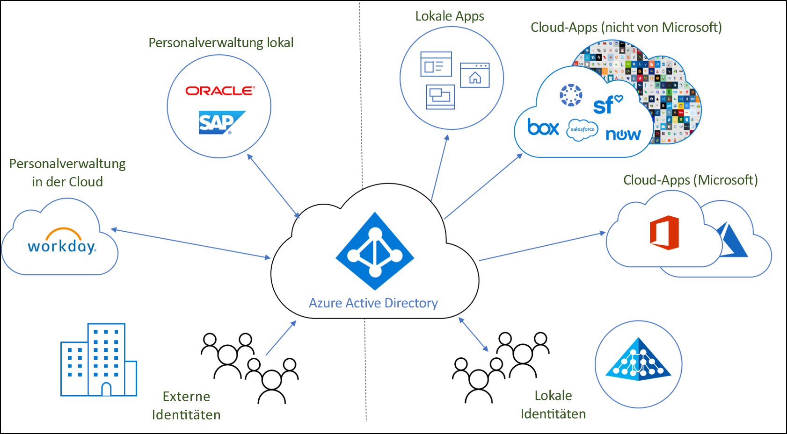
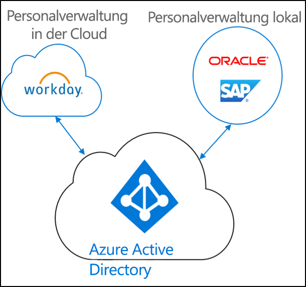
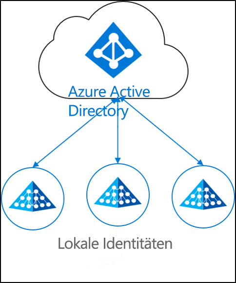

# Was ist die Identitätsbereitstellung?

Heutzutage werden Unternehmen und Konzerne immer mehr zu einer Mischung aus lokalen Anwendungen und Cloudanwendungen.  Benutzer müssen sowohl auf lokale Anwendungen als auch auf Cloudanwendungen zugreifen können – idealerweise mit einer einzelnen Identität, die sowohl für lokale Anwendungen als auch für Cloudanwendungen verwendet werden kann.

Bei der Bereitstellung wird ein Objekt auf der Grundlage bestimmter Bedingungen erstellt, auf dem neuesten Stand gehalten und wieder gelöscht, wenn die Bedingungen nicht mehr erfüllt sind. Ein Beispiel: Wenn in Ihrer Organisation ein neuer Benutzer hinzukommt, wird er in das Personalsystem aufgenommen.  An diesem Punkt kann im Zuge der Bereitstellung ein entsprechendes Benutzerkonto in der Cloud, in Active Directory und in verschiedenen Anwendungen erstellt werden, auf die der Benutzer Zugriff benötigt.  Dadurch kann der Benutzer umgehend mit der Arbeit beginnen und auf die benötigten Anwendungen und Systeme zugreifen. 

Im Kontext von Azure Active Directory lässt sich die Bereitstellung in folgende Schlüsselszenarien unterteilen:  

- **[Personalbasierte Bereitstellung](#hr-driven-provisioning)**  
- **[App-Bereitstellung](#app-provisioning)**  
- **[Verzeichnisbereitstellung](#directory-provisioning)** 

## Personalbasierte Bereitstellung

Die Cloudbereitstellung aus dem Personalsystem umfasst die Erstellung von Objekten (Benutzer, Rollen, Gruppen usw.) auf der Grundlage der Informationen aus Ihrem Personalsystem.  

Gängigstes Szenario: Ein neuer Mitarbeiter wird eingestellt und in das Personalsystem aufgenommen.  Daraufhin wird er in der Cloud bereitgestellt –  in diesem Fall in Azure AD.  Die Bereitstellung aus dem Personalsystem kann folgende Szenarien umfassen: 

- **Einstellung neuer Mitarbeiter:** Wenn ein neuer Mitarbeiter dem cloudbasierten Personalsystem hinzugefügt wird, wird in Active Directory, in Azure Active Directory und optional in Office 365 sowie in anderen, von Azure AD unterstützten SaaS-Anwendungen automatisch ein Benutzerkonto erstellt, und die E-Mail-Adresse wird in das cloudbasierte Personalsystem zurückgeschrieben.
- **Aktualisierung von Mitarbeiterattributen und -profilen:** Wenn im cloudbasierten Personalsystem ein Mitarbeiterdatensatz aktualisiert wird (beispielsweise der Name, Titel oder Vorgesetzte), wird das entsprechende Benutzerkonto in Active Directory, in Azure Active Directory und optional in Office 365 und in anderen, von Azure AD unterstützten SaaS-Anwendungen automatisch aktualisiert.
- **Kündigung von Mitarbeitern:** Wenn einem Mitarbeiter im cloudbasierten Personalsystem gekündigt wird, wird das entsprechende Benutzerkonto in Active Directory, in Azure Active Directory und optional in Office 365 und in anderen, von Azure AD unterstützten SaaS-Anwendungen automatisch deaktiviert.
- **Wiedereinstellung von Mitarbeitern:** Wenn ein Mitarbeiter im cloudbasierten Personalsystem erneut eingestellt wird, kann sein altes Konto in Active Directory, in Azure Active Directory und optional in Office 365 und in anderen, von Azure AD unterstützten SaaS-Anwendungen je nach Präferenz automatisch reaktiviert oder erneut bereitgestellt werden.

## App-Bereitstellung

Die App-Bereitstellung umfasst die Bereitstellung von Benutzern und Rollen in den Anwendungen, auf die der Benutzer Zugriff benötigt.  

Gängigstes Szenario: Ein Benutzer in Azure AD wird in O365 oder Salesforce bereitgestellt.

## Verzeichnisbereitstellung

Die lokale Bereitstellung umfasst die Bereitstellung aus lokalen Quellen (etwa Active Directory) in Azure AD.  

Gängigstes Szenario: Ein Benutzer in Active Directory (AD) wird in Azure AD bereitgestellt.

Hierzu werden die Azure AD Connect-Synchronisierung, die Azure AD Connect-Cloudbereitstellung und Microsoft Identity Manager verwendet. 
 
## Nächste Schritte 

- [Was ist die Azure AD Connect-Cloudbereitstellung?](what-is-cloud-provisioning.md)
- [Installieren des Azure AD Connect-Bereitstellungs-Agents](how-to-install.md)