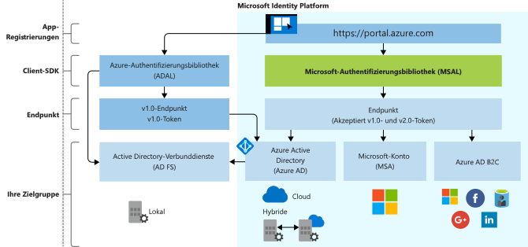

# Entwicklung der Microsoft Identity Platform

Microsoft Identity Platform ist eine Weiterentwicklung der Azure AD-Entwicklerplattform (Azure Active Directory). Sie ermöglicht Entwicklern das Erstellen von Anwendungen, mit denen Benutzer angemeldet werden, sowie das Abrufen von Token zum Aufrufen von APIs, etwa Microsoft Graph oder von Entwicklern erstellten APIs. Die Plattform umfasst einen Authentifizierungsdienst, Open-Source-Bibliotheken, Anwendungsregistrierung und -konfiguration (über ein Entwicklerportal und eine Anwendungs-API), eine vollständige Entwicklerdokumentation, Schnellstartbeispiele, Codebeispiele, Tutorials, Schrittanleitungen und weitere Inhalte für Entwickler. Microsoft Identity Platform unterstützt die branchenüblichen Protokolle, z.B. OAuth 2.0 und OpenID Connect.

Bisher haben die meisten Entwickler mit der Azure AD v1.0-Plattform gearbeitet, um (von Azure AD bereitgestellte) Geschäfts-, Schul- und Unikonten zu authentifizieren, indem sie Token vom Azure AD v1.0-Endpunkt angefordert, die Azure AD-Authentifizierungsbibliothek (ADAL), das Azure-Portal für die Anwendungsregistrierung und -konfiguration und die Azure AD Graph-API für die programmgesteuerte Anwendungskonfiguration verwendet haben.

Mit Microsoft Identity Platform (v2.0) dehnen Sie Ihre Reichweite auf folgende Benutzertypen aus:

- Geschäfts-, Schul- oder Unikonten (von Azure AD bereitgestellte Konten)
- Persönliche Konten (z. B. Outlook.com oder Hotmail.com)
- Kunden mit eigenen E-Mail-Adressen oder Social Media-Konten (z. B. LinkedIn, Facebook, Google) über das Azure AD B2C-Angebot

Dank der einheitlichen Microsoft Identity Platform können Sie einmalig Code schreiben und beliebige Microsoft-Identitäten in Ihrer Anwendung authentifizieren. Die Microsoft-Authentifizierungsbibliothek (MSAL) ist eine vollständig unterstützte Open Source-Bibliothek und steht für verschiedene Plattformen zur Verfügung. MSAL ist einfach zu verwenden und bietet Benutzern hervorragende Funktionen für einmaliges Anmelden (SSO). Sie ist auf hohe Zuverlässigkeit und Leistung ausgelegt und wurde unter Verwendung von Microsoft Secure Development Lifecycle (SDL) entwickelt. Sie können Ihre Anwendung so konfigurieren, dass sie beim Aufrufen von APIs die inkrementelle Zustimmung nutzt. Dadurch wird eine Zustimmung für invasivere Geltungsbereiche erst angefordert, wenn dies durch die Anwendungsnutzung zur Laufzeit erforderlich wird.

Sie können das Azure-Portal zum Registrieren und Konfigurieren Ihrer Anwendung und die Microsoft Graph-API für die programmgesteuerte Anwendungskonfiguration verwenden.

Aktualisieren Sie Ihre Anwendung in Ihrem eigenen Tempo. Mit ADAL-Bibliotheken erstellte Anwendungen werden weiterhin unterstützt. Gemischte Portfolios aus Anwendungen, die mit ADAL- und mit MSAL-Bibliotheken erstellt wurden, werden ebenfalls unterstützt. So können Anwendungen, die die aktuelle ADAL- und die aktuelle MSAL-Bibliothek nutzen, eine portfolioübergreifende SSO-Funktionalität bieten. Gewährleistet wird dies durch den gemeinsamen Tokencache, den beide Bibliotheken nutzen. Anwendungen, die von ADAL auf MSAL aktualisiert werden, behalten den Benutzeranmeldestatus beim Upgrade bei.

## Benutzeroberfläche von Microsoft Identity Platform

Die folgende Abbildung zeigt eine Übersicht der Microsoft-Identitätsbenutzeroberfläche. Dabei werden die App-Registrierungsbenutzeroberfläche, SDKs, Endpunkte und unterstützte Identitäten berücksichtigt.

### Umgebung für die App-Registrierung

Die Seite **[App-Registrierungen](https://go.microsoft.com/fwlink/?linkid=2083908)** im Azure-Portal ist die zentrale Portaloberfläche für die Verwaltung aller in Microsoft Identity Platform integrierten Anwendungen. Wenn Sie bisher das App-Registrierungsportal verwendet haben, sollten Sie jetzt auf die App-Registrierungsoberfläche im Azure-Portal umsteigen.

Zur Integration von Azure AD B2C (für die Authentifizierung von Social Media- oder lokalen Identitäten) müssen Sie Ihre Anwendung bei einem B2C-Mandanten registrieren. Diese Funktion ist ebenfalls Bestandteil des Microsoft Azure-Portals.

Die **Anwendungs-API in Microsoft Graph** ist derzeit als Vorschauversion verfügbar. Verwenden Sie diese API, um Ihre in Microsoft Identity Platform integrierten Anwendungen programmgesteuert für die Authentifizierung beliebiger Microsoft-Identitäten zu konfigurieren. Bis diese API jedoch allgemein verfügbar wird, sollten Sie die Azure AD Graph 1.6-API und das Anwendungsmanifest verwenden.

### MSAL-Bibliotheken

Sie können die MSAL-Bibliothek zum Erstellen von Anwendungen nutzen, die sämtliche Microsoft-Identitäten authentifizieren. Die MSAL-Bibliotheken in .NET sind allgemein verfügbar. MSAL-Bibliotheken für JavaScript, iOS und Android befinden sich in der Vorschau und sind für die Verwendung in einer Produktionsumgebung geeignet. Wir bieten für MSAL-Bibliotheken in der Vorschau denselben professionellen Produktionssupport wie wir für allgemein verfügbare MSAL- und ADAL-Versionen.

Sie können die MSAL-Bibliotheken auch verwenden, um Ihre Anwendung in Azure AD B2C zu integrieren.

Serverseitige Bibliotheken zum Erstellen von Web-Apps und Web-APIs sind allgemein verfügbar: [ASP.NET](https://docs.microsoft.com/aspnet/overview) und [ASP.NET Core](https://docs.microsoft.com/aspnet/core/?view=aspnetcore-2.2)

### Microsoft Identity Platform-Endpunkt

Der Microsoft Identity Platform (v2.0)-Endpunkt ist ab sofort OIDC-zertifiziert. Er unterstützt Microsoft-Authentifizierungsbibliotheken (MSAL) und andere standardkonforme Bibliotheken. Er implementiert visuell lesbare Geltungsbereiche gemäß Branchenstandards.

## Nächste Schritte

Weitere Informationen zu v1. 0 und v2. 0.

* [Microsoft Identity Platform (v2.0) – Übersicht](v2-overview.md)
* [Azure Active Directory für Entwickler (v1.0) – Übersicht](v1-overview.md)
