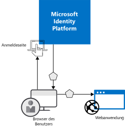
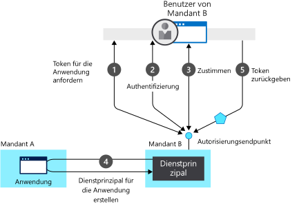

# Was ist Authentifizierung?

*Authentifizierung* ist die Anforderung ordnungsgemäßer Anmeldeinformationen von einer Partei. Sie bildet die Grundlage für die Erstellung eines Sicherheitsprinzipals für die Identitäts- und Zugriffssteuerung. Vereinfacht ausgedrückt, ist es der Vorgang, mit dem Sie den Nachweis erbringen, dass Sie derjenige sind, für den Sie sich ausgeben. Authentifizierung wird manchmal verkürzt als AuthN bezeichnet.

*Autorisierung* ist die Gewährung einer Handlungsberechtigung für einen authentifizierten Sicherheitsprinzipal. Sie gibt an, auf welche Daten Sie zugreifen dürfen und welche Aktionen Sie damit ausführen können. Autorisierung wird manchmal verkürzt als AuthZ bezeichnet.

Microsoft Identity Platform vereinfacht die Authentifizierung für Anwendungsentwickler. Die Plattform bietet Identity-as-a-Service mit Unterstützung für Protokolle nach Branchenstandard wie OAuth 2.0 und OpenID Connect sowie Open Source-Bibliotheken für verschiedene Plattformen, sodass Sie schnell mit der Programmierung beginnen können.

Im Programmiermodell von Microsoft Identity Platform sind im Wesentlichen zwei Anwendungsfälle vorgesehen:

* Im Rahmen einer OAuth 2.0-Autorisierungsgewährung: Wenn der Ressourcenbesitzer die Clientanwendung autorisiert und dem Client dadurch Zugriff auf Ressourcen des Ressourcenbesitzers gewährt.
* Im Rahmen des Ressourcenzugriffs durch den Client: Gemäß Implementierung durch den Ressourcenserver unter Verwendung der Werte des Anspruchs aus dem Zugriffstoken, die als Grundlage für Zugriffssteuerungsentscheidungen herangezogen werden.

## Grundlagen der Authentifizierung in Microsoft Identity Platform

Betrachten Sie das einfachste Szenario, bei dem eine Identität erforderlich ist: Ein Benutzer in einem Webbrowser muss sich gegenüber einer Webanwendung authentifizieren. Im folgenden Diagramm wird dieses Szenario veranschaulicht:

Folgendes müssen Sie über die verschiedenen im Diagramm gezeigten Komponenten wissen:

* Microsoft Identity Platform ist der Identitätsanbieter. Der Identitätsanbieter ist für die Überprüfung der Identität von Benutzern und Anwendungen zuständig, die im Verzeichnis einer Organisation vorhanden sind, und bei erfolgreicher Authentifizierung dieser Benutzer und Anwendungen auch für die Ausgabe von Sicherheitstoken.
* Jede Anwendung, deren Authentifizierung an Microsoft Identity Platform ausgelagert werden soll, muss in Azure Active Directory (Azure AD) registriert werden. Azure AD registriert die App im Verzeichnis und identifiziert sie eindeutig.
* Entwickler können die Open Source-Authentifizierungsbibliotheken für Microsoft Identity Platform zum Behandeln der Protokolldetails verwenden, um die Authentifizierung zu vereinfachen. Weitere Informationen finden Sie in den [v2.0-Authentifizierungsbibliotheken](reference-v2-libraries.md) und [v1.0-Authentifizierungsbibliotheken](active-directory-authentication-libraries.md) für Microsoft Identity Platform.
* Nach der Authentifizierung eines Benutzers muss die Anwendung das Sicherheitstoken des Benutzers überprüfen, um sicherzustellen, dass die Authentifizierung erfolgreich war. Es sind Schnellstarts, Tutorials und Codebeispiele in einer Vielzahl von Sprachen und Frameworks verfügbar, die zeigen, wie die Anwendung vorgehen muss.
  * Um eine App schnell zu erstellen und Funktionen wie das Abrufen von Token, Aktualisieren von Token, Anmelden eines Benutzers, Anzeigen einiger Benutzerinformationen und vieles mehr hinzuzufügen, lesen Sie den Abschnitt **Schnellstarts** in der Dokumentation.
  * Ausführlichere, szenariobasierte Verfahren für wichtige Authentifizierungsentwickleraufgaben wie das Abrufen von Zugriffstoken und deren Verwendung in Aufrufen der Microsoft Graph-API und anderer APIs, die Implementierung der Anmeldung bei Microsoft mit einer traditionellen webbrowsergestützten App unter Verwendung von OpenID Connect und mehr finden Sie im Abschnitt **Tutorials** der Dokumentation.
  * Um Codebeispiele herunterzuladen, navigieren Sie zu [GitHub](https://github.com/Azure-Samples?q=active-directory).
* Der Fluss von Anforderungen und Antworten für den Authentifizierungsprozess ergibt sich aus dem von Ihnen verwendeten Authentifizierungsprotokoll (etwa OAuth 2.0, OpenID Connect, WS-Federation oder SAML 2.0). Weitere Informationen zu Protokollen finden Sie im Abschnitt **Konzepte > Authentifizierungsprotokoll** der Dokumentation.

Im Beispielszenario oben können Sie die Apps gemäß diesen beiden Rollen klassifizieren:

* Apps, die sicher auf Ressourcen zugreifen müssen
* Apps, die die Rolle der Ressource selbst übernehmen

Nachdem Sie einen Einblick in die Grundlagen erhalten haben, können Sie sich in den nächsten Abschnitten mit dem App-Identitätsmodell und der API sowie der Bereitstellung in Microsoft Identity Platform vertraut machen. Zudem finden Sie hier Links zu detaillierten Informationen für die allgemeinen Szenarien, die Microsoft Identity Platform unterstützt.

## Anwendungsmodell

Microsoft Identity Platform stellt Anwendungen dar, die einem bestimmten Modell folgen, das zwei Hauptfunktionen erfüllen soll:

* **Identifizieren der App anhand der von ihr unterstützten Authentifizierungsprotokolle**: Dies beinhaltet die Aufzählung aller Bezeichner, URLs, Geheimnisse und verwandten Informationen, die zur Authentifizierungszeit benötigt werden. Hierbei übernimmt Microsoft Identity Platform die folgenden Aufgaben:

    * Enthält alle Daten, die zur Unterstützung der Authentifizierung zur Laufzeit erforderlich sind.
    * Enthält alle Daten, um zu entscheiden, auf welche Ressourcen eine App zugreifen muss und ob und unter welchen Umständen eine bestimmte Anforderung erfüllt werden soll.
    * Stellt die Infrastruktur für die Implementierung der App-Bereitstellung innerhalb des Mandanten des App-Entwicklers und für andere Azure AD-Mandanten bereit.

* **Behandeln der Benutzereinwilligung während der Tokenanforderung und Ermöglichen der dynamischen mandantenübergreifenden Bereitstellung von Apps**. Hierbei übernimmt Microsoft Identity Platform die folgenden Aufgaben:

    * Ermöglicht Benutzern und Administratoren, der App dynamisch die Zustimmung zum Zugriff auf Ressourcen in ihrem Namen zu erteilen oder zu verweigern.
    * Ermöglicht es Administratoren, letztendlich zu entscheiden, welche Aktionen Apps ausführen und welche Benutzer bestimmte Apps verwenden dürfen und wie auf die Verzeichnisressourcen zugegriffen wird.

In Microsoft Identity Platform beschreibt ein **Anwendungsobjekt** eine Anwendung als eine abstrakte Entität. Entwickler arbeiten mit Anwendungen. Zum Zeitpunkt der Bereitstellung verwendet Microsoft Identity Platform ein angegebenes Anwendungsobjekt als Blaupause zum Erstellen eines **Dienstprinzipals**, der eine konkrete Instanz einer Anwendung in einem Verzeichnis oder Mandanten darstellt. Es ist der Dienstprinzipal, der definiert, welche Aktionen die App in einem bestimmten Zielverzeichnis ausführen darf, wer sie verwenden kann, auf welche Ressourcen sie Zugriff besitzt usw. Microsoft Identity Platform erstellt mittels **Einwilligung** einen Dienstprinzipal aus einem Anwendungsobjekt.

Die folgende Abbildung zeigt einen vereinfachten Microsoft Identity Platform-Bereitstellungsablauf, der durch die Einwilligung gesteuert wird.  Darin gibt es zwei Mandanten (A und B), wobei Mandant A Besitzer der Anwendung ist, und Mandant B die Anwendung über einen Dienstprinzipal instanziiert.  

In diesem Bereitstellungsablauf geschieht Folgendes:

1. Ein Benutzer von Mandant B versucht, sich mit der App anzumelden, und der Autorisierungsendpunkt fordert ein Token für die Anwendung an.
1. Die Anmeldeinformationen des Benutzers werden abgerufen und für die Authentifizierung überprüft.
1. Der Benutzer wird aufgefordert, dem Zugriff auf den Mandanten B für die App zuzustimmen.
1. Microsoft Identity Platform verwendet das Anwendungsobjekt in Mandant A als Blaupause für das Erstellen eines Dienstprinzipals in Mandant B.
1. Der Benutzer erhält das angeforderte Token.

Sie können diesen Vorgang beliebig oft für andere Mandanten (C, D, usw.) wiederholen. Der Mandant A enthält die Blaupause für die App (Anwendungsobjekt). Benutzer und Administratoren aller anderen Mandanten, in denen der App die Zustimmung erteilt wird, behalten durch das entsprechende Dienstprinzipalobjekt in jedem Mandaten die Kontrolle darüber, welche Aktionen die Anwendung ausführen darf. Weitere Informationen finden Sie unter [Anwendungs- und Dienstprinzipalobjekte in Microsoft Identity Platform](app-objects-and-service-principals.md).

## Ansprüche in Microsoft Identity Platform-Sicherheitstoken

Von Microsoft Identity Platform ausgestellte Sicherheitstoken (Zugriffs- und ID-Token) enthalten Ansprüche oder Assertionen von Informationen zum authentifizierten Antragsteller. Anwendungen können Ansprüche für verschiedene Aufgaben verwenden, z.B. für die folgenden:

* Überprüfen des Tokens
* Identifizieren des Verzeichnismandanten des Antragstellers
* Anzeigen der Benutzerinformationen
* Bestimmen der Autorisierung des Antragstellers

Welche Ansprüche in einem Sicherheitstoken enthalten sind, hängt von der Art des Tokens, von der Art der Anmeldeinformationen für die Benutzerauthentifizierung sowie von der Anwendungskonfiguration ab.

Die folgende Tabelle enthält eine kurze Beschreibung der Anspruchstypen, die von Microsoft Identity Platform ausgegeben werden. Ausführlichere Informationen finden Sie in den Themen zu den von Microsoft Identity Platform ausgestellten [Zugriffstoken](access-tokens.md) und [ID-Token](id-tokens.md).

| Anspruch | BESCHREIBUNG |
| --- | --- |
| Anwendungs-ID | Die Anwendung, die das Token verwendet. |
| Zielgruppe | Die Empfängerressource, für die das Token vorgesehen ist. |
| Application Authentication Context Class Reference (Kontextklassenreferenz für die Anwendungsauthentifizierung) | Die Art der Clientauthentifizierung (öffentlicher oder vertraulicher Client). |
| Authentifizierungszeitpunkt | Datum und Uhrzeit der Authentifizierung. |
| Authentifizierungsmethode | Die Authentifizierungsmethode für den Antragsteller des Tokens (Kennwort, Zertifikat oder Ähnliches). |
| First Name (Vorname) | Der Vorname des Benutzers gemäß Angabe in Azure AD. |
| Gruppen | Objekt-IDs von Azure AD-Gruppen, denen der Benutzer angehört. |
| Identitätsanbieter | Der Identitätsanbieter, der den Antragsteller des Tokens authentifiziert hat. |
| Ausgestellt um | Die Zeit, zu der das Token ausgestellt wurde (wird häufig für die Tokenaktualität verwendet). |
| Issuer (Aussteller) | Der STS, der das Token ausgestellt hat, sowie der Azure AD-Mandant. |
| Last Name (Nachname) | Der Nachname des Benutzers gemäß Angabe in Azure AD. |
| NAME | Ein lesbarer Wert, der Aufschluss über den Antragsteller des Tokens gibt. |
| Object ID (Objekt-ID) | Ein unveränderlicher, eindeutiger Bezeichner des Antragstellers in Azure AD. |
| Rollen | Anzeigenamen von Azure AD-Anwendungsrollen, die dem Benutzer erteilt wurden. |
| `Scope` | Die Berechtigungen, die der Clientanwendung gewährt wurden. |
| Subject | Der Prinzipal, für den das Token Informationen bestätigt. |
| Mandanten-ID | Ein unveränderlicher, eindeutiger Bezeichner des Verzeichnismandanten, der das Token ausgestellt hat. |
| Tokengültigkeitsdauer | Das Zeitintervall, für das ein Token gültig ist. |
| Benutzerprinzipalname | Der Benutzerprinzipalname des Antragstellers. |
| Version | Die Versionsnummer des Tokens. |

## Nächste Schritte

* Erfahren Sie mehr über die [in Microsoft Identity Platform unterstützten Anwendungstypen und Szenarien](app-types.md).
