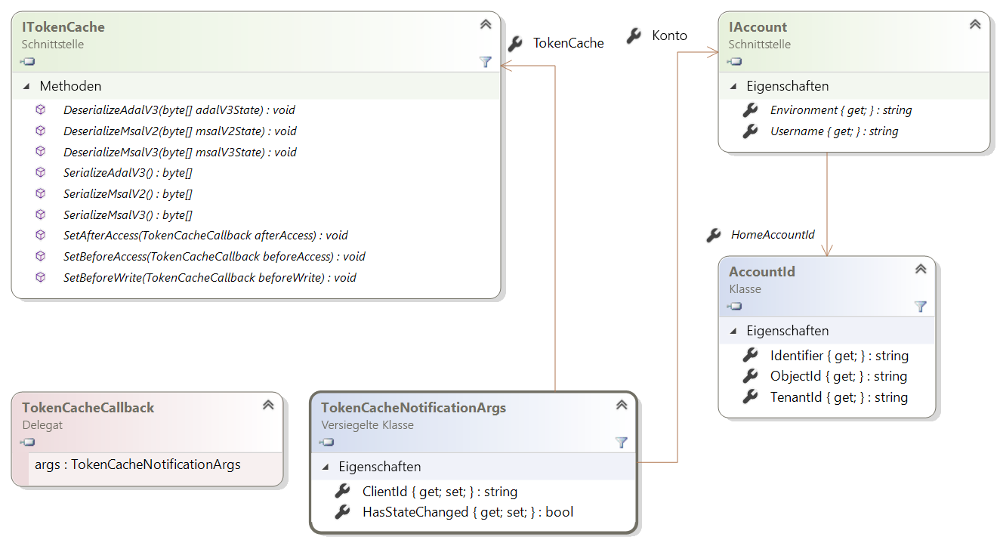
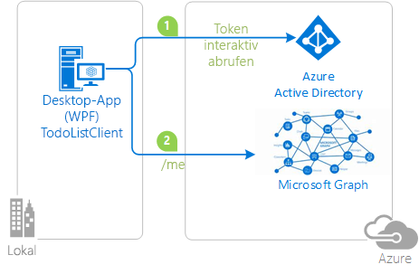

# <a name="token-cache-serialization-in-msalnet"></a>Serialisierung des Tokencaches in MSAL.NET
Nachdem ein [Token abgerufen wurde](msal-acquire-cache-tokens.md), wird es von der Microsoft-Authentifizierungsbibliothek (MSAL) zwischengespeichert.  Der Anwendungscode sollte zunächst versuchen, ein Token aus dem Cache abzurufen, bevor andere Methoden angewendet werden.  Dieser Artikel beschreibt die standardmäßige und benutzerdefinierte Serialisierung des Tokencaches in MSAL.NET.

Dieser Artikel bezieht sich auf MSAL.NET 3.x. Wenn Sie sich für MSAL.NET 2.x interessieren, informieren Sie sich unter [Serialisierung des Tokencaches in MSAL.NET 2.x](https://github.com/AzureAD/microsoft-authentication-library-for-dotnet/wiki/Token-cache-serialization-2x).

## <a name="default-serialization-for-mobile-platforms"></a>Standardserialisierung für mobile Plattformen

In MSAL.NET wird standardmäßig ein InMemory-Tokencache bereitgestellt. Die Serialisierung wird standardmäßig für Plattformen bereitgestellt, in denen sicherer Speicher dem Benutzer als Teil der Plattform angeboten wird. Dies trifft auf die Universelle Windows-Plattform (UWP), Xamarin.iOS und Xamarin.Android zu.

> [!Note]
> Wenn Sie ein Xamarin.Android-Projekt von MSAL.NET 1.x zu MSAL.NET 3.x migrieren, können Sie `android:allowBackup="false"` Ihrem Projekt hinzufügen. So vermeiden Sie, dass alte zwischengespeicherte Token wiederkehren, wenn die Wiederherstellung des lokalen Speichers in einer Visual Studio-Bereitstellung ausgelöst wird. Weitere Informationen finden Sie in der Beschreibung zu [Problem 659](https://github.com/AzureAD/microsoft-authentication-library-for-dotnet/issues/659#issuecomment-436181938).

## <a name="custom-serialization-for-windows-desktop-apps-and-web-appsweb-apis"></a>Benutzerdefinierte Serialisierung für Windows-Desktopanwendungen und Web-Apps/Web-APIs

Beachten Sie, dass für mobile Plattformen (UWP, Xamarin.iOS und Xamarin.Android) keine benutzerdefinierte Serialisierung verfügbar ist. MSAL implementiert bereits einen sicheren und leistungsfähigen Serialisierungsmechanismus für diese Plattformen. .NET Desktop- und .NET Core-Anwendungen verfügen jedoch über unterschiedliche Architekturen, sodass MSAL keinen allgemeingültigen Serialisierungsmechanismus implementieren kann. Token können von Websites beispielsweise bevorzugt in einem Redis-Cache und von Desktopanwendungen bevorzugt in einer verschlüsselten Datei gespeichert werden. Für die Serialisierung gilt es also keine universelle Lösung. Um eine einheitliche Nutzung des Tokencaches in .NET Desktop oder .NET Core sicherzustellen, müssen Sie die Serialisierung anpassen.

Die folgenden Klassen und Schnittstellen sind an der Serialisierung des Tokencaches beteiligt:

- `ITokenCache` definiert Ereignisse zum Abonnieren von Anforderungen zur Tokencacheserialisierung sowie Methoden zum Serialisieren oder Deserialisieren des Caches in verschiedenen Formaten (ADAL v3.0, MSAL 2.x und MSAL 3.x = ADAL v5.0).
- `TokenCacheCallback` ist ein an die Ereignisse übergebener Rückruf, damit Sie die Serialisierung verarbeiten können. Sie werden mit Argumenten vom Typ `TokenCacheNotificationArgs` aufgerufen.
- `TokenCacheNotificationArgs` stellt nur den `ClientId` der Anwendung und einen Verweis auf den Benutzer bereit, für den das Token verfügbar ist.

  

> [!IMPORTANT]
> MSAL.NET erstellt automatisch Tokencaches und stellt den `IToken`-Cache für Sie bereit, wenn Sie die `UserTokenCache`-Methode und die `AppTokenCache`-Eigenschaften einer Anwendung aufrufen. Sie müssen die Schnittstelle nicht selbst implementieren. Beim Implementieren einer benutzerdefinierten Serialisierung des Tokencaches müssen Sie folgende Aufgaben ausführen:
> - Sie müssen auf `BeforeAccess`- und `AfterAccess`-„Ereignisse“ (oder deren asynchrone Varianten) reagieren. Der `BeforeAccess`-Delegat ist für die Deserialisierung des Caches zuständig, während der `AfterAccess`-Delegat den Cache serialisiert.
> - Einige dieser Ereignisse speichern oder laden Blobs, die über das Ereignisargument an den gewünschten Speicher übergeben werden.

Die Strategien variieren, je nachdem, ob Sie eine Tokencacheserialisierung für eine [öffentliche Clientanwendung](msal-client-applications.md) (Desktop) oder eine [vertrauliche Clientanwendung](msal-client-applications.md) (Web-App/Web-API, Daemon-App) schreiben.

### <a name="token-cache-for-a-public-client"></a>Tokencache für einen öffentlichen Client 

Seit MSAL.NET v2.x haben Sie mehrere Optionen, um den Tokencache eines öffentlichen Clients zu serialisieren. Sie können den Cache nur für das MSAL.NET-Format serialisieren (das einheitliche Cacheformat wird von MSAL und Plattformen unterstützt).  Auch die [ältere](https://github.com/AzureAD/azure-activedirectory-library-for-dotnet/wiki/Token-cache-serialization), in ADAL V3 gebräuchliche Serialisierung des Tokencaches wird unterstützt.

Im folgenden Beispiel wird u. a. erläutert, wie die Serialisierung des Tokencaches angepasst werden kann, damit der SSO-Zustand von ADAL.NET 3.x, ADAL.NET 5.x und MSAL.NET gemeinsam verwendet werden kann: [active-directory-dotnet-v1-to-v2](https://github.com/Azure-Samples/active-directory-dotnet-v1-to-v2)

> [!Note]
> Das Tokencacheformat für die MSAL.NET 1.1.4-Vorschau wird in MSAL 2.x nicht mehr unterstützt. Wenn Sie über Anwendungen verfügen, die MSAL.NET 1.x nutzen, müssen sich Ihre Benutzer erneut anmelden. Dafür wird jedoch die Migration von ADAL 4.x (und 3.x) unterstützt.

#### <a name="simple-token-cache-serialization-msal-only"></a>Einfache Serialisierung des Tokencaches (nur MSAL)

Das folgende Beispiel zeigt eine einfache Implementierung der benutzerdefinierten Serialisierung eines Tokencaches für Desktopanwendungen. Hier entspricht der Benutzertokencache einer Datei im selben Ordner wie die Anwendung.

Nach dem Erstellen der Anwendung aktivieren Sie die Serialisierung durch einen Aufruf der `TokenCacheHelper.EnableSerialization()`-Methode, wobei der `UserTokenCache` der Anwendung übergeben wird.

```csharp
app = PublicClientApplicationBuilder.Create(ClientId)
    .Build();
TokenCacheHelper.EnableSerialization(app.UserTokenCache);
```

Die `TokenCacheHelper`-Hilfsklasse ist wie folgt definiert:

```csharp
static class TokenCacheHelper
 {
  public static void EnableSerialization(ITokenCache tokenCache)
  {
   tokenCache.SetBeforeAccess(BeforeAccessNotification);
   tokenCache.SetAfterAccess(AfterAccessNotification);
  }

  /// <summary>
  /// Path to the token cache
  /// </summary>
  public static readonly string CacheFilePath = System.Reflection.Assembly.GetExecutingAssembly().Location + ".msalcache.bin3";

  private static readonly object FileLock = new object();


  private static void BeforeAccessNotification(TokenCacheNotificationArgs args)
  {
   lock (FileLock)
   {
    args.TokenCache.DeserializeMsalV3(File.Exists(CacheFilePath)
            ? ProtectedData.Unprotect(File.ReadAllBytes(CacheFilePath),
                                      null,
                                      DataProtectionScope.CurrentUser)
            : null);
   }
  }

  private static void AfterAccessNotification(TokenCacheNotificationArgs args)
  {
   // if the access operation resulted in a cache update
   if (args.HasStateChanged)
   {
    lock (FileLock)
    {
     // reflect changesgs in the persistent store
     File.WriteAllBytes(CacheFilePath,
                         ProtectedData.Protect(args.TokenCache.SerializeMsalV3(),
                                                 null,
                                                 DataProtectionScope.CurrentUser)
                         );
    }
   }
  }
 }
```

Eine Vorschau eines dateibasierten Serialisierungsmoduls für einen Tokencache in Produktqualität, der für öffentliche Clientanwendungen (für Desktopanwendungen unter Windows, Mac und Linux) verwendet wird, ist in der Open-Source-Bibliothek [Microsoft.Identity.Client.Extensions.Msal](https://github.com/AzureAD/microsoft-authentication-extensions-for-dotnet/tree/master/src/Microsoft.Identity.Client.Extensions.Msal) verfügbar. Sie können das Modul aus dem folgenden Nuget-Paket in Ihre Anwendungen einschließen: [Microsoft.Identity.Client.Extensions.Msal](https://www.nuget.org/packages/Microsoft.Identity.Client.Extensions.Msal/).

#### <a name="dual-token-cache-serialization-msal-unified-cache-and-adal-v3"></a>Duale Serialisierung des Tokencaches (einheitlicher MSAL-Cache und ADAL v3)

Um die Serialisierung des Tokencaches sowohl mit dem einheitlichen Cacheformat (üblich in ADAL.NET 4.x und MSAL.NET 2.x) als auch mit anderen MSALs (derselben oder einer früheren Generation auf derselben Plattform) zu implementieren, können Sie den folgenden Code nutzen:

```csharp
string appLocation = Path.GetDirectoryName(Assembly.GetEntryAssembly().Location;
string cacheFolder = Path.GetFullPath(appLocation) + @"..\..\..\..");
string adalV3cacheFileName = Path.Combine(cacheFolder, "cacheAdalV3.bin");
string unifiedCacheFileName = Path.Combine(cacheFolder, "unifiedCache.bin");

IPublicClientApplication app;
app = PublicClientApplicationBuilder.Create(clientId)
                                    .Build();
FilesBasedTokenCacheHelper.EnableSerialization(app.UserTokenCache,
                                               unifiedCacheFileName,
                                               adalV3cacheFileName);

```

Hierbei ist die Hilfsklasse wie folgt definiert:

```csharp
using System;
using System.IO;
using System.Security.Cryptography;
using Microsoft.Identity.Client;

namespace CommonCacheMsalV3
{
 /// <summary>
 /// Simple persistent cache implementation of the dual cache serialization (ADAL V3 legacy
 /// and unified cache format) for a desktop applications (from MSAL 2.x)
 /// </summary>
 static class FilesBasedTokenCacheHelper
 {
  /// <summary>
  /// Enables the serialization of the token cache
  /// </summary>
  /// <param name="adalV3CacheFileName">File name where the cache is serialized with the
  /// ADAL V3 token cache format. Can
  /// be <c>null</c> if you don't want to implement the legacy ADAL V3 token cache
  /// serialization in your MSAL 2.x+ application</param>
  /// <param name="unifiedCacheFileName">File name where the cache is serialized
  /// with the Unified cache format, common to
  /// ADAL V4 and MSAL V2 and above, and also across ADAL/MSAL on the same platform.
  ///  Should not be <c>null</c></param>
  /// <returns></returns>
  public static void EnableSerialization(ITokenCache tokenCache, string unifiedCacheFileName, string adalV3CacheFileName)
  {
   UnifiedCacheFileName = unifiedCacheFileName;
   AdalV3CacheFileName = adalV3CacheFileName;

   tokenCache.SetBeforeAccess(BeforeAccessNotification);
   tokenCache.SetAfterAccess(AfterAccessNotification);
  }

  /// <summary>
  /// File path where the token cache is serialized with the unified cache format
  /// (ADAL.NET V4, MSAL.NET V3)
  /// </summary>
  public static string UnifiedCacheFileName { get; private set; }

  /// <summary>
  /// File path where the token cache is serialized with the legacy ADAL V3 format
  /// </summary>
  public static string AdalV3CacheFileName { get; private set; }

  private static readonly object FileLock = new object();

  public static void BeforeAccessNotification(TokenCacheNotificationArgs args)
  {
   lock (FileLock)
   {
    args.TokenCache.DeserializeAdalV3(ReadFromFileIfExists(AdalV3CacheFileName));
    try
    {
     args.TokenCache.DeserializeMsalV3(ReadFromFileIfExists(UnifiedCacheFileName));
    }
    catch(Exception ex)
    {
     // Compatibility with the MSAL v2 cache if you used one
     args.TokenCache.DeserializeMsalV2(ReadFromFileIfExists(UnifiedCacheFileName));
    }
   }
  }

  public static void AfterAccessNotification(TokenCacheNotificationArgs args)
  {
   // if the access operation resulted in a cache update
   if (args.HasStateChanged)
   {
    lock (FileLock)
    {
     WriteToFileIfNotNull(UnifiedCacheFileName, args.TokenCache.SerializeMsalV3());
     if (!string.IsNullOrWhiteSpace(AdalV3CacheFileName))
     {
      WriteToFileIfNotNull(AdalV3CacheFileName, args.TokenCache.SerializeAdalV3());
     }
    }
   }
  }

  /// <summary>
  /// Read the content of a file if it exists
  /// </summary>
  /// <param name="path">File path</param>
  /// <returns>Content of the file (in bytes)</returns>
  private static byte[] ReadFromFileIfExists(string path)
  {
   byte[] protectedBytes = (!string.IsNullOrEmpty(path) && File.Exists(path))
       ? File.ReadAllBytes(path) : null;
   byte[] unprotectedBytes = encrypt ?
       ((protectedBytes != null) ? ProtectedData.Unprotect(protectedBytes, null, DataProtectionScope.CurrentUser) : null)
       : protectedBytes;
   return unprotectedBytes;
  }

  /// <summary>
  /// Writes a blob of bytes to a file. If the blob is <c>null</c>, deletes the file
  /// </summary>
  /// <param name="path">path to the file to write</param>
  /// <param name="blob">Blob of bytes to write</param>
  private static void WriteToFileIfNotNull(string path, byte[] blob)
  {
   if (blob != null)
   {
    byte[] protectedBytes = encrypt
      ? ProtectedData.Protect(blob, null, DataProtectionScope.CurrentUser)
      : blob;
    File.WriteAllBytes(path, protectedBytes);
   }
   else
   {
    File.Delete(path);
   }
  }

  // Change if you want to test with an un-encrypted blob (this is a json format)
  private static bool encrypt = true;
 }
}
```

### <a name="token-cache-for-a-web-app-confidential-client-application"></a>Tokencache für eine Web-App (vertrauliche Clientanwendung)

In Web-Apps oder Web-APIs kann der Cache die Sitzung, einen Redis-Cache oder eine Datenbank nutzen.

Halten Sie in Web-Apps oder Web-APIs jeweils einen Tokencache pro Konto bereit.  Bei Web-Apps sollte der Tokencache durch die Konto-ID mit einem Schlüssel versehen werden.  Bei Web-APIs sollte das Konto durch den Hash des Tokens, das zum Aufrufen der API verwendet wird, mit einem Schlüssel versehen werden. MSAL.NET bietet eine benutzerdefinierte Tokencache-Serialisierung in .NET Framework- und .NET Core-Plattformen. Ereignisse werden beim Zugriff auf den Cache ausgelöst; Apps können auswählen, ob der Cache serialisiert oder deserialisiert werden soll. In vertraulichen Clientanwendungen, die Benutzer behandeln (Web-Apps, die Benutzer anmelden und Web-APIs aufrufen, und Web-APIs, die nachgeschaltete Web-APIs aufrufen), können viele Benutzer vorhanden sein. Die Benutzer werden dann parallel verarbeitet. Aus Sicherheits- und Leistungsgründen wird empfohlen, jeweils einen Cache pro Benutzer zu serialisieren. Serialisierungsereignisse berechnen anhand der Identität des verarbeiteten Benutzers einen Cacheschlüssel und serialisieren/deserialisieren einen Tokencache für diesen Benutzer.

Beispiele zur Verwendung von Tokencaches für Web-Apps und Web-APIs finden Sie im [Tutorial zur ASP.NET Core-Web-App](https://ms-identity-aspnetcore-webapp-tutorial) in Phase [2-2 Token Cache](https://github.com/Azure-Samples/active-directory-aspnetcore-webapp-openidconnect-v2/tree/master/2-WebApp-graph-user/2-2-TokenCache). Beispiele für Implementierungen finden Sie im Ordner [TokenCacheProviders](https://github.com/Azure-Samples/active-directory-aspnetcore-webapp-openidconnect-v2/tree/master/Microsoft.Identity.Web/TokenCacheProviders) in der Bibliothek [microsoft-authentication-extensions-for-dotnet](https://github.com/AzureAD/microsoft-authentication-extensions-for-dotnet) (im Ordner [Microsoft.Identity.Client.Extensions.Web](https://github.com/AzureAD/microsoft-authentication-extensions-for-dotnet/tree/master/src/Microsoft.Identity.Client.Extensions.Web)). 

## <a name="next-steps"></a>Nächste Schritte
Die folgenden Beispiele veranschaulichen die Serialisierung des Tokencaches.

| Beispiel | Plattform | Beschreibung|
| ------ | -------- | ----------- |
|[active-directory-dotnet-desktop-msgraph-v2](https://github.com/azure-samples/active-directory-dotnet-desktop-msgraph-v2) | Desktop (WPF) | Windows Desktop .NET (WPF)-Anwendung, die die Microsoft Graph-API aufruft |
|[active-directory-dotnet-v1-to-v2](https://github.com/Azure-Samples/active-directory-dotnet-v1-to-v2) | Desktop (Konsole) | Mehrere Visual Studio-Projektmappen, die die Migration von Azure AD v1.0-Anwendungen (mit ADAL.NET) zu Azure AD v2.0-Anwendungen bzw. konvergenten Anwendungen (mit MSAL.NET) veranschaulichen, in einer besonderen [Migration des Tokencaches](https://github.com/Azure-Samples/active-directory-dotnet-v1-to-v2/blob/master/TokenCacheMigration/README.md)|
