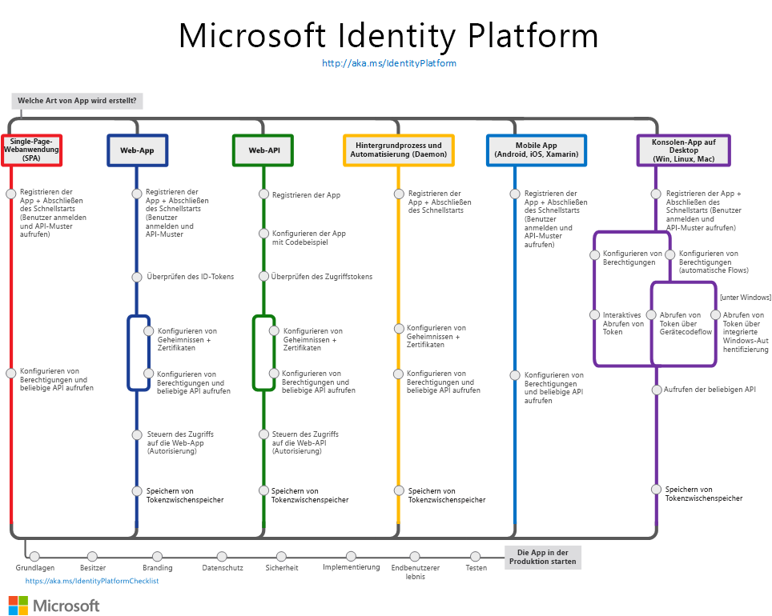

# Übersicht über Microsoft Identity Platform (v2.0)

Microsoft Identity Platform ist eine Weiterentwicklung der Azure AD-Entwicklerplattform (Azure Active Directory). Sie ermöglicht Entwicklern das Erstellen von Anwendungen, mit denen alle Microsoft-Identitäten angemeldet werden, sowie das Abrufen von Token zum Aufrufen von Microsoft-APIs, etwa Microsoft Graph oder von Entwicklern erstellte APIs. Microsoft Identity Platform umfasst folgende Komponenten:

- **Standardkonformer OAuth 2.0- und OpenID Connect-Authentifizierungsdienst**, der Entwicklern die Authentifizierung einer beliebigen Microsoft-Identität ermöglicht, einschließlich:
  - Geschäfts-, Schul- oder Unikonten (über Azure AD bereitgestellt)
  - Persönliche Microsoft-Konten (z. B. Skype, Xbox und Outlook.com)
  - Social Media-Konten oder lokale Konten (über Azure AD B2C)
- **Open-Source-Bibliotheken**: Microsoft Authentication Libraries (MSAL) und Unterstützung für andere standardkonforme Bibliotheken
- **Verwaltungsportal für Anwendungen**: Eine Registrierungs- und Konfigurationsumgebung, die zusammen mit allen Ihren anderen Azure-Verwaltungsfunktionen in das Azure-Portal integriert ist
- **Anwendungskonfigurations-API und PowerShell**: ermöglicht die programmgesteuerte Konfiguration Ihrer Anwendungen über die REST-API (Microsoft Graph und Azure Active Directory Graph 1.6) und PowerShell, damit Sie Ihre DevOps-Aufgaben automatisieren können.
- **Entwicklerinhalte**: Konzept- und Referenzdokumentation, Schnellstartbeispiele, Codebeispiele, Tutorials und Schrittanleitungen

Für Entwickler bietet Microsoft Identity Platform eine nahtlose Integration in Innovationen im Identitäts- und Sicherheitsbereich wie kennwortlose Authentifizierung, Step-up-Authentifizierung und bedingten Zugriff.  Sie müssen diese Funktionalität nicht selbst implementieren: In Microsoft Identity Platform integrierte Anwendungen nutzen solche Innovationen nativ.

Mit Microsoft Identity Platform müssen Sie Code nur einmal schreiben, um alle Benutzer zu erreichen. Sie können eine App einmalig erstellen und sie plattformübergreifend nutzen lassen, oder eine App erstellen, die sowohl als Client als auch als Ressourcenanwendung (API) fungiert.

## Erste Schritte

Die Verwendung von Identitäten muss nicht kompliziert sein. Wählen Sie ein auf Sie zutreffendes [Szenario](authentication-flows-app-scenarios.md) aus. In jedem Szenariopfad stehen ein Schnellstart sowie eine Übersichtsseite zur Verfügung, sodass Sie in wenigen Minuten einsatzbereit sind:

- [Erstellen einer Einzelseiten-App](scenario-spa-overview.md)
- [Erstellen einer Web-App, die Benutzer anmeldet](scenario-web-app-sign-user-overview.md)
- [Erstellen einer Web-App, die Web-APIs aufruft](scenario-web-app-call-api-overview.md)
- [Erstellen einer geschützten Web-API](scenario-protected-web-api-overview.md)
- [Erstellen einer Web-API, die Web-APIs aufruft](scenario-web-api-call-api-overview.md)
- [Erstellen einer Desktop-App](scenario-desktop-overview.md)
- [Erstellen einer Daemon-App](scenario-daemon-overview.md)
- [Erstellen einer mobilen App](scenario-mobile-overview.md)

Das folgende Diagramm zeigt gängige Authentifizierungs-App-Szenarien. Verwenden Sie es bei der Integration von Microsoft Identity Platform in Ihre App als Referenz.

## Nächste Schritte

Wenn Sie mehr über die wichtigsten Authentifizierungskonzepte erfahren möchten, empfehlen wir Ihnen, mit diesen Themen zu beginnen:

- [Authentifizierungsflows und Anwendungsszenarien](authentication-flows-app-scenarios.md)
- [Authentifizierungsszenarien für Azure AD](authentication-scenarios.md)
- [Anwendungs- und Dienstprinzipale](app-objects-and-service-principals.md)
- [Zielgruppen](v2-supported-account-types.md)
- [Berechtigungen und Einwilligung](v2-permissions-and-consent.md)
- [ID-Token](id-tokens.md) und [Zugriffstoken](access-tokens.md)

Erstellen Sie eine Anwendung mit umfassenden Daten, die [Microsoft Graph](https://docs.microsoft.com/graph/overview) aufruft.

Wenn Sie zum Starten Ihrer App in einer **Produktionsumgebung** bereit sind, beachten Sie diese bewährten Methoden:

- [Aktivieren Sie die Protokollierung](msal-logging.md) in Ihrer Anwendung.
- Aktivieren Sie die Telemetrie in Ihrer Anwendung.
- Aktivieren Sie [Proxys und das Anpassen von HTTP-Clients](msal-net-provide-httpclient.md).
- Testen Sie Ihre Integration anhand der [Checkliste für die Integration von Microsoft Identity Platform](identity-platform-integration-checklist.md).

## Weitere Informationen

Wenn Sie die Erstellung einer kundenorientierten Anwendung planen, die Social Media-Identitäten und lokale Identitäten anmeldet, lesen Sie die [Azure AD B2C-Übersicht](https://docs.microsoft.com/azure/active-directory-b2c/tutorial-add-identity-providers).
