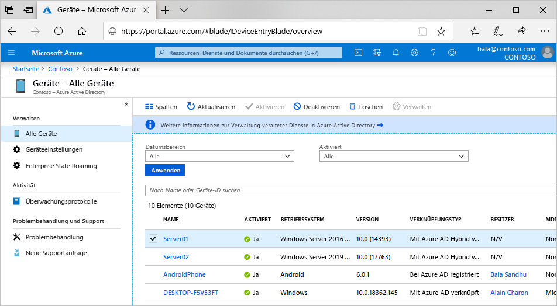

# Was ist eine Geräteidentität?

Aufgrund der steigenden Zahl von Geräten aller Art und Größe und dem BYOD-Konzept (Bring Your Own Device) gelten für IT-Spezialisten zwei eigentlich gegensätzliche Zielsetzungen:

- Schaffen von Bedingungen für Benutzer, unter denen sie an jedem Ort und zu jeder Zeit produktiv sein können
- Schützen der Ressourcen einer Organisation

Zum Schutz dieser Ressourcen müssen IT-Mitarbeiter zunächst die Geräteidentitäten verwalten. IT-Mitarbeiter können mit Tools wie Microsoft Intune auf der Geräteidentität aufbauen, um sicherzustellen, dass die Standards für Sicherheit und Konformität erfüllt werden. Azure Active Directory (Azure AD) ermöglicht das einmalige Anmelden bei Geräten, Apps und Diensten an jedem Ort über diese Geräte.

- Ihre Benutzer erhalten Zugriff auf die benötigten Ressourcen Ihrer Organisation. 
- Ihre IT-Mitarbeiter erhalten die Kontrolle, die sie benötigen, um Ihre Organisation zu schützen.

Die Geräteidentitätsverwaltung stellt die Grundlage für [gerätebasierten bedingten Zugriff](../conditional-access/require-managed-devices.md) dar. Mit Richtlinien für gerätebasierten bedingten Zugriff können Sie sicherstellen, dass nur mit verwalteten Geräten auf Ressourcen in Ihrer Umgebung zugegriffen werden kann.

## Aufnehmen von Geräten in Azure AD

Um ein Gerät in Azure AD aufzunehmen, haben Sie mehrere Möglichkeiten:

- **Bei Azure AD registriert**
   - Geräte, die bei Azure AD registriert sind, sind normalerweise persönliche oder mobile Geräte und werden mit einem persönlichen Microsoft-Konto oder einem anderen lokalen Konto angemeldet.
      - Windows 10
      - iOS
      - Android
      - MacOS
- **In Azure AD eingebunden**
   - Geräte, die in Azure AD eingebunden sind, gehören einer Organisation und werden mit einem Azure AD-Konto angemeldet, das zu der Organisation gehört. Sie sind nur in der Cloud vorhanden.
      - Windows 10 
      - Windows Server 2019 (Server Core wird nicht unterstützt.)
- **eingebunden in Hybrid Azure AD**
   - Geräte, die in Hybrid Azure AD eingebunden sind, gehören einer Organisation und werden mit einem Azure AD-Konto angemeldet, das zu der Organisation gehört. Sie sind in der Cloud und lokal vorhanden.
      - Windows 7, 8.1 oder 10
      - Windows Server 2008 oder höher

> [!NOTE]
> Ein Hybridzustand ist mehr als nur der Zustand eines Geräts. Für einen gültigen Hybridzustand ist zudem ein gültiger Azure AD-Benutzer erforderlich.

## Geräteverwaltung

Geräte in Azure AD können mithilfe von Tools für die mobile Geräteverwaltung (Mobile Device Management, MDM) wie z. B. Microsoft Intune, Microsoft Endpoint Configuration Manager, Gruppenrichtlinie (eingebunden in Hybrid Azure AD), Tools für die mobile Anwendungsverwaltung (Mobile Application Management, MAM) oder anderen Tools von Drittanbietern verwaltet werden.

## Zugriff auf Ressourcen

Das Registrieren und Hinzufügen von Geräten zu Azure AD ermöglicht Ihren Benutzern eine nahtlose Anmeldung (Seamless Sign-On, SSO) bei Cloudressourcen. Mit diesem Prozess können Administratoren außerdem Richtlinien für den bedingten Zugriff auf Ressourcen abhängig von dem Gerät anwenden, von dem aus darauf zugegriffen wird. 

> [!NOTE]
> Gerätebasierte Richtlinien für den bedingten Zugriff erfordern entweder hybride in Azure AD eingebundene Geräte oder kompatible in Azure AD eingebundene oder bei Azure AD registrierte Geräte.

Das primäre Aktualisierungstoken (Primary Refresh Token, PRT) enthält Informationen zum Gerät und ist für einmaliges Anmelden erforderlich. Wenn Sie für eine Anwendung eine gerätebasierte Richtlinie für bedingten Zugriff festgelegt haben, wird der Zugriff ohne PRT verweigert. Für Richtlinien für bedingten Hybridzugriff sind ein Gerät mit Hybridzustand und ein gültiger angemeldeter Benutzer erforderlich.

Für Geräte, die in Azure AD oder in Hybrid Azure AD eingebunden sind, kann das einmalige Anmelden für die lokalen Ressourcen sowie die Cloudressourcen Ihrer Organisation genutzt werden. Weitere Informationen finden Sie unter [Funktionsweise von SSO für lokale Ressourcen auf in Azure AD eingebundenen Geräten](azuread-join-sso.md).

## Gerätesicherheit

- **Bei Azure AD registrierte Geräte** nutzen ein vom Endbenutzer verwaltetes Konto. Bei diesem Konto handelt es sich entweder um ein Microsoft-Konto oder um andere lokale Anmeldeinformationen, die durch eines oder mehrere der folgenden Elemente gesichert sind.
   - Kennwort
   - PIN
   - Muster
   - Windows Hello
- **In Azure AD oder in Hybrid Azure AD eingebundene Geräte** nutzen ein Organisationskonto in Azure AD, das durch eines oder mehrere der folgenden Elemente gesichert ist.
   - Kennwort
   - Windows Hello for Business

## Bereitstellung

Die Bereitstellung von Geräten in Azure AD kann im Self-Service-Modus oder über einen von Administratoren gesteuerten Bereitstellungsprozess erfolgen.

## Zusammenfassung

Mit der Geräteidentitätsverwaltung in Azure AD haben Sie folgende Möglichkeiten:

- Vereinfachen des Prozesses zum Aufnehmen und Verwalten von Geräten in Azure AD
- Benutzerfreundlicher Zugriff auf die cloudbasierten Ressourcen Ihres Unternehmens für Ihre Benutzer

## Lizenzanforderungen

[!INCLUDE [Active Directory P1 license](../../../includes/active-directory-p1-license.md)]

## Nächste Schritte

- Informieren Sie sich über [bei Azure AD registrierte Geräte](concept-azure-ad-register.md).
- Informieren Sie sich über [in Azure AD eingebundene Geräte](concept-azure-ad-join.md).
- Weitere Informationen zu [in Hybrid Azure AD eingebundene Geräte](concept-azure-ad-join-hybrid.md)
- Einen Überblick über die Verwaltung von Geräteidentitäten im Azure-Portal finden Sie unter [Managing device identities using the Azure portal](device-management-azure-portal.md) (Verwalten von Geräteidentitäten mit dem Azure-Portal, in englischer Sprache).
- Weitere Informationen zum gerätebasierten bedingten Zugriff finden Sie unter [Anleitung: Vorschreiben der Verwendung verwalteter Geräte für den Zugriff auf Cloud-Apps mithilfe des bedingten Zugriffs](../conditional-access/require-managed-devices.md).
