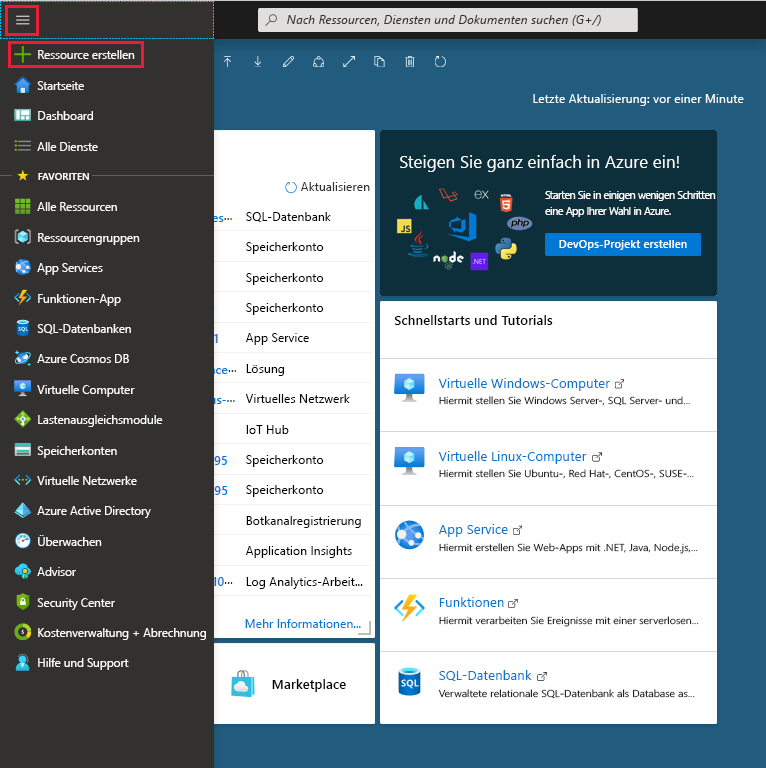

# Schnellstart: Zugreifen auf Azure Active Directory zum Erstellen eines neuen Mandanten
Sie können alle Verwaltungsaufgaben über das Azure Active Directory-Portal (Azure AD-Portal) ausführen. Dazu gehört auch das Erstellen eines neuen Mandanten für Ihre Organisation. 

In diesem Schnellstart erfahren Sie, wie Sie das Azure-Portal und Azure Active Directory aufrufen, und wie Sie einen Basismandanten für Ihre Organisation erstellen.

Wenn Sie kein Azure-Abonnement besitzen, können Sie ein [kostenloses Konto](https://azure.microsoft.com/free/) erstellen, bevor Sie beginnen.

## Voraussetzungen
Bevor Sie beginnen, müssen die folgenden Voraussetzungen erfüllt sein:

- Ihre Organisation muss über eine gültige Azure AD-Lizenz verfügen.

- Sie müssen ein globaler Administrator sein.

## Anmelden im Azure-Portal
Melden Sie sich mit dem Konto eines globalen Administrators im [Azure-Portal](https://portal.azure.com/) Ihrer Organisation an.

## Erstellen eines neuen Mandanten für Ihre Organisation
Nach der Anmeldung im Azure-Portal können Sie einen neuen Mandanten für Ihre Organisation erstellen. Ihr neuer Mandant stellt Ihre Organisation dar und unterstützt Sie dabei, eine bestimmte Microsoft Cloud Services-Instanz für Ihre internen und externen Benutzer zu verwalten.

### Erstellen eines neuen Mandanten
1. Wählen Sie **Azure Active Directory**, **Ressourcen erstellen**, **Identität** und dann **Azure Active Directory** aus.

    Daraufhin wird die Seite **Verzeichnis erstellen** angezeigt.

    

2.  Geben Sie auf der Seite **Verzeichnis erstellen** die folgenden Informationen ein:
    
    - Geben Sie in das Feld **Organisationsname** _Contoso_ ein.

    - Geben Sie in das Feld **Name der Anfangsdomäne** _Contoso_ ein.

    - Übernehmen Sie im Feld **Land oder Region** die Option _USA_.

3. Klicken Sie auf **Erstellen**.

Ihr neuer Mandant wird mit der Domäne „contoso.onmicrosoft.com“ erstellt.

## Bereinigen von Ressourcen
Wenn Sie diese Anwendung nicht mehr verwenden möchten, können Sie den Mandanten folgendermaßen löschen:

- Wählen Sie **Azure Active Directory**, die Seite **Contoso – Übersicht** und dann **Verzeichnis löschen** aus.

    Der Mandant und die dazugehörigen Informationen werden gelöscht.

    

## Nächste Schritte
- Wie Sie zusätzliche Domänennamen ändern oder hinzufügen, erfahren Sie unter [Hinzufügen eines benutzerdefinierten Domänennamens zu Azure Active Directory](add-custom-domain.md).

- Weitere Informationen zum Hinzufügen von Benutzern finden Sie unter [Hinzufügen oder Löschen eines neuen Benutzers](add-users-azure-active-directory.md).

- Der Artikel [Erstellen einer Basisgruppe und Hinzufügen von Mitgliedern](active-directory-groups-create-azure-portal.md) erläutert, wie Sie Gruppen und Mitglieder hinzufügen.

- Erfahren Sie mehr über [rollenbasierten Zugriff mit Privileged Identity Management](../../role-based-access-control/pim-azure-resource.md) und [bedingten Zugriff](../../role-based-access-control/conditional-access-azure-management.md), um den Zugriff auf die Anwendungen und Ressourcen Ihrer Organisation zu verwalten.
