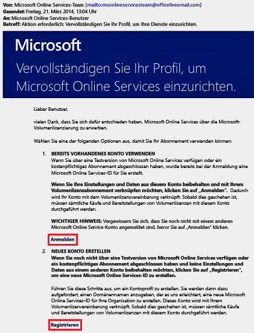
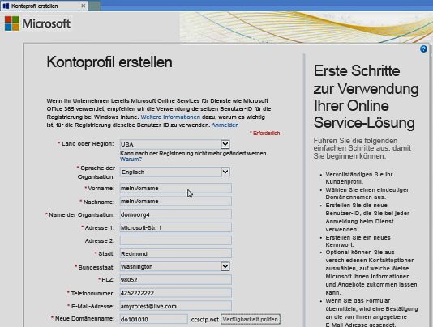
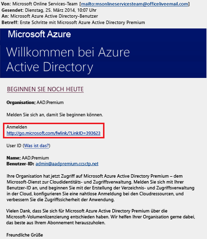
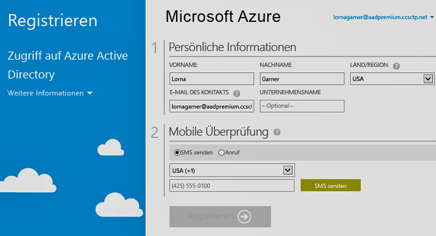

# Registrieren für Azure Active Directory Premium-Editionen
Sie können Azure Active Directory (Azure AD) Premium-Editionen erwerben und Ihrem Azure-Abonnement zuordnen. Wenn Sie ein neues Azure-Abonnement erstellen müssen, müssen Sie außerdem Ihren Lizenzplan und den Azure AD-Dienstzugriff aktivieren.

> [!NOTE]
>Die Azure AD-Editionen Premium und Basic stehen für Kunden in China zur Verfügung, die mit der weltweit verfügbaren Instanz von Azure Active Directory arbeiten. Allerdings werden die Azure AD-Editionen „Premium“ und „Basic“ derzeit nicht durch den Azure-Dienst unterstützt, der in China von 21Vianet betrieben wird. Sollten Sie weitere Informationen benötigen, können Sie sich über das [Azure Active Directory-Forum](https://feedback.azure.com/forums/169401-azure-active-directory/) mit uns in Verbindung setzen.

Bevor Sie sich für Active Directory Premium 1 oder Premium 2 registrieren, müssen Sie zuerst festlegen, welches Ihrer vorhandenen Abonnements oder Pläne Sie verwenden möchten:

- Ihr vorhandenes Azure- oder Office 365-Abonnement

- Ihren Enterprise Mobility + Security-Lizenzplan

- Einen Microsoft-Volumenlizenzierungsplan

Durch die Registrierung über Ihr Azure-Abonnement und bereits erworbenen aktivierten Azure AD-Lizenzen werden automatisch die Lizenzen im selben Verzeichnis aktiviert. Wenn dies nicht der Fall ist, müssen Sie noch Ihren Lizenzplan und den Azure AD-Zugriff aktivieren. Weitere Informationen zum Aktivieren Ihres Lizenzplans finden Sie unter [Aktivieren des neuen Lizenzplans](#activate-your-new-license-plan). Weitere Informationen zum Aktivieren Ihres Azure AD-Zugriffs finden Sie unter [Aktivieren des Azure AD-Zugriffs](#activate-your-azure-ad-access). 

## Registrieren über ein vorhandenes Azure- oder Office 365-Abonnement
Abonnenten von Azure oder Office 365 können Azure Active Directory Premium-Editionen online erwerben. Ausführliche Schritte finden Sie unter [How to Purchase Azure Active Directory Premium - Existing Customers](https://channel9.msdn.com/Series/Azure-Active-Directory-Videos-Demos/How-to-Purchase-Azure-Active-Directory-Premium-Existing-Customer) (Erwerben von Azure Active Directory Premium – Bestandskunden) oder [How to Purchase Azure Active Directory Premium - New Customers](https://channel9.msdn.com/Series/Azure-Active-Directory-Videos-Demos/How-to-Purchase-Azure-Active-Directory-Premium-New-Customers) (Erwerben von Azure Active Directory Premium – Neukunden).

## Registrieren über den Enterprise Mobility + Security-Lizenzplan
Enterprise Mobility + Security (EMS) ist eine Suite bestehend aus Azure AD Premium, Azure Information Protection und Microsoft Intune. Wenn Sie bereits über eine EMS-Lizenz verfügen, können Sie für Ihre ersten Schritte mit Azure AD eine der folgenden Lizenzoptionen verwenden:

Weitere Informationen zu EMS finden Sie auf der Website [Enterprise Mobility + Security](https://www.microsoft.com/cloud-platform/enterprise-mobility-security).

- Testen Sie EMS mit einem kostenlosen [Enterprise Mobility + Security E5-Testabonnement](https://signup.microsoft.com/Signup?OfferId=87dd2714-d452-48a0-a809-d2f58c4f68b7&ali=1).

- Erwerben Sie [Enterprise Mobility + Security E5-Lizenzen](https://signup.microsoft.com/Signup?OfferId=e6de2192-536a-4dc3-afdc-9e2602b6c790&ali=1).

- Erwerben Sie [Enterprise Mobility + Security E3-Lizenzen](https://signup.microsoft.com/Signup?OfferId=4BBA281F-95E8-4136-8B0F-037D6062F54C&ali=1).

## Registrieren über den Microsoft-Volumenlizenzierungsplan
Über Ihren Microsoft-Volumenlizenzierungsplan können Sie sich mit einem der beiden folgenden Programme (basierend auf der Anzahl der Lizenzen, die Sie beziehen möchten) für Azure AD Premium registrieren:

- **Für mindestens 250 Lizenzen** [Microsoft Enterprise Agreement](https://www.microsoft.com/en-us/licensing/licensing-programs/enterprise.aspx)

- **Für 5 bis 250 Lizenzen** [Open-Volumenlizenz](https://www.microsoft.com/en-us/licensing/licensing-programs/open-license.aspx)

Weitere Informationen zu Kaufoptionen im Rahmen der Volumenlizenzierung finden Sie unter [Gewusst wie: Kaufoptionen über die Volumenlizenzierung](https://www.microsoft.com/en-us/licensing/how-to-buy/how-to-buy.aspx).

## Aktivieren des neuen Lizenzplans
Wenn Sie sich mit einem neuen Azure AD-Lizenzplan registriert haben, müssen Sie ihn für Ihre Organisation mit der Bestätigungs-E-Mail, die nach dem Kauf gesendet wird, aktivieren.

### Aktivieren des Lizenzplans
- Öffnen Sie die Bestätigungs-E-Mail, die Sie von Microsoft nach Ihrer Registrierung erhalten haben, und klicken Sie dann entweder auf **Anmelden** oder **Registrieren**.
   
    

    - **Anmelden**: Klicken Sie auf diesen Link, wenn Sie bereits über einen Mandanten verfügen, und melden Sie sich dann bei Ihrem vorhandenen Administratorkonto an. Sie müssen ein globaler Administrator auf dem Mandanten sein, auf dem die Lizenzen aktiviert werden.

    - **Registrieren**: Klicken Sie auf diesen Link, wenn Sie die Seite **Kontoprofil erstellen** öffnen und einen neuen Azure AD-Mandanten für Ihren Lizenzplan erstellen möchten.

        

Wenn Sie fertig sind, sehen Sie ein Bestätigungsdialogfeld, in dem Ihnen für die Aktivierung des Lizenzplans für Ihren Mandanten gedankt wird.

## Aktivieren des Azure AD-Zugriffs
Wenn Sie neue Azure AD Premium-Lizenzen zu einem vorhandenen Abonnement hinzufügen, sollte Ihr Azure AD-Zugriff bereits aktiviert sein. Andernfalls müssen Sie den Azure AD-Zugriff aktivieren, nachdem Sie die **Begrüßungs-E-Mail** erhalten haben.  

Nachdem Ihre erworbenen Lizenzen in Ihrem Verzeichnis bereitgestellt wurden, erhalten Sie eine **Willkommens-E-Mail**. Mit dieser E-Mail wird bestätigt, dass Sie mit der Verwaltung der Lizenzen und Features von Azure AD Premium oder Enterprise Mobility + Security beginnen können. 

> [!TIP]
> Sie können erst auf Azure AD für Ihren neuen Mandanten zugreifen, wenn Sie den Azure AD-Verzeichniszugriff über die Willkommens-E-Mail aktiviert haben.

### Aktivieren des Azure AD-Zugriffs

1. Öffnen Sie die **Willkommens-E-Mail**, und klicken Sie dann auf **Anmelden**.
   
    

2. Nach der erfolgreichen Anmeldung durchlaufen Sie eine zweistufige Überprüfung mithilfe eines Mobilgeräts.
   
    

Der Aktivierungsvorgang dauert in der Regel nur wenige Minuten. Danach können Sie Ihren Azure AD-Mandanten verwenden. 

## Nächste Schritte
Nachdem Sie nun über Azure AD Premium verfügen, können Sie [Ihre Domäne anpassen](add-custom-domain.md), Ihr [Unternehmensbranding](customize-branding.md) hinzufügen, [einen Mandanten erstellen](active-directory-access-create-new-tenant.md) und [Gruppen](active-directory-groups-create-azure-portal.md) sowie [Benutzer hinzufügen](add-users-azure-active-directory.md).
