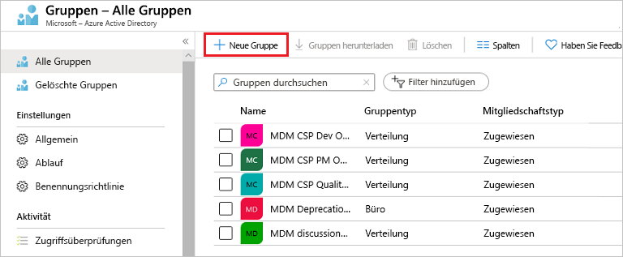
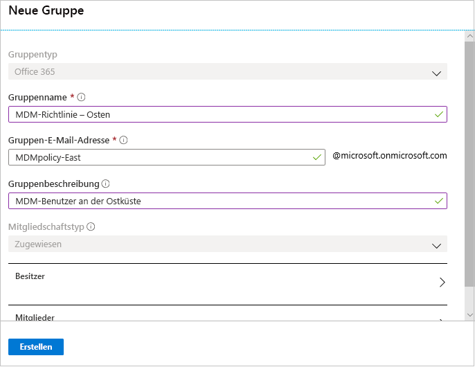

# Gewusst wie: Erstellen einer Basisgruppe und Hinzufügen von Mitgliedern mit Azure Active Directory

Sie können über das Azure Active Directory-Portal (Azure AD) eine Basisgruppe erstellen. Für die Zwecke dieses Artikels wird einer einzelnen Ressource eine Basisgruppe durch den Ressourcenbesitzer (Administrator) hinzugefügt und bestimmte Mitglieder (Mitarbeiter) eingeschlossen, die auf diese Ressource zugreifen müssen. Informationen zu komplexeren Szenarien wie dynamische Mitgliedschaften und die Erstellung von Regeln finden Sie in der [Dokumentation für die Verwaltung von Azure Active Directory-Benutzern](../users-groups-roles/index.yml).

## Erstellen einer Basisgruppe und Hinzufügen von Mitgliedern
Sie können eine Basisgruppe erstellen und gleichzeitig Ihre Mitglieder hinzufügen.

### Erstellen einer Basisgruppe und Hinzufügen von Mitgliedern
1. Melden Sie sich mit dem Konto eines globalen Administrators für das Verzeichnis beim [Azure-Portal](https://portal.azure.com) an.

2. Wählen Sie **Azure Active Directory** > **Gruppen** und anschließend **Neue Gruppe** aus.

    

3. Geben Sie auf der Seite **Gruppe** die erforderlichen Informationen ein.

    

    - **Gruppentyp (erforderlich)**: Wählen Sie einen vordefinierten Gruppentyp aus. Dies umfasst:
        
        - **Sicherheit**. Dieser Gruppentyp dient zur Verwaltung von Mitgliedern und des Computerzugriffs auf freigegebene Ressourcen für eine Gruppe von Benutzern. Beispielsweise können Sie eine Sicherheitsgruppe für eine bestimmte Sicherheitsrichtlinie erstellen. Auf diese Weise können Sie allen Mitgliedern gleichzeitig eine Gruppe von Berechtigungen gewähren, statt jedem einzelnen Mitglied separat Berechtigungen hinzuzufügen. Weitere Informationen zum Verwalten des Zugriffs auf Ressourcen finden Sie unter [Informationen zur Verwaltung des Zugriffs mit Azure Active Directory-Gruppen](active-directory-manage-groups.md).
        
        - **Office 365**. Dieser Gruppentyp bietet Möglichkeiten zur Zusammenarbeit, indem Mitgliedern Zugriff auf freigegebene Postfächer, Kalender, Dateien, SharePoint-Websites und vieles mehr gewährt wird. Über diese Option können Sie auch Personen außerhalb Ihrer Organisation Zugriff auf die Gruppe gewähren. Weitere Informationen zu Office 365-Gruppen, finden Sie unter [Informationen zu Office 365-Gruppen](https://support.office.com/article/learn-about-office-365-groups-b565caa1-5c40-40ef-9915-60fdb2d97fa2).

    - **Gruppenname (erforderlich)**: Fügen Sie einen aussagekräftigen Namen für die Gruppe hinzu.

    - **Gruppenbeschreibung**: Fügen Sie ggf. eine Beschreibung zu Ihrer Gruppe hinzu.

    - **Mitgliedschaftstyp (erforderlich)**: Wählen Sie einen vordefinierten Mitgliedschaftstyp aus. Dies umfasst:

        - **Zugewiesen**: Mit dieser Option können Sie bestimmte Benutzer als Mitglieder dieser Gruppe mit einzigartigen Berechtigungen hinzufügen. Für die Zwecke dieses Artikels verwenden wir diese Option.

        - **Dynamischer Benutzer**: Über diese Option können Sie mithilfe dynamischer Gruppenregeln automatisch Mitglieder hinzufügen und entfernen lassen. Wenn sich die Attribute eines Mitglieds ändern, prüft das System Ihre dynamischen Gruppenregeln für das Verzeichnis, um festzustellen, ob das Mitglied den Regelanforderungen (sofern hinzugefügt) entspricht oder nicht mehr entspricht (falls entfernt).

        - **Dynamisches Gerät**: Über diese Option können Sie mithilfe dynamischer Gruppenregeln automatisch Geräte hinzufügen und entfernen lassen. Wenn sich die Attribute eines Geräts ändern, prüft das System Ihre dynamischen Gruppenregeln für das Verzeichnis, um festzustellen, ob das Gerät den Regelanforderungen (sofern hinzugefügt) entspricht oder nicht mehr entspricht (falls entfernt).

        >[!Important]
        >Sie können eine dynamische Gruppe entweder für Geräte oder für Benutzer erstellen, jedoch nicht für beides. Zudem können Sie keine Gerätegruppe basierend auf den Attributen der Gerätebesitzer erstellen. Regeln für die Gerätemitgliedschaft können nur Geräteattribute referenzieren. Weitere Informationen zum Erstellen einer dynamischen Gruppe von Benutzern und Geräten finden Sie unter [Erstellen einer dynamischen Gruppe und Überprüfen des Status](../users-groups-roles/groups-create-rule.md).

4. Klicken Sie auf **Erstellen**.

    Wenn die Gruppe erstellt ist, können ihr Mitglieder hinzugefügt werden.

5. Wählen Sie auf der Seite **Gruppe** den Bereich **Mitglieder** aus, und suchen Sie dann auf der Seite **Mitglied auswählen** die Mitglieder, die Ihrer Gruppe hinzugefügt werden sollen.

    

6. Wenn Sie fertig sind, wählen Sie **Auswählen** aus.

    Die Seite **Gruppenübersicht** wird aktualisiert und zeigt danach die Anzahl der Mitglieder an, die nun der Gruppe hinzugefügt sind.

    

## Nächste Schritte
Nachdem Sie nun eine Gruppe und mindestens einen Benutzer hinzugefügt haben, können Sie Folgendes ausführen:

- [Anzeigen Ihrer Gruppen und Mitglieder](active-directory-groups-view-azure-portal.md)

- [Verwalten der Gruppenmitgliedschaft](active-directory-groups-membership-azure-portal.md)

- [Verwalten dynamischer Regeln für Benutzer in einer Gruppe](../users-groups-roles/groups-create-rule.md)

- [Bearbeiten Ihrer Gruppeneinstellungen](active-directory-groups-settings-azure-portal.md)

- [Verwalten des Zugriffs auf Ressourcen mittels Gruppen](active-directory-manage-groups.md)

- [Verwalten des Zugriffs auf SaaS-Apps mittels Gruppen](../users-groups-roles/groups-saasapps.md)

- [Verwalten von Gruppen mithilfe von PowerShell-Befehlen](../users-groups-roles/groups-settings-v2-cmdlets.md)

- [Zuweisen oder Hinzufügen eines Azure-Abonnements zu Azure Active Directory](active-directory-how-subscriptions-associated-directory.md)