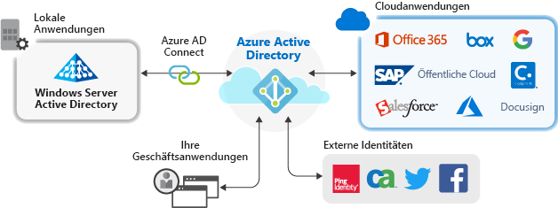

# Anwendungsverwaltung mit Azure Active Directory

Azure Active Directory (Azure AD) vereinfacht die Verwaltung von Anwendungen durch ein einziges Identitätssystem für Ihre cloudbasierten und lokalen Apps. Sie können Azure AD Ihre SaaS-Anwendungen (Software-as-a-Service), lokalen Anwendungen und branchenspezifischen Apps hinzufügen. Die Benutzer melden sich einmal an, um sicher und nahtlos auf diese Anwendungen sowie auf Office 365 und andere Geschäftsanwendungen von Microsoft zuzugreifen. Durch die Automatisierung der Benutzerbereitstellung können Sie die Verwaltungskosten senken. Sie können die mehrstufige Authentifizierung und Richtlinien für bedingten Zugriff verwenden, um sicheren Zugriff auf Anwendungen zu ermöglichen.

## Gründe für die Verwaltung von Anwendungen mit einer Cloudlösung

Organisationen besitzen häufig Hunderte von Anwendungen, die für die Arbeit ihrer Benutzer unerlässlich sind. Der Benutzerzugriff auf diese Anwendungen erfolgt über eine Vielzahl von Geräten und Standorten. Tagtäglich werden neue Anwendungen hinzugefügt und entwickelt. Angesichts dieser Vielzahl an Anwendungen und Zugriffspunkte gewinnt die Verwaltung des Benutzerzugriffs auf alle Anwendungen über eine cloudbasierte Lösung zunehmend an Bedeutung.

## Welche Typen von Anwendungen kann ich in Azure AD integrieren?
Es gibt vier Haupttypen von Anwendungen, die Sie Ihren **Unternehmensanwendungen** hinzufügen und mit Azure AD verwalten können:

-   **Azure AD-Kataloganwendungen**: Azure AD bietet einen Katalog mit Tausenden von Anwendungen, die für einmaliges Anmelden mit Azure AD vorab integriert wurden. Einige der von Ihrer Organisation verwendeten Anwendungen sind wahrscheinlich im Katalog enthalten. [Erfahren Sie mehr über das Planen der App-Integration](plan-an-application-integration.md), oder informieren Sie sich in den [Tutorials für SaaS-Anwendungen](https://docs.microsoft.com/azure/active-directory/saas-apps/) über die detaillierten Schritte für einzelne Apps. 

-   **Lokale Anwendungen mit dem Anwendungsproxy**: Mit dem Azure AD-Anwendungsproxy können Sie lokale Web-Apps in Azure AD integrieren, um einmaliges Anmelden zu unterstützen. Dann können Endbenutzer auf Ihre lokalen Web-Apps auf die gleiche Weise zugreifen wie auf Office 365 und andere SaaS-Apps. [Informieren Sie sich über die Verwendung und Funktionsweise des Anwendungsproxys](what-is-application-proxy.md).

-   **Benutzerdefinierte Anwendungen**: Wenn Sie eigene branchenspezifische Anwendungen erstellen, können Sie sie in Azure AD integrieren, um einmaliges Anmelden zu unterstützen. Durch das Integrieren der Anwendung in Azure AD haben Sie die Kontrolle über die für die Anwendung festgelegte Authentifizierungsrichtlinie. Weitere Informationen finden Sie in der [Anleitung für Entwickler](developer-guidance-for-integrating-applications.md).

-   **Nicht im Katalog vorhandene Anwendungen**: Nutzen Sie Ihre eigenen Anwendungen (BYOD, Bring Your Own Applications). Unterstützen Sie einmaliges Anmelden für andere Apps, indem Sie sie Azure AD hinzufügen. Sie können beliebige Weblinks oder Anwendungen integrieren, die Felder für Benutzername und Kennwort generieren oder SAML, OpenID Connect-Protokolle oder SCIM unterstützen. Weitere Informationen finden Sie unter [Konfigurieren des einmaligen Anmeldens für Nicht-Kataloganwendungen in Azure Active Directory](configure-single-sign-on-non-gallery-applications.md).

## Risikomanagement durch Richtlinien für bedingten Zugriff
In Kombination mit einmaligem Anmelden (Single Sign-On, SSO) mit Azure AD bietet [bedingter Zugriff](https://docs.microsoft.com/azure/active-directory/conditional-access/overview) ein hohes Maß an Sicherheit für den Zugriff auf Anwendungen. Zu den Sicherheitsfunktionen zählen der cloudgestützte Identitätsschutz, die risikobasierte Zugriffssteuerung, die native mehrstufige Authentifizierung und Richtlinien für bedingten Zugriff. Durch diese Funktionen können präzise Steuerungsrichtlinien basierend auf Anwendungen oder Gruppen geschaffen werden, die ein höheres Maß an Sicherheit erfordern.

## Produktivitätssteigerung durch einmaliges Anmelden
Die Aktivierung des einmaligen Anmeldens (Single Sign-On, SSO) für verschiedenste Anwendungen und in Office 365 bietet eine optimierte Anmeldung für bestehende Benutzer, da hierdurch die Anzahl von Anmeldeeingabeaufforderungen reduziert wird oder diese gänzlich beseitigt werden. Ohne die Vielzahl an Eingabeaufforderungen oder die Verwaltung mehrerer Kennwörter wirkt die Umgebung des Benutzers ganzheitlicher und weniger verwirrend. Die Unternehmensgruppe kann Zugriffe über Self-Service-Funktionen und dynamische Mitgliedschaften verwalten und genehmigen. Indem Sie den richtigen Personen im Unternehmen die Verwaltung des Zugriffs auf eine Anwendung ermöglichen, erhöhen Sie die Sicherheit des Identitätssystems.

SSO erhöht die Sicherheit. *Ohne einmaliges Anmelden* müssen Administratoren Benutzerkonten für jede einzelne Anwendung erstellen und aktualisieren, was viel Zeit in Anspruch nimmt. Darüber hinaus müssen Benutzer mehrere Sätze von Anmeldeinformationen für den Zugriff auf ihre Anwendungen nachverfolgen. Die Folge: Benutzer neigen dazu, ihre Kennwörter aufzuschreiben oder andere Lösungen zur Kennwortverwaltung zu verwenden, was zu Risiken für die Datensicherheit führt. [Weitere Informationen zu einmaligem Anmelden](what-is-single-sign-on.md).

## Beheben von Governance- und Complianceproblemen
Mit Azure AD können Sie Anmeldungen bei Anwendungen durch Berichte überwachen, die SIEM-Tools (Security Information & Event Monitoring) nutzen. Sie können über das Portal oder über APIs auf die Berichte zugreifen. Lassen Sie programmgesteuert überwachen, wer auf Ihre Anwendungen zugreifen darf, und entfernen Sie den Zugriff für inaktive Benutzer durch Zugriffsüberprüfungen.

## Verwalten von Kosten
Durch eine Migration zu Azure AD können Sie Ihre Kosten senken und sich den Aufwand der Verwaltung Ihrer lokalen Infrastruktur ersparen. Azure AD bietet außerdem Self-Service-Zugriff auf Anwendungen, was sowohl Administratoren als auch Benutzern Zeit erspart. Einmaliges Anmelden macht anwendungsspezifische Kennwörter überflüssig. Diese Option für die einmalige Anmeldung spart Kosten für das Zurücksetzen von Kennwörtern für Anwendungen und vermeidet Produktivitätsverluste durch das Abrufen von Kennwörtern.

## Nächste Schritte

- [Was ist der Anwendungsproxy?](what-is-application-proxy.md)
- [Schnellstart: Hinzufügen einer Kataloganwendung zu Ihrem Azure AD-Mandanten](add-application-portal.md)
