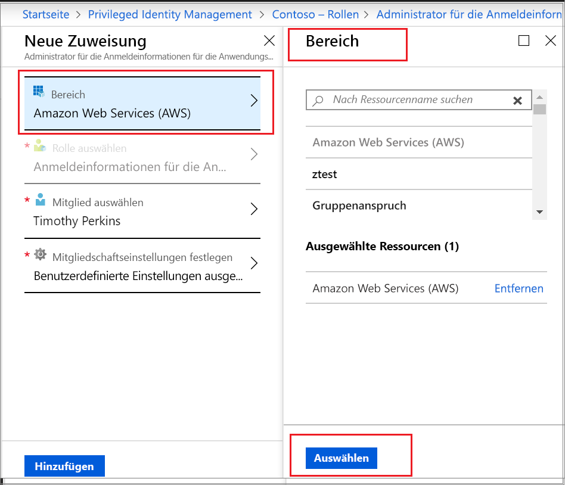

# Aktivieren einer benutzerdefinierten Azure AD-Rolle in Privileged Identity Management

Privileged Identity Management in Azure Active Directory (Azure AD) unterstützt jetzt Just-In-Time- und zeitgebundene Zuweisungen zu benutzerdefinierten Rollen, die für die Anwendungsverwaltung auf der Administratoroberfläche der Identitäts- und Zugriffsverwaltung erstellt wurden. Weitere Informationen zum Erstellen benutzerdefinierter Rollen, um die Anwendungsverwaltung in Azure AD zu delegieren, finden Sie unter [Benutzerdefinierte Administratorrollen in Azure Active Directory (Vorschau)](../users-groups-roles/roles-custom-overview.md).

> [!NOTE]
> Benutzerdefinierte Azure AD-Rollen sind in der Vorschauversion nicht in die integrierten Verzeichnisrollen integriert. Sobald die Funktion allgemein verfügbar ist, erfolgt die Rollenverwaltung auf der Benutzeroberfläche für integrierte Rollen.

## Aktivieren einer Rolle

Wenn Sie eine Azure AD-Rolle aktivieren müssen, fordern Sie die Aktivierung an, indem Sie in Privileged Identity Management die Navigationsoption „Meine Rollen“ auswählen.

1. Melden Sie sich beim [Azure-Portal](https://portal.azure.com) an.
1. Öffnen Sie Azure AD [Privileged Identity Management](https://portal.azure.com/?Microsoft_AAD_IAM_enableCustomRoleManagement=true&Microsoft_AAD_IAM_enableCustomRoleAssignment=true&feature.rbacv2roles=true&feature.rbacv2=true&Microsoft_AAD_RegisteredApps=demo#blade/Microsoft_Azure_PIMCommon/CommonMenuBlade/quickStart).

1. Wählen Sie **Benutzerdefinierte Azure AD-Rollen** aus, um eine Liste der berechtigten benutzerdefinierten Azure AD-Rollenzuweisungen anzuzeigen.

   

> [!Note] 
>  Bevor Sie eine Rolle zuweisen können, müssen Sie zunächst eine Rolle erstellen/konfigurieren. Weitere Informationen zum Konfigurieren von benutzerdefinierten AAD-Rollen finden Sie [hier] (https://docs.microsoft.com/azure/active-directory/privileged-identity-management/azure-ad-custom-roles-configure)

1. Suchen Sie auf der Seite **Benutzerdefinierte Azure AD-Rollen (Vorschau)** die gewünschte Zuweisung.
1. Wählen Sie **Ihre Rolle aktivieren** aus, um die Seite **Aktivieren** zu öffnen.
1. Wenn Ihre Rolle eine mehrstufige Authentifizierung erfordert, klicken Sie auf **Überprüfen Sie Ihre Identität, bevor Sie den Vorgang fortsetzen**. Sie müssen sich nur einmal pro Sitzung authentifizieren.
1. Klicken Sie auf **Meine Identität überprüfen**, und folgen Sie den Anweisungen, um zusätzliche Informationen die Sicherheitsüberprüfung anzugeben.
1. Wenn Sie einen benutzerdefinierten Anwendungsbereich angeben möchten, wählen Sie **Bereich** aus, um den Filterbereich zu öffnen. Sie sollten den Zugriff auf eine Rolle nur im mindestens erforderlichen Bereich anfordern. Wenn Ihre Zuweisung auf Ebene des Anwendungsbereichs erfolgt ist, können Sie den Zugriff nur in diesem Bereich aktivieren.

   

1. Falls erforderlich, geben Sie einen Startzeitpunkt für die Aktivierung an. Bei Angabe dieser Option wird das Rollenmitglied zum angegebenen Zeitpunkt aktiviert.
1. Geben Sie im Feld **Grund** den Grund für die Aktivierungsanforderung ein. Diese Option kann in den Rolleneinstellungen als erforderlich oder nicht angegeben sein.
1. Wählen Sie **Aktivieren**aus.

Wenn die Rolle keine Genehmigung erfordert, wird sie gemäß Ihren Einstellungen aktiviert und der Liste aktiver Rollen hinzugefügt. Wenn Sie die aktivierte Rolle verwenden möchten, beginnen Sie mit den Schritten im Artikel [Zuweisen einer benutzerdefinierten Azure AD-Rolle in Privileged Identity Management](azure-ad-custom-roles-assign.md).

Falls die Aktivierung der Rolle genehmigt werden muss, erhalten Sie eine Azure-Benachrichtigung, die Sie darüber informiert, dass die Genehmigung für die Anforderung aussteht.

## Nächste Schritte

- [Zuweisen einer benutzerdefinierten Azure AD-Rolle](azure-ad-custom-roles-assign.md)
- [Entfernen oder Aktualisieren der Zuweisung einer benutzerdefinierten Azure AD-Rolle](azure-ad-custom-roles-update-remove.md)
- [Konfigurieren der Zuweisung einer benutzerdefinierten Azure AD-Rolle](azure-ad-custom-roles-configure.md)
- [Rollendefinitionen in Azure AD](../users-groups-roles/directory-assign-admin-roles.md)
