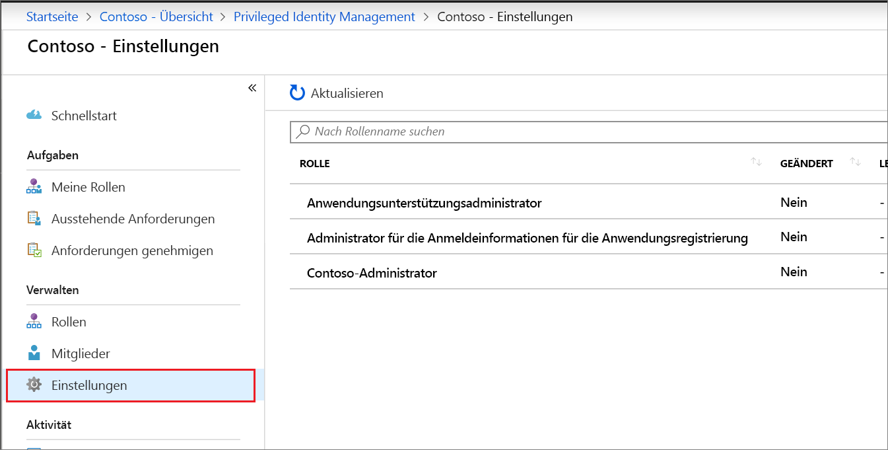
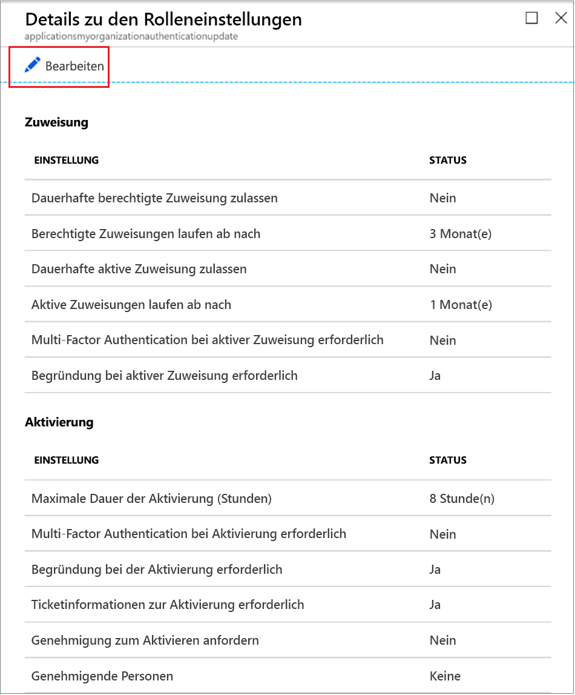
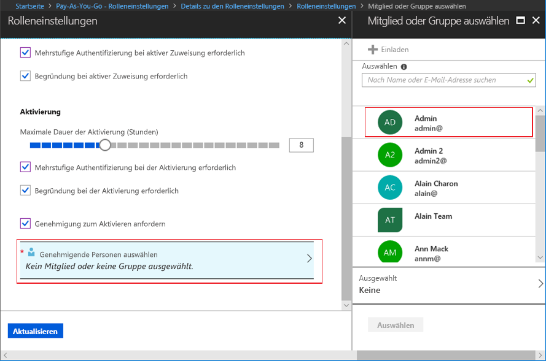

# Konfigurieren von benutzerdefinierten Azure AD-Rollen in Privileged Identity Management

Ein Administrator mit einer privilegierten Rolle kann die Rolleneinstellungen ändern, die für Benutzer gelten, wenn diese ihre Zuweisung zu einer benutzerdefinierten Rolle aktivieren. Ein solcher Administrator kann auch die Einstellungen für andere Anwendungsadministratoren ändern, die benutzerdefinierte Rollen zuweisen.

> [!NOTE]
> Benutzerdefinierte Azure AD-Rollen sind in der Vorschauversion nicht in die integrierten Verzeichnisrollen integriert. Sobald die Funktion allgemein verfügbar ist, erfolgt die Rollenverwaltung auf der Benutzeroberfläche für integrierte Rollen. Wenn das folgende Banner angezeigt wird, sollten diese Rollen [auf der Benutzeroberfläche für integrierte Rollen](pim-how-to-activate-role.md) verwaltet werden, und dieser Artikel trifft nicht zu:
>
> 

## Öffnen von Rolleneinstellungen

Führen Sie die folgenden Schritte aus, um die Einstellungen für eine Azure AD-Rolle zu öffnen.

1. Melden Sie sich im Azure-Portal mit dem Benutzerkonto bei [Privileged Identity Management](https://portal.azure.com/?Microsoft_AAD_IAM_enableCustomRoleManagement=true&Microsoft_AAD_IAM_enableCustomRoleAssignment=true&feature.rbacv2roles=true&feature.rbacv2=true&Microsoft_AAD_RegisteredApps=demo#blade/Microsoft_Azure_PIMCommon/CommonMenuBlade/quickStart) an, das der Rolle „Administrator für privilegierte Rollen“ zugewiesen ist.
1. Wählen Sie **Benutzerdefinierte Azure AD-Rollen (Vorschau)** aus.

    

1. Wählen Sie **Einstellung** aus, um die Seite **Einstellungen** zu öffnen. Wählen Sie die Rolle aus, deren Einstellungen Sie konfigurieren möchten.
1. Klicken Sie auf **Bearbeiten**, um die Seite **Rolleneinstellungen** zu öffnen.

    

## Rolleneinstellungen

Sie können zahlreiche Einstellungen konfigurieren.

### Zuweisungsdauer

Beim Konfigurieren der Einstellungen für eine Rolle können Sie für jeden Zuweisungstyp („berechtigt“ oder „aktiv“) zwischen zwei Optionen für die Zuweisungsdauer wählen. Diese Optionen werden zur maximalen Standarddauer, wenn ein Mitglied der Rolle in Privileged Identity Management zugewiesen wird.

Beim Typ *berechtigt* können Sie eine der folgenden Optionen für die Zuweisungsdauer wählen.

- **Dauerhafte berechtigte Zuweisung zulassen**: Administratoren können eine dauerhafte berechtigte Mitgliedschaft zuweisen.
- **Berechtigte Zuweisungen laufen ab nach**: Administratoren können anfordern, dass alle berechtigten Zuweisungen ein bestimmtes Start- und Enddatum haben.

Beim Typ *aktiv* können Sie eine der folgenden Optionen für die Zuweisungsdauer wählen:

- **Permanente aktive Zuweisung zulassen**: Administratoren können eine permanente aktive Mitgliedschaft zuweisen.
- **Aktive Zuweisungen laufen ab nach**: Administratoren können anfordern, dass alle aktiven Zuweisungen ein bestimmtes Start- und Enddatum haben.

### Anfordern von Azure Multi-Factor Authentication

Privileged Identity Management ermöglicht die optionale Erzwingung der Azure Multi-Factor Authentication (MFA) für zwei bestimmte Szenarien.

- **Multi-Factor Authentication bei aktiver Zuweisung erforderlich**

  Wenn Sie ein Mitglied nur für kurze Zeit (z.B. einen Tag) einer Rolle zuweisen möchte, dauert es möglicherweise zu lange, wenn dieses Mitglied erst eine Aktivierung anfordern muss. In diesem Szenario kann PIM die Multi-Factor Authentication nicht erzwingen, wenn der Benutzer seine Rollenzuweisung aktiviert, weil die Rolle ab dem Moment der Zuweisung bereits aktiv ist. Um sicherzustellen, dass der Administrator, der die Zuweisung bearbeitet, auch wirklich die angegebene Person ist, aktivieren Sie das Kontrollkästchen **Multi-Factor Authentication bei aktiver Zuweisung erzwingen**.

- **Bei Aktivierung Multi-Factor Authentication anfordern**

  Sie können anfordern, dass berechtigte Benutzer, die einer Rolle zugewiesen wurden, sich zuerst bei der Azure Multi-Factor Authentication registrieren müssen, bevor sie die Rolle aktivieren können. Mit diesem Prozess wird sichergestellt, dass es sich bei dem Benutzer, der die Aktivierung anfordert, auch wirklich um den angegebenen Benutzer handelt. Durch die Erzwingung dieser Option werden wichtige Rollen in Situationen geschützt, in denen ein Benutzerkonto möglicherweise kompromittiert wurde. Um von einem berechtigten Mitglied vor der Aktivierung die Ausführung der Azure Multi-Factor Authentication anzufordern, aktivieren Sie das Kontrollkästchen **Bei Aktivierung Multi-Factor Authentication anfordern**.

Weitere Informationen finden Sie unter [Multi-Factor Authentication und Privileged Identity Management](pim-how-to-require-mfa.md).

### Maximale Aktivierungsdauer

Mit dem Schieberegler **Maximale Aktivierungsdauer** geben Sie die maximale Zeit in Stunden an, die eine Rolle aktiv bleibt, bevor sie abläuft. Dieser Wert kann zwischen 1 und 24 Stunden liegen.

### Verlangen einer Begründung

Sie können verlangen, dass Mitglieder bei aktiver Zuweisung oder bei Aktivierung eine Begründung eingeben. Um eine Begründung zu verlangen, aktivieren Sie das Kontrollkästchen **Begründung für aktive Zuweisung erforderlich** oder **Begründung für Aktivierung erforderlich**.

### Erzwingen der Genehmigung für die Aktivierung

Wenn Sie für die Aktivierung einer Rolle eine Genehmigung anfordern möchten, gehen Sie wie folgt vor.

1. Aktivieren Sie das Kontrollkästchen **Genehmigung zum Aktivieren anfordern**.
1. Klicken Sie auf **Genehmigende Personen auswählen**, um die Liste **Mitglied oder Gruppe auswählen** zu öffnen.

    

1. Wählen Sie mindestens ein Mitglied oder eine Gruppe aus, und klicken Sie dann auf **Auswählen**. Sie müssen mindestens eine genehmigende Person auswählen. Für genehmigende Personen gibt es keine Standardeinstellung. Ihre Auswahl wird in der Liste der ausgewählten genehmigenden Personen angezeigt.
1. Wenn Sie die Rolleneinstellungen angegeben haben, klicken Sie auf **Aktualisieren**, um Ihre Änderungen zu speichern.

## Nächste Schritte

- [Aktivieren einer benutzerdefinierten Azure AD-Rolle](azure-ad-custom-roles-activate.md)
- [Zuweisen einer benutzerdefinierten Azure AD-Rolle](azure-ad-custom-roles-assign.md)
- [Entfernen oder Aktualisieren der Zuweisung einer benutzerdefinierten Azure AD-Rolle](azure-ad-custom-roles-update-remove.md)
- [Rollendefinitionen in Azure AD](../users-groups-roles/directory-assign-admin-roles.md)
