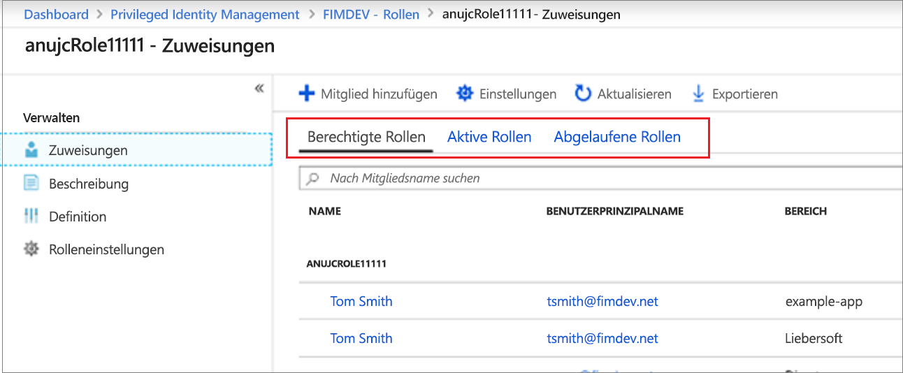
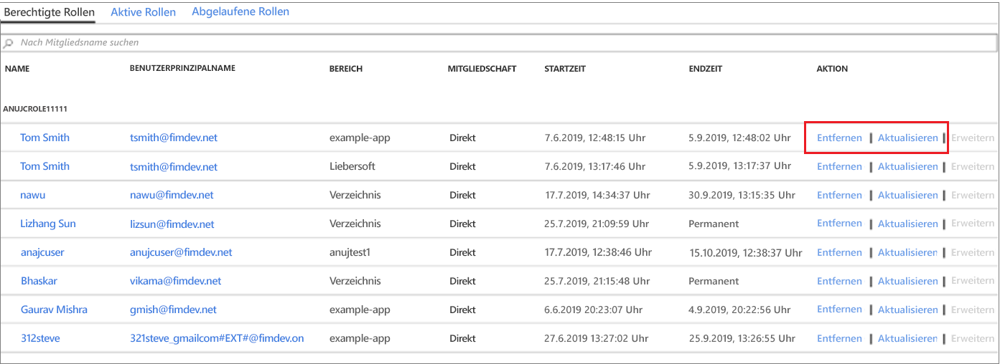

# Aktualisieren oder Entfernen einer zugewiesenen benutzerdefinierten Azure AD-Rolle in Privileged Identity Management

In diesem Artikel erfahren Sie, wie Sie Privileged Identity Management verwenden, um Just-In-Time- und zeitgebundene Zuweisungen zu benutzerdefinierten Rollen zu aktualisieren oder zu entfernen, die für die Anwendungsverwaltung auf der Administratoroberfläche von Azure Active Directory (Azure AD) erstellt wurden. 

- Weitere Informationen zum Erstellen benutzerdefinierter Rollen, um die Anwendungsverwaltung in Azure AD zu delegieren, finden Sie unter [Benutzerdefinierte Administratorrollen in Azure Active Directory (Vorschau)](../users-groups-roles/roles-custom-overview.md). 
- Wenn Sie Privileged Identity Management noch nie verwendet haben, informieren Sie sich zunächst auf der Seite [Einstieg in die Verwendung von PIM](pim-getting-started.md).

> [!NOTE]
> Benutzerdefinierte Azure AD-Rollen sind in der Vorschauversion nicht in die integrierten Verzeichnisrollen integriert. Sobald die Funktion allgemein verfügbar ist, erfolgt die Rollenverwaltung auf der Benutzeroberfläche für integrierte Rollen. Wenn das folgende Banner angezeigt wird, sollten diese Rollen [auf der Benutzeroberfläche für integrierte Rollen](pim-how-to-add-role-to-user.md) verwaltet werden, und dieser Artikel trifft nicht zu:
>
> 

## Aktualisieren oder Entfernen einer Zuweisung

Führen Sie die folgenden Schritte aus, um eine vorhandene benutzerdefinierte Rollenzuweisung zu aktualisieren oder zu entfernen.

1. Melden Sie sich im Azure-Portal mit dem Benutzerkonto bei [Privileged Identity Management](https://portal.azure.com/?Microsoft_AAD_IAM_enableCustomRoleManagement=true&Microsoft_AAD_IAM_enableCustomRoleAssignment=true&feature.rbacv2roles=true&feature.rbacv2=true&Microsoft_AAD_RegisteredApps=demo#blade/Microsoft_Azure_PIMCommon/CommonMenuBlade/quickStart) an, das der Rolle „Administrator für privilegierte Rollen“ zugewiesen ist.
1. Wählen Sie **Benutzerdefinierte Azure AD-Rollen (Vorschau)** aus.

    

1. Wählen Sie **Rollen** aus, um eine Liste der **Zuweisungen** von benutzerdefinierten Rollen für Azure AD-Anwendungen anzuzeigen.

    

1. Wählen Sie die Rolle aus, die Sie aktualisieren oder entfernen möchten.
1. Suchen Sie die Rollenzuweisung auf den Registerkarten **Berechtigte Rollen** oder **Aktive Rollen**.
1. Wählen Sie **Aktualisieren** oder **Entfernen** aus, um die Rollenzuweisung zu aktualisieren oder zu entfernen.

    

## Nächste Schritte

- [Aktivieren einer benutzerdefinierten Azure AD-Rolle](azure-ad-custom-roles-assign.md)
- [Zuweisen einer benutzerdefinierten Azure AD-Rolle](azure-ad-custom-roles-assign.md)
- [Konfigurieren der Zuweisung einer benutzerdefinierten Azure AD-Rolle](azure-ad-custom-roles-configure.md)
