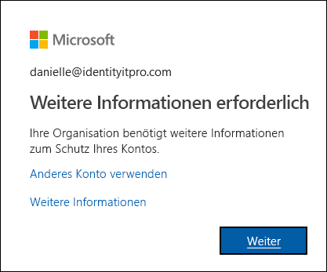

# Worum handelt es sich bei der Seite „Zusätzliche Sicherheitsüberprüfung“?

Sie haben eine E-Mail von einem IT-Mitarbeiter erhalten oder Ihr Vorgesetzter hat Ihnen mitgeteilt, dass Ihr Unternehmen Ihrem Konto eine zusätzliche Sicherheitsüberprüfung hinzugefügt hat. Was bedeutet das? Das bedeutet, dass Ihre Organisation zusätzliche Maßnahmen ergreifen, um Ihre Identität bei der Anmeldung sicherzustellen. Diese zusätzlichen Überprüfung – auch als zweistufige Überprüfung bekannt – erfolgt über eine Kombination aus Ihrem Benutzernamen, Ihrem Kennwort und einem Mobilgerät oder Telefon.

Die zweistufige Überprüfung ist sicherer als die einfache Verwendung eines Kennworts, da sie auf zwei Authentifizierungsfaktoren basiert: Sie müssen etwas wissen, und Sie müssen etwas haben. Was Sie wissen, ist Ihr Kennwort. Was Sie bei sich tragen, ist ein Smartphone oder ein anderes Gerät, das Sie häufig mit sich führen. Die zweistufige Überprüfung trägt dazu bei, Angriffe durch Hacker zu verhindern, die sich für Sie ausgeben, denn auch wenn ein Hacker Ihr Kennwort weiß, ist die Wahrscheinlichkeit gering, dass er auch über Ihr Gerät verfügt.

>[!Important]
>Dieser Artikel richtet sich an Benutzer, die die zweistufige Überprüfung mit einem Geschäfts-, Schul- oder Unikonto (z. B. alain@contoso.com) verwenden möchten. Wenn Sie Administrator sind und Informationen zum Aktivieren der zweistufigen Überprüfung für Ihre Mitarbeiter oder andere Benutzer benötigen, sehen Sie sich die [Dokumentation zur Azure Active Directory-Authentifizierung](https://docs.microsoft.com/azure/active-directory/authentication/) an.

## Wer entscheidet über die Verwendung dieser Funktion?

Je nach Kontotyp entscheidet Ihre Organisation, ob Sie die zweistufige Überprüfung verwenden müssen. Möglicherweise können Sie diese Entscheidung aber auch selbst treffen.

- **Geschäfts-, Schul- oder Unikonto.** Wenn Sie ein Geschäfts-, Schul- oder Uni-Konto verwenden (z. B. alain@contoso.com), entscheidet Ihre Organisation, ob Sie die zweistufige Überprüfung verwenden müssen. Sie gibt zudem vor, welche Überprüfungsmethode anzuwenden ist. Da Ihre Organisation die Verwendung des Features vorgeschrieben hat, kann es nicht individuell deaktiviert werden.

- **Persönliches Microsoft-Konto.** Sie können die zweistufige Überprüfung auch für Ihre persönlichen Microsoft-Konten einrichten (z.B. alain@outlook.com). Bei Problemen mit der zweistufigen Überprüfung und Ihrem persönlichen Microsoft-Konto lesen Sie den Artikel [Aktivieren oder Deaktivieren der Überprüfung in zwei Schritten für Ihr Microsoft-Konto](https://support.microsoft.com/help/4028586/microsoft-account-turning-two-step-verification-on-or-off). Da Sie auswählen, ob Sie diese Funktion verwenden möchten, können Sie sie jederzeit aktivieren und deaktivieren.

    >[!Note]
    >Wenn Probleme bei der zweistufigen Überprüfung und Ihrem persönlichen Microsoft-Konto (z. B. danielle@outlook.com) auftreten, können Sie die Vorschläge unter [Aktivieren der zweistufigen Überprüfung für Ihr Microsoft-Konto](https://support.microsoft.com/help/12408/microsoft-account-how-to-use-two-step-verification) ausprobieren.

## Zugreifen auf die Seite „Zusätzliche Sicherheitsüberprüfung“

Nachdem Ihre Organisation die zweistufige Überprüfung aktiviert und eingerichtet hat, werden Sie aufgefordert, weitere Informationen einzugeben, um Ihr Konto zu schützen.

### So greifen Sie auf die Seite „Zusätzliche Sicherheitsüberprüfung“ zu

1. Wählen Sie in der Aufforderung **Weitere Informationen erforderlich** die Option **Weiter** aus.

    Die Seite **Zusätzliche Sicherheitsüberprüfung** wird angezeigt.

2. Auf der Seite **Zusätzliche Sicherheitsüberprüfung** müssen Sie die Methode zur zweistufigen Überprüfung festlegen, mit der Sie nach der Anmeldung bei Ihrem Geschäfts-, Schul- oder Unikonto Ihre Identität bestätigen. Sie können Folgendes auswählen:

    | Kontaktmethode | Beschreibung |
    | --- | --- |
    | Mobile App | <ul><li>**Benachrichtigungen zur Überprüfung empfangen**: Mit dieser Option wird eine Benachrichtigung an die Authenticator-App auf Ihrem Smartphone oder Tablet gesendet. Überprüfen Sie die Benachrichtigung, und wählen Sie in der App **Authentifizieren** aus, wenn Sie den Zugriff zulassen möchten. Ihr Unternehmen oder Ihre Bildungseinrichtung erfordert möglicherweise die Eingabe einer PIN, bevor Sie sich authentifizieren.</li><li>**Prüfcode verwenden**: In diesem Modus generiert die Authenticator-App einen Überprüfungscode, der alle 30 Sekunden aktualisiert wird. Geben Sie auf dem Anmeldebildschirm den aktuellen Prüfcode ein. Die Microsoft Authenticator-App ist für [Android](https://go.microsoft.com/fwlink/?linkid=866594) und [iOS](https://go.microsoft.com/fwlink/?linkid=866594) verfügbar.</li></ul> |
    | Authentifizierungstelefon | <ul><li>**Telefonanruf**: Das Telefon mit der von Ihnen angegebenen Telefonnummer empfängt einen automatisierten Anruf. Nehmen Sie den Anruf an, und drücken Sie die Rautetaste (#) auf der Telefontastatur, um sich zu authentifizieren.</li><li>**SMS**: Es wird eine SMS gesendet, die einen Prüfcode enthält. Je nachdem, wozu Sie in der SMS aufgefordert werden, antworten Sie auf die SMS, oder geben Sie im Anmeldungsfenster den angegebenen Überprüfungscode ein.</li></ul> |
    | Bürotelefon | Das Telefon mit der von Ihnen angegebenen Telefonnummer empfängt einen automatisierten Anruf. Nehmen Sie den Anruf an, und drücken Sie die Rautetaste (#) auf der Telefontastatur, um sich zu authentifizieren. |

## Nächste Schritte

Nach dem Aufrufen der Seite **Zusätzliche Sicherheitsüberprüfung** müssen Sie Ihre Methode für die zweistufige Überprüfung auswählen und einrichten:

- [Einrichten Ihres mobilen Geräts als Überprüfungsmethode](multi-factor-authentication-setup-phone-number.md)

- [Einrichten Ihrer Bürotelefonnummer als Überprüfungsmethode](multi-factor-authentication-setup-office-phone.md)

- [Einrichten der Microsoft Authenticator-App als Überprüfungsmethode](multi-factor-authentication-setup-auth-app.md)

## Zugehörige Ressourcen

- [Verwalten der Einstellungen für die zweistufige Überprüfung](multi-factor-authentication-end-user-manage-settings.md)

- [Verwalten von App-Kennwörtern](multi-factor-authentication-end-user-app-passwords.md)

- [Anmelden per zweistufiger Überprüfung](multi-factor-authentication-end-user-signin.md)

- [Hilfe bei der zweistufigen Überprüfung](multi-factor-authentication-end-user-troubleshoot.md) 
