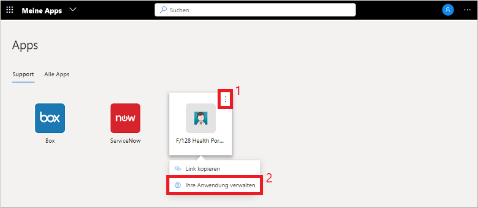

# Bearbeiten oder Widerrufen von Anwendungsberechtigungen im Portal „Meine Apps“

Wenn Sie Organisationsanwendungen im Portal **Meine Apps** verwenden, erteilen Sie häufig Berechtigungen und speichern Kontoinformationen. Um Ihre Daten zu schützen, können Sie die Berechtigungen überprüfen und widerrufen oder gespeicherte Kontoanmeldeinformationen löschen. Durch das Entfernen von Berechtigungen oder Konten können einige App-Funktionen eventuell zu Fehlern führen. Wenn nach dem Entfernen von Berechtigungen oder Konten Probleme auftreten, wenden Sie sich an den Helpdesk Ihrer Organisation, um weitere Unterstützung zu erhalten.

[!INCLUDE [preview-notice](../../../includes/active-directory-end-user-my-apps-and-workspaces.md)]

>[!Important]
>Dieser Inhalt richtet sich an Benutzer. Administratoren können sich in der [Dokumentation zur Anwendungsverwaltung](https://docs.microsoft.com/azure/active-directory/manage-apps/access-panel-workspaces) über die Einrichtung und Verwaltung cloudbasierter Apps informieren.

## Verwalten von App-Berechtigungen

Wählen Sie zum Anzeigen der Berechtigungen, denen Sie oder Ihr Administrator zugestimmt haben, das Auslassungszeichen ( **...** ) aus, das angezeigt wird, wenn Sie im Portal **Meine Apps** auf eine App zeigen. Wählen Sie anschließend **Anwendungen verwalten** aus:

Im oberen Bereich des Berechtigungsfensters wird angezeigt, welche Einwilligungen Sie persönlich gegeben haben. Beispiele für App-Berechtigungen sind die Möglichkeit des Zugriffs auf Ihren Kalender, Ihre Kontakte oder Ihre Kamera.

Sie können alle Berechtigungen widerrufen, denen Sie zugestimmt haben, indem Sie **Berechtigungen widerrufen** auswählen. Das Entfernen einer Berechtigung kann jedoch einige der App-Funktionen außer Kraft setzen. Wenn nach dem Entfernen von Berechtigungen oder Konten Probleme auftreten, wenden Sie sich an den Helpdesk Ihrer Organisation, um weitere Unterstützung zu erhalten.

Unten im Berechtigungsfenster wird angezeigt, welche Einwilligungen Ihr Administrator in Ihrem Namen gegeben hat. Dieser Abschnitt wird nicht angezeigt, wenn keine Einwilligungen vom Administrator für Berechtigungen vorhanden sind. Sie können diese Berechtigungen nicht widerrufen, da der Administrator ihnen zugestimmt hat und sie häufig aufgrund von Unternehmensrichtlinien erforderlich sind.

## Nächste Schritte

Nach dem Verwalten von App-Berechtigungen und dem Speichern von Konten im Portal **Meine Apps** haben Sie folgende Möglichkeiten:

- Organisieren Ihrer Apps in den verschiedenen Kategorien, die von Ihrer Organisation erstellt und bereitgestellt werden. Weitere Informationen finden Sie unter [Zugreifen auf und Verwenden von Sammlungen im Portal „Meine Apps“](my-applications-portal-workspaces.md).

## Verwandte Artikel

- [Aktualisieren Ihrer Profil- und Kontoinformationen](my-account-portal-overview.md). In diesem Artikel finden Sie Anweisungen zum Aktualisieren Ihrer personenbezogenen Daten, die im Portal **Meine Apps** angezeigt werden.

- [Verwalten Ihrer Organisationen](my-account-portal-organizations-page.md). Anweisungen zum Anzeigen und Verwalten gruppenbezogener Informationen auf der Seite **Organisationen** im Portal **Meine Apps**

- [Verwalten Ihrer verbundenen Geräte](my-account-portal-devices-page.md). Anweisungen zum Verwalten der Geräte, mit denen Sie über Ihr Geschäfts-, Schul- oder Unikonto verbunden sind, auf der Seite **Geräte** im Portal **Mein Profil**
