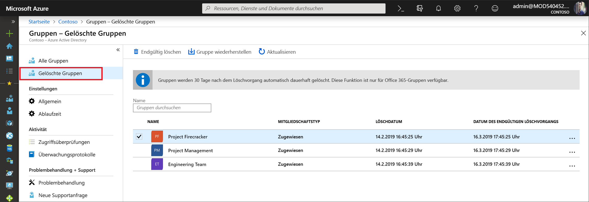

# <a name="restore-a-deleted-office-365-group-in-azure-active-directory"></a>Wiederherstellen einer gelöschten Office 365-Gruppe in der Azure Active Directory-Vorschau

Wenn Sie eine Office 365-Gruppe in Azure Active Directory (Azure AD) löschen, wird die gelöschte Gruppe beibehalten, ist aber 30 Tage lang nach dem Löschdatum nicht sichtbar. Damit soll sichergestellt werden, dass die Gruppe und dessen Inhalte bei Bedarf wiederhergestellt werden können. Diese Funktionalität ist ausschließlich auf Office 365-Gruppen in Azure AD beschränkt. Sie ist nicht für Sicherheits- und Verteilergruppen verfügbar. Beachten Sie, dass der 30-tägige Wiederherstellungszeitraum für Gruppen nicht angepasst werden kann.

> [!NOTE]
> Verwenden Sie nicht `Remove-MsolGroup`, da hierbei die Gruppe endgültig gelöscht wird. Verwenden Sie immer `Remove-AzureADMSGroup`, um eine Office 365-Gruppe zu löschen.

Die Berechtigungen, die zum Wiederherstellen einer Gruppe erforderlich sind, können Folgende umfassen:

Role | Berechtigungen
--------- | ---------
Globaler Administrator, Gruppenadministrator, Partnersupport der Ebene 2 und Intune-Administrator | Können eine beliebige gelöschte Office 365-Gruppe wiederherstellen
Benutzeradministrator und Partnersupport der Ebene 1 | Können eine beliebige gelöschte Office 365-Gruppe wiederherstellen (mit Ausnahme von Gruppen, die der Rolle „Unternehmensadministrator“ zugewiesen sind)
Benutzer | Kann eine beliebige gelöschte Office 365-Gruppe wiederherstellen, die sich in seinem Besitz befand.

## <a name="view-and-manage-the-deleted-office-365-groups-that-are-available-to-restore"></a>Anzeigen und Verwalten der wiederherstellbaren gelöschten Office 365-Gruppen

1. Melden Sie sich mit einem Benutzeradministratorkonto beim [Azure AD Admin Center](https://aad.portal.azure.com) an.

2. Wählen Sie **Gruppen** > **Gelöschte Gruppen** aus, um die gelöschten Gruppen anzuzeigen, die wiederhergestellt werden können.

    

3. Auf dem Blatt **Gelöschte Gruppen** haben Sie folgende Möglichkeiten:

   - Sie können **Gruppe wiederherstellen** auswählen, um die gelöschte Gruppe und deren Inhalt wiederherzustellen.
   - Sie können **Endgültig löschen** auswählen, um die gelöschte Gruppe endgültig zu entfernen. Gruppen können nur von einem Administrator endgültig entfernt werden.

## <a name="view-the-deleted-office-365-groups-that-are-available-to-restore-using-powershell"></a>Anzeigen der wiederherstellbaren gelöschten Office 365-Gruppen mithilfe von PowerShell

Mit den folgenden Cmdlets können gelöschte Gruppen angezeigt werden, um sicherzustellen, dass die gewünschten Gruppen noch nicht endgültig gelöscht wurden. Diese Cmdlets sind Teil des [Azure AD PowerShell-Moduls](https://www.powershellgallery.com/packages/AzureAD/). Weitere Informationen zu diesem Modul finden Sie im Artikel [Azure Active Directory PowerShell Version 2](/powershell/azure/install-adv2?view=azureadps-2.0).

1.  Führen Sie das folgende Cmdlet aus, um alle gelöschten Office 365-Gruppen in Ihrem Mandanten, die noch zur Wiederherstellung verfügbar sind, anzuzeigen.
   

    ```powershell
    Get-AzureADMSDeletedGroup
    ```

2.  Wenn Sie die ObjectID einer bestimmten Gruppe kennen (und Sie diese über das Cmdlet in Schritt 1 abrufen können), führen Sie alternativ das folgende Cmdlet aus, um sicherzustellen, dass die jeweilige gelöschte Gruppe noch nicht endgültig gelöscht wurde.

    ```
    Get-AzureADMSDeletedGroup –Id <objectId>
    ```

## <a name="how-to-restore-your-deleted-office-365-group-using-powershell"></a>So stellen Sie Ihre gelöschte Office 365-Gruppe mithilfe von PowerShell wieder her

Nachdem Sie sichergestellt haben, dass die Gruppe noch zur Wiederherstellung verfügbar ist, stellen Sie die gelöschte Gruppe über eine der folgenden Methoden wieder her. Wenn die Gruppe Dokumente, SharePoint-Websites oder andere beständige Objekte enthält, kann es bis zu 24 Stunden dauern, bis eine Gruppe und dessen Inhalte vollständig wiederhergestellt werden.

1. Führen Sie das folgende Cmdlet aus, um die Gruppe und dessen Inhalte wiederherzustellen.
 

   ```
    Restore-AzureADMSDeletedDirectoryObject –Id <objectId>
    ``` 

2. Alternativ können Sie das folgende Cmdlet ausführen, um die gelöschte Gruppe dauerhaft zu löschen.
    

    ```
    Remove-AzureADMSDeletedDirectoryObject –Id <objectId>
    ```

## <a name="how-do-you-know-this-worked"></a>Wie finde ich heraus, ob es funktioniert hat?

Um sicherzustellen, dass Sie eine Office 365-Gruppe erfolgreich wiederhergestellt haben, führen Sie das Cmdlet `Get-AzureADGroup –ObjectId <objectId>` aus, um Informationen zur Gruppe anzuzeigen. Nach Durchführung der Wiederherstellungsanforderung:

- Die Gruppe wird in der linken Navigationsleiste in Exchange angezeigt.
- Der Plan für die Gruppe wird in Planner angezeigt.
- Alle SharePoint-Websites und deren Inhalte sind verfügbar.
- Die Gruppe kann über einen der Exchange-Endpunkte und andere Office 365-Workloads, die Office 365-Gruppen unterstützen, aufgerufen werden.

## <a name="next-steps"></a>Nächste Schritte

Diese Artikel enthalten zusätzliche Informationen zu Azure Active Directory-Gruppen.

* [Anzeigen vorhandener Gruppen](../fundamentals/active-directory-groups-view-azure-portal.md)
* [Verwalten der Einstellungen einer Gruppe](../fundamentals/active-directory-groups-settings-azure-portal.md)
* [Verwalten der Mitglieder einer Gruppe](../fundamentals/active-directory-groups-members-azure-portal.md)
* [Verwalten der Mitgliedschaften einer Gruppe](../fundamentals/active-directory-groups-membership-azure-portal.md)
* [Verwalten dynamischer Regeln für Benutzer in einer Gruppe](groups-dynamic-membership.md)
