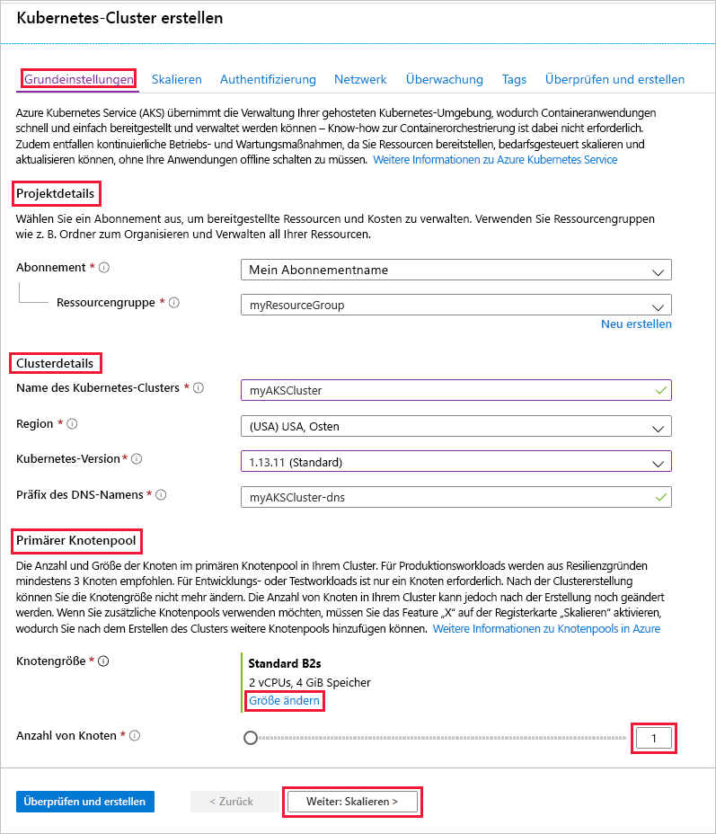
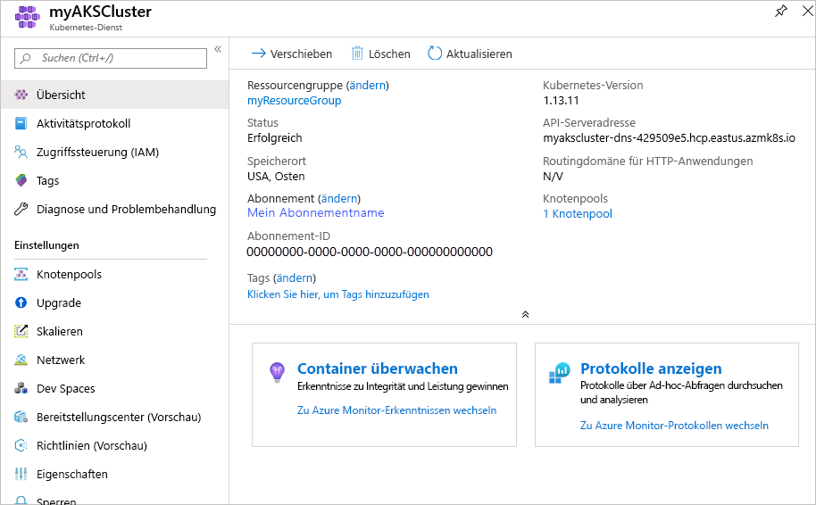
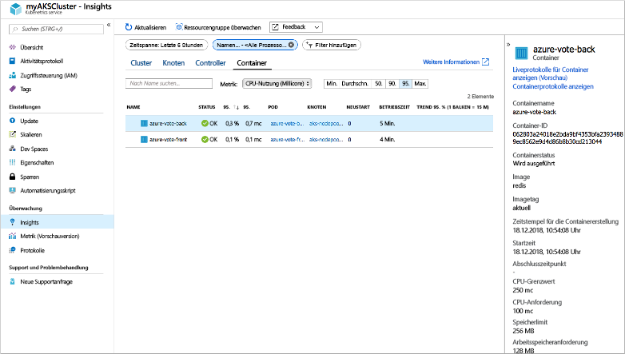
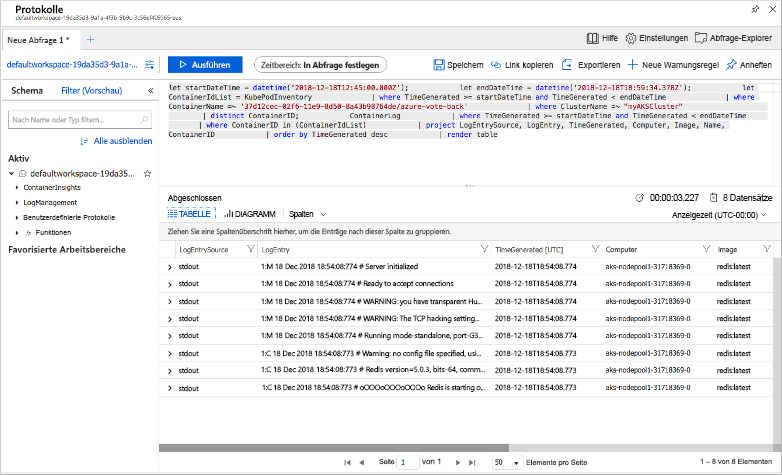

# <a name="quickstart-deploy-an-azure-kubernetes-service-aks-cluster"></a>Schnellstart: Bereitstellen eines Azure Kubernetes Service-Clusters (AKS)

In dieser Schnellstartanleitung stellen Sie einen AKS-Cluster mit dem Azure-Portal bereit. Anschließend wird im Cluster eine Anwendung mit mehreren Containern ausgeführt, die ein Web-Front-End und eine Redis-Instanz umfasst. Nach Abschluss des Vorgangs kann auf die Anwendung über das Internet zugegriffen werden.


Für diese Schnellstartanleitung werden Grundkenntnisse in Bezug auf die Kubernetes-Konzepte vorausgesetzt. Ausführliche Informationen zu Kubernetes finden Sie in der [Kubernetes-Dokumentation][kubernetes-documentation].

## <a name="sign-in-to-azure"></a>Anmelden bei Azure

Melden Sie sich unter http://portal.azure.com beim Azure-Portal an.

## <a name="create-an-aks-cluster"></a>Erstellen eines AKS-Clusters

Klicken Sie im Azure-Portal oben links auf **Ressource erstellen** > **Kubernetes Service**.

Führen Sie zum Erstellen eines AKS-Clusters die folgenden Schritte aus:

1. **Grundlagen**: Konfigurieren Sie die folgenden Optionen:
    - *PROJEKTDETAILS:* Wählen Sie ein Azure-Abonnement und dann eine Azure-Ressourcengruppe aus, bzw. erstellen Sie eine Ressourcengruppe, etwa *myResourceGroup*. Geben Sie unter **Kubernetes cluster name** (Name des Kubernetes-Clusters) einen Namen ein, etwa *myAKSCluster*.
    - *CLUSTERDETAILS:* Geben Sie Region, Kubernetes-Version und DNS-Namenspräfix für den AKS-Cluster ein.
    - *SKALIERUNG:* Wählen Sie eine VM-Größe für die AKS-Knoten aus. Die VM-Größe kann **nicht** geändert werden, sobald ein AKS-Cluster bereitgestellt wurde.
        - Wählen Sie die Anzahl von Knoten für die Bereitstellung im Cluster aus. Legen Sie für diese Schnellstartanleitung für **Anzahl von Knoten** die Option *1* fest. Die Knotenanzahl **kann** nach der Clusterbereitstellung angepasst werden.
    
    

    Wählen Sie nach Abschluss des Vorgangs **Next: Authentication** (Nächster Schritt: Authentifizierung).

1. **Authentifizierung:** Konfigurieren Sie die folgenden Optionen:
    - Erstellen Sie einen neuen Dienstprinzipal, oder *konfigurieren* Sie einen vorhandenen. Bei der Verwendung eines vorhandenen Dienstprinzipalnamens müssen Sie die SPN-Client-ID und das Geheimnis angeben.
    - Aktivieren Sie die Option für die rollenbasierte Zugriffssteuerung (Role-Based Access Control, RBAC) für Kubernetes. Diese RBAC-Funktionen ermöglichen eine präzisere Steuerung des Zugriffs auf die im AKS-Cluster bereitgestellten Kubernetes-Ressourcen.

    Wählen Sie danach **Weiter: Netzwerk** aus.

1. **Netzwerk:** Konfigurieren Sie die folgenden Netzwerkoptionen, die als Standard festgelegt werden sollten:
    
    - **HTTP-Anwendungsrouting**: Wählen Sie **Ja**, um einen integrierten Eingangscontroller mit automatischer Erstellung öffentlicher DNS-Namen zu konfigurieren. Weitere Informationen zum HTTP-Routing finden Sie unter [HTTP-Routing und DNS bei AKS][http-routing].
    - **Netzwerkkonfiguration**: Wählen Sie die Netzwerkkonfiguration **Basic** mit dem [kubenet][kubenet]-Kubernetes-Plug-In anstelle der erweiterten Netzwerkkonfiguration mit [Azure CNI][azure-cni]. Weitere Informationen zu Netzwerkoptionen finden Sie unter [Netzwerkkonfiguration in Azure Kubernetes Service (AKS)][aks-network].
    
    Wählen Sie danach **Weiter: Überwachung** aus.

1. Bei der Bereitstellung eines AKS-Clusters kann Azure Monitor für Container so konfiguriert werden, dass die Integrität des AKS-Cluster und im Cluster ausgeführte Pods überwacht werden. Weitere Informationen zur Überwachung der Integrität von Containern finden Sie unter [Überwachen der Integrität von Azure Kubernetes Service][aks-monitor].

    Wählen Sie zum Aktivieren der Containerüberwachung **Ja** und dann einen vorhandenen Log Analytics-Arbeitsbereich aus, oder erstellen Sie einen neuen.
    
    Wählen Sie **Überprüfen + erstellen** und danach **Erstellen**.

Es dauert einige Minuten, bis der AKS-Clusters erstellt wurde und für die Verwendung bereit ist. Navigieren Sie zur Ressourcengruppe für den AKS-Cluster (etwa *myResourceGroup*), und wählen Sie die AKS-Ressource aus, beispielsweise *myAKSCluster*. Das AKS-Clusterdashboard wird wie im folgenden Beispielscreenshot angezeigt:



## <a name="connect-to-the-cluster"></a>Verbinden mit dem Cluster

Verwenden Sie zum Verwalten eines Kubernetes-Clusters den Kubernetes-Befehlszeilenclient [kubectl][kubectl]. Der `kubectl`-Client ist in Azure Cloud Shell vorinstalliert.

Öffnen Sie die Cloud Shell mit der Schaltfläche oben rechts im Azure-Portal.


Mit dem Befehl [az aks get-credentials][az-aks-get-credentials] können Sie `kubectl` für die Verbindungsherstellung mit Ihrem Kubernetes-Cluster konfigurieren. Im folgenden Beispiel werden Anmeldeinformationen für den Clusternamen *myAKSCluster* in der Ressourcengruppe *myResourceGroup* abgerufen:

```azurecli-interactive
az aks get-credentials --resource-group myResourceGroup --name myAKSCluster
```

Verwenden Sie zum Überprüfen der Verbindung mit Ihrem Cluster den Befehl [kubectl get][kubectl-get], um eine Liste der Clusterknoten zu erhalten.

```azurecli-interactive
kubectl get nodes
```

Die folgende Beispielausgabe zeigt den in den vorherigen Schritten erstellten Knoten.

```
NAME                       STATUS    ROLES     AGE       VERSION
aks-agentpool-14693408-0   Ready     agent     10m       v1.11.2
```

## <a name="run-the-application"></a>Ausführen der Anwendung

Kubernetes-Manifestdateien definieren einen gewünschten Zustand für einen Cluster (Desired State) – also beispielsweise, welche Containerimages ausgeführt werden sollen. In dieser Schnellstartanleitung wird ein Manifest verwendet, um alle Objekte zu erstellen, die zum Ausführen einer Azure Vote-Beispielanwendung benötigt werden. Zu diesen Objekten gehören zwei [Kubernetes-Bereitstellungen][kubernetes-deployment]: eine für das Azure Vote-Front-End und eine für eine Redis-Instanz. Darüber hinaus werden zwei [Kubernetes-Dienste][kubernetes-service] erstellt: ein interner Dienst für die Redis-Instanz und ein externer Dienst für den Zugriff auf die Azure Vote-Anwendung über das Internet.

Erstellen Sie eine Datei mit dem Namen `azure-vote.yaml`, und fügen Sie den folgenden YAML-Code ein: Erstellen Sie bei Verwendung von Azure Cloud Shell die Datei mit `vi` oder `Nano` wie auf einem virtuellen oder physischen System.

```yaml
apiVersion: apps/v1
kind: Deployment
metadata:
  name: azure-vote-back
spec:
  replicas: 1
  selector:
    matchLabels:
      app: azure-vote-back
  template:
    metadata:
      labels:
        app: azure-vote-back
    spec:
      containers:
      - name: azure-vote-back
        image: redis
        resources:
          requests:
            cpu: 100m
            memory: 128Mi
          limits:
            cpu: 250m
            memory: 256Mi
        ports:
        - containerPort: 6379
          name: redis
---
apiVersion: v1
kind: Service
metadata:
  name: azure-vote-back
spec:
  ports:
  - port: 6379
  selector:
    app: azure-vote-back
---
apiVersion: apps/v1
kind: Deployment
metadata:
  name: azure-vote-front
spec:
  replicas: 1
  selector:
    matchLabels:
      app: azure-vote-front
  template:
    metadata:
      labels:
        app: azure-vote-front
    spec:
      containers:
      - name: azure-vote-front
        image: microsoft/azure-vote-front:v1
        resources:
          requests:
            cpu: 100m
            memory: 128Mi
          limits:
            cpu: 250m
            memory: 256Mi
        ports:
        - containerPort: 80
        env:
        - name: REDIS
          value: "azure-vote-back"
---
apiVersion: v1
kind: Service
metadata:
  name: azure-vote-front
spec:
  type: LoadBalancer
  ports:
  - port: 80
  selector:
    app: azure-vote-front
```

Führen Sie die Anwendung mithilfe des Befehls [kubectl apply][kubectl-apply] aus.

```azurecli-interactive
kubectl create -f azure-vote.yaml
```

Die folgende Beispielausgabe zeigt die in Ihrem AKS-Cluster erstellten Kubernetes-Ressourcen:

```
deployment "azure-vote-back" created
service "azure-vote-back" created
deployment "azure-vote-front" created
service "azure-vote-front" created
```

## <a name="test-the-application"></a>Testen der Anwendung

Im Zuge der Anwendungsausführung wird ein [Kubernetes-Dienst][kubernetes-service] erstellt, der die Anwendung über das Internet verfügbar macht. Dieser Vorgang kann einige Minuten dauern.

Verwenden Sie zum Überwachen des Fortschritts den Befehl [kubectl get service][kubectl-get] mit dem Argument `--watch`.

```azurecli-interactive
kubectl get service azure-vote-front --watch
```

Der Wert *EXTENAL-IP* für den Dienst *azure-vote-front* wird zunächst als *ausstehend* angezeigt.

```
NAME               TYPE           CLUSTER-IP   EXTERNAL-IP   PORT(S)        AGE
azure-vote-front   LoadBalancer   10.0.37.27   <pending>     80:30572/TCP   6s
```

Sobald die *externe IP-Adresse* nicht mehr *ausstehend* ist, sondern eine *IP-Adresse* angezeigt wird, verwenden Sie `CTRL-C`, um die kubectl-Überwachung zu beenden.

```
azure-vote-front   LoadBalancer   10.0.37.27   52.179.23.131   80:30572/TCP   2m
```

Öffnen Sie in einem Webbrowser die externe IP-Adresse des Diensts, um die Azure Vote-App wie im folgenden Beispiel anzuzeigen:


## <a name="monitor-health-and-logs"></a>Überwachung von Integrität und Protokollen

Bei der Erstellung des Clusters wurde die Überwachung von Containerinformationen aktiviert. Mit dieser Überwachungsfunktion werden Integritätsmetriken für den AKS-Cluster und für im Cluster ausgeführte Pods bereitgestellt. Weitere Informationen zur Überwachung der Integrität von Containern finden Sie unter [Überwachen der Integrität von Azure Kubernetes Service][aks-monitor].

Es dauert möglicherweise einige Minuten, bis diese Daten im Azure-Portal aufgefüllt werden. Wenn Sie den aktuellen Status, die Betriebszeit und die Ressourcennutzung für die Azure Vote-Pods anzeigen möchten, navigieren Sie wieder zur AKS-Ressource (etwa *myAKSCluster*) im Azure-Portal. Sie können dann wie folgt auf den Integritätsstatus zugreifen:

1. Wählen Sie auf der linken Seite unter **Überwachung** die Option **Insights (Vorschau)**.
1. Wählen Sie oben die Option **+ Filter hinzufügen**.
1. Wählen Sie *Namespace* als Eigenschaft, und wählen Sie dann die Option *\<All but kube-system\>* (Alles außer kube-system).
1. Wählen Sie die Anzeige **Container**.

Die Container *azure-vote-back* und *azure-vote-front* werden angezeigt. Dies wird im folgenden Beispiel veranschaulicht:



Wenn Sie Protokolle für den Pod `azure-vote-front` anzeigen möchten, klicken Sie auf der rechten Seite der Containerliste auf den Link **Containerprotokolle anzeigen**. Diese Protokolle enthalten die Datenströme *stdout* und *stderr* aus dem Container.



## <a name="delete-cluster"></a>Löschen von Clustern

Wenn der Cluster nicht mehr benötigt wird, löschen Sie die Clusterressource. Bei diesem Vorgang werden alle zugeordneten Ressourcen gelöscht. Dieser Vorgang kann im Azure-Portal ausgeführt werden, indem Sie auf dem AKS-Clusterdashboard auf die Schaltfläche **Löschen** klicken. Alternativ dazu kann der Befehl [az aks delete][az-aks-delete] in Cloud Shell genutzt werden:

```azurecli-interactive
az aks delete --resource-group myResourceGroup --name myAKSCluster --no-wait
```

> [!NOTE]
> Wenn Sie den Cluster löschen, wird der vom AKS-Cluster verwendete Azure Active Directory-Dienstprinzipal nicht entfernt. Schritte zum Entfernen des Dienstprinzipals finden Sie unter den [Überlegungen zum AKS-Dienstprinzipal und dessen Löschung][sp-delete].

## <a name="get-the-code"></a>Abrufen des Codes

In dieser Schnellstartanleitung wurden vorab erstellte Containerimages verwendet, um eine Kubernetes-Bereitstellung zu erstellen. Der dazugehörige Anwendungscode, die Dockerfile-Datei und die Kubernetes-Manifestdatei sind auf GitHub verfügbar.

[https://github.com/Azure-Samples/azure-voting-app-redis][azure-vote-app]

## <a name="next-steps"></a>Nächste Schritte

In dieser Schnellstartanleitung haben Sie einen Kubernetes-Cluster und eine Anwendung mit mehreren Containern dafür bereitgestellt.

Weitere Informationen zu Azure Container Service sowie ein vollständiges Beispiel vom Code bis zur Bereitstellung finden Sie im Kubernetes-Clustertutorial.

> [!div class="nextstepaction"]
> [AKS-Tutorial][aks-tutorial]

<!-- LINKS - external -->
[azure-vote-app]: https://github.com/Azure-Samples/azure-voting-app-redis.git
[azure-cni]: https://github.com/Azure/azure-container-networking/blob/master/docs/cni.md
[kubectl]: https://kubernetes.io/docs/user-guide/kubectl/
[kubectl-apply]: https://kubernetes.io/docs/reference/generated/kubectl/kubectl-commands#apply
[kubectl-get]: https://kubernetes.io/docs/reference/generated/kubectl/kubectl-commands#get
[kubenet]: https://kubernetes.io/docs/concepts/cluster-administration/network-plugins/#kubenet
[kubernetes-deployment]: https://kubernetes.io/docs/concepts/workloads/controllers/deployment/
[kubernetes-documentation]: https://kubernetes.io/docs/home/
[kubernetes-service]: https://kubernetes.io/docs/concepts/services-networking/service/

<!-- LINKS - internal -->
[az-aks-get-credentials]: /cli/azure/aks?view=azure-cli-latest#az-aks-get-credentials
[az-aks-delete]: /cli/azure/aks#az-aks-delete
[aks-monitor]: ../monitoring/monitoring-container-health.md
[aks-network]: ./concepts-network.md
[aks-tutorial]: ./tutorial-kubernetes-prepare-app.md
[http-routing]: ./http-application-routing.md
[sp-delete]: kubernetes-service-principal.md#additional-considerations
