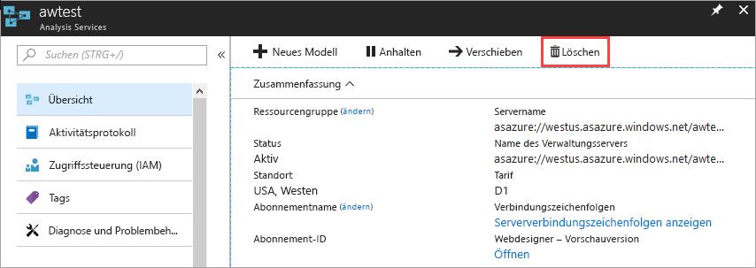

# Erstellen eines Analysis Services-Servers im Azure-Portal
In diesem Artikel werden die Schritte zum Erstellen einer Analysis Services-Serverressource in Ihrem Azure-Abonnement beschrieben.

Bevor Sie beginnen, benötigen Sie Folgendes: 

* **Azure-Abonnement:** Besuchen Sie die Webseite [Kostenlose Azure-Testversion](https://azure.microsoft.com/offers/ms-azr-0044p/), und erstellen Sie ein Konto.
* **Azure Active Directory**: Ihr Abonnement muss einem Azure Active Directory-Mandanten zugeordnet sein. Und Sie müssen bei Azure mit einem Konto in diesem Azure Active Directory angemeldet sein. Weitere Informationen finden Sie unter [Authentifizierung und Benutzerberechtigungen](analysis-services-manage-users.md).

## Anmelden beim Azure-Portal 

Melden Sie sich beim [Azure-Portal](https://portal.azure.com)

## Erstellen eines Servers

1. Klicken Sie auf **+ Ressource erstellen** > **Daten + Analysen** > **Analysis Services**.

    

2. Füllen Sie in **Analysis Services** die erforderlichen Felder aus, und klicken Sie dann auf **Erstellen**.
   
    
   
   * **Servername:** Geben Sie einen eindeutigen Namen ein, mit dem auf den Server verwiesen wird.
   * **Abonnement**: Wählen Sie das Abonnement aus, das diesem Server zugeordnet wird.
   * **Ressourcengruppe**: Erstellen Sie eine neue Ressourcengruppe, oder wählen Sie eine bereits vorhandene Ressourcengruppe aus. Ressourcengruppen sind darauf ausgelegt, Sie beim Verwalten einer Sammlung von Azure-Ressourcen zu unterstützen. Weitere Informationen finden Sie unter [Ressourcengruppen](../azure-resource-manager/resource-group-overview.md).
   * **Standort:** An diesem Standort des Azure-Rechenzentrums wird der Server gehostet. Wählen Sie einen Standort in der Nähe Ihrer größten Benutzerbasis aus.
   * **Tarif:** Wählen Sie einen Tarif aus. Wenn Sie Tests durchführen und die Beispielmodelldatenbank installieren möchten, wählen Sie den kostenlosen Tarif **D1** aus. Weitere Informationen finden Sie unter [Azure Analysis Services – Preise](https://azure.microsoft.com/pricing/details/analysis-services/). 
    * **Administrator**: Dies ist standardmäßig das Konto, mit dem Sie angemeldet werden. Sie können ein anderes Konto aus Ihrem Azure Active Directory auswählen.
    * **Einstellung „Sicherungsspeicher“**: Optional. Wenn Sie bereits über ein [Speicherkonto](../storage/common/storage-introduction.md), verfügen, können Sie es als Standardkonto für die Sicherung der Modelldatenbank angeben. Sie können später auch Einstellungen zum [Sichern und Wiederherstellen](analysis-services-backup.md) angeben.
    * **Speicherschlüssel-Ablaufdatum**: Optional. Geben Sie einen Ablaufzeitraum für den Speicherschlüssel an.
3. Klicken Sie auf **Create**.

Die Erstellung dauert in der Regel weniger als eine Minute. Wenn Sie **Add to Portal** (Zu Portal hinzufügen) ausgewählt haben, navigieren Sie zu Ihrem Portal, um den neuen Server anzuzeigen. Oder navigieren Sie zu **Alle Dienste** > **Analysis Services**, um zu überprüfen, ob der Server bereit ist.

## Bereinigen von Ressourcen
Löschen Sie Ihren Server, wenn Sie ihn nicht mehr benötigen. Klicken Sie auf der Seite **Übersicht** Ihres Servers auf **Löschen**. 

 

## Nächste Schritte

[Hinzufügen eines Beispieldatenmodells](analysis-services-create-sample-model.md) zu Ihrem Server  
[Installieren eines lokalen Datengateways](analysis-services-gateway-install.md), wenn Ihr Datenmodell mit lokalen Datenquellen verbunden ist  
[Bereitstellen eines tabellarischen Modellprojekts](analysis-services-deploy.md) aus Visual Studio   

