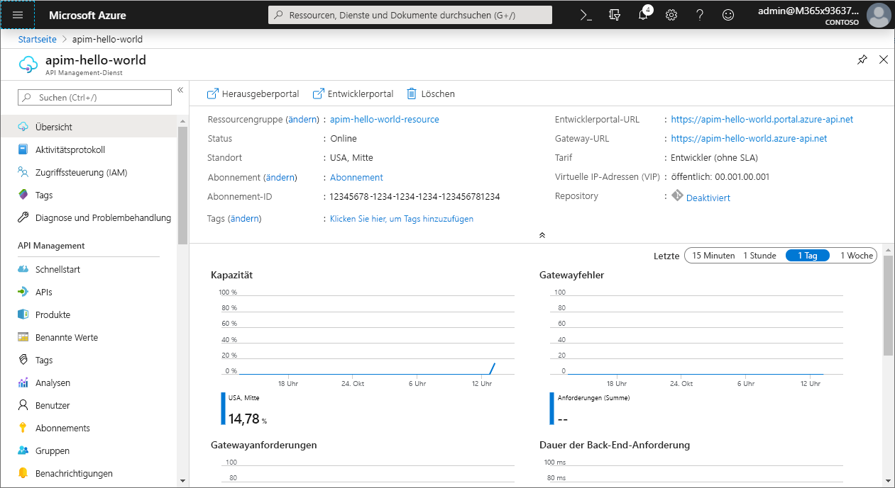
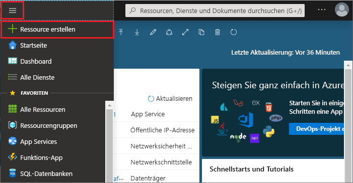
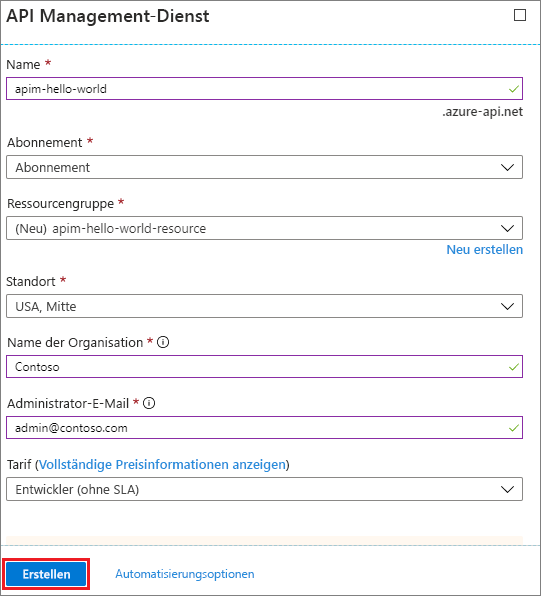
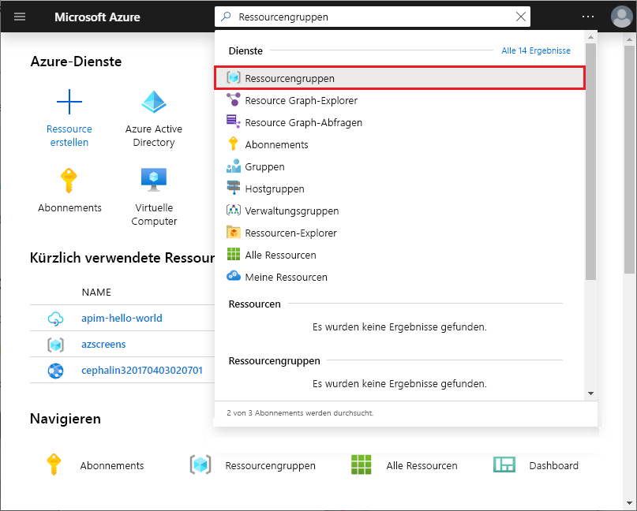

# Erstellen einer neuen Azure API Management-Dienstinstanz

Azure API Management (APIM) unterstützt Organisationen beim Veröffentlichen von APIs für externe Entwickler, Partnerentwickler und interne Entwickler, um das volle Potenzial von Daten und Diensten ausschöpfen zu können. API Management bietet die Kernkompetenzen zur Sicherstellung eines erfolgreichen API-Programms in Form von Entwicklerengagement, geschäftlichen Erkenntnissen, Analysen, Sicherheit und Schutz. Mit APIM können Sie moderne API-Gateways für vorhandene Back-End-Dienste, die an einem beliebigen Ort gehostet werden, erstellen und verwalten. Weitere Informationen finden Sie im Thema [Übersicht](api-management-key-concepts.md).

In dieser Schnellstartanleitung werden die Schritte zum Erstellen einer neuen API Management-Instanz mit dem Azure-Portal beschrieben.

[!INCLUDE [quickstarts-free-trial-note](../../includes/quickstarts-free-trial-note.md)]

## Anmelden an Azure

Melden Sie sich unter http://portal.azure.com beim Azure-Portal an.

## Erstellen eines neuen Diensts

1. Klicken Sie im [Azure-Portal](https://portal.azure.com/) auf **Ressource erstellen** > **Enterprise Integration** > **API Management**.

    Alternativ können Sie **Neu** wählen, `API management` in das Suchfeld eingeben und die EINGABETASTE drücken. Klicken Sie auf **Create**.

2. Geben Sie im Fenster **API Management-Dienst** Einstellungen ein.

    

    | Einstellung                 | Empfohlener Wert                               | Beschreibung                                                                                                                                                                                                                                                                                                                         |
|-------------------------|-----------------------------------------------|-------------------------------------------------------------------------------------------------------------------------------------------------------------------------------------------------------------------------------------------------------------------------------------------------------------------------------------|
| **Name**                | Eindeutiger Name für Ihren API Management-Dienst | Den Namen können Sie später nicht mehr ändern. Der Name des Diensts wird verwendet, um einen Standarddomänennamen in der Form *{Name}.azure-api.net* zu generieren. Wenn Sie einen benutzerdefinierten Domänennamen verwenden möchten, lesen Sie [Configure a custom domain name](configure-custom-domain.md) (Konfigurieren eines benutzerdefinierten Domänennamens).   Der Dienstname wird verwendet, um auf den Dienst und die entsprechende Azure-Ressource zu verweisen. |
| **Abonnement**        | Ihr Abonnement                             | Das Abonnement, unter dem diese neue Dienstinstanz erstellt wird. Sie können aus den verschiedenen Azure-Abonnements, auf die Sie Zugriff haben, ein Abonnement auswählen.                                                                                                                                                            |
| **Ressourcengruppe**      | *apimResourceGroup*                           | Sie können eine neue oder eine vorhandene Ressource auswählen. Eine Ressourcengruppe ist eine Sammlung von Ressourcen mit gleichem Lebenszyklus, gleichen Berechtigungen und gleichen Richtlinien. [Hier](../azure-resource-manager/resource-group-overview.md#resource-groups)erhalten Sie weitere Informationen.                                                                                                  |
| **Location**            | *USA, Westen*                                    | Wählen Sie die geografische Region in Ihrer Nähe aus. Im Dropdownlistenfeld werden nur die verfügbaren Regionen für den API Management-Dienst angezeigt.                                                                                                                                                                                                          |
| **Name der Organisation**   | Der Name Ihrer Organisation                 | Dieser Name wird an verschiedenen Stellen verwendet, u.a. im Titel des Entwicklerportals und im Absender von Benachrichtigungs-E-Mails.                                                                                                                                                                                                             |
| **Administrator-E-Mail** | *admin@org.com*                               | Legen Sie die E-Mail-Adresse fest, an die alle Benachrichtigungen von **API Management** gesendet werden.                                                                                                                                                                                                                                              |
| **Preisstufe**        | *Developer*                                   | Legen Sie den Tarif **Entwickler** fest, um den Dienst zu bewerten. Dieser Tarif ist nicht für die Produktion bestimmt. Weitere Informationen zum Skalieren der API Management-Tarife finden Sie unter [Upgrade and scale an API Management instance](upgrade-and-scale.md) (Upgraden und Skalieren einer API Management-Instanz).                                                                                                                                    |

3. Wählen Sie **Erstellen**.

    > [!TIP]
    > Es dauert in der Regel zwischen 20 und 30 Minuten, einen API Management-Dienst zu erstellen. Durch Auswählen von **An Dashboard anheften** ist ein neu erstellter Dienst einfacher zu finden.

[!INCLUDE [api-management-navigate-to-instance.md](../../includes/api-management-navigate-to-instance.md)]

## Bereinigen von Ressourcen

Wenn die Ressourcengruppe und alle zugehörigen Ressourcen nicht mehr benötigt werden, können Sie sie mit den folgenden Schritten entfernen:

1. Wählen Sie im Azure-Portal **Alle Dienste** aus.
2. Geben Sie `resource groups` in das Suchfeld ein, und klicken Sie auf das Ergebnis.

    

3. Suchen Sie nach Ihrer Ressourcengruppe, und klicken Sie darauf.
4. Klicken Sie auf **Ressourcengruppe löschen**.

    

5. Bestätigen Sie den Löschvorgang, indem Sie den Namen Ihrer Ressourcengruppe eingeben.
6. Klicken Sie auf **Löschen**.

## Nächste Schritte

> [!div class="nextstepaction"]
> [Importieren und Veröffentlichen Ihrer ersten API](import-and-publish.md)
