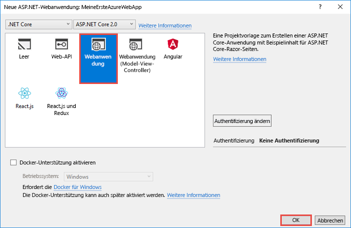
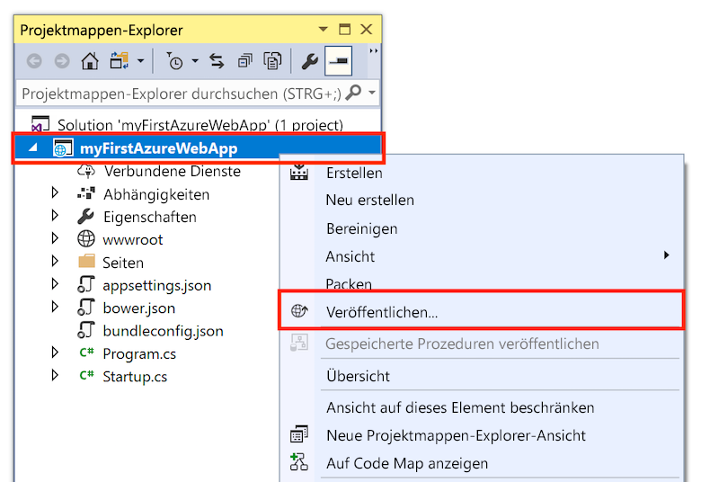
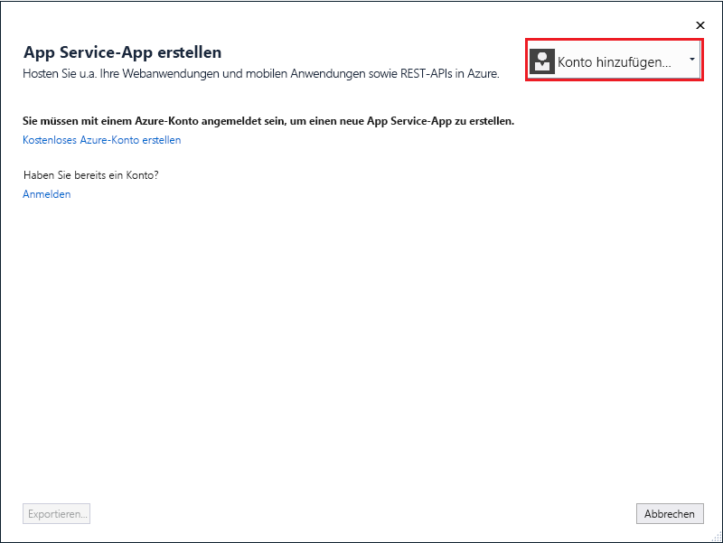
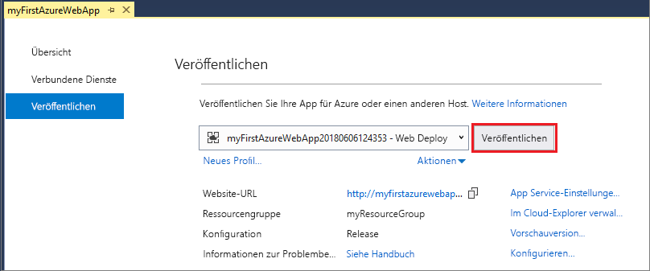

# <a name="create-an-aspnet-core-web-app-in-azure"></a>Erstellen von ASP.NET Core-Web-Apps in Azure

> [!NOTE]
> In diesem Artikel wird eine App in App Service unter Windows bereitgestellt. Informationen zur Bereitstellung in App Service unter _Linux_ finden Sie unter [Erstellen einer .NET Core-Web-App in App Service unter Linux](./containers/quickstart-dotnetcore.md). 
>

Von [Azure App Service](overview.md) wird ein hochgradig skalierbarer Webhostingdienst mit Self-Patching bereitgestellt.  Diese Schnellstartanleitung veranschaulicht die Bereitstellung Ihrer ersten ASP.NET Core-Web-App in Azure App Service. Am Ende verfügen Sie über eine Ressourcengruppe, die einen App Service-Plan und eine App Service-App mit einer bereitgestellten Webanwendung umfasst.


[!INCLUDE [quickstarts-free-trial-note](../../includes/quickstarts-free-trial-note.md)]

## <a name="prerequisites"></a>Voraussetzungen

Installieren Sie <a href="https://www.visualstudio.com/downloads/" target="_blank">Visual Studio 2017</a> mit der Workload **ASP.NET und Webentwicklung**, um dieses Tutorial abzuschließen.

Sie haben Visual Studio 2017 bereits installiert:

- Installieren Sie die neuesten Updates in Visual Studio, indem Sie auf **Hilfe** > **Nach Updates suchen** klicken.
- Fügen Sie die Workload hinzu. Klicken Sie dazu auf **Tools** > **Tools und Features abrufen**.

## <a name="create-an-aspnet-core-web-app"></a>Erstellen einer ASP.NET Core-Web-App

Erstellen Sie in Visual Studio ein Projekt durch Auswählen von **Datei > Neu > Projekt**. 

Wählen Sie im Dialogfeld **Neues Projekt** die Optionen **Visual C# > Web > ASP.NET Core-Webanwendung** aus.

Geben Sie der Anwendung den Namen _myFirstAzureWebApp_, und wählen Sie anschließend **OK** aus.
   


Sie können jede Art von ASP.NET Core-Web-App für Azure bereitstellen. Wählen Sie in diesem Schnellstart die Vorlage **Webanwendung** aus, und vergewissern Sie sich, dass die Authentifizierung auf **Keine Authentifizierung** festgelegt und keine andere Option ausgewählt ist.
      
Klicken Sie auf **OK**.



Wählen Sie im Menü **Debuggen > Starten ohne Debugging** aus, um die Web-App lokal auszuführen.


## <a name="launch-the-publish-wizard"></a>Starten des Veröffentlichungs-Assistenten

Klicken Sie im **Projektmappen-Explorer** mit der rechten Maustaste auf das Projekt **myFirstAzureWebApp**, und wählen Sie **Veröffentlichen** aus.



Der Veröffentlichungs-Assistent wird automatisch gestartet. Wählen Sie **App Service** > **Veröffentlichen**, um das Dialogfeld **App Service erstellen** zu öffnen.


## <a name="sign-in-to-azure"></a>Anmelden bei Azure

Klicken Sie im Dialogfeld **App Service erstellen** auf **Konto hinzufügen**, und melden Sie sich bei Ihrem Azure-Abonnement an. Wenn Sie bereits angemeldet sind, wählen Sie in der Dropdownliste das gewünschte Konto aus.

> [!NOTE]
> Wenn Sie bereits angemeldet sind, wählen Sie noch nicht **Erstellen** aus.
>
   


## <a name="create-a-resource-group"></a>Erstellen einer Ressourcengruppe

[!INCLUDE [resource group intro text](../../includes/resource-group.md)]

Wählen Sie neben **Ressourcengruppe** die Option **Neu** aus.

Nennen Sie die Ressourcengruppe **myResourceGroup**, und wählen Sie **OK** aus.

## <a name="create-an-app-service-plan"></a>Wie erstelle ich einen Plan?

[!INCLUDE [app-service-plan](../../includes/app-service-plan.md)]

Wählen Sie neben **Hostingplan** die Option **Neu** aus. 

Verwenden Sie im Dialogfeld **Hostingplan konfigurieren** die in der Tabelle unter dem Screenshot aufgeführten Einstellungen.


| Einstellung | Empfohlener Wert | BESCHREIBUNG |
|-|-|-|
|App Service-Plan| myAppServicePlan | Name des App Service-Plans. |
| Standort | Europa, Westen | Das Rechenzentrum, in dem die Web-App gehostet wird. |
| Größe | Kostenlos | Der [Tarif](https://azure.microsoft.com/pricing/details/app-service/?ref=microsoft.com&utm_source=microsoft.com&utm_medium=docs&utm_campaign=visualstudio) bestimmt die Hostingfeatures. |

Klicken Sie auf **OK**.

## <a name="create-and-publish-the-web-app"></a>Erstellen und Veröffentlichen der Web-App

Geben Sie unter **App-Name** einen eindeutigen App-Namen ein (gültige Zeichen sind `a-z`, `0-9` und `-`), oder akzeptieren Sie den automatisch generierten eindeutigen Namen. Die URL der Web-App lautet `http://<app_name>.azurewebsites.net`, wobei `<app_name>` der Name Ihrer App ist.

Wählen Sie **Erstellen** aus, um mit der Erstellung der Azure-Ressourcen zu beginnen.


Nach Abschluss des Assistenten wird die ASP.NET Core-Web-App in Azure veröffentlicht und anschließend im Standardbrowser gestartet.


Der App-Name, den Sie im [Schritt „Erstellen und Veröffentlichen“](#create-and-publish-the-web-app) angegeben haben, wird als URL-Präfix im Format `http://<app_name>.azurewebsites.net` verwendet.

Herzlichen Glückwunsch, Ihre ASP.NET Core-Web-App wird live in Azure App Service ausgeführt.

## <a name="update-the-app-and-redeploy"></a>Aktualisieren der App und erneutes Bereitstellen

Öffnen Sie im **Projektmappen-Explorer** Folgendes: _Pages/Index.cshtml_.

Ersetzen Sie die zwei `<div>`-Tags durch den folgenden Code:

```HTML
<div class="jumbotron">
    <h1>ASP.NET in Azure!</h1>
    <p class="lead">This is a simple app that we’ve built that demonstrates how to deploy a .NET app to Azure App Service.</p>
</div>
```

Klicken Sie zur erneuten Bereitstellung in Azure im **Projektmappen-Explorer** mit der rechten Maustaste auf das Projekt **myFirstAzureWebApp**, und wählen Sie **Veröffentlichen** aus.

Wählen Sie auf der Seite mit der Veröffentlichungszusammenfassung die Option **Veröffentlichen** aus.


Nach Abschluss der Veröffentlichung wird in Visual Studio ein Browser mit der URL der Web-App gestartet.


## <a name="manage-the-azure-app"></a>Verwalten der Azure-App

Wechseln Sie zum <a href="https://portal.azure.com" target="_blank">Azure-Portal</a>, um die Web-App zu verwalten.

Wählen Sie im linken Menü **App Services** und anschließend den Namen Ihrer Azure-App aus.


Die Übersichtsseite Ihrer Web-App wird angezeigt. Hier können Sie einfache Verwaltungsaufgaben wie Durchsuchen, Beenden, Neustarten und Löschen durchführen. 


Im linken Menü werden verschiedene Seiten für die Konfiguration Ihrer App angezeigt. 

[!INCLUDE [Clean-up section](../../includes/clean-up-section-portal.md)]

## <a name="next-steps"></a>Nächste Schritte

> [!div class="nextstepaction"]
> [ASP.NET Core mit SQL-Datenbank](app-service-web-tutorial-dotnetcore-sqldb.md)
