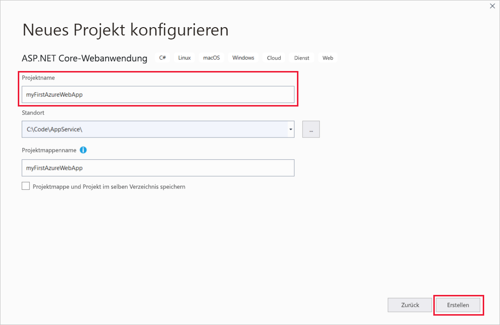
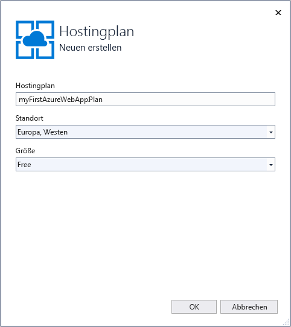

# <a name="create-an-aspnet-core-web-app-in-azure"></a>Erstellen von ASP.NET Core-Web-Apps in Azure

> [!NOTE]
> In diesem Artikel wird eine App in App Service unter Windows bereitgestellt. Informationen zur Bereitstellung in App Service unter _Linux_ finden Sie unter [Erstellen einer .NET Core-Web-App in App Service unter Linux](./containers/quickstart-dotnetcore.md).
>

Von [Azure App Service](overview.md) wird ein hochgradig skalierbarer Webhostingdienst mit Self-Patching bereitgestellt.

Diese Schnellstartanleitung veranschaulicht die Bereitstellung Ihrer ersten ASP.NET Core-Web-App in Azure App Service. Am Ende verfügen Sie über eine Ressourcengruppe, die einen App Service-Plan und eine App Service-App mit einer bereitgestellten Webanwendung umfasst.

[!INCLUDE [quickstarts-free-trial-note](../../includes/quickstarts-free-trial-note.md)]

## <a name="prerequisites"></a>Voraussetzungen

Installieren Sie <a href="https://www.visualstudio.com/downloads/" target="_blank">Visual Studio 2019</a> mit der Workload **ASP.NET und Webentwicklung**, um dieses Tutorial abzuschließen.

Sie haben Visual Studio 2019 bereits installiert:

- Installieren Sie die neuesten Updates in Visual Studio, indem Sie **Hilfe** > **Nach Updates suchen** auswählen.
- Fügen Sie die Workload hinzu. Wählen Sie dazu **Tools** > **Tools und Features abrufen** aus.

## <a name="create-an-aspnet-core-web-app"></a>Erstellen einer ASP.NET Core-Web-App

Führen Sie zum Erstellen einer ASP.NET Core-Web-App die folgenden Schritte aus:

1. Öffnen Sie Visual Studio, und wählen Sie **Neues Projekt erstellen** aus.

1. Suchen Sie unter **Neues Projekt erstellen** die Option **ASP.NET Core Web Application** für C#, und wählen Sie sie aus. Wählen Sie anschließend **Weiter** aus.

1. Geben Sie der Anwendung unter **Neues Projekt konfigurieren** den Namen _myFirstAzureWebApp_, und wählen Sie dann **Erstellen** aus.

   

1. Wählen Sie für diese Schnellstartanleitung die Vorlage **Webanwendung** aus. Stellen Sie sicher, dass für die Authentifizierung **Keine Authentifizierung** festgelegt und keine andere Option ausgewählt ist. Klicken Sie auf **Erstellen**.

   

    Sie können jede Art von ASP.NET Core-Web-App für Azure bereitstellen.

1. Wählen Sie im Visual Studio-Menü die Option **Debuggen** > **Starten ohne Debugging** aus, um die Web-App lokal auszuführen.

   

## <a name="publish-your-web-app"></a>Veröffentlichen Ihrer Web-App

1. Klicken Sie im **Projektmappen-Explorer** mit der rechten Maustaste auf das Projekt **myFirstAzureWebApp**, und wählen Sie **Veröffentlichen** aus.

1. Wählen Sie **App Service** und dann **Veröffentlichen** aus.

   

1. Unter **App Service – Neues Element erstellen** hängen Ihre Optionen davon ab, ob Sie bereits bei Azure angemeldet sind und ob Sie über ein Visual Studio-Konto verfügen, das mit einem Azure-Konto verknüpft ist. Wählen Sie entweder **Konto hinzufügen** oder **Anmelden** aus, um sich bei Ihrem Azure-Abonnement anzumelden. Wenn Sie bereits angemeldet sind, wählen Sie das gewünschte Konto aus.

   > [!NOTE]
   > Wenn Sie bereits angemeldet sind, wählen Sie noch nicht **Erstellen** aus.
   >

   

   [!INCLUDE [resource group intro text](../../includes/resource-group.md)]

1. Wählen Sie unter **Ressourcengruppe** die Option **Neu** aus.

1. Geben Sie unter **Name der neuen Ressourcengruppe** den Namen *myResourceGroup* ein, und wählen Sie **OK** aus.

   [!INCLUDE [app-service-plan](../../includes/app-service-plan.md)]

1. Wählen Sie unter **Hostingplan** die Option **Neu** aus.

1. Geben Sie im Dialogfeld **Hostingplan konfigurieren** die Werte aus der folgenden Tabelle ein, und wählen Sie dann **OK** aus.

   | Einstellung | Empfohlener Wert | BESCHREIBUNG |
   |-|-|-|
   |App Service-Plan| myAppServicePlan | Name des App Service-Plans. |
   | Location | Europa, Westen | Das Rechenzentrum, in dem die Web-App gehostet wird. |
   | Size | Kostenlos | Der [Tarif](https://azure.microsoft.com/pricing/details/app-service/?ref=microsoft.com&utm_source=microsoft.com&utm_medium=docs&utm_campaign=visualstudio) bestimmt die Hostingfeatures. |

   

1. Geben Sie unter **Name** einen eindeutigen App-Namen ein, der nur aus den folgenden zulässigen Zeichen besteht: `a-z`, `A-Z`, `0-9` und `-`. Sie können den automatisch generierten eindeutigen Namen übernehmen. Die URL der Web-App lautet `http://<app_name>.azurewebsites.net`, wobei `<app_name>` der Name Ihrer App ist.

   

1. Wählen Sie **Erstellen** aus, um mit der Erstellung der Azure-Ressourcen zu beginnen.

Nach Abschluss des Assistenten wird die ASP.NET Core-Web-App in Azure veröffentlicht und anschließend im Standardbrowser gestartet.


Der App-Name, den Sie auf der Seite **App Service – Neues Element erstellen** angegeben haben, wird als URL-Präfix im Format `http://<app_name>.azurewebsites.net` verwendet.

**Glückwunsch!** Ihre ASP.NET Core-Web-App wird live in Azure App Service ausgeführt.

## <a name="update-the-app-and-redeploy"></a>Aktualisieren der App und erneutes Bereitstellen

1. Öffnen Sie im **Projektmappen-Explorer** unter Ihrem Projekt **Seiten** > **Index.cshtml**.

1. Ersetzen Sie die zwei `<div>`-Tags durch den folgenden Code:

   ```HTML
   <div class="jumbotron">
       <h1>ASP.NET in Azure!</h1>
       <p class="lead">This is a simple app that we’ve built that demonstrates how to deploy a .NET app to Azure App Service.</p>
   </div>
   ```

1. Klicken Sie zur erneuten Bereitstellung in Azure im **Projektmappen-Explorer** mit der rechten Maustaste auf das Projekt **myFirstAzureWebApp**, und wählen Sie **Veröffentlichen** aus.

1. Wählen Sie auf der Zusammenfassungsseite **Veröffentlichen** die Option **Veröffentlichen** aus.

   

Nach Abschluss der Veröffentlichung wird in Visual Studio ein Browser mit der URL der Web-App gestartet.


## <a name="manage-the-azure-app"></a>Verwalten der Azure-App

1. Wechseln Sie zum <a href="https://portal.azure.com" target="_blank">Azure-Portal</a>, um die Web-App zu verwalten.

1. Wählen Sie im linken Menü **App Services** und anschließend den Namen Ihrer Azure-App aus.

   

   Die Übersichtsseite Ihrer Web-App wird angezeigt. Hier können Sie einfache Verwaltungsaufgaben wie Durchsuchen, Beenden, Starten, Neustarten und Löschen durchführen.

   

   Im linken Menü werden verschiedene Seiten für die Konfiguration Ihrer App angezeigt.

[!INCLUDE [Clean-up section](../../includes/clean-up-section-portal.md)]

## <a name="next-steps"></a>Nächste Schritte

> [!div class="nextstepaction"]
> [ASP.NET Core mit SQL-Datenbank](app-service-web-tutorial-dotnetcore-sqldb.md)
