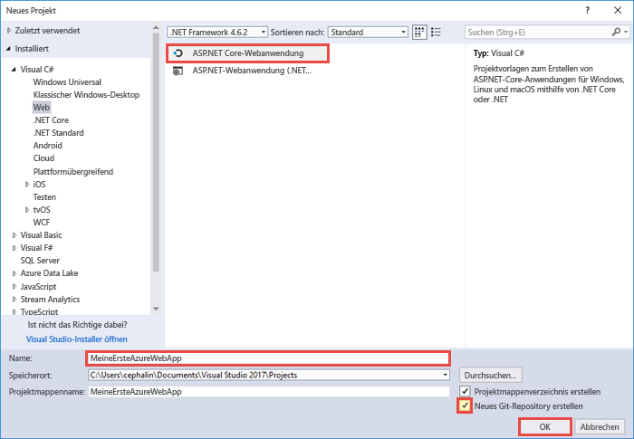
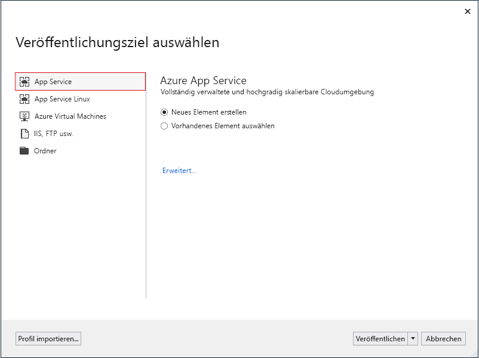
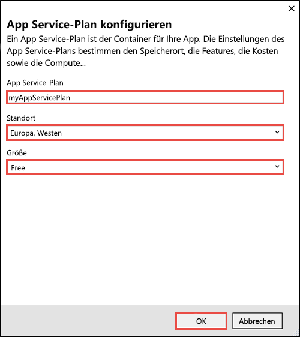
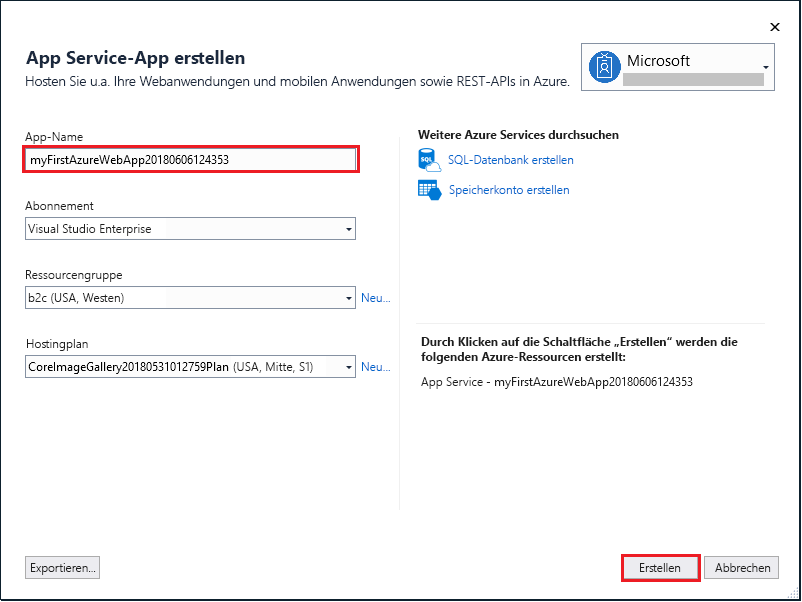

# <a name="create-an-aspnet-web-app-in-azure"></a>Erstellen von ASP.NET-Web-Apps in Azure

[Azure-Web-Apps](app-service-web-overview.md) bietet einen hoch skalierbaren Webhostingdienst mit Self-Patching.  Dieser Schnellstart veranschaulicht die Bereitstellung Ihrer ersten ASP.NET-Web-App in Azure-Web-Apps. Am Ende verfügen Sie über eine Ressourcengruppe, die einen App Service-Plan und eine Azure-Web-App mit einer bereitgestellten Webanwendung umfasst.

Sehen Sie sich das Video an, um diese Schnellstartanleitung in Aktion zu erleben, und führen Sie dann selbst die Schritte aus, um Ihre erste .NET-App in Azure zu veröffentlichen.

> [!VIDEO https://channel9.msdn.com/Shows/Azure-for-NET-Developers/Create-a-NET-app-in-Azure-Quickstart/player]

## <a name="prerequisites"></a>Voraussetzungen

Für dieses Tutorial benötigen Sie Folgendes:

* Installieren Sie [Visual Studio 2017](https://www.visualstudio.com/downloads/) mit den folgenden Workloads:
    - **ASP.NET und Webentwicklung**
    - **Azure-Entwicklung**

    

[!INCLUDE [quickstarts-free-trial-note](../../includes/quickstarts-free-trial-note.md)]

## <a name="create-an-aspnet-web-app"></a>Erstellen einer ASP.NET-Web-App

Erstellen Sie in Visual Studio ein Projekt durch Auswählen von **Datei > Neu > Projekt**. 

Wählen Sie im Dialogfeld **Neues Projekt** die Optionen **Visual C# > Web > ASP.NET-Webanwendung (.NET Framework)** aus.

Geben Sie der Anwendung den Namen _myFirstAzureWebApp_, und wählen Sie anschließend **OK** aus.
   


Sie können jede Art von ASP.NET Web-App für Azure bereitstellen. Wählen Sie in diesem Schnellstart die Vorlage **MVC** aus, und vergewissern Sie sich, dass die Authentifizierung auf **Keine Authentifizierung** festgelegt ist.
      
Klicken Sie auf **OK**.


Wählen Sie im Menü **Debuggen > Starten ohne Debugging** aus, um die Web-App lokal auszuführen.


## <a name="publish-to-azure"></a>Veröffentlichen in Azure

Klicken Sie im **Projektmappen-Explorer** mit der rechten Maustaste auf das Projekt **myFirstAzureWebApp**, und wählen Sie **Veröffentlichen** aus.


Vergewissern Sie sich, dass **Microsoft Azure App Service** ausgewählt ist, und wählen Sie **Veröffentlichen** aus.



Daraufhin wird das Dialogfeld **App Service erstellen** geöffnet, in dem Sie alle erforderlichen Azure-Ressourcen erstellen können, um die ASP.NET-Web-App in Azure auszuführen.

## <a name="sign-in-to-azure"></a>Anmelden bei Azure

Wählen Sie im Dialogfeld **App Service erstellen** die Option **Konto hinzufügen**, und melden Sie sich an Ihrem Azure-Abonnement an. Falls Sie bereits angemeldet sind, können Sie in der Dropdownliste das Konto mit dem gewünschten Abonnement auswählen.

> [!NOTE]
> Wenn Sie bereits angemeldet sind, wählen Sie noch nicht **Erstellen** aus.
>
>
   


## <a name="create-a-resource-group"></a>Erstellen einer Ressourcengruppe

[!INCLUDE [resource group intro text](../../includes/resource-group.md)]

Wählen Sie neben **Ressourcengruppe** die Option **Neu** aus.

Nennen Sie die Ressourcengruppe **myResourceGroup**, und wählen Sie **OK** aus.

## <a name="create-an-app-service-plan"></a>Wie erstelle ich einen Plan?

[!INCLUDE [app-service-plan](../../includes/app-service-plan.md)]

Wählen Sie neben **App Service-Plan** die Option **Neu** aus. 

Verwenden Sie im Dialogfeld **App Service-Plan konfigurieren** die in der Tabelle unter dem Screenshot aufgeführten Einstellungen.



| Einstellung | Empfohlener Wert | Beschreibung |
|-|-|-|
|App Service-Plan| myAppServicePlan | Name des App Service-Plans. |
| Ort | Westeuropa | Das Rechenzentrum, in dem die Web-App gehostet wird. |
| Größe | Kostenlos | Der [Tarif](https://azure.microsoft.com/pricing/details/app-service/?ref=microsoft.com&utm_source=microsoft.com&utm_medium=docs&utm_campaign=visualstudio) bestimmt die Hostingfeatures. |

Klicken Sie auf **OK**.

## <a name="create-and-publish-the-web-app"></a>Erstellen und Veröffentlichen der Web-App

Geben Sie unter **Web-App-Name** einen eindeutigen App-Namen ein (gültige Zeichen sind `a-z`, `0-9` und `-`), oder akzeptieren Sie den automatisch generierten eindeutigen Namen. Die URL der Web-App lautet `http://<app_name>.azurewebsites.net`, wobei `<app_name>` der Name der Web-App ist.

Wählen Sie **Erstellen** aus, um mit der Erstellung der Azure-Ressourcen zu beginnen.



Nach Abschluss des Assistenten wird die ASP.NET Web-App in Azure veröffentlicht und anschließend im Standardbrowser gestartet.


Der Web-App-Name, den Sie im [Schritt „Erstellen und Veröffentlichen“](#create-and-publish-the-web-app) angegeben haben, wird als URL-Präfix im Format `http://<app_name>.azurewebsites.net` verwendet.

Herzlichen Glückwunsch, Ihre ASP.NET-Web-App wird live in Azure App Service ausgeführt.

## <a name="update-the-app-and-redeploy"></a>Aktualisieren der App und erneutes Bereitstellen

Öffnen Sie im **Projektmappen-Explorer** Folgendes: _Views\Home\Index.cshtml_.

Suchen Sie im oberen Bereich nach dem HTML-Tag `<div class="jumbotron">`, und ersetzen Sie das gesamte Element durch folgenden Code:

```HTML
<div class="jumbotron">
    <h1>ASP.NET in Azure!</h1>
    <p class="lead">This is a simple app that we’ve built that demonstrates how to deploy a .NET app to Azure App Service.</p>
</div>
```

Klicken Sie zur erneuten Bereitstellung in Azure im **Projektmappen-Explorer** mit der rechten Maustaste auf das Projekt **myFirstAzureWebApp**, und wählen Sie **Veröffentlichen** aus.

Wählen Sie auf der Veröffentlichungsseite die Option **Veröffentlichen** aus.

Nach Abschluss der Veröffentlichung wird in Visual Studio ein Browser mit der URL der Web-App gestartet.


## <a name="manage-the-azure-web-app"></a>Verwalten der Azure-Web-App

Wechseln Sie zum <a href="https://portal.azure.com" target="_blank">Azure-Portal</a>, um die Web-App zu verwalten.

Wählen Sie im linken Menü **App Services** und anschließend den Namen Ihrer Azure-Web-App aus.


Die Übersichtsseite Ihrer Web-App wird angezeigt. Hier können Sie einfache Verwaltungsaufgaben wie Durchsuchen, Beenden, Neustarten und Löschen durchführen. 


Im linken Menü werden verschiedene Seiten für die Konfiguration Ihrer App angezeigt. 

[!INCLUDE [Clean-up section](../../includes/clean-up-section-portal.md)]

## <a name="next-steps"></a>Nächste Schritte

> [!div class="nextstepaction"]
> [ASP.NET mit SQL-Datenbank](app-service-web-tutorial-dotnet-sqldatabase.md)
