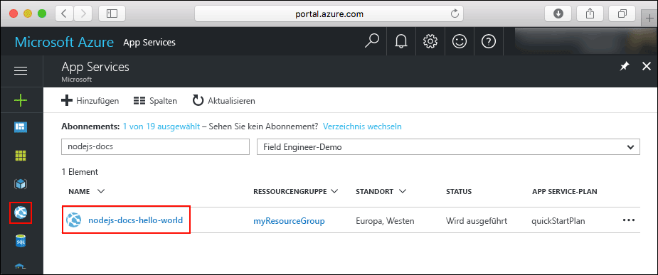

# <a name="create-a-nodejs-web-app-in-azure"></a>Erstellen einer Node.js-Web-App in Azure

> [!NOTE]
> In diesem Artikel wird eine App in App Service unter Windows bereitgestellt. Informationen zur Bereitstellung in App Service unter _Linux_ finden Sie unter [Erstellen einer Node.js-Web-App in Azure App Service unter Linux](./containers/quickstart-nodejs.md).
>

Von [Azure App Service](overview.md) wird ein hochgradig skalierbarer Webhostingdienst mit Self-Patching bereitgestellt.  In diesem Schnellstart-Artikel wird erläutert, wie Sie eine Node.js-App in Azure App Service bereitstellen. Sie erstellen die Web-App mithilfe der [Azure CLI](https://docs.microsoft.com/cli/azure/get-started-with-azure-cli) und stellen mit ZipDeploy Node.js-Beispielcode für die Web-App bereit.


Die folgenden Schritte können unter Mac, Windows oder Linux ausgeführt werden. Nachdem die erforderlichen Komponenten installiert wurden, können die Schritte in etwa fünf Minuten durchgeführt werden.   

[!INCLUDE [quickstarts-free-trial-note](../../includes/quickstarts-free-trial-note.md)]

## <a name="prerequisites"></a>Voraussetzungen

So führen Sie diesen Schnellstart durch:

* <a href="https://nodejs.org/" target="_blank">Installieren Sie Node.js und NPM.</a>

## <a name="download-the-sample"></a>Herunterladen des Beispiels

Laden Sie das Node.js-Beispielprojekt von [https://github.com/Azure-Samples/nodejs-docs-hello-world/archive/master.zip](https://github.com/Azure-Samples/nodejs-docs-hello-world/archive/master.zip) herunter, und extrahieren Sie das ZIP-Archiv.

Öffnen Sie die Datei _index.js_, und suchen Sie nach der folgenden Zeile:

```javascript
const port = process.env.PORT || 1337;
```

App Service fügt „process.env.PORT“ in Ihre Anwendung ein, sodass der Code anhand der Variablen ermittelt, an welchem Port gelauscht werden soll. 

Navigieren Sie in einem Terminalfenster zum Stammverzeichnis des Node.js-Beispielprojekts (das Verzeichnis mit _index.js_).

## <a name="run-the-app-locally"></a>Lokales Ausführen der App

Führen Sie die Anwendung lokal aus, damit Sie sehen, wie sie beim Bereitstellen in Azure aussehen sollte. Öffnen Sie ein Terminalfenster, und verwenden Sie das Skript `npm start`, um den integrierten Node.js-HTTP-Webserver zu starten.

```bash
npm start
```

Öffnen Sie einen Webbrowser, und navigieren Sie zu der Beispielapp auf `http://localhost:1337`.

Auf der Seite wird die Nachricht **Hello World** aus der Beispiel-App angezeigt.


Drücken Sie in Ihrem Terminalfenster **STRG+C**, um den Webserver zu beenden.

> [!NOTE]
> In Azure App Service wird die App unter Verwendung von [iisnode](https://github.com/Azure/iisnode) in IIS ausgeführt. Damit die App mit iisnode ausgeführt werden kann, enthält das Stammverzeichnis der App die Datei „web.config“. Die Datei kann von IIS gelesen werden, und die Einstellungen für iisnode sind im [GitHub-Repository zu iisnode](https://github.com/Azure/iisnode/blob/master/src/samples/configuration/web.config) dokumentiert.

[!INCLUDE [Create ZIP file](../../includes/app-service-web-create-zip.md)]

[!INCLUDE [cloud-shell-try-it.md](../../includes/cloud-shell-try-it.md)]

[!INCLUDE [Create resource group](../../includes/app-service-web-create-resource-group-scus.md)] 

[!INCLUDE [Create app service plan](../../includes/app-service-web-create-app-service-plan-scus.md)] 

## <a name="create-a-web-app"></a>Erstellen einer Web-App

Erstellen Sie in Cloud Shell mit dem Befehl [`az webapp create`](/cli/azure/webapp?view=azure-cli-latest#az-webapp-create) eine Web-App im App Service-Plan `myAppServicePlan`. 

Ersetzen Sie im folgenden Beispiel `<app_name>` durch einen global eindeutigen App-Namen (gültige Zeichen sind `a-z`, `0-9` und `-`).

```azurecli-interactive
# Bash and Powershell
az webapp create --resource-group myResourceGroup --plan myAppServicePlan --name <app_name>
```

Nach Erstellung der Web-App zeigt die Azure CLI eine Ausgabe wie im folgenden Beispiel an:

```json
{
  "availabilityState": "Normal",
  "clientAffinityEnabled": true,
  "clientCertEnabled": false,
  "cloningInfo": null,
  "containerSize": 0,
  "dailyMemoryTimeQuota": 0,
  "defaultHostName": "<app_name>.azurewebsites.net",
  "enabled": true,
  < JSON data removed for brevity. >
}
```

### <a name="set-nodejs-runtime"></a>Festlegen der Node.js-Runtime

Legen Sie die Node.js-Runtime auf „10.14.1“ fest. Führen Sie [`az webapp list-runtimes`](/cli/azure/webapp?view=azure-cli-latest#az-webapp-list-runtimes) aus, um alle unterstützten Laufzeiten anzuzeigen.

```azurecli-interactive
# Bash and Powershell
az webapp config appsettings set --resource-group myResourceGroup --name <app_name> --settings WEBSITE_NODE_DEFAULT_VERSION=10.14.1
```

Wechseln Sie zu Ihrer neu erstellten Web-App. Ersetzen Sie `<app_name>` durch einen eindeutigen App-Namen.

```bash
http://<app_name>.azurewebsites.net
```

Ihre neue Web-App sollte nun wie folgt aussehen:


[!INCLUDE [Deploy ZIP file](../../includes/app-service-web-deploy-zip.md)]

## <a name="browse-to-the-app"></a>Navigieren zur App

Navigieren Sie in Ihrem Webbrowser zu der bereitgestellten Anwendung.

```
http://<app_name>.azurewebsites.net
```

Der Node.js-Beispielcode wird in einer Azure App Service-Web-App ausgeführt.


**Glückwunsch!** Sie haben Ihre erste Node.js-App für App Service bereitgestellt.

## <a name="update-and-redeploy-the-code"></a>Aktualisieren und erneutes Bereitstellen des Codes

Öffnen Sie die Datei `index.js` innerhalb der Node.js-App mit einem Text-Editor, und ändern Sie den Text im Aufruf von `response.end` geringfügig:

```javascript
response.end("Hello Azure!");
```

Navigieren Sie im lokalen Terminalfenster zum Stammverzeichnis Ihrer Anwendung, und erstellen Sie eine neue ZIP-Datei für Ihr aktualisiertes Projekt.

```azurecli-interactive
# Bash
zip -r myUpdatedAppFiles.zip .

# PowerShell
Compress-Archive -Path * -DestinationPath myUpdatedAppFiles.zip
```

Stellen Sie diese neue ZIP-Datei in App Service bereit. Führen Sie dabei die unter [Bereitstellen der ZIP-Datei](#deploy-zip-file) aufgeführten Schritte aus.

Wechseln Sie wieder zu dem Browserfenster, das im Schritt **Navigieren zur App** geöffnet wurde, und aktualisieren Sie die Seite.


## <a name="manage-your-new-azure-app"></a>Verwalten Ihrer neuen Azure-App

Wechseln Sie zum <a href="https://portal.azure.com" target="_blank">Azure-Portal</a>, um die erstellte Web-App zu verwalten.

Klicken Sie im linken Menü auf **App Services** und anschließend auf den Namen Ihrer Azure-App.



Die Übersichtsseite Ihrer Web-App wird angezeigt. Hier können Sie einfache Verwaltungsaufgaben wie Durchsuchen, Beenden, Neustarten und Löschen durchführen. 


Im linken Menü werden verschiedene Seiten für die Konfiguration Ihrer App angezeigt. 

[!INCLUDE [cli-samples-clean-up](../../includes/cli-samples-clean-up.md)]

## <a name="next-steps"></a>Nächste Schritte

> [!div class="nextstepaction"]
> [Node.js mit MongoDB](app-service-web-tutorial-nodejs-mongodb-app.md)
