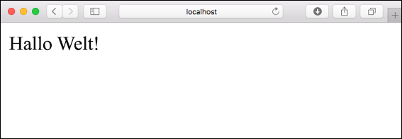
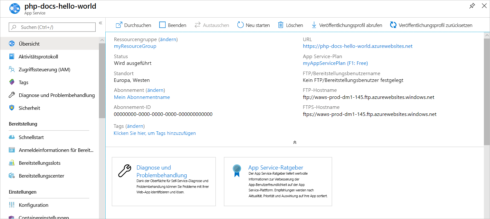

# <a name="create-a-php-web-app-in-azure"></a>Erstellen einer PHP-Web-App in Azure

> [!NOTE]
> In diesem Artikel wird eine App in App Service unter Windows bereitgestellt. Informationen zur Bereitstellung in App Service unter _Linux_ finden Sie unter [Erstellen einer PHP-Web-App in App Service unter Linux](./containers/quickstart-php.md).
>

[Azure-Web-Apps](app-service-web-overview.md) bietet einen hoch skalierbaren Webhostingdienst mit Self-Patching.  In diesem Schnellstart-Tutorial wird erläutert, wie Sie eine PHP-App in Azure-Web-Apps bereitstellen. Sie erstellen die Web-App mithilfe der [Azure-Befehlszeilenschnittstelle](https://docs.microsoft.com/cli/azure/get-started-with-azure-cli) in Cloud Shell und stellen mit einer [ZIP-Datei](app-service-deploy-zip.md) den PHP-Beispielcode für die Web-App bereit.

![In Azure ausgeführte Beispiel-App]](media/app-service-web-get-started-php/hello-world-in-browser.png)

Die folgenden Schritte können unter Mac, Windows oder Linux ausgeführt werden. Nachdem die erforderlichen Komponenten installiert wurden, können die Schritte in etwa fünf Minuten durchgeführt werden.

[!INCLUDE [quickstarts-free-trial-note](../../includes/quickstarts-free-trial-note.md)]

## <a name="prerequisites"></a>Voraussetzungen

So führen Sie diesen Schnellstart durch:

* <a href="https://php.net" target="_blank">Installieren Sie PHP.</a>

## <a name="download-the-sample-locally"></a>Lokales Herunterladen des Beispiels

Laden Sie das PHP-Beispielprojekt von [https://github.com/Azure-Samples/php-docs-hello-world/archive/master.zip](https://github.com/Azure-Samples/php-docs-hello-world/archive/master.zip) herunter, und extrahieren Sie das ZIP-Archiv.

Navigieren Sie in einem Terminalfenster zum Stammverzeichnis des PHP-Beispielprojekts (das Verzeichnis mit _index.php_).

## <a name="run-the-app-locally"></a>Lokales Ausführen der App

Öffnen Sie zum lokalen Ausführen der Anwendung ein Terminalfenster, und verwenden Sie den Befehl `php`, um den integrierten PHP-Webserver zu starten.

```bash
php -S localhost:8080
```

Öffnen Sie einen Webbrowser, und navigieren Sie zu der Beispielapp auf `http://localhost:8080`.

Die Nachricht **Hello World!** aus der Beispiel-App wird auf der Seite angezeigt.



Drücken Sie in Ihrem Terminalfenster **STRG+C**, um den Webserver zu beenden.

[!INCLUDE [Create ZIP file](../../includes/app-service-web-create-zip.md)]

[!INCLUDE [cloud-shell-try-it.md](../../includes/cloud-shell-try-it.md)]

[!INCLUDE [Upload zip file](../../includes/app-service-web-upload-zip.md)]

[!INCLUDE [Create resource group](../../includes/app-service-web-create-resource-group.md)]

[!INCLUDE [Create app service plan](../../includes/app-service-web-create-app-service-plan.md)]

## <a name="create-a-web-app"></a>Erstellen einer Web-App

Erstellen Sie in Cloud Shell mit dem Befehl [`az webapp create`](/cli/azure/webapp?view=azure-cli-latest#az_webapp_create) eine Web-App im App Service-Plan `myAppServicePlan`. 

Ersetzen Sie im folgenden Beispiel `<app_name>` durch einen global eindeutigen App-Namen (gültige Zeichen sind `a-z`, `0-9` und `-`). Die Runtime ist auf `PHP|7.0` festgelegt. Führen Sie [`az webapp list-runtimes`](/cli/azure/webapp?view=azure-cli-latest#az_webapp_list_runtimes) aus, um alle unterstützten Laufzeiten anzuzeigen. 

```azurecli-interactive
az webapp create --resource-group myResourceGroup --plan myAppServicePlan --name <app_name> --runtime "PHP|7.0"
```

Nach Erstellung der Web-App zeigt die Azure CLI eine Ausgabe wie im folgenden Beispiel an:

```json
{
  "availabilityState": "Normal",
  "clientAffinityEnabled": true,
  "clientCertEnabled": false,
  "cloningInfo": null,
  "containerSize": 0,
  "dailyMemoryTimeQuota": 0,
  "defaultHostName": "<app_name>.azurewebsites.net",
  "enabled": true,
  < JSON data removed for brevity. >
}
```

Wechseln Sie zu Ihrer neu erstellten Web-App. Ersetzen Sie _&lt;App-Name>_ durch einen eindeutigen App-Namen.

```bash
http://<app name>.azurewebsites.net
```


[!INCLUDE [Deploy uploaded ZIP file](../../includes/app-service-web-deploy-zip.md)]

## <a name="browse-to-the-app"></a>Navigieren zur App

Navigieren Sie in Ihrem Webbrowser zu der bereitgestellten Anwendung.

```bash
http://<app_name>.azurewebsites.net
```

Der PHP-Beispielcode wird in einer Azure App Service-Web-App ausgeführt.


**Glückwunsch!** Sie haben Ihre erste PHP-App für App Service bereitgestellt.

## <a name="update-locally-and-redeploy-the-code"></a>Lokales Aktualisieren und erneutes Bereitstellen des Codes

Öffnen Sie die Datei `index.php` innerhalb der PHP-App mit einem lokalen Text-Editor, und ändern Sie den Text in der Zeichenfolge neben `echo` geringfügig:

```php
echo "Hello Azure!";
```

Navigieren Sie im lokalen Terminalfenster zum Stammverzeichnis Ihrer Anwendung, und erstellen Sie eine neue ZIP-Datei für Ihr aktualisiertes Projekt.

```
# Bash
zip -r myUpdatedAppFiles.zip .

# PowerShell
Compress-Archive -Path * -DestinationPath myUpdatedAppFiles.zip
``` 

Laden Sie diese neue ZIP-Datei in Cloud Shell noch. Führen Sie dabei die unter [Hochladen der ZIP-Datei](#upload-the-zip-file) aufgeführten Schritte aus.

Stellen Sie anschließend in Cloud Shell erneut die hochgeladene ZIP-Datei bereit.

```azurecli-interactive
az webapp deployment source config-zip --resource-group myResouceGroup --name <app_name> --src clouddrive/myUpdatedAppFiles.zip
```

Wechseln Sie wieder zu dem Browserfenster, das im Schritt **Navigieren zur App** geöffnet wurde, und aktualisieren Sie die Seite.


## <a name="manage-your-new-azure-web-app"></a>Verwalten Ihrer neuen Azure-Web-App

Wechseln Sie zum <a href="https://portal.azure.com" target="_blank">Azure-Portal</a>, um die erstellte Web-App zu verwalten.

Klicken Sie im linken Menü auf **App Services** und anschließend auf den Namen Ihrer Azure-Web-App.


Die Übersichtsseite Ihrer Web-App wird angezeigt. Hier können Sie einfache Verwaltungsaufgaben wie Durchsuchen, Beenden, Neustarten und Löschen durchführen.



Im linken Menü werden verschiedene Seiten für die Konfiguration Ihrer App angezeigt. 

[!INCLUDE [cli-samples-clean-up](../../includes/cli-samples-clean-up.md)]

## <a name="next-steps"></a>Nächste Schritte

> [!div class="nextstepaction"]
> [PHP mit MySQL](app-service-web-tutorial-php-mysql.md)
