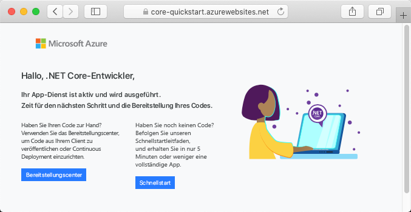
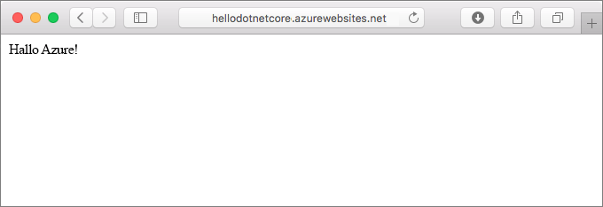
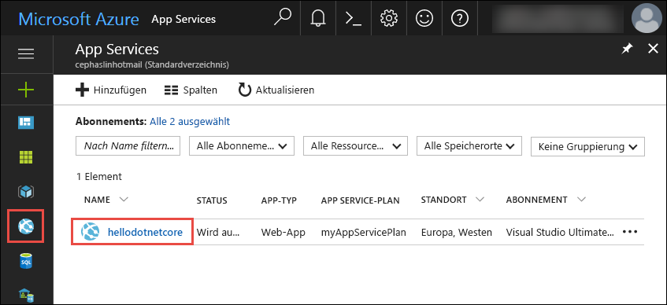
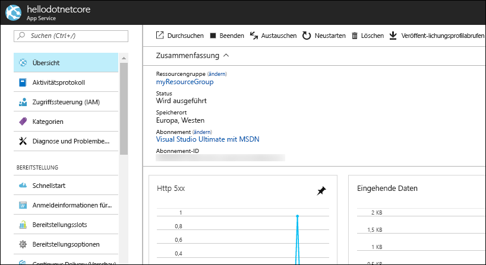

# <a name="create-a-net-core-web-app-in-app-service-on-linux"></a>Erstellen einer .NET Core-Web-App in App Service unter Linux

> [!NOTE]
> In diesem Artikel wird eine App in App Service unter Linux bereitgestellt. Informationen zur Bereitstellung in App Service unter _Windows_ finden Sie unter [Erstellen einer ASP.NET Core-Web-App in Azure](../app-service-web-get-started-dotnet.md).
>

[App Service unter Linux](app-service-linux-intro.md) bietet einen hochgradig skalierbaren Webhostingdienst mit Self-Patching unter Linux-Betriebssystemen. In diesem Schnellstartartikel wird erläutert, wie Sie eine [.NET Core](https://docs.microsoft.com/aspnet/core/)-App in App Service unter Linux erstellen. Sie erstellen die Web-App mithilfe der [Azure CLI](https://docs.microsoft.com/cli/azure/get-started-with-azure-cli) und stellen mit Git den .NET Core-Code für die Web-App bereit.


Die folgenden Schritte können unter Mac, Windows oder Linux ausgeführt werden.

## <a name="prerequisites"></a>Voraussetzungen

So führen Sie diesen Schnellstart durch:

* <a href="https://git-scm.com/" target="_blank">Installation von Git</a>
* <a href="https://github.com/dotnet/core/blob/master/release-notes/download-archives/1.1.6-sdk-download.md" target="_blank">Installieren von .NET Core SDK 1.1</a>

[!INCLUDE [quickstarts-free-trial-note](../../../includes/quickstarts-free-trial-note.md)]

## <a name="create-the-app-locally"></a>Lokales Erstellen der App

Erstellen Sie in einem Terminalfenster auf Ihrem Computer ein Verzeichnis mit dem Namen `hellodotnetcore`, und wechseln Sie dorthin.

```bash
md hellodotnetcore
cd hellodotnetcore
```

Erstellen Sie eine neue .NET Core-Web-App.

```bash
dotnet new web
```

## <a name="run-the-app-locally"></a>Lokales Ausführen der App

Stellen Sie die NuGet-Pakete wieder her, und führen Sie die App aus.

```bash
dotnet restore
dotnet run
```

Öffnen Sie einen Webbrowser, und navigieren Sie zu der App auf `http://localhost:5000`.

Auf der Seite wird die Nachricht **Hello World** aus der Beispiel-App angezeigt.


Drücken Sie in Ihrem Terminalfenster **STRG+C**, um den Webserver zu beenden. Initialisieren Sie ein Git-Repository für das .NET Core-Projekt.

```bash
git init
git add .
git commit -m "first commit"
```

[!INCLUDE [cloud-shell-try-it.md](../../../includes/cloud-shell-try-it.md)]

[!INCLUDE [Configure deployment user](../../../includes/configure-deployment-user.md)]

[!INCLUDE [Create resource group](../../../includes/app-service-web-create-resource-group.md)]

[!INCLUDE [Create app service plan](../../../includes/app-service-web-create-app-service-plan-linux.md)]

## <a name="create-a-web-app"></a>Erstellen einer Web-App

[!INCLUDE [Create web app](../../../includes/app-service-web-create-web-app-dotnetcore-no-h.md)]

Wechseln Sie zu Ihrer neu erstellten Web-App. Ersetzen Sie _&lt;App-Name>_ durch Ihren Web-App-Namen.

```bash
http://<app name>.azurewebsites.net
```



[!INCLUDE [Push to Azure](../../../includes/app-service-web-git-push-to-azure.md)] 

```bash
Counting objects: 22, done.
Delta compression using up to 8 threads.
Compressing objects: 100% (18/18), done.
Writing objects: 100% (22/22), 51.21 KiB | 3.94 MiB/s, done.
Total 22 (delta 1), reused 0 (delta 0)
remote: Updating branch 'master'.
remote: Updating submodules.
remote: Preparing deployment for commit id '741f16d1db'.
remote: Generating deployment script.
remote: Project file path: ./hellodotnetcore.csproj
remote: Generated deployment script files
remote: Running deployment command...
remote: Handling ASP.NET Core Web Application deployment.
remote: ...............................................................................................
remote:   Restoring packages for /home/site/repository/hellodotnetcore.csproj...
remote: ....................................
remote:   Installing System.Xml.XPath 4.0.1.
remote:   Installing System.Diagnostics.Tracing 4.1.0.
remote:   Installing System.Threading.Tasks.Extensions 4.0.0.
remote:   Installing System.Reflection.Emit.ILGeneration 4.0.1.
remote:   ...
remote: Finished successfully.
remote: Running post deployment command(s)...
remote: Deployment successful.
To https://cephalin-dotnetcore.scm.azurewebsites.net/cephalin-dotnetcore.git
 * [new branch]      master -> master
```

## <a name="browse-to-the-app"></a>Navigieren zur App

Navigieren Sie in Ihrem Webbrowser zu der bereitgestellten Anwendung.

```bash
http://<app_name>.azurewebsites.net
```

Der .NET Core-Beispielcode wird in einer Web-App mit integriertem Image ausgeführt.


**Glückwunsch!** Sie haben Ihre erste .NET Core-App für App Service unter Linux bereitgestellt.

## <a name="update-and-redeploy-the-code"></a>Aktualisieren und erneutes Bereitstellen des Codes

Öffnen Sie im lokalen Verzeichnis die Datei _Startup.cs_. Nehmen Sie eine kleine Änderung am Text im Methodenaufruf `context.Response.WriteAsync` vor:

```csharp
await context.Response.WriteAsync("Hello Azure!");
```

Führen Sie für Ihre Änderungen in Git einen Commit aus, und übertragen Sie dann die Codeänderungen mithilfe von Push an Azure.

```bash
git commit -am "updated output"
git push azure master
```

Wechseln Sie nach Abschluss der Bereitstellung wieder zu dem Browserfenster, das im Schritt **Navigieren zur App** geöffnet wurde, und wählen Sie die Option „Aktualisieren“ aus.



## <a name="manage-your-new-azure-web-app"></a>Verwalten Ihrer neuen Azure-Web-App

Wechseln Sie zum <a href="https://portal.azure.com" target="_blank">Azure-Portal</a>, um die erstellte Web-App zu verwalten.

Klicken Sie im linken Menü auf **App Services** und anschließend auf den Namen Ihrer Azure-Web-App.



Die Übersichtsseite Ihrer Web-App wird angezeigt. Hier können Sie einfache Verwaltungsaufgaben wie Durchsuchen, Beenden, Neustarten und Löschen durchführen. 



Im linken Menü werden verschiedene Seiten für die Konfiguration Ihrer App angezeigt. 

[!INCLUDE [cli-samples-clean-up](../../../includes/cli-samples-clean-up.md)]

## <a name="next-steps"></a>Nächste Schritte

> [!div class="nextstepaction"]
> [Erstellen einer .NET Core- und SQL-Datenbank-Web-App in Azure App Service unter Linux](tutorial-dotnetcore-sqldb-app.md)
