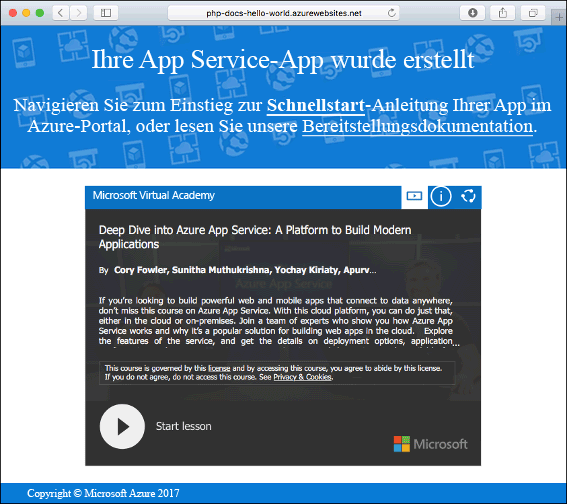
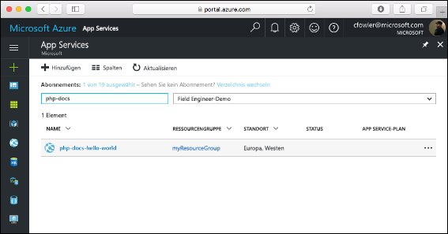
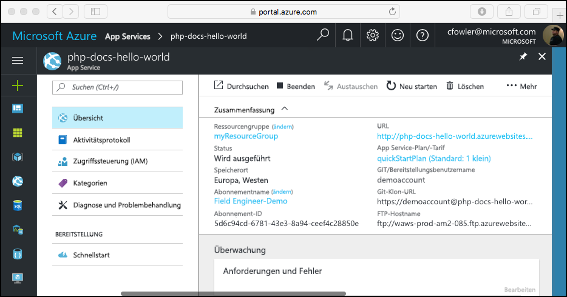

# <a name="create-a-php-web-app-in-app-service-on-linux"></a>Erstellen einer PHP-Web-App in App Service unter Linux

> [!NOTE]
> In diesem Artikel wird eine App in App Service unter Linux bereitgestellt. Informationen zur Bereitstellung in App Service unter _Windows_ finden Sie unter [Erstellen einer PHP-Web-App in Azure](../app-service-web-get-started-php.md).
>

[App Service unter Linux](app-service-linux-intro.md) bietet einen hochgradig skalierbaren Webhostingdienst mit Self-Patching unter Linux-Betriebssystemen. In diesem Schnellstart-Tutorial wird erläutert, wie Sie eine PHP-App in Azure App Service unter Linux bereitstellen. Sie erstellen die Web-App mit integriertem Image mithilfe der [Azure CLI](https://docs.microsoft.com/cli/azure/get-started-with-azure-cli) in Cloud Shell und stellen mit Git den PHP-Code für die Web-App bereit.


Die Schritte in diesem Artikel können unter Mac, Windows oder Linux ausgeführt werden.

[!INCLUDE [quickstarts-free-trial-note](../../../includes/quickstarts-free-trial-note.md)]

## <a name="prerequisites"></a>Voraussetzungen

So führen Sie diesen Schnellstart durch:

* <a href="https://git-scm.com/" target="_blank">Installieren Sie Git.</a>
* <a href="https://php.net" target="_blank">Installieren Sie PHP.</a>

## <a name="download-the-sample"></a>Herunterladen des Beispiels

Führen Sie in einem Terminalfenster die folgenden Befehle aus, um die Beispielanwendung auf Ihren lokalen Computer zu klonen, und navigieren Sie zum Verzeichnis mit dem Beispielcode.

```bash
git clone https://github.com/Azure-Samples/php-docs-hello-world
cd php-docs-hello-world
```

## <a name="run-the-app-locally"></a>Lokales Ausführen der App

Öffnen Sie zum lokalen Ausführen der Anwendung ein Terminalfenster, und verwenden Sie den Befehl `php`, um den integrierten PHP-Webserver zu starten.

```bash
php -S localhost:8080
```

Öffnen Sie einen Webbrowser, und navigieren Sie zu der Beispielapp auf `http://localhost:8080`.

Die Nachricht **Hello World!** aus der Beispiel-App wird auf der Seite angezeigt.


Drücken Sie in Ihrem Terminalfenster **STRG+C**, um den Webserver zu beenden.

[!INCLUDE [cloud-shell-try-it.md](../../../includes/cloud-shell-try-it.md)]

[!INCLUDE [Configure deployment user](../../../includes/configure-deployment-user.md)]

[!INCLUDE [Create resource group](../../../includes/app-service-web-create-resource-group-linux.md)]

[!INCLUDE [Create app service plan](../../../includes/app-service-web-create-app-service-plan-linux.md)]

## <a name="create-a-web-app"></a>Erstellen einer Web-App

[!INCLUDE [Create web app](../../../includes/app-service-web-create-web-app-php-linux-no-h.md)] 

Browsen Sie zu der Website, um Ihre neu erstellte Web-App mit integriertem Image anzuzeigen. Ersetzen Sie _&lt;App-Name>_ durch Ihren Web-App-Namen.

```bash
http://<app_name>.azurewebsites.net
```

Ihre neue Web-App sollte nun wie folgt aussehen:



[!INCLUDE [Push to Azure](../../../includes/app-service-web-git-push-to-azure.md)] 

```bash
Counting objects: 2, done.
Delta compression using up to 4 threads.
Compressing objects: 100% (2/2), done.
Writing objects: 100% (2/2), 352 bytes | 0 bytes/s, done.
Total 2 (delta 1), reused 0 (delta 0)
remote: Updating branch 'master'.
remote: Updating submodules.
remote: Preparing deployment for commit id '25f18051e9'.
remote: Generating deployment script.
remote: Running deployment command...
remote: Handling Basic Web Site deployment.
remote: Kudu sync from: '/home/site/repository' to: '/home/site/wwwroot'
remote: Copying file: '.gitignore'
remote: Copying file: 'LICENSE'
remote: Copying file: 'README.md'
remote: Copying file: 'index.php'
remote: Ignoring: .git
remote: Finished successfully.
remote: Running post deployment command(s)...
remote: Deployment successful.
To https://<app_name>.scm.azurewebsites.net/<app_name>.git
   cc39b1e..25f1805  master -> master
```

## <a name="browse-to-the-app"></a>Navigieren zur App

Navigieren Sie in Ihrem Webbrowser zu der bereitgestellten Anwendung.

```bash
http://<app_name>.azurewebsites.net
```

Der PHP-Beispielcode wird in einer Web-App mit integriertem Image ausgeführt.


**Glückwunsch!** Sie haben Ihre erste PHP-App für App Service unter Linux bereitgestellt.

## <a name="update-locally-and-redeploy-the-code"></a>Lokales Aktualisieren und erneutes Bereitstellen des Codes

Öffnen Sie im lokalen Verzeichnis die Datei `index.php` innerhalb der PHP-App, und ändern Sie den Text in der Zeichenfolge neben `echo` geringfügig:

```php
echo "Hello Azure!";
```

Führen Sie für Ihre Änderungen in Git einen Commit aus, und übertragen Sie dann die Codeänderungen mithilfe von Push an Azure.

```bash
git commit -am "updated output"
git push azure master
```

Wechseln Sie nach Abschluss der Bereitstellung wieder zu dem Browserfenster, das im Schritt **Navigieren zur App** geöffnet wurde, und aktualisieren Sie die Seite.


## <a name="manage-your-new-azure-web-app"></a>Verwalten Ihrer neuen Azure-Web-App

Wechseln Sie zum <a href="https://portal.azure.com" target="_blank">Azure-Portal</a>, um die erstellte Web-App zu verwalten.

Klicken Sie im linken Menü auf **App Services** und anschließend auf den Namen Ihrer Azure-Web-App.



Die Übersichtsseite Ihrer Web-App wird angezeigt. Hier können Sie einfache Verwaltungsaufgaben wie Durchsuchen, Beenden, Neustarten und Löschen durchführen.



Im linken Menü werden verschiedene Seiten für die Konfiguration Ihrer App angezeigt. 

[!INCLUDE [cli-samples-clean-up](../../../includes/cli-samples-clean-up.md)]

## <a name="next-steps"></a>Nächste Schritte

> [!div class="nextstepaction"]
> [PHP mit MySQL](tutorial-php-mysql-app.md)
