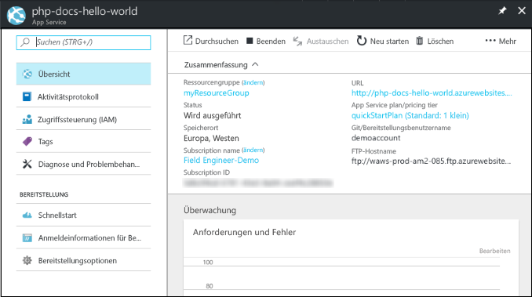

# <a name="deploy-a-python-web-app-in-web-app-for-containers"></a>Bereitstellen einer Python-Web-App über die Web-App für Container

[App Service unter Linux](app-service-linux-intro.md) bietet einen hochgradig skalierbaren Webhostingdienst mit Self-Patching unter Linux-Betriebssystemen. In dieser Schnellstartanleitung wird veranschaulicht, wie Sie eine Web-App erstellen und dafür eine einfache Flask-App bereitstellen, indem Sie ein benutzerdefiniertes Docker-Hub-Image verwenden. Sie erstellen die Web-App mithilfe der [Azure CLI](https://docs.microsoft.com/cli/azure/get-started-with-azure-cli).


[!INCLUDE [quickstarts-free-trial-note](../../../includes/quickstarts-free-trial-note.md)]

## <a name="prerequisites"></a>Voraussetzungen

Für dieses Tutorial benötigen Sie Folgendes:

* <a href="https://git-scm.com/" target="_blank">Installation von Git</a>
* <a href="https://www.docker.com/community-edition" target="_blank">Installation der Docker Community Edition</a>
* <a href="https://hub.docker.com/" target="_blank">Registrierung für ein Docker-Hub-Konto</a>

## <a name="download-the-sample"></a>Herunterladen des Beispiels

Führen Sie in einem Terminalfenster die folgenden Befehle aus, um die Beispielanwendung auf Ihren lokalen Computer zu klonen, und navigieren Sie zum Verzeichnis mit dem Beispielcode.

```bash
git clone https://github.com/Azure-Samples/python-docs-hello-world
cd python-docs-hello-world
```

Dieses Repository enthält eine einfache Flask-Anwendung im Ordner _/app_ und eine _Dockerfile_, mit der drei Dinge angegeben werden:

- Verwenden Sie das Basisimage [tiangolo/uwsgi-nginx-flask:python3.6-alpine3.7](https://hub.docker.com/r/tiangolo/uwsgi-nginx-flask/).
- Der Container sollte über Port 8000 lauschen.
- Kopieren Sie das Verzeichnis `/app` in das Verzeichnis `/app` des Containers.

Für die Konfiguration wird die [Anleitung für das Basisimage](https://hub.docker.com/r/tiangolo/uwsgi-nginx-flask/) befolgt.

## <a name="run-the-app-locally"></a>Lokales Ausführen der App

Führen Sie die App in einem Docker-Container aus.

```bash
docker build --rm -t flask-quickstart .
docker run --rm -it -p 8000:8000 flask-quickstart
```

Öffnen Sie einen Webbrowser, und navigieren Sie zu der Beispielapp auf `http://localhost:8000`.

Auf der Seite wird die Nachricht **Hello World** aus der Beispiel-App angezeigt.


Drücken Sie im Terminalfenster die Tastenkombination **STRG+C**, um den Container zu beenden.

## <a name="deploy-image-to-docker-hub"></a>Bereitstellen des Images auf dem Docker-Hub

Melden Sie sich an Ihrem Docker-Hub-Konto an. Befolgen Sie die Aufforderung zum Eingeben Ihrer Docker-Hub-Anmeldeinformationen.

```bash
docker login
```

Markieren Sie Ihr Image, und übertragen Sie es per Pushvorgang in ein neues _öffentliches_ Repository Ihres Docker-Hub-Kontos, das den Namen `flask-quickstart` hat. Ersetzen Sie *\<dockerhub_id>* durch Ihre Docker-Hub-ID.

```bash
docker tag flask-quickstart <dockerhub_id>/flask-quickstart
docker push <dockerhub_id>/flask-quickstart
```

> [!NOTE]
> Mit `docker push` wird ein öffentliches Repository erstellt, wenn das angegebene Repository nicht gefunden wird. In dieser Schnellstartanleitung wird davon ausgegangen, dass ein öffentliches Repository im Docker-Hub vorhanden ist. Wenn Sie es vorziehen, den Pushvorgang in ein privates Repository durchzuführen, müssen Sie Ihre Docker-Hub-Anmeldeinformationen später in Azure App Service konfigurieren. Weitere Informationen finden Sie unter [Erstellen einer Web-App](#create-a-web-app).

Nachdem der Pushvorgang für das Image abgeschlossen wurde, können Sie es in Ihrer Azure-Web-App verwenden.

[!INCLUDE [cloud-shell-try-it.md](../../../includes/cloud-shell-try-it.md)]

[!INCLUDE [Create resource group](../../../includes/app-service-web-create-resource-group-linux.md)]

[!INCLUDE [Create app service plan](../../../includes/app-service-web-create-app-service-plan-linux.md)]

## <a name="create-a-web-app"></a>Erstellen einer Web-App

Erstellen Sie eine [Web-App](../app-service-web-overview.md) im App Service-Plan `myAppServicePlan` mit dem Befehl [az webapp create](/cli/azure/webapp?view=azure-cli-latest#az_webapp_create). Ersetzen Sie *\<app name>* durch einen global eindeutigen App-Namen und *\<dockerhub_id>* durch Ihre Docker-Hub-ID.

```azurecli-interactive
az webapp create --resource-group myResourceGroup --plan myAppServicePlan --name <app name> --deployment-container-image-name <dockerhub_id>/flask-quickstart
```

Nach Erstellung der Web-App zeigt die Azure CLI eine Ausgabe wie im folgenden Beispiel an:

```json
{
  "availabilityState": "Normal",
  "clientAffinityEnabled": true,
  "clientCertEnabled": false,
  "cloningInfo": null,
  "containerSize": 0,
  "dailyMemoryTimeQuota": 0,
  "defaultHostName": "<app name>.azurewebsites.net",
  "deploymentLocalGitUrl": "https://<username>@<app name>.scm.azurewebsites.net/<app name>.git",
  "enabled": true,
  < JSON data removed for brevity. >
}
```

Wenn Sie zuvor den Upload in ein privates Repository durchgeführt haben, müssen Sie auch die Docker-Hub-Anmeldeinformationen in App Service konfigurieren. Weitere Informationen finden Sie unter [Verwenden eines privaten Images von Docker Hub (optional)](tutorial-custom-docker-image.md#use-a-private-image-from-docker-hub-optional).

### <a name="specify-container-port"></a>Angeben des Containerports

Wie in der _Dockerfile_ angegeben, lauscht Ihr Container über Port 8000. Damit App Service Ihre Anforderung an den richtigen Port sendet, müssen Sie die App-Einstellung *WEBSITES_PORT* festlegen.

Führen Sie in Cloud Shell den Befehl [`az webapp config appsettings set`](/cli/azure/webapp/config/appsettings?view=azure-cli-latest#az_webapp_config_appsettings_set) aus.


```azurecli-interactive
az webapp config appsettings set --name <app_name> --resource-group myResourceGroup --settings WEBSITES_PORT=8000
```

## <a name="browse-to-the-app"></a>Navigieren zur App

```bash
http://<app_name>.azurewebsites.net/
```


> [!NOTE]
> Das Starten der Web-App dauert einen Moment, da bei der ersten Anforderung der App das Docker-Hub-Image heruntergeladen und ausgeführt werden muss. Wenn nach längerer Zeit zuerst ein Fehler angezeigt wird, können Sie die Seite einfach aktualisieren.

**Glückwunsch!** Sie haben ein benutzerdefiniertes Docker-Image zur Ausführung einer Python-App für Web-App für Container bereitgestellt.

## <a name="update-locally-and-redeploy"></a>Lokales Aktualisieren und erneutes Bereitstellen

Öffnen Sie die Datei `app/main.py` innerhalb der Python-App mit einem lokalen Text-Editor, und ändern Sie den Text neben der Anweisung `return` geringfügig:

```python
return 'Hello, Azure!'
```

Erstellen Sie das Image neu, und übertragen Sie es erneut per Pushvorgang an den Docker-Hub.

```bash
docker build --rm -t flask-quickstart .
docker tag flask-quickstart <dockerhub_id>/flask-quickstart
docker push <dockerhub_id>/flask-quickstart
```

Starten Sie die App in Cloud Shell neu. Durch den Neustart der App wird sichergestellt, dass alle Einstellungen übernommen werden und der neueste Container per Pullvorgang aus der Registrierung abgerufen wird.

```azurecli-interactive
az webapp restart --resource-group myResourceGroup --name <app_name>
```

Warten Sie ca. 15 Sekunden, bis App Service das aktualisierte Image per Pullvorgang abruft. Wechseln Sie wieder zu dem Browserfenster, das im Schritt **Navigieren zur App** geöffnet wurde, und aktualisieren Sie die Seite.


## <a name="manage-your-azure-web-app"></a>Verwalten Ihrer Azure-Web-App

Wechseln Sie zum [Azure-Portal](https://portal.azure.com), um die erstellte Web-App anzuzeigen.

Klicken Sie im linken Menü auf **App Services** und anschließend auf den Namen Ihrer Azure-Web-App.


Standardmäßig wird im Portal die Seite **Übersicht** Ihrer Web-App angezeigt. Diese Seite bietet einen Überblick über den Status Ihrer App. Hier können Sie auch einfache Verwaltungsaufgaben wie Durchsuchen, Beenden, Neustarten und Löschen durchführen. Die Registerkarten links auf der Seite zeigen die verschiedenen Konfigurationsseiten, die Sie öffnen können.



[!INCLUDE [Clean-up section](../../../includes/cli-script-clean-up.md)]

## <a name="next-steps"></a>Nächste Schritte

> [!div class="nextstepaction"]
> [Python mit PostgreSQL](tutorial-docker-python-postgresql-app.md)

> [!div class="nextstepaction"]
> [Verwenden von benutzerdefinierten Images](tutorial-custom-docker-image.md)