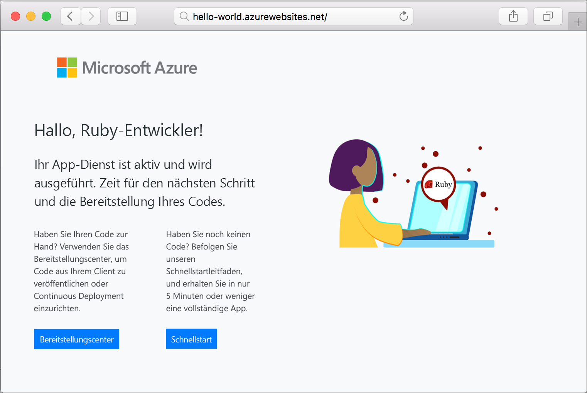

# <a name="create-a-ruby-app-with-web-apps-on-linux"></a>Erstellen einer Ruby-App in Web-Apps unter Linux

[Azure-Web-Apps](https://docs.microsoft.com/azure/app-service-web/app-service-web-overview) bietet einen hochgradig skalierbaren Webhosting-Dienst mit Self-Patching. In dieser Schnellstartanleitung erfahren Sie, wie Sie eine grundlegende Ruby on Rails-Anwendung erstellen und in Azure unter als Web-App unter Linux bereitstellen.


## <a name="prerequisites"></a>Voraussetzungen

* [Ruby 2.4.1 oder höher](https://www.ruby-lang.org/en/documentation/installation/#rubyinstaller)
* [Git](https://git-scm.com/downloads).
* Ein [aktives Azure-Abonnement](https://azure.microsoft.com/pricing/free-trial/)

[!INCLUDE [quickstarts-free-trial-note](../../../includes/quickstarts-free-trial-note.md)]

## <a name="download-the-sample"></a>Herunterladen des Beispiels

Führen Sie in einem Terminalfenster den folgenden Befehl aus, um das Beispiel-App-Repository auf Ihren lokalen Computer zu klonen:

```bash
git clone https://github.com/Azure-Samples/ruby-docs-hello-world
```

## <a name="run-the-application-locally"></a>Lokales Ausführen der Anwendung

Führen Sie den Rails-Server aus, damit die Anwendung funktioniert. Wechseln Sie zum Verzeichnis *hello-world*, und starten Sie den Server mit dem Befehl `rails server`.

```bash
cd hello-world\bin
rails server
```

Navigieren Sie in Ihrem Webbrowser zu `http://localhost:3000`, um die App lokal zu testen.


## <a name="modify-app-to-display-welcome-message"></a>Ändern der App zum Anzeigen einer Begrüßungsnachricht

Ändern Sie die Anwendung, sodass diese eine Begrüßungsnachricht anzeigt. Sie müssen zuerst eine Route einrichten, indem Sie die Datei *~/workspace/ruby-docs-hello-world/config/routes.rb* so ändern, dass sie eine Route mit dem Namen `hello` enthält.
    
  ```ruby
  Rails.application.routes.draw do
      #For details on the DSL available within this file, see http://guides.rubyonrails.org/routing.html
      root 'application#hello'
  end
  ```

Ändern Sie den Controller für die Anwendung, sodass die Nachricht als HTML an den Browser zurückgegeben wird. 

Öffnen Sie *~/workspace/hello-world/app/controllers/application_controller.rb* zur Bearbeitung. Ändern Sie die `ApplicationController`-Klasse wie im folgenden Codebeispiel gezeigt:

  ```ruby
  class ApplicationController > ActionController :: base
    protect_from_forgery with: :exception
    def hello
      render html: "Hello, world from Azure Web App on Linux!"
    end
  end
  ```

Ihre App ist jetzt konfiguriert. Navigieren Sie in Ihrem Webbrowser zu `http://localhost:3000`, um die Stamm-Startseite zu bestätigen.


[!INCLUDE [Try Cloud Shell](../../../includes/cloud-shell-try-it.md)]

[!INCLUDE [Configure deployment user](../../../includes/configure-deployment-user.md)]

## <a name="create-a-ruby-web-app-on-azure"></a>Erstellen einer Ruby-Web-App in Azure

Es ist eine Ressourcengruppe erforderlich, die die erforderlichen Ressourcen für Ihre Web-App enthalten soll. Verwenden Sie zum Erstellen einer Ressourcengruppe den Befehl [az group create]().

```azurecli-interactive
az group create --location westeurope --name myResourceGroup
```

Erstellen Sie mit dem Befehl [az appservice plan create](https://docs.microsoft.com/cli/azure/appservice/plan#az_appservice_plan_create) einen App Service-Plan für Ihre Web-App.

```azurecli-interactive
az appservice plan create --name myAppServicePlan --resource-group myResourceGroup --is-linux
```

Verwenden Sie als Nächstes den Befehl [az webapp create](https://docs.microsoft.com/cli/azure/webapp), um die Web-App zu erstellen, die den neu erstellten Service-Plan verwendet. Beachten Sie, dass die Runtime auf `ruby|2.3` festgelegt ist. Vergessen Sie nicht, `<app name>` durch einen eindeutigen App-Namen zu ersetzen.

```azurecli-interactive
az webapp create --resource-group myResourceGroup --plan myAppServicePlan --name <app name> \
--runtime "ruby|2.3" --deployment-local-git
```

Die Ausgabe des Befehls zeigt Informationen über die neu erstellte Web-App sowie die Bereitstellungs-URL an. Sie sollte in etwa wie das folgende Beispiel aussehen. Kopieren Sie die URL zur späteren Verwendung in diesem Tutorial.

```bash
https://<deployment user name>@<app name>.scm.azurewebsites.net/<app name>.git
```

Nach dem Erstellen der Web-App kann die Seite **Übersicht** angezeigt werden. Navigieren Sie zu dieser. Die folgende Begrüßungsseite wird angezeigt:




## <a name="deploy-your-application"></a>Bereitstellen der Anwendung

Führen Sie die folgenden Befehle aus, um die lokale Anwendung auf Ihrer Azure-Website bereitzustellen:

```bash
git remote add azure <Git deployment URL from above>
git add -A
git commit -m "Initial deployment commit"
git push azure master
```

Vergewissern Sie sich, dass die Remotebereitstellungsvorgänge erfolgreich waren. Der Befehl erzeugt eine Ausgabe ähnlich dem folgenden Text:

```bash
remote: Using sass-rails 5.0.6
remote: Updating files in vendor/cache
remote: Bundle gems are installed into ./vendor/bundle
remote: Updating files in vendor/cache
remote: ~site/repository
remote: Finished successfully.
remote: Running post deployment command(s)...
remote: Deployment successful.
To https://<your web app name>.scm.azurewebsites.net/<your web app name>.git
  579ccb....2ca5f31  master -> master
myuser@ubuntu1234:~workspace/<app name>$
```

Starten Sie Ihre Web-App nach Abschluss der Bereitstellung neu, damit die Bereitstellung wirksam wird. Verwenden Sie dazu den Befehl [az webapp restart](https://docs.microsoft.com/cli/azure/webapp#az_webapp_restart), wie hier gezeigt:

```azurecli-interactive
az webapp restart --name <app name> --resource-group myResourceGroup
```

Navigieren Sie zu Ihrer Website, und überprüfen Sie die Ergebnisse.

```bash
http://<app name>.azurewebsites.net
```


> [!NOTE]
> Wenn Sie während des Neustarts der App versuchen, zur Website zu browsen, wird der HTTP-Statuscode `Error 503 Server unavailable` ausgegeben. Der vollständige Neustart kann einige Minuten in Anspruch nehmen.
>

[!INCLUDE [Clean-up section](../../../includes/cli-script-clean-up.md)]

## <a name="next-steps"></a>Nächste Schritte

[Häufig gestellte Fragen zu Azure App Service-Web-App unter Linux](https://docs.microsoft.com/azure/app-service-web/app-service-linux-faq.md)

