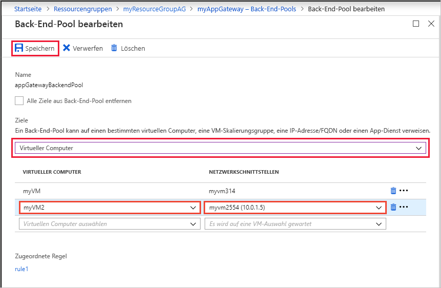

# <a name="create-an-application-gateway-using-the-azure-portal"></a>Erstellen eines Anwendungsgateways im Azure-Portal

Sie können das Azure-Portal verwenden, um Anwendungsgateways zu erstellen oder zu verwalten. Diese Schnellstartanleitung zeigt Ihnen, wie Sie Netzwerkressourcen, Back-End-Server und ein Anwendungsgateway erstellen.

Wenn Sie kein Azure-Abonnement besitzen, können Sie ein [kostenloses Konto](https://azure.microsoft.com/free/?WT.mc_id=A261C142F) erstellen, bevor Sie beginnen.

## <a name="log-in-to-azure"></a>Anmelden an Azure

Melden Sie sich unter [http://portal.azure.com](http://portal.azure.com) beim Azure-Portal an.

## <a name="create-an-application-gateway"></a>Erstellen eines Anwendungsgateways

Für die Kommunikation zwischen den von Ihnen erstellten Ressourcen ist ein virtuelles Netzwerk erforderlich. In diesem Beispiel werden zwei Subnetze erstellt: eins für das Anwendungsgateway und eins für die Back-End-Server. Sie können ein virtuelles Netzwerk zum gleichen Zeitpunkt erstellen wie das Anwendungsgateway.

1. Klicken Sie in der linken oberen Ecke des Azure-Portals auf **Neu**.
2. Klicken Sie auf **Netzwerk** und dann in der Liste der ausgewählten Elemente auf **Application Gateway**.
3. Geben Sie die folgenden Werte für das Anwendungsgateway ein:

    - *myAppGateway*: Name des Anwendungsgateways
    - *myResourceGroupAG*: neue Ressourcengruppe

    

4. Übernehmen Sie die Standardwerte für die anderen Einstellungen, und klicken Sie auf **OK**.
5. Klicken Sie auf **Virtuelles Netzwerk auswählen** und dann auf **Neu erstellen**, und geben Sie dann die folgenden Werte für das virtuelle Netzwerk ein:

    - *myVNet*: Name des virtuellen Netzwerks
    - *10.0.0.0/16*: Adressraum des virtuellen Netzwerks
    - *myAGSubnet*: Subnetzname
    - *10.0.0.0/24*: Adressraum des Subnetzes

    

6. Klicken Sie auf **OK**, um das virtuelle Netzwerk und das Subnetz zu erstellen.
6. Klicken Sie auf **Öffentliche IP-Adresse auswählen** und dann auf **Neu erstellen**, und geben Sie den Namen der öffentlichen IP-Adresse ein. In diesem Beispiel heißt die öffentliche IP-Adresse *myAGPublicIPAddress*. Übernehmen Sie die Standardwerte für die anderen Einstellungen, und klicken Sie auf **OK**.
8. Übernehmen Sie die Standardwerte für die Listenerkonfiguration, lassen Sie die Web Application Firewall deaktiviert, und klicken Sie dann auf **OK**.
9. Überprüfen Sie die Einstellungen auf der Zusammenfassungsseite, und klicken Sie dann auf **OK**, um das virtuelle Netzwerk, die öffentliche IP-Adresse und das Anwendungsgateway zu erstellen. Die Erstellung des Anwendungsgateways kann einige Minuten dauern. Warten Sie, bis die Bereitstellung abgeschlossen ist, bevor Sie mit dem nächsten Abschnitt fortfahren.

### <a name="add-a-subnet"></a>Hinzufügen eines Subnetzes

1. Klicken Sie im linken Menü auf **Alle Ressourcen** und dann in der Ressourcenliste auf **myVNet**.
2. Klicken Sie auf **Subnetze** und dann auf **Subnetz**.

    

3. Geben Sie als Name des Subnetzes *myBackendSubnet* ein, und klicken Sie auf **OK**.

## <a name="create-backend-servers"></a>Erstellen von Back-End-Servern

In diesem Beispiel erstellen Sie zwei virtuelle Computer, die als Back-End-Server für das Anwendungsgateway verwendet werden. Sie installieren außerdem IIS auf den virtuellen Computern, um zu überprüfen, ob das Anwendungsgateway erfolgreich erstellt wurde.

### <a name="create-a-virtual-machine"></a>Erstellen eines virtuellen Computers

1. Klicken Sie auf **New**.
2. Klicken Sie auf **Compute**, und wählen Sie dann in der Liste der ausgewählten Elemente die Option **Windows Server 2016 Datacenter**.
3. Geben Sie die folgenden Werte für den virtuellen Computer ein:

    - *myVM*: Name des virtuellen Computers
    - *azureuser*: Name des Administratorbenutzers
    - *Azure123456!* als Kennwort
    - Wählen Sie **Vorhandene verwenden** und dann *myResourceGroupAG* aus.

4. Klicken Sie auf **OK**.
5. Wählen Sie als Größe des virtuellen Computers **DS1_V2** aus, und klicken Sie auf **Auswählen**.
6. Stellen Sie sicher, dass als virtuelles Netzwerk **myVNet** und als Subnetz **myBackendSubnet** ausgewählt ist. 
7. Klicken Sie auf **Deaktiviert**, um die Startdiagnose zu deaktivieren.
8. Klicken Sie auf **OK**, überprüfen Sie die Einstellungen auf der Seite „Zusammenfassung“, und klicken Sie dann auf **Erstellen**.

### <a name="install-iis"></a>Installieren von IIS

1. Öffnen Sie die interaktive Shell, und vergewissern Sie sich, dass **PowerShell** festgelegt ist.

    

2. Führen Sie den folgenden Befehl aus, um IIS auf dem virtuellen Computer zu installieren: 

    ```azurepowershell-interactive
    Set-AzureRmVMExtension `
      -ResourceGroupName myResourceGroupAG `
      -ExtensionName IIS `
      -VMName myVM `
      -Publisher Microsoft.Compute `
      -ExtensionType CustomScriptExtension `
      -TypeHandlerVersion 1.4 `
      -SettingString '{"commandToExecute":"powershell Add-WindowsFeature Web-Server; powershell Add-Content -Path \"C:\\inetpub\\wwwroot\\Default.htm\" -Value $($env:computername)"}' `
      -Location EastUS
    ```

3. Erstellen Sie einen zweiten virtuellen Computer, und installieren Sie IIS mithilfe der soeben ausgeführten Schritte. Geben Sie *myVM2* als Name und für „VMName“ in „Set-AzureRmVMExtension“ ein.

### <a name="add-backend-servers"></a>Hinzufügen von Back-End-Servern

3. Klicken Sie auf **Alle Ressourcen** und dann auf **myAppGateway**.
4. Klicken Sie auf **Back-End-Pools**. Ein Standardpool mit dem Anwendungsgateway wurde automatisch erstellt. Klicken Sie auf **appGatewayBackendPool**.
5. Klicken Sie auf **Ziel hinzufügen**, um alle erstellten virtuellen Computer dem Back-End-Pool hinzuzufügen.

    

6. Klicken Sie auf **Speichern**.

## <a name="test-the-application-gateway"></a>Testen des Anwendungsgateways

1. Suchen Sie auf dem Übersichtsbildschirm die öffentliche IP-Adresse für das Anwendungsgateway. Klicken Sie auf **Alle Ressourcen** und dann auf **myAGPublicIPAddress**.

    

2. Kopieren Sie die öffentliche IP-Adresse, und fügen Sie sie in die Adressleiste des Browsers ein.

    


## <a name="clean-up-resources"></a>Bereinigen von Ressourcen

Löschen Sie die Ressourcengruppe, das Anwendungsgateway und alle dazugehörigen Ressourcen, wenn Sie sie nicht mehr benötigen. Wählen Sie hierzu die Ressourcengruppe aus, die das Anwendungsgateway enthält, und klicken Sie auf **Löschen**.

## <a name="next-steps"></a>Nächste Schritte

In dieser Schnellstartanleitung haben Sie eine Ressourcengruppe, Netzwerkressourcen und Back-End-Server erstellt. Danach haben Sie diese Ressourcen verwendet, um ein Anwendungsgateway zu erstellen. Weitere Informationen zu Anwendungsgateways und den zugehörigen Ressourcen finden Sie in den Artikeln mit empfohlenen Vorgehensweisen.
