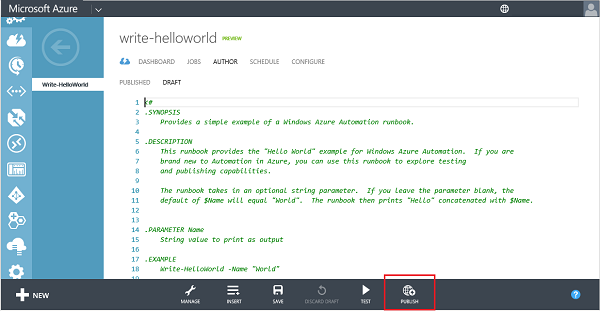

<properties linkid="automation-create-runbook-from-samples" urlDisplayName="Get Started with Azure Automation" pageTitle="Get Started with Azure Automation" metaKeywords="" description="Learn how to import and run an automation job in Azure." metaCanonical="" services="automation" documentationCenter="" title="Get Started with Azure Automation" authors="" solutions="" manager="" editor="" />

Erste Schritte mit Azure Automation
===================================

In diesem Lernprogramm werden die Schritte zum Importieren und Ausführen eines Automation-Runbooks in Microsoft Azure dargestellt.

Microsoft Azure Automation bietet Entwicklern die Möglichkeit, die manuellen, langfristigen, Fehler verursachenden und häufig wiederholten Aufgaben zu automatisieren, die für gewöhnlich in einer Cloudumgebung ausgeführt werden. Mithilfe von Runbooks, bei denen es sich eigentlich um Windows PowerShell-Workflows handelt, können Sie in Ihrer Azure-Umgebung Ressourcen erstellen, überwachen, verwalten und bereitstellen. Weitere Informationen zu Automation finden Sie im [Automation Overview Guide](http://go.microsoft.com/fwlink/p/?LinkId=392861) (Leitfaden Überblick über Automation, in englischer Sprache).

In diesem Lernprogramm wird erläutert, wie Sie ein Beispiel-Runbook in Azure Automation importieren, das Runbook ausführen und anschließend dessen Ausgabe anzeigen.

Beispiele und Hilfsprogramm-Runbooks
------------------------------------

Das Azure Automation-Team hat eine Reihe von Runbook-Beispielen erstellt, die Sie bei den ersten Schritten mit Automation unterstützen sollen. Diese Beispiele umfassen grundlegende Automation-Konzepte und sollen Ihnen helfen, Ihre eigenen Runbooks zu schreiben.

Das Automation-Team hat darüber hinaus Hilfsprogramm-Runbooks erstellt, die Sie als Bausteine für umfangreichere Automation-Aufgaben verwenden können.

> [WACOM.NOTE] Es empfiehlt sich, kleine, modulare, wiederverwendbare Runbooks zu schreiben. Sie sollten außerdem unbedingt eigene Hilfsprogramm-Runbooks für häufig verwendete Szenarien erstellen, nachdem Sie sich mit Automation vertraut gemacht haben.

Die Beispiel- und Hilfsprogramm-Runbooks des Automation-Teams können Sie im [Script Center](http://go.microsoft.com/fwlink/p/?LinkId=393029) aufrufen und herunterladen.

Die Automation-Community und Feedback
-------------------------------------

Runbooks der Community und anderer Microsoft-Teams werden auch im [Script Center](http://go.microsoft.com/fwlink/?LinkID=391681) veröffentlicht.

**Geben Sie uns Feedback!** Wenn Sie nach einer Runbook-Lösung oder einem PowerShell-Integrationsmodul suchen, senden Sie im Script Center eine Skriptanforderung. Wenn Sie eine Idee für ein neues Automation-Feature haben, senden Sie sie an die Seite [User Voice](http://feedback.windowsazure.com/forums/34192--general-feedback).

[WACOM.INCLUDE [create-account-note](../includes/create-account-note.md)]

Herunterladen eines Beispiel-Runbooks aus dem Script Center
-----------------------------------------------------------

1.  Rufen Sie das [Script Center](http://go.microsoft.com/fwlink/p/?LinkId=393029) auf, und klicken Sie dann auf **Hello World for Azure Automation**.

2.  Klicken Sie auf den Namen **Write-HelloWorld.ps1** neben **Herunterladen**, und speichern Sie die Datei auf dem Computer.

Importieren des Beispiel-Runbooks in Azure
------------------------------------------

1.  Melden Sie sich beim [Azure-Verwaltungsportal](http://manage.windowsazure.com) an.

2.  Klicken Sie im Verwaltungsportal auf **Create an Automation Account**.

    > [WACOM.NOTE] Wenn Sie bereits ein Automation-Konto erstellt haben, können Sie zu Schritt 4 springen.

    

3.  Geben Sie auf der Seite **Add a New Automation Account** einen Namen für das Konto ein, und klicken Sie auf das Häkchen.

    

4.  Klicken Sie auf der Seite **Automation** auf das soeben erstellte neue Konto.

    

5.  Klicken Sie auf **RUNBOOKS**.

    

6.  Klicken Sie auf **IMPORTIEREN**.

    

7.  Navigieren Sie zum heruntergeladenen Skript **Write-HelloWorld.ps1**, und klicken Sie auf das Häkchen.

    

8.  Klicken Sie auf **Write-HelloWorld**.

    

9.  Klicken Sie auf **AUTOR** und dann auf **ENTWURF**. Bei diesem Runbook müssen Sie keine Änderungen vornehmen.

    Sie sehen jetzt den Inhalt der Datei **Write-HelloWorld.ps1**. Sie können den Inhalt eines Runbooks im Entwurfsmodus ändern.

    

10. Klicken Sie auf **VERÖFFENTLICHEN**, um das Runbook hochzustufen, sodass es in der Produktion eingesetzt werden kann.

    

11. Wenn Sie zum Speichern und Veröffentlichen des Runbooks aufgefordert werden, klicken Sie auf **Ja**.

    

12. Klicken Sie auf **VERÖFFENTLICHT** und dann auf **START**.

    

13. Geben Sie auf der Seite **Specify the runbook parameter values** einen **Namen** ein, der als Eingabeparameter für das Skript Write-HelloWorld.ps1 verwendet wird, und klicken Sie dann auf das Häkchen.

    

14. Klicken Sie auf **JOBS**, um den Status des soeben gestarteten Runbook-Auftrags zu prüfen. Klicken Sie anschließend auf den Zeitstempel in der Spalte **AUFTRAGSANFANG**, um eine Zusammenfassung des Auftrags anzuzeigen.

    

15. Auf der Seite **ZUSAMMENFASSUNG** sehen Sie die Zusammenfassung, die Eingabeparameter und die Ausgabe des Auftrags.

    

Weitere Informationen
---------------------

-   [Automation Overview (Übersicht über Automation, in englischer Sprache)](http://go.microsoft.com/fwlink/p/?LinkId=392860)
-   [Runbook Authoring Guide (Leitfaden zum Erstellen von Runbooks, in englischer Sprache)](http://go.microsoft.com/fwlink/p/?LinkID=301740)
-   [Automation-Forum](http://go.microsoft.com/fwlink/p/?LinkId=390561)

