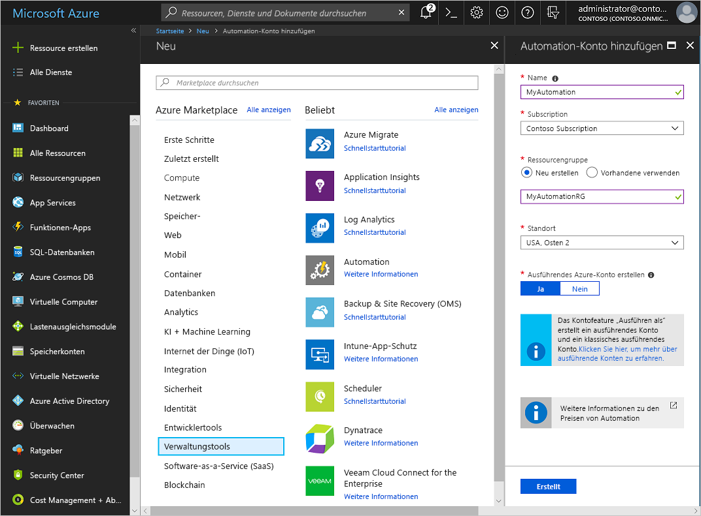
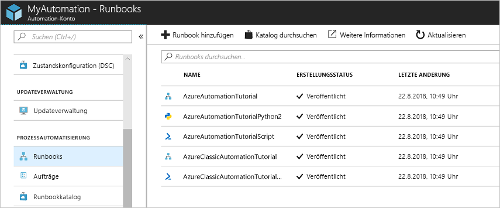

# Erstellen eines Azure Automation-Kontos

Azure Automation-Konten können über Azure erstellt werden. Diese Methode bietet eine browserbasierte Benutzeroberfläche zum Erstellen und Konfigurieren von Automation-Konten und den dazugehörigen Ressourcen. In dieser Schnellstartanleitung werden die Erstellung eines Automation-Kontos und die Ausführung eines Runbooks im Konto Schritt für Schritt beschrieben.

Wenn Sie über kein Azure-Abonnement verfügen, können Sie ein [kostenloses Azure-Konto](https://azure.microsoft.com/free/?WT.mc_id=A261C142F) erstellen, bevor Sie beginnen.

## Anmelden an Azure

Melden Sie sich unter „https://portal.azure.com“ an Azure an.

## Erstellen eines Automation-Kontos

1. Klicken Sie in Azure in der linken oberen Ecke auf die Schaltfläche **Neu**.

1. Wählen Sie **Überwachung + Verwaltung** und dann **Automation**.

1. Geben Sie die Kontoinformationen ein. Wählen Sie für **Ausführendes Azure-Konto erstellen** die Option **Ja**, damit die Artefakte zum Vereinfachen der Authentifizierung für Azure automatisch aktiviert werden. Klicken Sie nach Abschluss des Vorgangs auf **Erstellen**, um die Bereitstellung des Automation-Kontos zu starten.

      

1. Das Automation-Konto wird im Azure-Dashboard angeheftet. Nachdem die Bereitstellung abgeschlossen ist, wird die Übersicht über das Automation-Konto automatisch geöffnet.

    

## Ausführen eines Runbooks

Führen Sie ein Runbook des Tutorials aus.

1. Klicken Sie unter **PROZESSAUTOMATISIERUNG** auf **Runbooks**. Die Liste mit den Runbooks wird angezeigt. Standardmäßig sind mehrere Tutorial-Runbooks im Konto aktiviert.

    

1. Wählen Sie das Runbook **AzureAutomationTutorialScript** aus. Die Seite mit der Runbookübersicht wird geöffnet.

    

1. Klicken Sie auf **Starten** und auf der Seite **Runbook starten** dann auf **OK**, um das Runbook zu starten.

    

1. Nachdem sich der **Auftragsstatus** in **Wird ausgeführt** geändert hat, können Sie auf **Ausgabe** oder **Alle Protokolle** klicken, um die Ausgabe des Runbookauftrags anzuzeigen. Für dieses Tutorial-Runbook ist die Ausgabe eine Liste mit Ihren Azure-Ressourcen.

## Bereinigen von Ressourcen

Löschen Sie die Ressourcengruppe, das Automation-Konto und alle dazugehörigen Ressourcen, wenn Sie sie nicht mehr benötigen. Wählen Sie hierzu die Ressourcengruppe für das Automation-Konto aus, und klicken Sie auf **Löschen**.

## Nächste Schritte

In dieser Schnellstartanleitung haben Sie ein Automation-Konto bereitgestellt, einen Runbookauftrag gestartet und die Auftragsergebnisse angezeigt. Weitere Informationen zu Azure Automation finden Sie in der Schnellstartanleitung zum Erstellen Ihres ersten Runbooks.

> [!div class="nextstepaction"]
> [Automation-Schnellstart – Erstellen eines Runbooks](./automation-quickstart-create-runbook.md)
