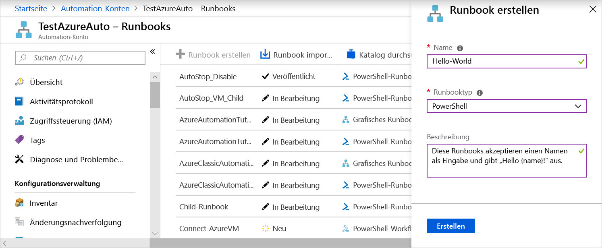
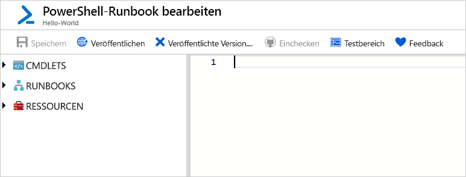
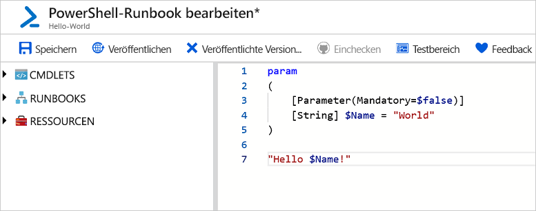
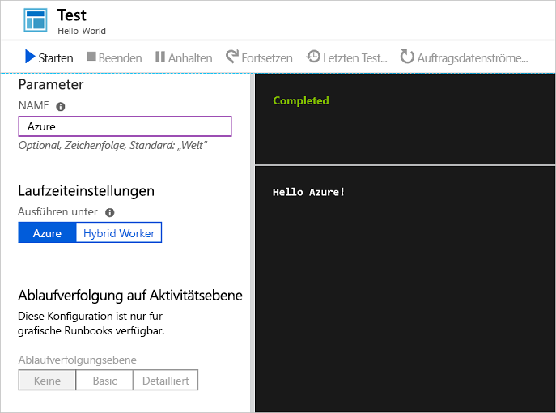
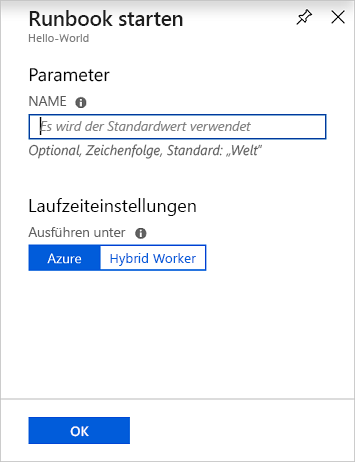
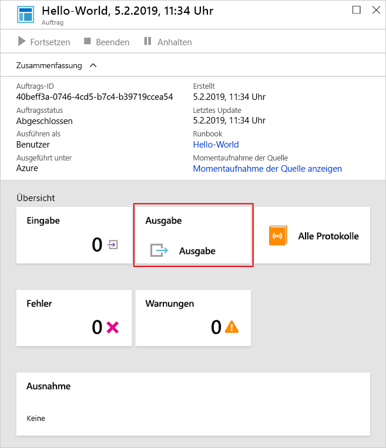
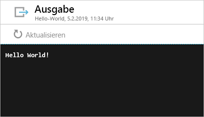

# <a name="create-an-azure-automation-runbook"></a>Erstellen eines Azure Automation-Runbooks

Azure Automation-Runbooks können über Azure erstellt werden. Mit dieser Methode wird eine browserbasierte Benutzeroberfläche zum Erstellen von Automation-Runbooks bereitgestellt. In dieser Schnellstartanleitung wird das Erstellen, Bearbeiten, Testen und Veröffentlichen eines Automation PowerShell-Runbooks Schritt für Schritt beschrieben.

Wenn Sie über kein Azure-Abonnement verfügen, können Sie ein [kostenloses Azure-Konto](https://azure.microsoft.com/free/?WT.mc_id=A261C142F) erstellen, bevor Sie beginnen.

## <a name="log-in-to-azure"></a>Anmelden an Azure

Melden Sie sich unter „https://portal.azure.com“ an Azure an.

## <a name="create-runbook"></a>Runbook erstellen

Erstellen Sie zuerst ein Runbook. Die Ausgabe des Beispielrunbooks, das in dieser Schnellstartanleitung erstellt wird, lautet standardmäßig `Hello World`.

1. Öffnen Sie Ihr Automation-Konto.

1. Klicken Sie unter **PROZESSAUTOMATISIERUNG** auf **Runbooks**. Die Liste mit den Runbooks wird angezeigt.

1. Klicken Sie oben in der Liste auf die Schaltfläche **Runbook hinzufügen**. Wählen Sie auf der Seite **Runbook hinzufügen** die Option **Schnellerfassung**.

1. Geben Sie als **Name** für das Runbook „Hello-World“ ein, und wählen Sie als **Runbooktyp** die Option **PowerShell**. Klicken Sie auf **Create**.

   

1. Das Runbook wird erstellt, und die Seite **PowerShell-Runbook bearbeiten** wird geöffnet.

    

1. Geben Sie den folgenden Code im Bearbeitungsbereich ein (oder fügen Sie ihn ein). Hiermit wird der optionale Eingabeparameter „Name“ mit dem Standardwert „World“ erstellt, und es wird eine Zeichenfolge ausgegeben, für die dieser Eingabewert verwendet wird:
   
   ```powershell-interactive
   param
   (
       [Parameter(Mandatory=$false)]
       [String] $Name = "World"
   )

   "Hello $Name!"
   ```

1. Klicken Sie auf **Speichern**, um eine Entwurfskopie des Runbooks zu speichern.

    

## <a name="test-the-runbook"></a>Testen des Runbooks

Testen Sie das Runbook nach der Erstellung, um die Funktionsweise zu überprüfen.

1. Klicken Sie auf **Testbereich**, um die Seite **Test** zu öffnen.

1. Geben Sie einen Wert für **Name** ein, und klicken Sie auf **Starten**. Der Testauftrag wird gestartet, und der Auftragsstatus und die Ausgabe werden angezeigt.

    

1. Schließen Sie die Seite **Test**, indem Sie oben rechts auf das **X** klicken. Klicken Sie im angezeigten Popupmenü auf **OK**.

1. Klicken Sie auf der Seite **PowerShell-Runbook bearbeiten** auf **Veröffentlichen**, um das Runbook als offizielle Version des Runbooks im Konto zu veröffentlichen.

   

## <a name="run-the-runbook"></a>Ausführen des Runbooks

Nachdem das Runbook veröffentlicht wurde, wird die Übersichtsseite angezeigt.

1. Klicken Sie auf der Übersichtsseite des Runbooks auf **Starten**, um die Konfigurationsseite **Runbook starten** für das Runbook zu öffnen.

   

1. Lassen Sie das Feld **Name** leer, damit der Standardwert verwendet wird, und klicken Sie auf **OK**. Der Runbookauftrag wird übermittelt, und die Auftragsseite wird angezeigt.

   

1. Wenn als **Auftragsstatus** entweder **Wird ausgeführt** oder **Abgeschlossen** angegeben ist, können Sie auf **Ausgabe** klicken, um den Bereich **Ausgabe** zu öffnen und die Runbookausgabe anzuzeigen.

   

## <a name="clean-up-resources"></a>Bereinigen von Ressourcen

Löschen Sie das Runbook, falls es nicht mehr benötigt wird. Wählen Sie das Runbook hierzu in der Runbookliste aus, und klicken Sie auf **Löschen**.

## <a name="next-steps"></a>Nächste Schritte

In dieser Schnellstartanleitung haben Sie ein Runbook erstellt, bearbeitet, getestet und veröffentlicht und einen Runbookauftrag gestartet. Weitere Informationen zu Automation-Runbooks finden Sie im Artikel zu den unterschiedlichen Runbooktypen, die Sie in Automation erstellen und nutzen können.

> [!div class="nextstepaction"]
> [Vorgehensweise für Automation – Runbooktypen](./automation-runbook-types.md)
