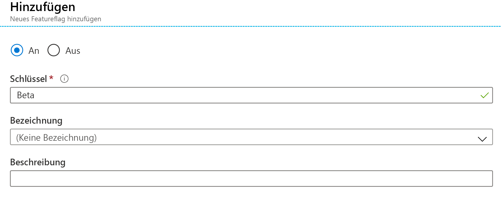
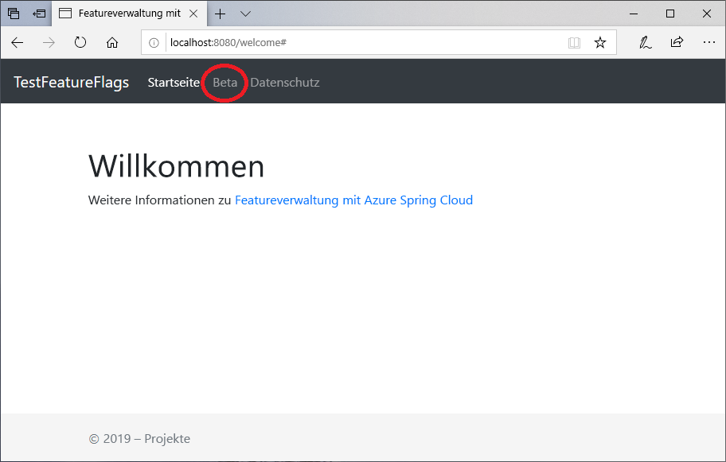

# <a name="quickstart-add-feature-flags-to-a-spring-boot-app"></a>Schnellstart: Hinzufügen von Featureflags zu einer Spring Boot-App

In dieser Schnellstartanleitung integrieren Sie Azure App Configuration in eine Spring Boot-Web-App, um eine End-to-End-Implementierung der Featureverwaltung zu erzielen. Mit diesem App Configuration-Dienst können Sie alle Featureflags zentral speichern und ihren jeweiligen Zustand steuern.

Die Spring Boot-Bibliotheken für die Featureverwaltung erweitern das Framework um umfassende Unterstützung für Featureflags. Diese Bibliotheken sind **nicht** von Azure-Bibliotheken abhängig. Über ihren Spring Boot-Konfigurationsanbieter lassen sie sich nahtlos in App Configuration integrieren.

## <a name="prerequisites"></a>Voraussetzungen

* Azure-Abonnement – [Erstellen eines kostenlosen Kontos](https://azure.microsoft.com/free/)
* Ein unterstütztes [Java Development Kit-SDK](https://docs.microsoft.com/java/azure/jdk) mit Version 8.
* [Apache Maven](https://maven.apache.org/download.cgi) Version 3.0 oder höher

## <a name="create-an-app-configuration-instance"></a>Erstellen einer App Configuration-Instanz

[!INCLUDE [azure-app-configuration-create](../../includes/azure-app-configuration-create.md)]

6. Wählen Sie **Feature-Manager** >  **+Hinzufügen** aus, um ein Featureflag namens `Beta` hinzuzufügen.

    > [!div class="mx-imgBorder"]
    > 

    Definieren Sie `label` vorerst nicht.

## <a name="create-a-spring-boot-app"></a>Erstellen einer Spring Boot-App

Verwenden Sie [Spring Initializr](https://start.spring.io/), um ein neues Spring Boot-Projekt zu erstellen.

1. Navigieren Sie zu <https://start.spring.io/>.

1. Verwenden Sie die folgenden Optionen:

   * Generieren Sie ein **Maven**-Projekt mit **Java**.
   * Geben Sie eine **Spring Boot**-Version ab 2.0 an.
   * Geben Sie Namen für die **Gruppe** und das **Artefakt** für Ihre Anwendung an.  In diesem Artikel werden `com.example` und `demo` verwendet.
   * Fügen Sie die Abhängigkeit **Spring Web** hinzu.

1. Wählen Sie nach Angabe der vorherigen Optionen die Option **Projekt generieren** aus. Laden Sie das Projekt nach entsprechender Aufforderung auf Ihren lokalen Computer herunter.

## <a name="add-feature-management"></a>Hinzufügen der Featureverwaltung

1. Nachdem Sie die Dateien auf Ihrem lokalen System extrahiert haben, kann Ihre Spring Boot-Anwendung bearbeitet werden. Suchen Sie im Stammverzeichnis Ihrer App nach *pom.xml*.

1. Öffnen Sie die Datei *pom.xml* in einem Text-Editor, und fügen Sie der Abhängigkeitenliste (`<dependencies>`) Folgendes hinzu:

### <a name="spring-cloud-11x"></a>Spring Cloud 1.1.x

    ```xml
    <dependency>
        <groupId>com.microsoft.azure</groupId>
        <artifactId>spring-cloud-azure-appconfiguration-config</artifactId>
        <version>1.1.2</version>
    </dependency>
    <dependency>
        <groupId>com.microsoft.azure</groupId>
        <artifactId>spring-cloud-azure-feature-management-web</artifactId>
        <version>1.1.2</version>
    </dependency>
    <dependency>
        <groupId>org.springframework.boot</groupId>
        <artifactId>spring-boot-starter-thymeleaf</artifactId>
    </dependency>
    ```

### <a name="spring-cloud-12x"></a>Spring Cloud 1.2.x

    ```xml
    <dependency>
        <groupId>com.microsoft.azure</groupId>
        <artifactId>spring-cloud-azure-appconfiguration-config</artifactId>
        <version>1.2.2</version>
    </dependency>
    <dependency>
        <groupId>com.microsoft.azure</groupId>
        <artifactId>spring-cloud-azure-feature-management-web</artifactId>
        <version>1.2.2</version>
    </dependency>
    <dependency>
        <groupId>org.springframework.boot</groupId>
        <artifactId>spring-boot-starter-thymeleaf</artifactId>
    </dependency>
    ```

> [!Note]
> Es gibt eine nicht webgestützte Bibliothek für die Featureverwaltung, die nicht von Spring-Web abhängig ist. Unterschiede finden Sie in der [GitHub-Dokumentation](https://github.com/microsoft/spring-cloud-azure/tree/master/spring-cloud-azure-feature-management).

## <a name="connect-to-an-app-configuration-store"></a>Herstellen einer Verbindung mit einem App Configuration-Speicher

1. Navigieren Sie zum Verzeichnis `resources` Ihrer App, und öffnen Sie `bootstrap.properties`.  Sollte die Datei nicht vorhanden sein, erstellen Sie sie. Fügen Sie der Datei die folgende Zeile hinzu:

    ```properties
    spring.cloud.azure.appconfiguration.stores[0].name= ${APP_CONFIGURATION_CONNECTION_STRING}
    ```

1. Wählen Sie im App Configuration-Portal für Ihren Konfigurationsspeicher die Option `Access keys` auf der Seitenleiste aus. Wählen Sie die Registerkarte „Schreibgeschützte Schlüssel“ aus. Kopieren Sie den Wert der primären Verbindungszeichenfolge.

1. Fügen Sie die primäre Verbindungszeichenfolge unter Verwendung des Variablennamens `APP_CONFIGURATION_CONNECTION_STRING` als Umgebungsvariable hinzu.

1. Öffnen Sie die Java-Hauptanwendungsdatei, und fügen Sie `@EnableConfigurationProperties` hinzu, um diese Funktion zu aktivieren.

    ```java
    package com.example.demo;

    import org.springframework.boot.SpringApplication;
    import org.springframework.boot.context.properties.ConfigurationProperties;
    import org.springframework.boot.context.properties.EnableConfigurationProperties;
    import org.springframework.boot.autoconfigure.SpringBootApplication;

    @SpringBootApplication
    @EnableConfigurationProperties(MessageProperties.class)
    public class DemoApplication {

        public static void main(String[] args) {
            SpringApplication.run(DemoApplication.class, args);
        }
    }
    ```

1. Erstellen Sie eine neue Java-Datei mit dem Namen *MessageProperties.java* im Paketverzeichnis Ihrer App.

    ```java
    package com.example.demo;

    import org.springframework.boot.context.properties.ConfigurationProperties;
    import org.springframework.context.annotation.Configuration;

    @Configuration
    @ConfigurationProperties(prefix = "config")
    public class MessageProperties {
        private String message;

        public String getMessage() {
            return message;
        }

        public void setMessage(String message) {
            this.message = message;
        }
    }
    ```

1. Erstellen Sie im Paketverzeichnis Ihrer App eine neue Java-Datei mit dem Namen *HelloController.java*.

    ```java
    package com.example.demo;

    import org.springframework.boot.context.properties.ConfigurationProperties;
    import org.springframework.stereotype.Controller;
    import org.springframework.ui.Model;

    import com.microsoft.azure.spring.cloud.feature.manager.FeatureManager;
    import org.springframework.web.bind.annotation.GetMapping;


    @Controller
    @ConfigurationProperties("controller")
    public class HelloController {

        private FeatureManager featureManager;

        public HelloController(FeatureManager featureManager) {
            this.featureManager = featureManager;
        }

        @GetMapping("/welcome")
        public String mainWithParam(Model model) {
            model.addAttribute("Beta", featureManager.isEnabledAsync("Beta").block());
            return "welcome";
        }
    }
    ```

1. Erstellen Sie im Verzeichnis „templates“ der App eine neue HTML-Datei mit dem Namen *welcome.html*.

    ```html
    <!DOCTYPE html>
    <html lang="en" xmlns:th="http://www.thymeleaf.org">
    <head>
        <meta charset="utf-8">
        <meta name="viewport" content="width=device-width, initial-scale=1, shrink-to-fit=no">
        <title>Feature Management with Spring Cloud Azure</title>

        <link rel="stylesheet" href="/css/main.css">
        <link rel="stylesheet" href="https://stackpath.bootstrapcdn.com/bootstrap/4.3.1/css/bootstrap.min.css" integrity="sha384-ggOyR0iXCbMQv3Xipma34MD+dH/1fQ784/j6cY/iJTQUOhcWr7x9JvoRxT2MZw1T" crossorigin="anonymous">

        <script src="https://code.jquery.com/jquery-3.3.1.slim.min.js" integrity="sha384-q8i/X+965DzO0rT7abK41JStQIAqVgRVzpbzo5smXKp4YfRvH+8abtTE1Pi6jizo" crossorigin="anonymous"></script>
        <script src="https://cdnjs.cloudflare.com/ajax/libs/popper.js/1.14.7/umd/popper.min.js" integrity="sha384-UO2eT0CpHqdSJQ6hJty5KVphtPhzWj9WO1clHTMGa3JDZwrnQq4sF86dIHNDz0W1" crossorigin="anonymous"></script>
        <script src="https://stackpath.bootstrapcdn.com/bootstrap/4.3.1/js/bootstrap.min.js" integrity="sha384-JjSmVgyd0p3pXB1rRibZUAYoIIy6OrQ6VrjIEaFf/nJGzIxFDsf4x0xIM+B07jRM" crossorigin="anonymous"></script>

    </head>
    <body>
        <header>
        <!-- Fixed navbar -->
        <nav class="navbar navbar-expand-md navbar-dark fixed-top bg-dark">
            <a class="navbar-brand" href="#">TestFeatureFlags</a>
            <button class="navbar-toggler" aria-expanded="false" aria-controls="navbarCollapse" aria-label="Toggle navigation" type="button" data-target="#navbarCollapse" data-toggle="collapse">
            <span class="navbar-toggler-icon"></span>
            </button>
            <div class="collapse navbar-collapse" id="navbarCollapse">
            <ul class="navbar-nav mr-auto">
                <li class="nav-item active">
                <a class="nav-link" href="#">Home <span class="sr-only">(current)</span></a>
                </li>
                <li class="nav-item" th:if="${Beta}">
                <a class="nav-link" href="#">Beta</a>
                </li>
                <li class="nav-item">
                <a class="nav-link" href="#">Privacy</a>
                </li>
            </ul>
            </div>
        </nav>
        </header>
        <div class="container body-content">
            <h1 class="mt-5">Welcome</h1>
            <p>Learn more about <a href="https://github.com/microsoft/spring-cloud-azure/blob/master/spring-cloud-azure-feature-management/README.md">Feature Management with Spring Cloud Azure</a></p>

        </div>
        <footer class="footer">
            <div class="container">
            <span class="text-muted">&copy; 2019 - Projects</span>
        </div>

        </footer>
    </body>
    </html>

    ```

1. Erstellen Sie unter `static` einen neuen Ordner namens „CSS“ und in diesem Ordner eine neue CSS-Datei namens *main.css*.

    ```css
    html {
     position: relative;
     min-height: 100%;
    }
    body {
     margin-bottom: 60px;
    }
    .footer {
     position: absolute;
     bottom: 0;
     width: 100%;
     height: 60px;
     line-height: 60px;
     background-color: #f5f5f5;
    }

    body > .container {
     padding: 60px 15px 0;
    }

    .footer > .container {
     padding-right: 15px;
     padding-left: 15px;
    }

    code {
     font-size: 80%;
    }
    ```

## <a name="build-and-run-the-app-locally"></a>Lokales Erstellen und Ausführen der App

1. Erstellen Sie Ihre Spring Boot-Anwendung mit Maven, und führen Sie sie aus.

    ```shell
    mvn clean package
    mvn spring-boot:run
    ```

1. Öffnen Sie ein Browserfenster, und navigieren Sie zur Standard-URL für eine lokal gehostete Web-App: `https://localhost:8080`.

    

1. Wählen Sie im App Configuration-Portal **Feature-Manager** aus, und ändern Sie den Status des **Beta**-Schlüssels in **Ein**:

    | Schlüssel | State |
    |---|---|
    | Beta | Andererseits |

1. Aktualisieren Sie die Browserseite, um die neuen Konfigurationseinstellungen anzuzeigen.

    

## <a name="clean-up-resources"></a>Bereinigen von Ressourcen

[!INCLUDE [azure-app-configuration-cleanup](../../includes/azure-app-configuration-cleanup.md)]

## <a name="next-steps"></a>Nächste Schritte

In dieser Schnellstartanleitung haben Sie einen neuen App Configuration-Speicher erstellt und diesen zur Verwaltung von Features in einer Spring Boot-Web-App über die [Feature-Manager-Bibliotheken](https://go.microsoft.com/fwlink/?linkid=2074664) verwendet.

* Weitere Informationen über die [Featureverwaltung](./concept-feature-management.md)
* [Verwalten von Featureflags](./manage-feature-flags.md)
* [Verwenden von Featureflags in einer Spring Boot Core-App](./use-feature-flags-spring-boot.md).
