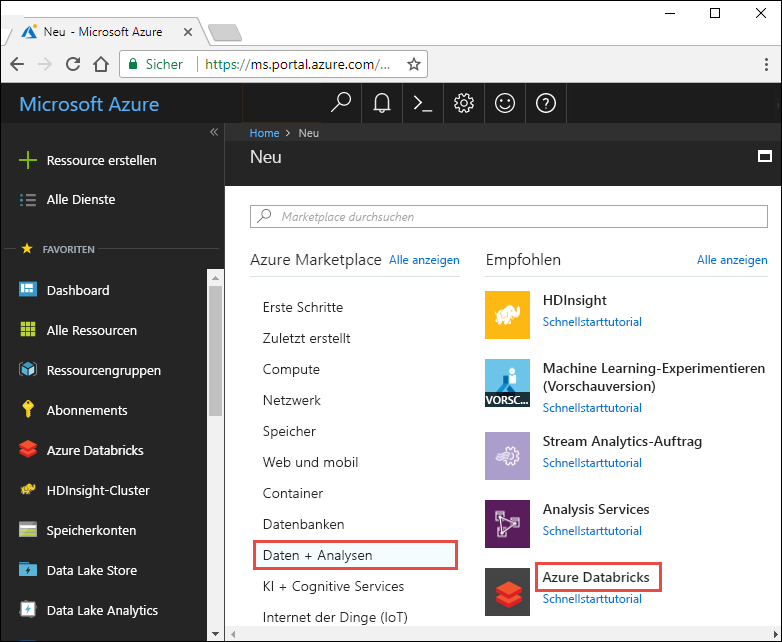
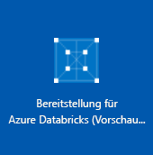
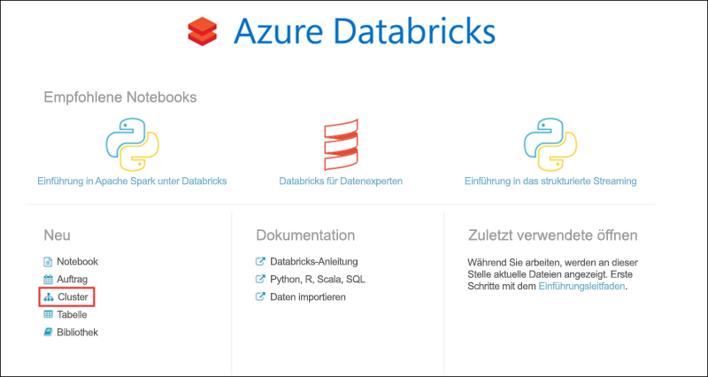

# <a name="tutorial-stream-data-into-azure-databricks-using-event-hubs"></a>Tutorial: Streamen von Daten an Azure Databricks unter Verwendung von Event Hubs

In diesem Tutorial verbinden Sie ein Datenerfassungssystem mit Azure Databricks, um Daten nahezu in Echtzeit in einen Apache Spark-Cluster zu streamen. Sie richten ein Datenerfassungssystem mit Azure Event Hubs ein und verbinden es zur Verarbeitung der eingehenden Nachrichten mit Azure Databricks. Für den Zugriff auf Streamingdaten verwenden Sie Twitter-APIs, um Tweets in Event Hubs zu erfassen. Sobald sich die Daten in Azure Databricks befinden, können Sie Analyseaufträge ausführen, um die Daten näher zu analysieren.

Am Ende dieses Tutorials haben Sie Tweets, die den Begriff „Azure“ enthalten, von Twitter gestreamt und die Tweets in Azure Databricks gelesen.

In der folgenden Abbildung ist der Anwendungsfluss dargestellt:


Dieses Tutorial enthält die folgenden Aufgaben:

> [!div class="checklist"]
> * Erstellen eines Azure Databricks-Arbeitsbereichs
> * Erstellen eines Spark-Clusters in Azure Databricks
> * Erstellen einer Twitter-App für den Zugriff auf Streamingdaten
> * Erstellen von Notebooks in Azure Databricks
> * Anfügen von Bibliotheken für Event Hubs und die Twitter-API
> * Senden von Tweets an Event Hubs
> * Lesen von Tweets aus Event Hubs

Wenn Sie kein Azure-Abonnement besitzen, können Sie ein [kostenloses Konto](https://azure.microsoft.com/free/) erstellen, bevor Sie beginnen.

> [!Note]
> Dieses Tutorial kann nicht mit dem **kostenlosen Azure-Testabonnement** absolviert werden.
> Wenn Sie ein kostenloses Konto haben, rufen Sie Ihr Profil auf, und ändern Sie Ihr Abonnement auf **Nutzungsbasierte Bezahlung**. Weitere Informationen finden Sie unter [Kostenloses Azure-Konto](https://azure.microsoft.com/free/). [Entfernen Sie das dann Ausgabenlimit](https://docs.microsoft.com/azure/billing/billing-spending-limit#why-you-might-want-to-remove-the-spending-limit), und [fordern Sie die Erhöhung des Kontingents](https://docs.microsoft.com/azure/azure-supportability/resource-manager-core-quotas-request) für vCPUs in Ihrer Region an. Wenn Sie Ihren Azure Databricks-Arbeitsbereich erstellen, können Sie den Tarif **Testversion (Premium – 14 Tage kostenlosen DBUs)** auswählen, damit Sie über den Arbeitsbereich 14 Tage lang auf kostenlose Premium Azure Databricks-DBUs zugreifen können.

## <a name="prerequisites"></a>Voraussetzungen

Vergewissern Sie sich zunächst, dass die folgenden Anforderungen erfüllt sind bzw. dass Folgendes vorhanden ist:
- Ein Azure Event Hubs-Namespace
- Ein Event Hub innerhalb des Namespace.
- Die Verbindungszeichenfolge für den Zugriff auf den Event Hubs-Namespace. Die Verbindungszeichenfolge sollte in etwa das folgende Format haben: `Endpoint=sb://<namespace>.servicebus.windows.net/;SharedAccessKeyName=<key name>;SharedAccessKey=<key value>`.
- Der Name der SAS-Richtlinie und der Richtlinienschlüssel für Event Hubs.

Sie können diese Anforderungen erfüllen, indem Sie die Schritte im Artikel [Erstellen eines Event Hubs-Namespace und eines Event Hubs mithilfe des Azure-Portals](../event-hubs/event-hubs-create.md) ausführen.

## <a name="sign-in-to-the-azure-portal"></a>Melden Sie sich auf dem Azure-Portal an.

Melden Sie sich beim [Azure-Portal](https://portal.azure.com/) an.

## <a name="create-an-azure-databricks-workspace"></a>Erstellen eines Azure Databricks-Arbeitsbereichs

In diesem Abschnitt erstellen Sie einen Azure Databricks-Arbeitsbereich über das Azure-Portal.

1. Klicken Sie im Azure-Portal auf **Ressource erstellen** > **Daten + Analysen** > **Azure Databricks**.

    

3. Geben Sie unter **Azure Databricks-Dienst** die Werte für die Erstellung eines Databricks-Arbeitsbereichs an.

    

    Geben Sie außerdem die folgenden Werte an:

    |Eigenschaft  |BESCHREIBUNG  |
    |---------|---------|
    |**Arbeitsbereichsname**     | Geben Sie einen Namen für Ihren Databricks-Arbeitsbereich an.        |
    |**Abonnement**     | Wählen Sie in der Dropdownliste Ihr Azure-Abonnement aus.        |
    |**Ressourcengruppe**     | Geben Sie an, ob Sie eine neue Ressourcengruppe erstellen oder eine vorhandene Ressourcengruppe verwenden möchten. Eine Ressourcengruppe ist ein Container, der verwandte Ressourcen für eine Azure-Lösung enthält. Weitere Informationen finden Sie in der [Übersicht über den Azure Resource Manager](../azure-resource-manager/resource-group-overview.md). |
    |**Location**     | Wählen Sie **USA, Osten 2** aus. Informationen zu weiteren verfügbaren Regionen finden Sie unter [Verfügbare Produkte nach Region](https://azure.microsoft.com/regions/services/).        |
    |**Tarif**     |  Wählen Sie zwischen **Standard** und **Premium**. Weitere Informationen zu diesen Tarifen, finden Sie unter [Azure Databricks – Preise](https://azure.microsoft.com/pricing/details/databricks/).       |

    Aktivieren Sie das Kontrollkästchen **An Dashboard anheften**, und klicken Sie anschließend auf **Erstellen**.

4. Die Kontoerstellung dauert einige Minuten. Während der Erstellung des Kontos wird im Portal auf der rechten Seite die Kachel **Submitting deployment for Azure Databricks** (Bereitstellung für Azure Databricks wird übermittelt) angezeigt. Möglicherweise müssen Sie im Dashboard nach rechts scrollen, um die Kachel zu sehen. Am oberen Bildschirmrand wird auch eine Statusanzeige angezeigt. Sie können den Status beider Bereiche beobachten.

    

## <a name="create-a-spark-cluster-in-databricks"></a>Erstellen eines Spark-Clusters in Databricks

1. Navigieren Sie im Azure-Portal zum erstellten Databricks-Arbeitsbereich, und klicken Sie auf **Launch Workspace** (Arbeitsbereich starten).

2. Sie werden zum Azure Databricks-Portal weitergeleitet. Klicken Sie im Portal auf **Cluster**.

    

3. Geben Sie auf der Seite **Neuer Cluster** die erforderlichen Werte an, um einen Cluster zu erstellen.

    

    Übernehmen Sie alle anderen Standardwerte bis auf Folgendes:

   * Geben Sie einen Namen für den Cluster ein.
   * Erstellen Sie im Rahmen dieses Artikels einen Cluster mit der Runtime **6.0**.
   * Aktivieren Sie das Kontrollkästchen **Terminate after \_\_ minutes of inactivity** (Nach \_\_ Minuten Inaktivität beenden). Geben Sie an, nach wie vielen Minuten der Cluster beendet werden soll, wenn er nicht verwendet wird.

   Wählen Sie die für Ihre technischen Kriterien und Ihr [Budget](https://azure.microsoft.com/pricing/details/databricks/) geeignete Größe für Clusterworker und Treiberknoten.

     Klicken Sie auf **Cluster erstellen**. Sobald der Cluster ausgeführt wird, können Sie Notizbücher an den Cluster anfügen und Spark-Aufträge ausführen.

## <a name="create-a-twitter-application"></a>Erstellen einer Twitter-Anwendung

Für den Empfang eines Datenstroms mit Tweets erstellen Sie eine Anwendung in Twitter. Gehen Sie gemäß der Anleitung vor, um eine Twitter-Anwendung zu erstellen, und erfassen Sie die Werte, die Sie für dieses Tutorial benötigen.

1. Wechseln Sie in einem Webbrowser zu [Twitter For Developers](https://developer.twitter.com/en/apps), und wählen Sie **App erstellen** aus. Möglicherweise wird eine Meldung angezeigt, dass Sie ein Twitter-Entwicklerkonto beantragen müssen. Zögern Sie nicht, diese Anfrage zu übermitteln, und nachdem sie genehmigt wurde, sollten Sie eine Bestätigungs-E-Mail erhalten. Es kann mehrere Tage dauern, bis die Genehmigung für ein Entwicklerkonto erfolgt ist.

    

2. Geben Sie auf der Seite **Create an application** (Anwendung erstellen) die Details für die neue App an, und klicken Sie anschließend auf **Create your Twitter application** (Twitter-Anwendung erstellen).

    

    

3. Klicken Sie auf der Anwendungsseite auf die Registerkarte **Keys and Tokens** (Schlüssel und Token), und kopieren Sie die Werte für **Consumer API Key** (Consumer-API-Schlüssel) und **Consumer API Secret** (Consumer-API-Geheimnis). Wählen Sie außerdem **Erstellen** unter **Access Token und Access Token Secret** (Zugriffstoken und Zugriffstokengeheimnis) aus, um die Zugriffstoken zu generieren. Kopieren Sie die Werte für **Access Token** (Zugriffstoken) und **Access Token Secret** (Zugriffstokengeheimnis).

    

Speichern Sie die Werte, die Sie für die Twitter-Anwendung abgerufen haben. Diese werden im weiteren Verlauf des Tutorials benötigt.

## <a name="attach-libraries-to-spark-cluster"></a>Anfügen von Bibliotheken an einen Spark-Cluster

In diesem Tutorial verwenden Sie die Twitter-APIs, um Tweets an Event Hubs zu senden. Außerdem verwenden Sie den [Apache Spark-Event Hubs-Connector](https://github.com/Azure/azure-event-hubs-spark), um Daten in Azure Event Hubs zu lesen und zu schreiben. Damit diese APIs als Teil Ihres Clusters verwendet werden können, fügen Sie sie als Bibliotheken zu Azure Databricks hinzu, und ordnen Sie sie Ihrem Spark-Cluster zu. Die folgenden Anweisungen zeigen, wie Sie eine Bibliothek hinzufügen können.

1. Wählen Sie im Azure Databricks-Arbeitsbereich die Option **Clusters** (Cluster)und dann Ihren vorhandenen Spark-Cluster aus. Wählen Sie im Clustermenü die Option **Libraries** (Bibliotheken) aus, und klicken Sie auf **Install New** (Neu installieren).

   

   

2. Wählen Sie auf der Seite „Neue Bibliothek“ unter **Quelle** die Option **Maven** aus. Geben Sie unter **Koordinaten** nacheinander die folgenden Koordinaten für den Spark Event Hubs-Connector und die Twitter-API ein.

   * Spark-Event Hubs-Connector: `com.microsoft.azure:azure-eventhubs-spark_2.11:2.3.12`
   * Twitter-API: `org.twitter4j:twitter4j-core:4.0.7`

3. Wählen Sie **Installieren** aus.

4. Vergewissern Sie sich im Clustermenü, dass beide Bibliotheken ordnungsgemäß installiert und angefügt sind.

    

6. Wiederholen Sie diese Schritte für das Twitter-Paket `twitter4j-core:4.0.7`.

## <a name="create-notebooks-in-databricks"></a>Erstellen von Notebooks in Databricks

In diesem Abschnitt erstellen Sie im Databricks-Arbeitsbereich zwei Notebooks mit folgenden Namen:

- **SendTweetsToEventHub**: Ein Producer-Notebook, um Tweets von Twitter abzurufen und an Event Hubs zu streamen.
- **ReadTweetsFromEventHub**: Ein Consumer-Notebook zum Lesen der Tweets aus Event Hubs.

1. Klicken Sie im linken Bereich auf **Arbeitsbereich**. Wählen Sie in der Dropdownliste **Arbeitsbereich** die Option **Erstellen** > **Notebook** aus.

    

2. Geben Sie im Dialogfeld **Notizbuch erstellen** den Namen **SendTweetsToEventHub** ein, wählen Sie **Scala** als Sprache aus, und wählen Sie den zuvor erstellten Spark-Cluster aus.

    

    Klicken Sie auf **Erstellen**.

3. Wiederholen Sie die Schritte, um das Notebook **ReadTweetsFromEventHub** zu erstellen.

## <a name="send-tweets-to-event-hubs"></a>Senden von Tweets an Event Hubs

Fügen Sie im Notebook **SendTweetsToEventHub** den folgenden Code ein, und ersetzen Sie die Platzhalter durch Werte für Ihren Event Hubs-Namespace und die zuvor erstellte Twitter-Anwendung. Mit diesem Notebook werden Tweets mit dem Schlüsselwort „Azure“ in Echtzeit an Event Hubs gestreamt.

> [!NOTE]
> Die Twitter-API weist bestimmte Anforderungsbeschränkungen und [Kontingente](https://developer.twitter.com/en/docs/basics/rate-limiting.html) auf. Wenn Sie mit der Standardratenbegrenzung in der Twitter-API nicht zufrieden sind, können Sie in diesem Beispiel Textinhalte ohne Verwendung der Twitter-API generieren. Legen Sie dazu die Variable **dataSource** auf `test` anstelle von `twitter` fest, und füllen Sie die Liste **testSource** mit der bevorzugten Testeingabe.

```scala
    import scala.collection.JavaConverters._
    import com.microsoft.azure.eventhubs._
    import java.util.concurrent._
    import scala.collection.immutable._
    import scala.concurrent.Future
    import scala.concurrent.ExecutionContext.Implicits.global

    val namespaceName = "<EVENT HUBS NAMESPACE>"
    val eventHubName = "<EVENT HUB NAME>"
    val sasKeyName = "<POLICY NAME>"
    val sasKey = "<POLICY KEY>"
    val connStr = new ConnectionStringBuilder()
                .setNamespaceName(namespaceName)
                .setEventHubName(eventHubName)
                .setSasKeyName(sasKeyName)
                .setSasKey(sasKey)

    val pool = Executors.newScheduledThreadPool(1)
    val eventHubClient = EventHubClient.create(connStr.toString(), pool)

    def sleep(time: Long): Unit = Thread.sleep(time)

    def sendEvent(message: String, delay: Long) = {
      sleep(delay)
      val messageData = EventData.create(message.getBytes("UTF-8"))
      eventHubClient.get().send(messageData)
      System.out.println("Sent event: " + message + "\n")
    }

    // Add your own values to the list
    val testSource = List("Azure is the greatest!", "Azure isn't working :(", "Azure is okay.")

    // Specify 'test' if you prefer to not use Twitter API and loop through a list of values you define in `testSource`
    // Otherwise specify 'twitter'
    val dataSource = "test"

    if (dataSource == "twitter") {

      import twitter4j._
      import twitter4j.TwitterFactory
      import twitter4j.Twitter
      import twitter4j.conf.ConfigurationBuilder

      // Twitter configuration!
      // Replace values below with you

      val twitterConsumerKey = "<CONSUMER API KEY>"
      val twitterConsumerSecret = "<CONSUMER API SECRET>"
      val twitterOauthAccessToken = "<ACCESS TOKEN>"
      val twitterOauthTokenSecret = "<TOKEN SECRET>"

      val cb = new ConfigurationBuilder()
        cb.setDebugEnabled(true)
        .setOAuthConsumerKey(twitterConsumerKey)
        .setOAuthConsumerSecret(twitterConsumerSecret)
        .setOAuthAccessToken(twitterOauthAccessToken)
        .setOAuthAccessTokenSecret(twitterOauthTokenSecret)

      val twitterFactory = new TwitterFactory(cb.build())
      val twitter = twitterFactory.getInstance()

      // Getting tweets with keyword "Azure" and sending them to the Event Hub in realtime!
      val query = new Query(" #Azure ")
      query.setCount(100)
      query.lang("en")
      var finished = false
      while (!finished) {
        val result = twitter.search(query)
        val statuses = result.getTweets()
        var lowestStatusId = Long.MaxValue
        for (status <- statuses.asScala) {
          if(!status.isRetweet()){
            sendEvent(status.getText(), 5000)
          }
          lowestStatusId = Math.min(status.getId(), lowestStatusId)
        }
        query.setMaxId(lowestStatusId - 1)
      }

    } else if (dataSource == "test") {
      // Loop through the list of test input data
      while (true) {
        testSource.foreach {
          sendEvent(_,5000)
        }
      }

    } else {
      System.out.println("Unsupported Data Source. Set 'dataSource' to \"twitter\" or \"test\"")
    }

    // Closing connection to the Event Hub
    eventHubClient.get().close()
```

Drücken Sie **UMSCHALT+EINGABE** , um das Notebook auszuführen. Die Ausgabe sieht in etwa wie im folgenden Codeausschnitt aus. Jedes Ereignis der Ausgabe ist ein Tweet, der in Event Hubs erfasst wird und den Begriff „Azure“ enthält.

    Sent event: @Microsoft and @Esri launch Geospatial AI on Azure https://t.co/VmLUCiPm6q via @geoworldmedia #geoai #azure #gis #ArtificialIntelligence

    Sent event: Public preview of Java on App Service, built-in support for Tomcat and OpenJDK
    https://t.co/7vs7cKtvah
    #cloudcomputing #Azure

    Sent event: 4 Killer #Azure Features for #Data #Performance https://t.co/kpIb7hFO2j by @RedPixie

    Sent event: Migrate your databases to a fully managed service with Azure SQL Database Managed Instance | #Azure | #Cloud https://t.co/sJHXN4trDk

    Sent event: Top 10 Tricks to #Save Money with #Azure Virtual Machines https://t.co/F2wshBXdoz #Cloud

    ...
    ...

## <a name="read-tweets-from-event-hubs"></a>Lesen von Tweets aus Event Hubs

Fügen Sie im Notebook **ReadTweetsFromEventHub** den folgenden Code ein, und ersetzen Sie den Platzhalter durch Werte für Ihre zuvor erstellten Azure Event Hubs. Mit diesem Notebook werden die Tweets gelesen, die Sie weiter oben mit dem Notebook **SendTweetsToEventHub** an Event Hubs gestreamt haben.

```scala

    import org.apache.spark.eventhubs._
    import com.microsoft.azure.eventhubs._

    // Build connection string with the above information
    val namespaceName = "<EVENT HUBS NAMESPACE>"
    val eventHubName = "<EVENT HUB NAME>"
    val sasKeyName = "<POLICY NAME>"
    val sasKey = "<POLICY KEY>"
    val connStr = new com.microsoft.azure.eventhubs.ConnectionStringBuilder()
                .setNamespaceName(namespaceName)
                .setEventHubName(eventHubName)
                .setSasKeyName(sasKeyName)
                .setSasKey(sasKey)

    val customEventhubParameters =
      EventHubsConf(connStr.toString())
      .setMaxEventsPerTrigger(5)

    val incomingStream = spark.readStream.format("eventhubs").options(customEventhubParameters.toMap).load()

    incomingStream.printSchema

    // Sending the incoming stream into the console.
    // Data comes in batches!
    incomingStream.writeStream.outputMode("append").format("console").option("truncate", false).start().awaitTermination()
```

Sie erhalten die folgende Ausgabe:


    root
     |-- body: binary (nullable = true)
     |-- offset: long (nullable = true)
     |-- seqNumber: long (nullable = true)
     |-- enqueuedTime: long (nullable = true)
     |-- publisher: string (nullable = true)
     |-- partitionKey: string (nullable = true)

    -------------------------------------------
    Batch: 0
    -------------------------------------------
    +------+------+--------------+---------------+---------+------------+
    |body  |offset|sequenceNumber|enqueuedTime   |publisher|partitionKey|
    +------+------+--------------+---------------+---------+------------+
    |[50 75 62 6C 69 63 20 70 72 65 76 69 65 77 20 6F 66 20 4A 61 76 61 20 6F 6E 20 41 70 70 20 53 65 72 76 69 63 65 2C 20 62 75 69 6C 74 2D 69 6E 20 73 75 70 70 6F 72 74 20 66 6F 72 20 54 6F 6D 63 61 74 20 61 6E 64 20 4F 70 65 6E 4A 44 4B 0A 68 74 74 70 73 3A 2F 2F 74 2E 63 6F 2F 37 76 73 37 63 4B 74 76 61 68 20 0A 23 63 6C 6F 75 64 63 6F 6D 70 75 74 69 6E 67 20 23 41 7A 75 72 65]                              |0     |0             |2018-03-09 05:49:08.86 |null     |null        |
    |[4D 69 67 72 61 74 65 20 79 6F 75 72 20 64 61 74 61 62 61 73 65 73 20 74 6F 20 61 20 66 75 6C 6C 79 20 6D 61 6E 61 67 65 64 20 73 65 72 76 69 63 65 20 77 69 74 68 20 41 7A 75 72 65 20 53 51 4C 20 44 61 74 61 62 61 73 65 20 4D 61 6E 61 67 65 64 20 49 6E 73 74 61 6E 63 65 20 7C 20 23 41 7A 75 72 65 20 7C 20 23 43 6C 6F 75 64 20 68 74 74 70 73 3A 2F 2F 74 2E 63 6F 2F 73 4A 48 58 4E 34 74 72 44 6B]            |168   |1             |2018-03-09 05:49:24.752|null     |null        |
    +------+------+--------------+---------------+---------+------------+

    -------------------------------------------
    Batch: 1
    -------------------------------------------
    ...
    ...

Da die Ausgabe in einem Binärmodus vorliegt, verwenden Sie den folgenden Codeausschnitt, um sie in eine Zeichenfolge zu konvertieren.

```scala
    import org.apache.spark.sql.types._
    import org.apache.spark.sql.functions._

    // Event Hub message format is JSON and contains "body" field
    // Body is binary, so we cast it to string to see the actual content of the message
    val messages =
      incomingStream
      .withColumn("Offset", $"offset".cast(LongType))
      .withColumn("Time (readable)", $"enqueuedTime".cast(TimestampType))
      .withColumn("Timestamp", $"enqueuedTime".cast(LongType))
      .withColumn("Body", $"body".cast(StringType))
      .select("Offset", "Time (readable)", "Timestamp", "Body")

    messages.printSchema

    messages.writeStream.outputMode("append").format("console").option("truncate", false).start().awaitTermination()
```

Die Ausgabe sieht nun in etwa wie im folgenden Codeausschnitt aus:

    root
     |-- Offset: long (nullable = true)
     |-- Time (readable): timestamp (nullable = true)
     |-- Timestamp: long (nullable = true)
     |-- Body: string (nullable = true)

    -------------------------------------------
    Batch: 0
    -------------------------------------------
    +------+-----------------+----------+-------+
    |Offset|Time (readable)  |Timestamp |Body
    +------+-----------------+----------+-------+
    |0     |2018-03-09 05:49:08.86 |1520574548|Public preview of Java on App Service, built-in support for Tomcat and OpenJDK
    https://t.co/7vs7cKtvah
    #cloudcomputing #Azure          |
    |168   |2018-03-09 05:49:24.752|1520574564|Migrate your databases to a fully managed service with Azure SQL Database Managed Instance | #Azure | #Cloud https://t.co/sJHXN4trDk    |
    |0     |2018-03-09 05:49:02.936|1520574542|@Microsoft and @Esri launch Geospatial AI on Azure https://t.co/VmLUCiPm6q via @geoworldmedia #geoai #azure #gis #ArtificialIntelligence|
    |176   |2018-03-09 05:49:20.801|1520574560|4 Killer #Azure Features for #Data #Performance https://t.co/kpIb7hFO2j by @RedPixie                                                    |
    +------+-----------------+----------+-------+
    -------------------------------------------
    Batch: 1
    -------------------------------------------
    ...
    ...

Das ist alles! Sie haben mit Azure Databricks erfolgreich und nahezu in Echtzeit Daten an Azure Event Hubs gestreamt. Anschließend haben Sie die Streamdaten mithilfe des Event Hubs-Connectors für Apache Spark verarbeitet. Weitere Informationen zur Verwendung des Event Hubs-Connectors für Spark finden Sie in der [Connector-Dokumentation](https://github.com/Azure/azure-event-hubs-spark/tree/master/docs).

## <a name="clean-up-resources"></a>Bereinigen von Ressourcen

Nach Abschluss des Tutorials können Sie den Cluster beenden. Klicken Sie hierzu im linken Bereich des Azure Databricks-Arbeitsbereichs auf **Cluster**. Bewegen Sie den Cursor zum Beenden des Clusters auf die Auslassungspunkte in der Spalte **Aktionen**, und klicken Sie auf das Symbol **Beenden**.


Wenn Sie den Cluster nicht manuell beenden, wird er automatisch beendet, sofern Sie bei der Erstellung des Clusters das Kontrollkästchen **Terminate after \_\_ minutes of inactivity** (Nach \_\_ Minuten Inaktivität beenden) aktiviert haben. Der Cluster wird dann automatisch beendet, wenn er für den angegebenen Zeitraum inaktiv war.

## <a name="next-steps"></a>Nächste Schritte
In diesem Tutorial haben Sie Folgendes gelernt:

> [!div class="checklist"]
> * Erstellen eines Azure Databricks-Arbeitsbereichs
> * Erstellen eines Spark-Clusters in Azure Databricks
> * Erstellen einer Twitter-App zum Generieren von Streamingdaten
> * Erstellen von Notebooks in Azure Databricks
> * Hinzufügen von Bibliotheken für Event Hubs und die Twitter-API
> * Senden von Tweets an Event Hubs
> * Lesen von Tweets aus Event Hubs

Im nächsten Tutorial erfahren Sie, wie Sie unter Verwendung von Azure Databricks und der [Cognitive Services-API](../cognitive-services/text-analytics/overview.md) eine Standpunktanalyse auf der Grundlage der gestreamten Daten durchführen.

> [!div class="nextstepaction"]
>[Standpunktanalyse für Streamingdaten mit Azure Databricks](databricks-sentiment-analysis-cognitive-services.md)
