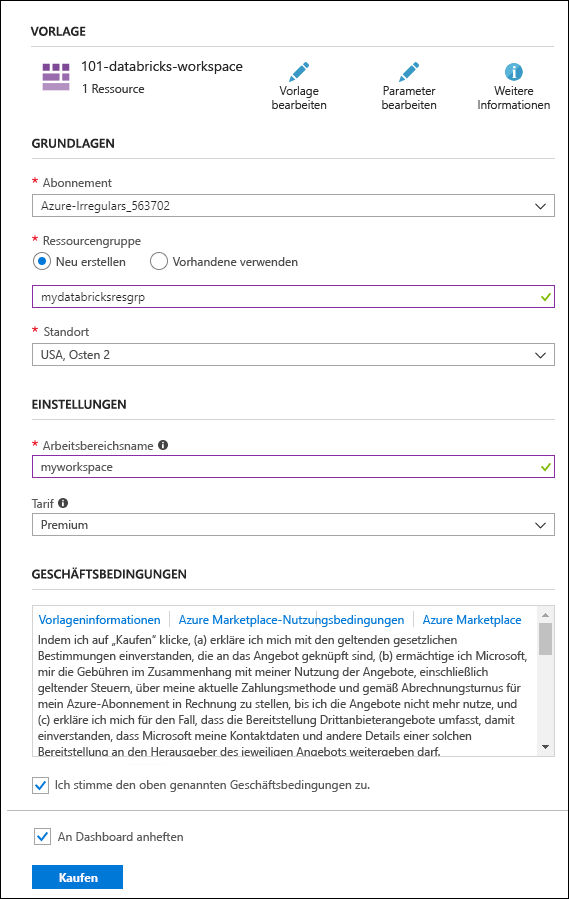
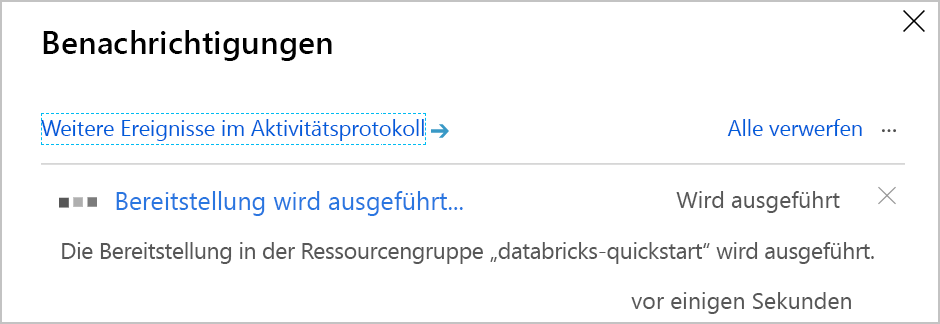

# <a name="quickstart-run-a-spark-job-on-azure-databricks-using-the-azure-resource-manager-template"></a>Schnellstart: Ausführen eines Spark-Auftrags in Azure Databricks mithilfe der Azure Resource Manager-Vorlage

In dieser Schnellstartanleitung erfahren Sie, wie Sie mithilfe der Azure Resource Manager-Vorlage einen Azure Databricks-Arbeitsbereich erstellen. Den Arbeitsbereich verwenden Sie dann, um einen Apache Spark-Cluster zu erstellen und einen Spark-Auftrag im Databricks-Cluster auszuführen. Weitere Informationen zu Azure Databricks finden Sie unter [Was ist Azure Databricks?](what-is-azure-databricks.md)

In dieser Schnellstartanleitung analysieren Sie im Rahmen des Spark-Auftrags die Abonnementdaten eines Radiosenders, um Erkenntnisse zur Nutzung kostenloser/kostenpflichtiger Angebote auf der Grundlage demografischer Daten zu erhalten.

Wenn Sie kein Azure-Abonnement besitzen, können Sie ein [kostenloses Konto](https://azure.microsoft.com/free/) erstellen, bevor Sie beginnen.

## <a name="create-an-azure-databricks-workspace"></a>Erstellen eines Azure Databricks-Arbeitsbereichs

In diesem Abschnitt erstellen Sie mithilfe der Azure Resource Manager-Vorlage einen Azure Databricks-Arbeitsbereich.

1. Klicken Sie auf die folgende Abbildung, um die Vorlage im Azure-Portal zu öffnen:

   <a href="https://portal.azure.com/#create/Microsoft.Template/uri/https%3A%2F%2Fraw.githubusercontent.com%2FAzure%2Fazure-quickstart-templates%2Fmaster%2F101-databricks-workspace%2Fazuredeploy.json" target="_blank"></a>

2. Geben Sie die erforderlichen Werte für die Erstellung des Azure Databricks-Arbeitsbereichs an:

   

   Geben Sie außerdem die folgenden Werte an:

   |Eigenschaft  |BESCHREIBUNG  |
   |---------|---------|
   |**Abonnement**     | Wählen Sie in der Dropdownliste Ihr Azure-Abonnement aus.        |
   |**Ressourcengruppe**     | Geben Sie an, ob Sie eine neue Ressourcengruppe erstellen oder eine vorhandene Ressourcengruppe verwenden möchten. Eine Ressourcengruppe ist ein Container, der verwandte Ressourcen für eine Azure-Lösung enthält. Weitere Informationen finden Sie in der [Übersicht über den Azure Resource Manager](../azure-resource-manager/resource-group-overview.md). |
   |**Location**     | Wählen Sie **USA, Osten 2** aus. Informationen zu weiteren verfügbaren Regionen finden Sie unter [Verfügbare Produkte nach Region](https://azure.microsoft.com/regions/services/).        |
   |**Arbeitsbereichsname**     | Geben Sie einen Namen für Ihren Databricks-Arbeitsbereich an.        |
   |**Tarif**     |  Wählen Sie zwischen **Standard** und **Premium**. Weitere Informationen zu diesen Tarifen, finden Sie unter [Azure Databricks – Preise](https://azure.microsoft.com/pricing/details/databricks/).       |

3. Aktivieren Sie die Optionen **Ich stimme den oben genannten Geschäftsbedingungen zu** und **An Dashboard anheften**, und klicken Sie anschließend auf **Kaufen**.

4. Die Erstellung des Arbeitsbereichs dauert einige Minuten. Während der Erstellung des Arbeitsbereichs wird im Portal auf der rechten Seite die Kachel **Bereitstellung für "Azure Databricks" wird gesendet** angezeigt. Möglicherweise müssen Sie im Dashboard nach rechts scrollen, um die Kachel zu sehen. Am oberen Bildschirmrand wird auch eine Statusanzeige angezeigt. Sie können den Status beider Bereiche beobachten.

   

## <a name="create-a-spark-cluster-in-databricks"></a>Erstellen eines Spark-Clusters in Databricks

1. Navigieren Sie im Azure-Portal zum erstellten Databricks-Arbeitsbereich, und klicken Sie auf **Launch Workspace** (Arbeitsbereich starten).

2. Sie werden zum Azure Databricks-Portal weitergeleitet. Klicken Sie im Portal auf **Cluster**.

   

3. Geben Sie auf der Seite **Neuer Cluster** die erforderlichen Werte an, um einen Cluster zu erstellen.

   

   Übernehmen Sie alle anderen Standardwerte bis auf Folgendes:

   * Geben Sie einen Namen für den Cluster ein.
   * Erstellen Sie im Rahmen dieses Artikels einen Cluster mit der Runtime **4.0**.
   * Aktivieren Sie das Kontrollkästchen **Terminate after \_\_ minutes of inactivity** (Nach \_\_ Minuten Inaktivität beenden). Geben Sie an, nach wie vielen Minuten der Cluster beendet werden soll, wenn er nicht verwendet wird.

   Klicken Sie auf **Cluster erstellen**. Sobald der Cluster ausgeführt wird, können Sie Notizbücher an den Cluster anfügen und Spark-Aufträge ausführen.

Weitere Informationen zum Erstellen von Clustern in Azure Databricks finden Sie unter [Creating Clusters](https://docs.azuredatabricks.net/user-guide/clusters/create.html) (Erstellen von Clustern).

## <a name="run-a-spark-sql-job"></a>Ausführen eines Spark SQL-Auftrags

Bevor Sie mit diesem Abschnitt beginnen, müssen folgende Schritte ausgeführt werden:

* [Erstellen Sie ein Azure Blob Storage-Konto.](../storage/common/storage-quickstart-create-account.md)
* Laden Sie eine JSON-Beispieldatei von [GitHub](https://github.com/Azure/usql/blob/master/Examples/Samples/Data/json/radiowebsite/small_radio_json.json) herunter.
* Laden Sie die JSON-Beispieldatei in das Azure Blob Storage-Konto hoch, das Sie erstellt haben. Dateien können mit dem [Microsoft Azure Storage-Explorer](../vs-azure-tools-storage-manage-with-storage-explorer.md) hochgeladen werden.

Gehen Sie wie folgt vor, um ein Notizbuch in Databricks zu erstellen, das Notizbuch zum Lesen von Daten aus einem Azure Blob Storage-Konto zu konfigurieren und anschließend einen Spark SQL-Auftrag für die Daten auszuführen:

1. Klicken Sie im linken Bereich auf **Arbeitsbereich**. Klicken Sie im Dropdownmenü **Arbeitsbereich** auf **Erstellen** > **Notizbuch**.

   

2. Geben Sie im Dialogfeld **Notizbuch erstellen** einen Namen ein, wählen Sie **Scala** als Sprache aus, und wählen Sie den zuvor erstellten Spark-Cluster aus.

   

   Klicken Sie auf **Create**.

3. In diesem Schritt ordnen Sie das Azure Storage-Konto dem Databricks-Spark-Cluster zu. Diese Zuordnung kann auf zwei Arten erreicht werden. Sie können das Azure Storage-Konto in das Databricks-Dateisystem (Databricks Filesystem, DBFS) einbinden oder direkt über die erstellte Anwendung auf das Azure Storage-Konto zugreifen.

   > [!IMPORTANT]
   >In diesem Artikel wird der **Ansatz zum Einbinden des Speichers mit DBFS** verwendet. Bei diesem Ansatz wird sichergestellt, dass der eingebundene Speicher dem Clusterdateisystem selbst zugewiesen wird. Daher kann jede Anwendung, die auf den Cluster zugreift, auch den zugeordneten Speicher nutzen. Der Ansatz für Direktzugriff ist auf die Anwendung beschränkt, über die Sie den Zugriff konfigurieren.
   >
   > Um die Einbindung zu verwenden, müssen Sie einen Spark-Cluster mit der Databricks-Runtimeversion **4.0** erstellen. Diese Version haben Sie auch in diesem Artikel ausgewählt.

   Ersetzen Sie im folgenden Codeausschnitt `{YOUR CONTAINER NAME}`, `{YOUR STORAGE ACCOUNT NAME}` und `{YOUR STORAGE ACCOUNT ACCESS KEY}` durch die entsprechenden Werte für Ihr Azure Storage-Konto. Fügen Sie den Codeausschnitt in eine leere Zelle des Notizbuchs ein, und drücken Sie UMSCHALT+EINGABE, um die Codezelle auszuführen.

   * **Einbinden des Speicherkontos mit DBFS (empfohlen)**. In diesem Codeausschnitt wird der Pfad des Azure Storage-Konto in `/mnt/mypath` eingebunden. Daher muss zukünftig beim Zugreifen auf das Azure Storage-Konto nicht der vollständige Pfad angegeben werden. Sie können nur `/mnt/mypath` verwenden.

          dbutils.fs.mount(
            source = "wasbs://{YOUR CONTAINER NAME}@{YOUR STORAGE ACCOUNT NAME}.blob.core.windows.net/",
            mountPoint = "/mnt/mypath",
            extraConfigs = Map("fs.azure.account.key.{YOUR STORAGE ACCOUNT NAME}.blob.core.windows.net" -> "{YOUR STORAGE ACCOUNT ACCESS KEY}"))

   * **Direktes Zugreifen auf das Speicherkonto**

          spark.conf.set("fs.azure.account.key.{YOUR STORAGE ACCOUNT NAME}.blob.core.windows.net", "{YOUR STORAGE ACCOUNT ACCESS KEY}")

    Eine Anleitung zum Abrufen des Speicherkontoschlüssels finden Sie unter [Informationen zu Azure-Speicherkonten](../storage/common/storage-account-manage.md#access-keys).

   > [!NOTE]
   > Sie können auch Azure Data Lake Store mit einem Spark-Cluster in Azure Databricks verwenden. Eine entsprechende Anleitung finden Sie unter [Azure Data Lake Store](https://go.microsoft.com/fwlink/?linkid=864084).

4. Führen Sie eine SQL-Anweisung aus, um eine temporäre Tabelle mit Daten aus der JSON-Beispieldatendatei **small_radio_json.json** zu erstellen. Ersetzen Sie die Platzhalterwerte im folgenden Codeausschnitt durch den Namen Ihres Containers bzw. Ihres Speicherkontos. Fügen Sie den Codeausschnitt in eine Codezelle des Notizbuchs ein, und drücken Sie UMSCHALT+EINGABE. In dem Codeausschnitt gibt `path` den Speicherort der JSON-Datei an, die Sie in Ihr Azure-Speicherkonto hochgeladen haben.

   ```sql
   %sql
   DROP TABLE IF EXISTS radio_sample_data;
   CREATE TABLE radio_sample_data
   USING json
   OPTIONS (
    path "/mnt/mypath/small_radio_json.json"
   )
   ```

   Nach erfolgreicher Ausführung des Befehls liegen alle Daten aus der JSON-Datei als Tabelle im Databricks-Cluster vor.

   Der Befehl `%sql` ermöglicht die Ausführung von SQL-Code über das Notizbuch, auch wenn es sich um ein Notizbuch eines anderen Typs handelt. Weitere Informationen finden Sie unter [Mixing languages in a notebook](https://docs.azuredatabricks.net/user-guide/notebooks/index.html#mixing-languages-in-a-notebook) (Mischen von Sprachen in einem Notizbuch).

5. Zum besseren Verständnis der ausgeführten Abfrage sehen wir uns eine Momentaufnahme der JSON-Beispieldaten an. Fügen Sie den folgenden Codeausschnitt in die Codezelle ein, und drücken Sie **UMSCHALT+EINGABE**.

   ```sql
   %sql
   SELECT * from radio_sample_data
   ```

6. Sie erhalten eine tabellarische Ausgabe wie im folgenden Screenshot, der allerdings nur einen Teil der Spalten zeigt:

   

   Neben verschiedenen anderen Details enthalten die Beispieldaten das Geschlecht der Zielgruppe eines Radiokanals (Spalte **gender**) und die Information, ob die jeweilige Person ein kostenloses oder ein kostenpflichtiges Abonnement nutzt (Spalte **level**).

7. Sie können nun eine visuelle Darstellung dieser Daten erstellen, die zeigt, wie viele Benutzer des jeweiligen Geschlechts über kostenlose Konten verfügen und bei wie vielen es sich um zahlende Abonnenten handelt. Klicken Sie im unteren Bereich der tabellarischen Ausgabe auf das Symbol **Balkendiagramm** und anschließend auf **Zeichnungsoptionen**.

   

8. Platzieren Sie per Drag & Drop Werte in **Customize Plot** (Zeichnung anpassen), wie im folgenden Screenshot zu sehen.

   

   * Legen Sie **Schlüssel** auf **gender** fest.
   * Legen Sie **Series groupings** (Reihengruppierungen) auf **level** fest.
   * Legen Sie **Werte** auf **level** fest.
   * Legen Sie **Aggregation** auf **ANZAHL** fest.

   Klicken Sie auf **Anwenden**.

9. Die Ausgabe zeigt die visuelle Darstellung wie im folgenden Screenshot dargestellt:

   

## <a name="clean-up-resources"></a>Bereinigen von Ressourcen

Am Ende dieses Artikels können Sie den Cluster beenden. Klicken Sie hierzu im linken Bereich des Azure Databricks-Arbeitsbereichs auf **Cluster**. Bewegen Sie den Cursor zum Beenden des Clusters auf die Auslassungspunkte in der Spalte **Aktionen**, und klicken Sie auf das Symbol **Beenden**.


Wenn Sie den Cluster nicht manuell beenden, wird er automatisch beendet, sofern Sie bei der Erstellung des Clusters das Kontrollkästchen **Terminate after \_\_ minutes of inactivity** (Nach \_\_ Minuten Inaktivität beenden) aktiviert haben. Der Cluster wird dann automatisch beendet, wenn er für den angegebenen Zeitraum inaktiv war.

## <a name="next-steps"></a>Nächste Schritte

In diesem Artikel haben Sie einen Spark-Cluster in Azure Databricks erstellt und einen Spark-Auftrag mit Daten in Azure Storage ausgeführt. Unter [Spark Data Sources](https://docs.azuredatabricks.net/spark/latest/data-sources/index.html) (Spark-Datenquellen) erfahren Sie, wie Sie Daten aus anderen Datenquellen in Azure Databricks importieren. Darüber hinaus können Sie sich die Resource Manager-Vorlage zum [Erstellen eines Azure Databricks-Arbeitsbereichs mit benutzerdefinierter VNet-Adresse](https://github.com/Azure/azure-quickstart-templates/tree/master/101-databricks-workspace-with-custom-vnet-address) ansehen.

Im nächsten Artikel erfahren Sie, wie Sie unter Verwendung von Azure Databricks einen ETL-Vorgang zum Extrahieren, Transformieren und Laden von Daten ausführen.

> [!div class="nextstepaction"]
> [Extrahieren, Transformieren und Laden von Daten mithilfe von Azure Databricks](databricks-extract-load-sql-data-warehouse.md)
