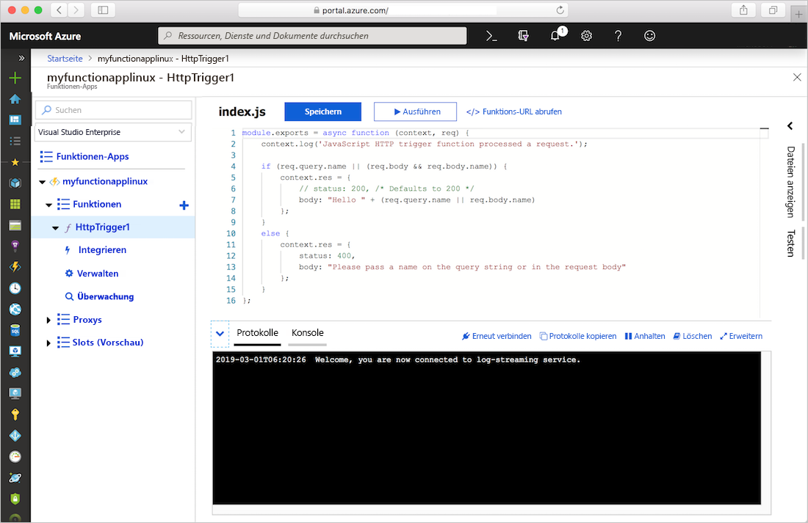
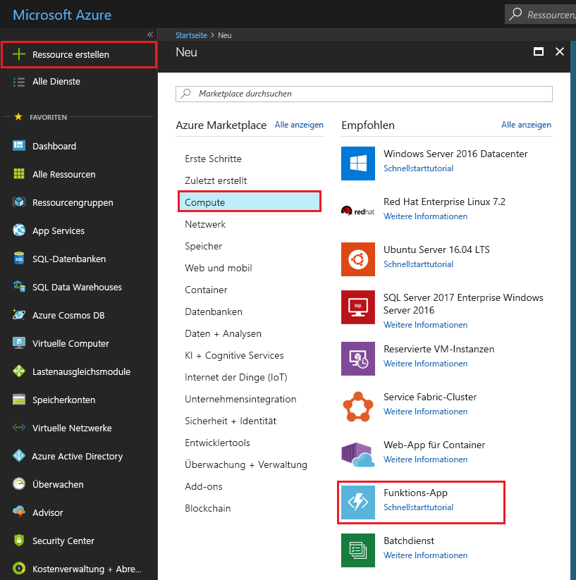
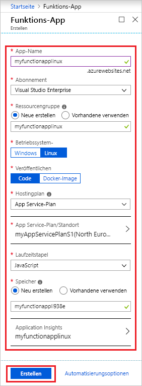
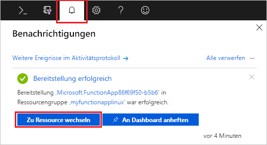
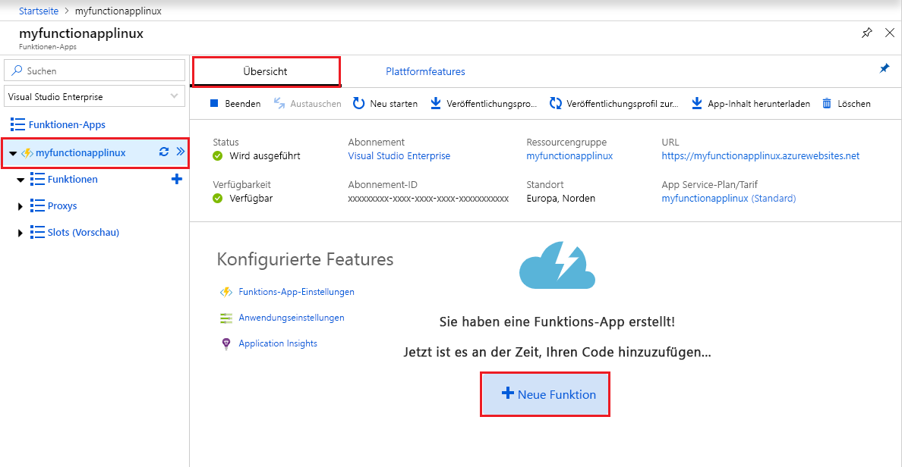
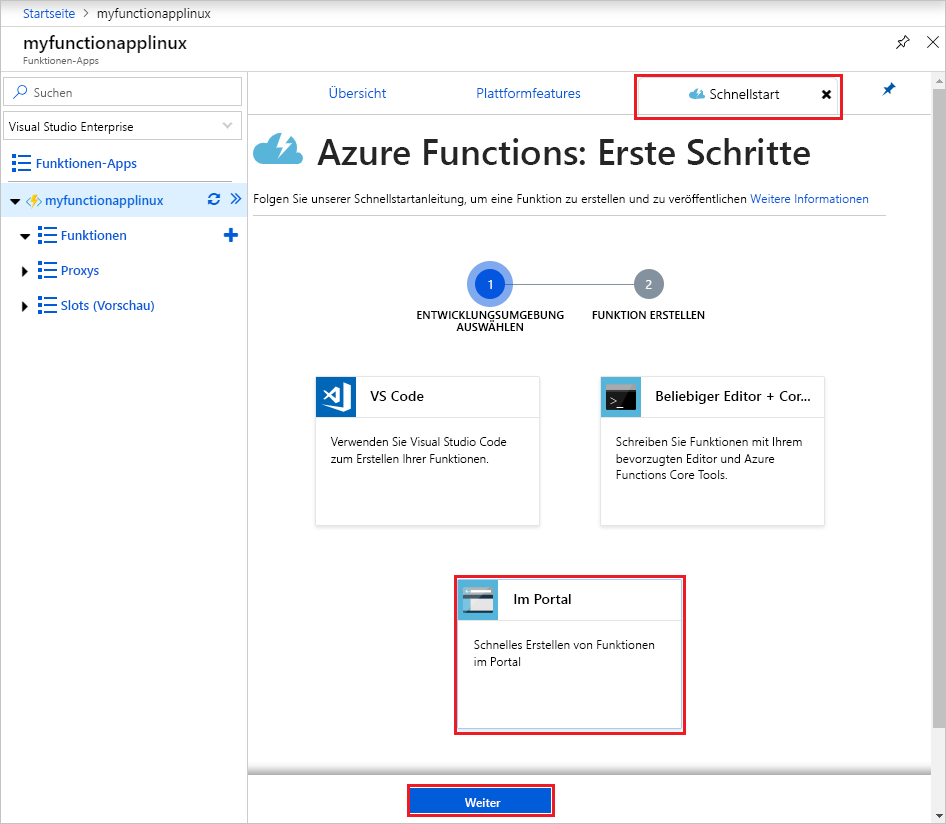
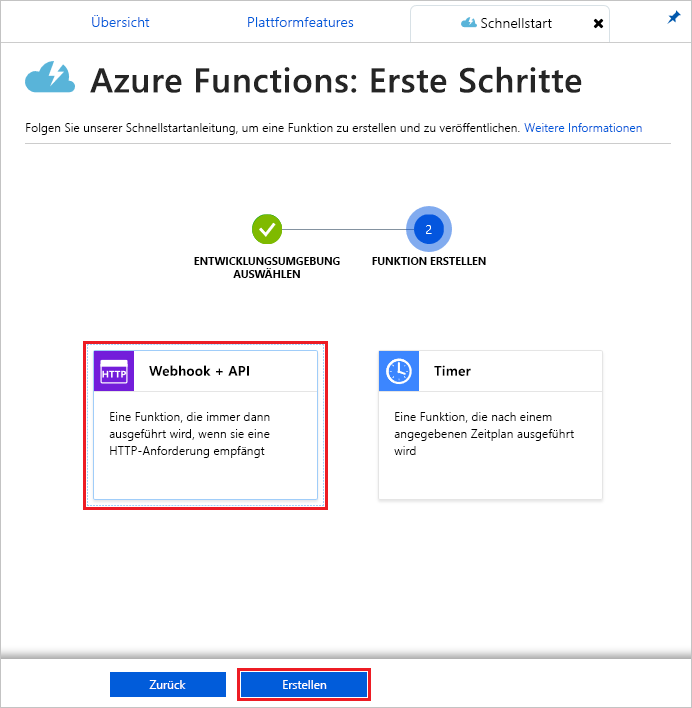
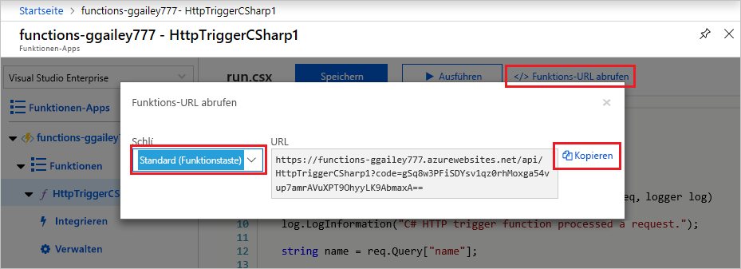
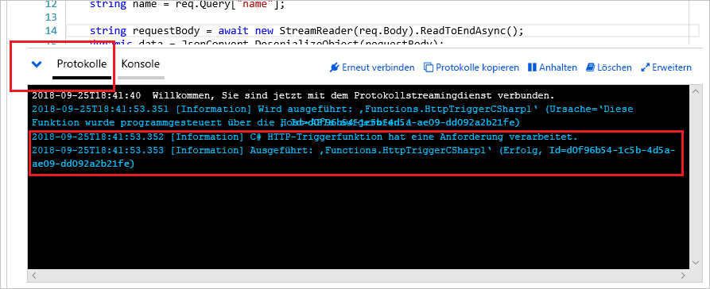

# Erstellen einer Funktions-App unter Linux in einem Azure App Service-Plan

Mit Azure Functions können Sie Funktionen unter Linux in einem Azure App Service-Standardcontainer hosten. In diesem Artikel wird Schritt für Schritt die Verwendung des [Azure-Portals](https://portal.azure.com) zum Erstellen einer unter Linux gehosteten Funktions-App beschrieben, die in einem [App Service-Plan](functions-scale.md#app-service-plan) ausgeführt wird. Sie können auch [einen eigenen benutzerdefinierten Container nutzen](functions-create-function-linux-custom-image.md).

[!INCLUDE [quickstarts-free-trial-note](../../includes/quickstarts-free-trial-note.md)]

## Anmelden bei Azure

Melden Sie sich unter <https://portal.azure.com> mit Ihrem Azure-Konto beim Azure-Portal an.

## Erstellen einer Funktionen-App

Sie müssen über eine Funktions-App verfügen, die die Ausführung Ihrer Funktionen unter Linux hostet. Die Funktions-App bietet eine Umgebung für die Ausführung des Funktionscodes. Mit ihr können Sie Funktionen zu logischen Einheiten gruppieren. Dies erleichtert die Verwaltung, Bereitstellung und Freigabe von Ressourcen. In diesem Artikel erstellen Sie bei der Erstellung Ihrer Funktions-App einen App Service-Plan.

1. Wählen Sie in der linken oberen Ecke des Azure-Portals die Schaltfläche **Ressource erstellen** und dann **Compute** > **Funktions-App**.

    

2. Verwenden Sie die in der Tabelle unter der Abbildung angegebenen Einstellungen für die Funktions-App.

    

    | Einstellung      | Vorgeschlagener Wert  | BESCHREIBUNG                                        |
    | ------------ |  ------- | -------------------------------------------------- |
    | **App-Name** | Global eindeutiger Name | Der Name, der Ihre neue Funktionen-App bezeichnet Gültige Zeichen sind `a-z`, `0-9` und `-`.  | 
    | **Abonnement** | Ihr Abonnement | Das Abonnement, unter dem diese neue Funktions-App erstellt wird. | 
    | **[Ressourcengruppe](../azure-resource-manager/management/overview.md)** |  myResourceGroup | Der Name der neuen Ressourcengruppe, in der die Funktionen-App erstellt wird |
    | **Betriebssystem** | Linux | Die Funktions-App wird unter Linux ausgeführt. |
    | **Veröffentlichen** | Code | Der standardmäßige Linux-Container für Ihren **Runtimestapel** wird verwendet. Sie müssen lediglich den Projektcode Ihrer Funktions-App bereitstellen. Eine weitere Option ist die Veröffentlichung eines benutzerdefinierten [Docker-Images](functions-create-function-linux-custom-image.md). |
    | **[Hostingplan](functions-scale.md)** | App Service-Plan | Der Hostingplan, der definiert, wie Ihre Ressourcen der Funktionen-App zugewiesen werden Bei der Ausführung in einem App Service-Plan können Sie die [Skalierung Ihrer Funktions-App](functions-scale.md) steuern.  |
    | **App Service-Plan/Standort** | Erstellen eines Plans | Wählen Sie **Neu erstellen**, und geben Sie einen Namen für den **App Service-Plan** an. Wählen Sie einen **Standort** in einer [Region](https://azure.microsoft.com/regions/) in Ihrer Nähe oder in der Nähe anderer Dienste aus, auf die Ihre Funktionen zugreifen. Wählen Sie Ihren bevorzugten **[Tarif](https://azure.microsoft.com/pricing/details/app-service/linux/)** aus.  Es ist nicht möglich, unter demselben App Service-Plan sowohl Linux- als auch Windows-Funktions-Apps auszuführen. |
    | **Laufzeitstapel** | Bevorzugte Sprache | Wählen Sie eine Runtime aus, die Ihre bevorzugte Programmiersprache für Funktionen unterstützt. Wählen Sie **.NET** für C#- und F#-Funktionen aus. |
    | **[Storage](../storage/common/storage-quickstart-create-account.md)** |  Global eindeutiger Name |  Erstellen Sie ein Speicherkonto, das von Ihrer Funktions-App verwendet wird. Speicherkontonamen müssen zwischen 3 und 24 Zeichen lang sein und dürfen nur Zahlen und Kleinbuchstaben enthalten. Sie können auch ein vorhandenes Konto verwenden, das die [Anforderungen an das Speicherkonto](functions-scale.md#storage-account-requirements) erfüllen muss. |
    | **[Application Insights](functions-monitoring.md)** | Enabled | Application Insights ist standardmäßig deaktiviert. Es wird empfohlen, die Application Insights-Integration jetzt zu aktivieren und einen Hostingstandort in der Nähe des Standorts Ihres App Service-Plans zu wählen. Wenn Sie dies später erledigen möchten, helfen Ihnen die Informationen unter [Überwachen von Azure Functions](functions-monitoring.md) weiter.  |

3. Klicken Sie auf **Erstellen**, um die Funktionen-App bereitzustellen.

4. Wählen Sie oben rechts im Portal das Benachrichtigungssymbol aus, und achten Sie auf die Meldung **Bereitstellung erfolgreich**.

    

5. Wählen Sie **Zu Ressource wechseln**, um Ihre neue Funktionen-App anzuzeigen.

Erstellen Sie als Nächstes in der neuen Funktionen-App eine Funktion. Nachdem Ihre Funktions-App bereitgestellt wurde, kann es trotzdem noch einige Minuten dauern, bis die Initialisierung vollständig abgeschlossen ist.

## Erstellen einer Funktion mit Auslösung per HTTP

In diesem Abschnitt wird veranschaulicht, wie Sie im Portal in Ihrer neuen Funktions-App eine Funktion erstellen.

> [!NOTE]
> Die Entwicklungsoberfläche im Portal kann zum Ausprobieren von Azure Functions nützlich sein. Für die meisten Szenarien ist es ratsam, Ihre Funktionen lokal zu entwickeln und das Projekt in Ihrer Funktions-App zu veröffentlichen, indem Sie entweder [Visual Studio Code](functions-create-first-function-vs-code.md#create-an-azure-functions-project) oder die [Azure Functions Core Tools](functions-run-local.md#create-a-local-functions-project) verwenden.  

1. Wählen Sie in Ihrer neuen Funktions-App die Registerkarte **Übersicht** und nach dem vollständigen Laden dann **+ Neue Funktion**.

    

1. Wählen Sie auf der Registerkarte **Schnellstart** die Option **Im Portal** und dann **Weiter**.

    

1. Wählen Sie **Webhook + API** aus, und klicken Sie anschließend auf **Erstellen**.

    

Eine Funktion wird unter Verwendung einer sprachspezifischen Vorlage für eine Funktion mit HTTP-Trigger erstellt.

Nun können Sie die neue Funktion ausführen, indem Sie eine HTTP-Anforderung senden.

## Testen der Funktion

1. Klicken Sie in der neuen Funktion rechts oben auf **</> Funktions-URL abrufen**, wählen Sie **default (Function key)** (Standard (Funktionsschlüssel)) aus, und klicken Sie dann auf **Kopieren**. 

    

2. Fügen Sie die URL der Funktion in die Adressleiste Ihres Browsers ein. Fügen Sie den Wert der Abfragezeichenfolge `&name=<yourname>` am Ende der URL hinzu, und drücken Sie die Taste `Enter` auf Ihrer Tastatur, um die Anforderung auszuführen. Daraufhin sollte die von der Funktion zurückgegebene Antwort im Browser angezeigt werden.  

    Das folgende Beispiel zeigt die Antwort im Browser:

    

    Die Anfrage-URL enthält einen Schlüssel, der standardmäßig über HTTP auf Ihre Funktion zugreifen muss.

3. Wenn Ihre Funktion ausgeführt wird, werden Nachverfolgungsinformationen in die Protokolle geschrieben. Kehren Sie zu Ihrer Funktion im Portal zurück, und klicken Sie am unteren Bildschirmrand auf den Pfeil, um **Protokolle** zu erweitern und die Nachverfolgungsausgabe der vorherigen Ausführung anzuzeigen.

   

## Bereinigen von Ressourcen

[!INCLUDE [Clean-up resources](../../includes/functions-quickstart-cleanup.md)]

## Nächste Schritte

Sie haben eine Funktionen-App mit einer einfachen Funktion mit Auslösung per HTTP erstellt.  

[!INCLUDE [Next steps note](../../includes/functions-quickstart-next-steps.md)]

Weitere Informationen finden Sie unter [HTTP- und Webhookbindungen in Azure Functions](functions-bindings-http-webhook.md).
