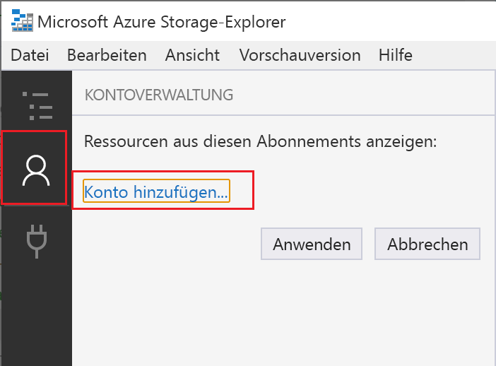
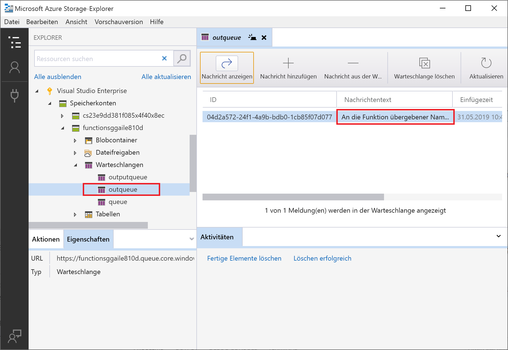

# <a name="connect-azure-functions-to-azure-storage-using-visual-studio-code"></a>Verbinden von Azure Functions mit Azure Storage mithilfe von Visual Studio Code

[!INCLUDE [functions-add-storage-binding-intro](../../includes/functions-add-storage-binding-intro.md)]

In diesem Artikel wird beschrieben, wie Sie die Funktion, die Sie im [vorherigen Schnellstartartikel](functions-create-first-function-vs-code.md) erstellt haben, mithilfe von Visual Studio Code mit Azure Storage verbinden. Die Ausgabebindung, die Sie dieser Funktion hinzufügen, schreibt Daten aus der HTTP-Anforderung in eine Nachricht in einer Azure Queue Storage-Warteschlange. 

Die meisten Bindungen erfordern eine gespeicherte Verbindungszeichenfolge, die Functions verwendet, um auf den gebundenen Dienst zuzugreifen. Um dies zu vereinfachen, verwenden Sie das Speicherkonto, das Sie mit Ihrer Funktions-App erstellt haben. Die Verbindung mit diesem Konto ist bereits in einer App-Einstellung namens `AzureWebJobsStorage` gespeichert.  

## <a name="configure-your-local-environment"></a>Konfigurieren Ihrer lokalen Umgebung

Zunächst müssen Sie die folgenden Schritte ausführen:

* Installieren Sie die [Azure Storage-Erweiterung für Visual Studio Code](https://marketplace.visualstudio.com/items?itemName=ms-azuretools.vscode-azurestorage).

* Installieren Sie [Azure Storage-Explorer](https://storageexplorer.com/). Storage-Explorer ist ein Tool, mit dem Sie Warteschlangennachrichten überprüfen können, die von der Ausgabebindung generiert werden. Storage-Explorer wird unter macOS-, Windows- und Linux-basierten Betriebssystemen unterstützt.

::: zone pivot="programming-language-csharp"
* Installieren Sie [.NET Core-CLI-Tools](https://docs.microsoft.com/dotnet/core/tools/?tabs=netcore2x).
::: zone-end

* Führen Sie die Schritte in [Teil 1 des Schnellstarts für Visual Studio Code](functions-create-first-function-vs-code.md) aus. 

In diesem Artikel wird davon ausgegangen, dass Sie bereits über Visual Studio Code bei Ihrem Azure-Abonnement angemeldet sind. Sie können sich anmelden, indem Sie `Azure: Sign In` in der Befehlspalette ausführen. 

## <a name="download-the-function-app-settings"></a>Herunterladen der Funktions-App-Einstellungen

Im [vorherigen Schnellstartartikel](functions-create-first-function-vs-code.md) haben Sie zusammen mit dem erforderlichen Storage-Konto eine Funktions-App in Azure erstellt. Die Verbindungszeichenfolge für dieses Konto wird sicher in App-Einstellungen in Azure gespeichert. In diesem Artikel schreiben Sie Nachrichten in eine Speicherwarteschlange in demselben Konto. Um eine Verbindung mit Ihrem Speicherkonto herzustellen, wenn die Funktion lokal ausgeführt wird, müssen Sie App-Einstellungen in die Datei „local.settings.json“ herunterladen. 

1. Drücken Sie die F1-Taste, um die Befehlspalette zu öffnen. Suchen Sie dann den Befehl `Azure Functions: Download Remote Settings....`, und führen Sie ihn aus. 

1. Wählen Sie die im vorherigen Artikel erstellte Funktions-App aus. Wählen Sie **Ja, alle** aus, um die vorhandenen lokalen Einstellungen zu überschreiben. 

    > [!IMPORTANT]  
    > Da sie Geheimnisse enthält, wird die Datei „local.settings.json“ nie veröffentlicht und von der Quellcodeverwaltung ausgeschlossen.

1. Kopieren Sie den Wert `AzureWebJobsStorage`, bei dem es sich um den Schlüssel für den Verbindungszeichenfolgenwert des Storage-Kontos handelt. Sie verwenden diese Verbindung, um sicherzustellen, dass die Ausgabebindung wie erwartet funktioniert.

## <a name="register-binding-extensions"></a>Registrieren von Bindungserweiterungen

Da Sie eine Queue Storage-Ausgabebindung verwenden, müssen Sie vor dem Ausführen des Projekts die Storage-Bindungserweiterung installieren. 

::: zone pivot="programming-language-javascript,programming-language-typescript,programming-language-python,programming-language-powershell,programming-language-java"

Ihr Projekt wurde für die Verwendung von [Erweiterungsbündeln](functions-bindings-register.md#extension-bundles) konfiguriert, wodurch automatisch ein vordefinierter Satz von Erweiterungspaketen installiert wird. 

Erweiterungspakete sind in der Datei „host.json“ im Stammverzeichnis des Projekts aktiviert. Dies sieht etwa wie folgt aus:

:::code language="json" source="~/functions-quickstart-java/functions-add-output-binding-storage-queue/host.json":::

::: zone-end

::: zone pivot="programming-language-csharp"

Mit Ausnahme von HTTP- und Timertriggern werden Bindungen als Erweiterungspakete implementiert. Führen Sie den folgenden [dotnet add package](/dotnet/core/tools/dotnet-add-package)-Befehl im Terminalfenster aus, um Ihrem Projekt das Storage-Erweiterungspaket hinzuzufügen.

```bash
dotnet add package Microsoft.Azure.WebJobs.Extensions.Storage --version 3.0.4
```

::: zone-end

Dann können Sie dem Projekt die Storage-Ausgabebindung hinzufügen.

## <a name="add-an-output-binding"></a>Hinzufügen einer Ausgabebindung

In Functions muss für jeden Typ von Bindung eine `direction`, ein `type` und ein eindeutiger `name` in der Datei „function.json“ definiert werden. Wie Sie diese Attribute definieren, hängt von der Sprache der Funktions-App ab.

::: zone pivot="programming-language-javascript,programming-language-typescript,programming-language-python,programming-language-powershell,programming-language-java"

[!INCLUDE [functions-add-output-binding-json](../../includes/functions-add-output-binding-json.md)]

::: zone-end

::: zone pivot="programming-language-csharp"

[!INCLUDE [functions-add-storage-binding-csharp-library](../../includes/functions-add-storage-binding-csharp-library.md)]

::: zone-end

::: zone pivot="programming-language-java"

[!INCLUDE [functions-add-output-binding-java](../../includes/functions-add-output-binding-java.md)]

::: zone-end

## <a name="add-code-that-uses-the-output-binding"></a>Hinzufügen von Code, der die Ausgabebindung verwendet

Nachdem die Bindung definiert wurde, können Sie den `name` der Bindung verwenden, um auf sie als Attribut in der Funktionssignatur zuzugreifen. Durch die Verwendung einer Ausgabebindung müssen Sie weder den Azure Storage-SDK-Code für die Authentifizierung verwenden, noch einen Warteschlangenverweis abrufen oder Daten schreiben. Die Functions-Runtime und die Warteschlangenausgabebindung übernehmen diese Aufgaben für Sie.

::: zone pivot="programming-language-javascript"  
[!INCLUDE [functions-add-output-binding-js](../../includes/functions-add-output-binding-js.md)]
::: zone-end  

::: zone pivot="programming-language-typescript"  
[!INCLUDE [functions-add-output-binding-ts](../../includes/functions-add-output-binding-ts.md)]
::: zone-end  

::: zone pivot="programming-language-powershell"

[!INCLUDE [functions-add-output-binding-powershell](../../includes/functions-add-output-binding-powershell.md)]

::: zone-end

::: zone pivot="programming-language-python"

[!INCLUDE [functions-add-output-binding-python](../../includes/functions-add-output-binding-python.md)]

::: zone-end

::: zone pivot="programming-language-csharp"  

[!INCLUDE [functions-add-storage-binding-csharp-library-code](../../includes/functions-add-storage-binding-csharp-library-code.md)]

::: zone-end  

::: zone pivot="programming-language-java"  

[!INCLUDE [functions-add-storage-binding-java-code](../../includes/functions-add-storage-binding-java-code.md)]

[!INCLUDE [functions-add-output-binding-java-test](../../includes/functions-add-output-binding-java-test.md)]

::: zone-end  

<!--- Local testing section --->

::: zone pivot="programming-language-csharp,programming-language-javascript,programming-language-python"

[!INCLUDE [functions-run-function-test-local-vs-code](../../includes/functions-run-function-test-local-vs-code.md)]

::: zone-end

::: zone pivot="programming-language-powershell"

[!INCLUDE [functions-run-function-test-local-vs-code-ps](../../includes/functions-run-function-test-local-vs-code-ps.md)]

::: zone-end

Eine neue Warteschlange mit dem Namen **outqueue** wird in Ihrem Speicherkonto von der Functions-Runtime erstellt, wenn die Ausgabebindung zum ersten Mal verwendet wird. Mit Storage-Explorer überprüfen Sie, ob die Warteschlange zusammen mit der neuen Nachricht erstellt wurde.

::: zone pivot="programming-language-java"  

[!INCLUDE [functions-add-output-binding-java-test](../../includes/functions-add-output-binding-java-test.md)]

::: zone-end

### <a name="connect-storage-explorer-to-your-account"></a>Herstellen einer Storage-Explorer-Verbindung mit Ihrem Konto

Diesen Abschnitt können Sie überspringen, wenn Sie Azure Storage-Explorer bereits installiert und mit Ihrem Azure-Konto verbunden haben.

1. Führen Sie das Tool [Azure Storage Explorer] aus, und wählen Sie das Verbindungssymbol auf der linken Seite und dann **Konto hinzufügen** aus.

    

1. Wählen Sie im Dialogfeld **Verbinden** die Option **Azure-Konto hinzufügen** aus. Wählen Sie Ihre **Azure-Umgebung** und dann **Anmelden** aus. 

    

Nach der erfolgreichen Anmeldung bei Ihrem Konto werden alle mit dem Konto verbundenen Azure-Abonnements angezeigt.

### <a name="examine-the-output-queue"></a>Überprüfen der Ausgabewarteschlange

1. Drücken Sie in Visual Studio Code die F1-Taste, um die Befehlspalette zu öffnen. Suchen Sie dann den Befehl `Azure Storage: Open in Storage Explorer`, führen Sie ihn aus, und wählen Sie den Namen Ihres Storage-Kontos aus. Das Storage-Konto wird in Azure Storage-Explorer geöffnet.  

1. Erweitern Sie den Knoten **Warteschlangen**, und wählen Sie die Warteschlange mit dem Namen **outqueue** aus. 

   Die Warteschlange enthält die Meldung, die die Warteschlangen-Ausgabebindung erstellt hat, als Sie die per HTTP ausgelöste Funktion ausgeführt haben. Wenn Sie die Funktion mit dem `name`-Standardwert *Azure* aufgerufen haben, lautet die Warteschlangenmeldung *Name passed to the function: Azure* (An die Funktion übergebener Name: Azure).

    

1. Führen Sie die Funktion erneut aus, und senden Sie eine andere Anforderung. Daraufhin wird eine neue Nachricht in der Warteschlange angezeigt.  

Nun ist es an der Zeit, die aktualisierte Funktions-App erneut in Azure zu veröffentlichen.

## <a name="redeploy-and-verify-the-updated-app"></a>Erneutes Bereitstellen und Überprüfen der aktualisierten App

1. Drücken Sie in Visual Studio Code die F1-Taste, um die Befehlspalette zu öffnen. Suchen Sie in der Befehlspalette den Befehl `Azure Functions: Deploy to function app...`, und wählen Sie ihn aus.

1. Wählen Sie die im ersten Artikel erstellte Funktions-App aus. Da Sie das Projekt für die gleiche App erneut bereitstellen, wählen Sie **Bereitstellen** aus, um die Warnung zum Überschreiben von Dateien zu schließen.

1. Nach Abschluss der Bereitstellung können Sie die erneut bereitgestellte Funktion wieder mithilfe von cURL oder in einem Browser testen. Fügen Sie wie zuvor die Abfragezeichenfolge `&name=<yourname>` an die URL an, wie im folgenden Beispiel zu sehen:

    ```bash
    curl https://myfunctionapp.azurewebsites.net/api/httptrigger?code=cCr8sAxfBiow548FBDLS1....&name=<yourname>
    ```

1. [Zeigen Sie wieder die Nachricht in der Speicherwarteschlange an](#examine-the-output-queue), um zu überprüfen, ob die Ausgabebindung erneut eine neue Nachricht in der Warteschlange generiert.

## <a name="clean-up-resources"></a>Bereinigen von Ressourcen

*Ressourcen* bezieht sich im Zusammenhang mit Azure auf Funktions-Apps, Funktionen, Speicherkonten und Ähnliches. Sie werden in *Ressourcengruppen* zusammengefasst, und sämtliche Inhalte einer Gruppe können durch Löschen der Gruppe gelöscht werden.

Im Rahmen dieser Schnellstartanleitungen haben Sie Ressourcen erstellt. Für diese Ressourcen fallen je nach [Kontostatus](https://azure.microsoft.com/account/) und [Dienstpreisen](https://azure.microsoft.com/pricing/) unter Umständen Kosten an. Nicht mehr benötigte Ressourcen können wie folgt gelöscht werden:

[!INCLUDE [functions-cleanup-resources-vs-code.md](../../includes/functions-cleanup-resources-vs-code.md)]

## <a name="next-steps"></a>Nächste Schritte

Sie haben Ihre mittels HTTP ausgelöste Funktion so aktualisiert, dass sie Daten in eine Speicherwarteschlange schreibt. Nun können Sie sich ausführlicher über die Entwicklung von Funktionen mit Visual Studio Code informieren:

+ [Entwickeln von Azure Functions mithilfe von Visual Studio Code](functions-develop-vs-code.md)
::: zone pivot="programming-language-csharp"  
+ [Beispiele für vollständige Functions-Projekte in C#](/samples/browse/?products=azure-functions&languages=csharp).
+ [C#-Entwicklerreferenz zu Azure Functions](functions-dotnet-class-library.md)  
::: zone-end 
::: zone pivot="programming-language-javascript"  
+ [Beispiele für vollständige Functions-Projekte in JavaScript](/samples/browse/?products=azure-functions&languages=javascript).
+ [JavaScript-Entwicklerhandbuch für Azure Functions](functions-reference-node.md)  
::: zone-end  
::: zone pivot="programming-language-typescript"  
+ [Beispiele für vollständige Functions-Projekte in TypeScript](/samples/browse/?products=azure-functions&languages=typescript).
+ [TypeScript-Entwicklerhandbuch für Azure Functions](functions-reference-node.md#typescript)  
::: zone-end  
::: zone pivot="programming-language-python"  
+ [Beispiele für vollständige Functions-Projekte in Python](/samples/browse/?products=azure-functions&languages=python).
+ [Python-Entwicklerhandbuch für Azure Functions](functions-reference-python.md)  
::: zone-end  
::: zone pivot="programming-language-powershell"  
+ [Beispiele für vollständige Functions-Projekte in PowerShell](/samples/browse/?products=azure-functions&languages=azurepowershell).
+ [PowerShell-Entwicklerhandbuch für Azure Functions](functions-reference-powershell.md) 
::: zone-end
+ [Konzepte für Azure Functions-Trigger und -Bindungen](functions-triggers-bindings.md)
+ [Azure Functions – Preise](https://azure.microsoft.com/pricing/details/functions/)
+ [Abschätzen der Kosten des Verbrauchstarifs](functions-consumption-costs.md)
