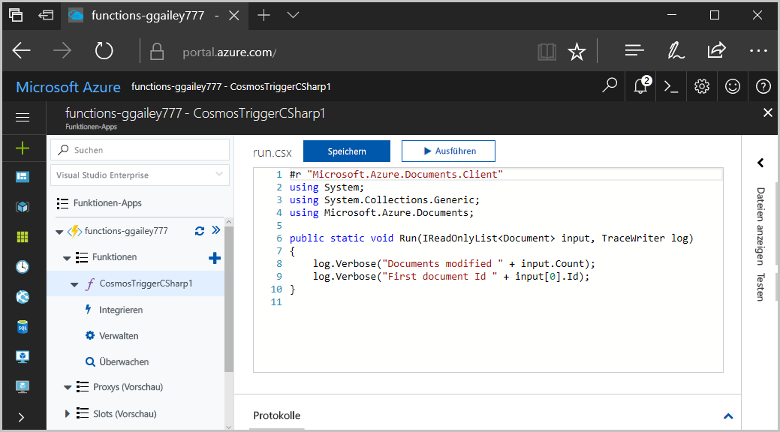
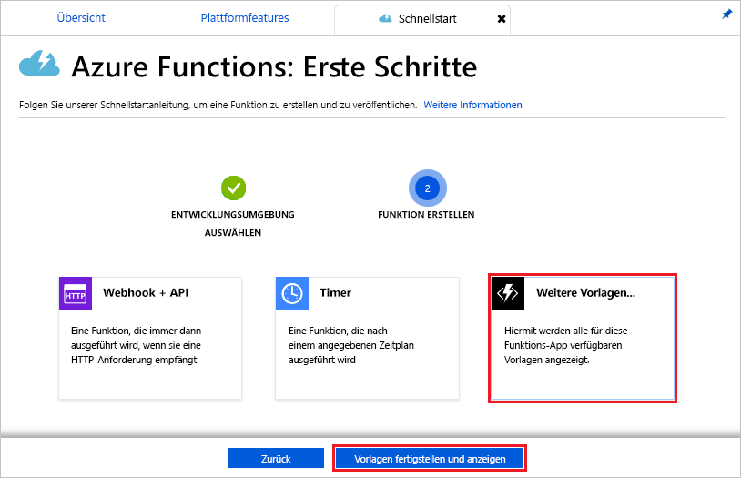
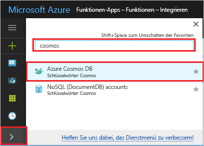

# Erstellen einer durch Azure Cosmos DB ausgelösten Funktion

Informationen zum Erstellen einer Funktion, die ausgelöst wird, wenn in Azure Cosmos DB einer Datenbank Daten hinzugefügt oder Daten in ihr geändert werden. Weitere Informationen zu Azure Cosmos DB finden Sie unter [Azure Cosmos DB: Serverloses Datenbank-Computing mithilfe von Azure Functions](..\cosmos-db\serverless-computing-database.md).

## Voraussetzungen

Für dieses Tutorial benötigen Sie Folgendes:

+ Wenn Sie kein Azure-Abonnement besitzen, können Sie ein [kostenloses Konto](https://azure.microsoft.com/free/?WT.mc_id=A261C142F) erstellen, bevor Sie beginnen.

[!INCLUDE [functions-portal-favorite-function-apps](../../includes/functions-portal-favorite-function-apps.md)]

## Erstellen einer Azure Function-App

[!INCLUDE [Create function app Azure portal](../../includes/functions-create-function-app-portal.md)]

Erstellen Sie als Nächstes in der neuen Funktionen-App eine Funktion.

## Erstellen eines Azure Cosmos DB-Triggers

1. Erweitern Sie die Funktionen-App, und klicken Sie auf die Schaltfläche **+** neben **Functions**. Wenn dies die erste Funktion in Ihrer Funktionen-App ist, wählen Sie **Benutzerdefinierte Funktion**. Hiermit wird der vollständige Satz von Funktionsvorlagen angezeigt.

    

2. Geben Sie im Suchfeld `cosmos` ein, und wählen Sie dann Ihre gewünschte Sprache für die Azure Cosmos DB-Triggervorlage aus.

    

3. Konfigurieren Sie den neuen Trigger mit den Einstellungen, die in der Tabelle unter der folgenden Abbildung enthalten sind.

    
    
    | Einstellung      | Empfohlener Wert  | Beschreibung                                |
    | ------------ | ---------------- | ------------------------------------------ |
    | **Name** | Standard | Verwenden Sie den von der Vorlage vorgeschlagenen Standardfunktionsnamen. |
    | **Sammlungsname** | Items | Name der zu überwachenden Sammlung. |
    | **Erstellen der Leasesammlung, wenn sie nicht vorhanden ist** | Aktiviert | Die Sammlung ist noch nicht vorhanden und muss erstellt werden. |
    | **Datenbankname** | Aufgaben | Name der Datenbank mit der zu überwachenden Sammlung. |

4. Wählen Sie neben **Azure Cosmos DB-Kontoverbindung** die Option **Neu** und anschließend ein bestehendes Cosmos DB-Konto oder **+ Neu erstellen** aus. 
 
    

6. Wenn Sie ein neues Cosmos DB-Konto erstellen, verwenden Sie die **Neues Konto**-Einstellungen wie in der Tabelle angegeben.

    | Einstellung      | Empfohlener Wert  | BESCHREIBUNG                                |
    | ------------ | ---------------- | ------------------------------------------ |
    | **ID** | Name der Datenbank | Eindeutige ID für die Azure Cosmos DB-Datenbank  |
    | **API** | SQL (DocumentDB) | In diesem Thema wird die Dokumentdatenbank-API verwendet.  |
    | **Abonnement** | Azure-Abonnement | Das Abonnement, unter dem dieses neue Cosmos DB-Konto erstellt wird  |
    | **Ressourcengruppe** | myResourceGroup |  Verwenden Sie die vorhandene Ressourcengruppe, die Ihre Funktions-App enthält. |
    | **Location**  | Europa, Westen | Wählen Sie einen Standort in der Nähe Ihrer Funktions-App oder in der Nähe anderer Apps aus, die die gespeicherten Dokumente verwenden.  |

6. Klicken Sie auf **OK**, um die Datenbank zu erstellen. Die Datenbankerstellung dauert unter Umständen einige Minuten. Nach Abschluss der Datenbankerstellung wird die Datenbankverbindungszeichenfolge als Einstellung der Funktions-App gespeichert. Der Name dieser App-Einstellung wird in **Azure Cosmos DB-Kontoverbindung** eingefügt. 

7. Klicken Sie auf **Erstellen**, um Ihre durch Azure Cosmos DB ausgelöste Funktion zu erstellen. Nachdem die Funktion erstellt ist, wird der vorlagenbasierte Funktionscode angezeigt.  

    

    Diese Funktionsvorlage schreibt die Anzahl von Dokumenten und die erste Dokument-ID in die Protokolle. 

Als Nächstes stellen Sie eine Verbindung mit Ihrem Azure Cosmos DB-Konto her und erstellen die Sammlung **Tasks** in der Datenbank. 

## Erstellen der Sammlung „Items“

1. Öffnen Sie im Browser in einer neuen Registerkarte eine zweite Instanz des [Azure-Portals](https://portal.azure.com). 

2. Erweitern Sie links im Portal die Symbolleiste, geben Sie `cosmos` in das Suchfeld ein, und wählen Sie **Azure Cosmos DB** aus.

    

2. Wählen Sie Ihr Azure Cosmos DB-Konto aus, und wählen Sie dann den **Daten-Explorer**. 
 
3. Wählen Sie in **Sammlungen** **taskDatabase**, und wählen Sie dann **Neue Sammlung**.

    

4. Verwenden Sie in **Sammlung hinzufügen** die Einstellungen, die in der Tabelle unten in der Abbildung gezeigt werden. 
 
    
 
    | Einstellung|Empfohlener Wert|BESCHREIBUNG |
    | ---|---|--- |
    | **Datenbank-ID** | Aufgaben |Der Name Ihrer neuen Datenbank. Dieser muss mit dem in der Funktionsbindung definierten Namen übereinstimmen. |
    | **Sammlungs-ID** | Items | Der Name der neuen Sammlung. Dieser muss mit dem in der Funktionsbindung definierten Namen übereinstimmen.  |
    | **Speicherkapazität** | Fixed (10 GB)|Verwenden Sie den Standardwert. Dieser Wert gibt die Speicherkapazität der Datenbank an. |
    | **Durchsatz** |400 RU| Verwenden Sie den Standardwert. Sie können den Durchsatz später zentral hochskalieren, wenn Sie Wartezeiten reduzieren möchten. |
    | **[Partitionsschlüssel](../cosmos-db/partition-data.md#design-for-partitioning)** | /category|Ein Partitionsschlüssel, der Daten gleichmäßig auf alle Partitionen verteilt. Die Auswahl des richtigen Partitionsschlüssels ist wichtig für die Erstellung einer leistungsfähigen Sammlung. | 

1. Klicken Sie auf **OK**, um die Sammlung **Tasks** zu erstellen. Es dauert möglicherweise kurze Zeit, bis die Sammlung erstellt ist.

Sobald die in der Sammlung angegebene Funktionsbindung vorhanden ist, können Sie die Funktion durch Hinzufügen von Dokumenten zu dieser neuen Sammlung testen.

## Testen der Funktion

1. Erweitern Sie die neue Sammlung **taskCollection** im Daten-Explorer, wählen Sie **Dokumente** und dann **Neues Dokument**.

    

2. Ersetzen Sie den Inhalt des neuen Dokuments mit dem folgenden Inhalt, und wählen Sie dann **Speichern**.

        {
            "id": "task1",
            "category": "general",
            "description": "some task"
        }

1. Wechseln Sie zur ersten Browserregisterkarte, die die Funktion im Portal enthält. Erweitern Sie die Funktionsprotokolle, und stellen Sie sicher, dass das neue Dokument die Funktion ausgelöst hat. Vergewissern Sie sich, dass der `task1`-Dokument-ID-Wert in die Protokolle geschrieben wurde. 

    

4. (Optional) Wechseln Sie zurück zu Ihrem Dokument, nehmen Sie eine Änderung vor, und klicken Sie auf **Aktualisieren**. Wechseln Sie anschließend zurück zu den Funktionsprotokollen, und stellen Sie sicher, dass die Aktualisierung auch die Funktion ausgelöst hat.

## Bereinigen von Ressourcen

[!INCLUDE [Next steps note](../../includes/functions-quickstart-cleanup.md)]

## Nächste Schritte

Sie haben eine Funktion erstellt, die ausgeführt wird, wenn Ihrer Azure Cosmos DB ein Dokument hinzugefügt oder ein Dokument darin geändert wird.

[!INCLUDE [Next steps note](../../includes/functions-quickstart-next-steps.md)]

Weitere Informationen zu Azure Cosmos DB-Triggern finden Sie unter [Azure Cosmos DB-Bindungen für Azure Functions](functions-bindings-cosmosdb.md).
