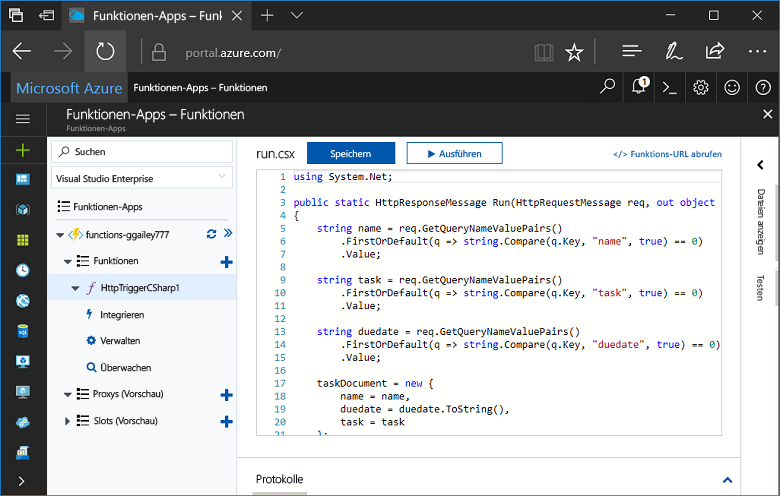
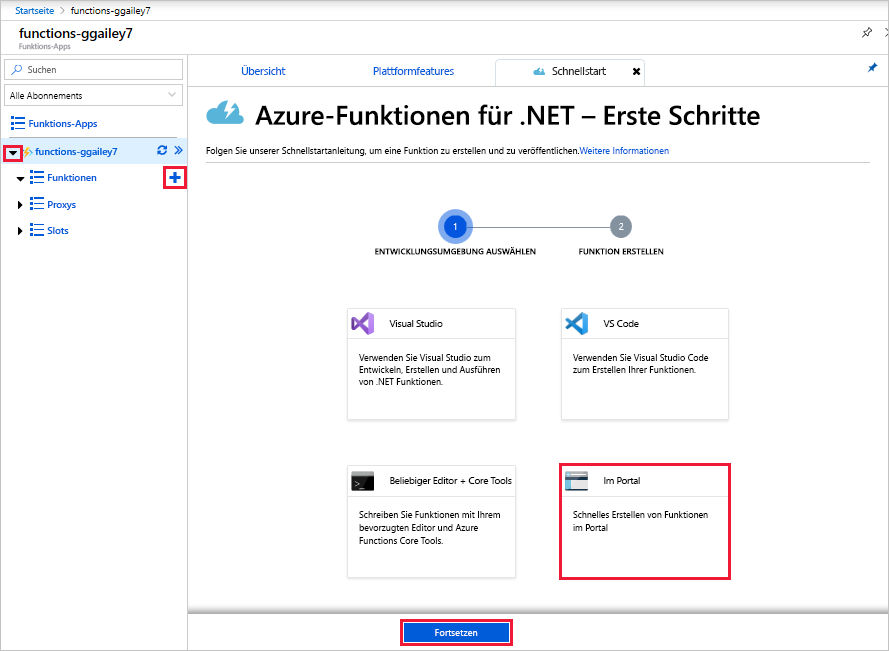

# Erstellen Ihrer ersten Funktion im Azure-Portal

Mit Azure Functions können Sie Code in einer [serverlosen](https://azure.microsoft.com/solutions/serverless/) Umgebung ausführen, ohne vorher eine VM erstellen oder eine Webanwendung veröffentlichen zu müssen. In diesem Artikel erfahren Sie, wie Sie Azure Functions verwenden können, um eine „Hello World“-Funktion im Azure-Portal zu erstellen.

[!INCLUDE [quickstarts-free-trial-note](../../includes/quickstarts-free-trial-note.md)]

> [!NOTE]
> C#-Entwickler sollten für die [Erstellung ihrer ersten Funktion Visual Studio 2019](functions-create-your-first-function-visual-studio.md) statt das Portal in Erwägung ziehen. 

## Anmelden an Azure

Melden Sie sich unter <https://portal.azure.com> mit Ihrem Azure-Konto beim Azure-Portal an.

## Erstellen einer Funktionen-App

Sie müssen über eine Funktionen-App verfügen, die die Ausführung Ihrer Funktionen in Azure hostet. Sie können mit einer Funktionen-App Funktionen zu logischen Einheiten gruppieren. Dies erleichtert die Verwaltung, Bereitstellung und Freigabe von Ressourcen. 

[!INCLUDE [Create function app Azure portal](../../includes/functions-create-function-app-portal.md)]

Erstellen Sie als Nächstes in der neuen Funktionen-App eine Funktion.

## Erstellen einer Funktion mit Auslösung per HTTP

1. Erweitern Sie Ihre neue Funktions-App, klicken Sie neben **Functions** auf die Schaltfläche **+** , klicken Sie auf **Im Portal**, und klicken Sie anschließend auf **Weiter**.

    

1. Wählen Sie **Webhook + API** aus, und klicken Sie anschließend auf **Erstellen**.

    

Eine Funktion wird unter Verwendung einer sprachspezifischen Vorlage für eine Funktion mit HTTP-Trigger erstellt.

Nun können Sie die neue Funktion ausführen, indem Sie eine HTTP-Anforderung senden.

## Testen der Funktion

1. Klicken Sie in der neuen Funktion rechts oben auf **</> Funktions-URL abrufen**, wählen Sie **default (Function key)** (Standard (Funktionsschlüssel)) aus, und klicken Sie dann auf **Kopieren**. 

    

2. Fügen Sie die URL der Funktion in die Adressleiste Ihres Browsers ein. Fügen Sie den Wert der Abfragezeichenfolge `&name=<yourname>` am Ende der URL hinzu, und drücken Sie die Taste `Enter` auf Ihrer Tastatur, um die Anforderung auszuführen. Daraufhin sollte die von der Funktion zurückgegebene Antwort im Browser angezeigt werden.  

    Das folgende Beispiel zeigt die Antwort im Browser:

    

    Die Anfrage-URL enthält einen Schlüssel, der standardmäßig über HTTP auf Ihre Funktion zugreifen muss.

3. Wenn Ihre Funktion ausgeführt wird, werden Nachverfolgungsinformationen in die Protokolle geschrieben. Kehren Sie zu Ihrer Funktion im Portal zurück, und klicken Sie am unteren Bildschirmrand auf den Pfeil, um **Protokolle** zu erweitern und die Nachverfolgungsausgabe der vorherigen Ausführung anzuzeigen.

   

## Bereinigen von Ressourcen

[!INCLUDE [Clean-up resources](../../includes/functions-quickstart-cleanup.md)]

## Nächste Schritte

Sie haben eine Funktions-App mit einer einfachen Funktion erstellt, die per HTTP ausgelöst wird.  

[!INCLUDE [Next steps note](../../includes/functions-quickstart-next-steps.md)]

Weitere Informationen finden Sie unter [HTTP- und Webhookbindungen in Azure Functions](functions-bindings-http-webhook.md).
