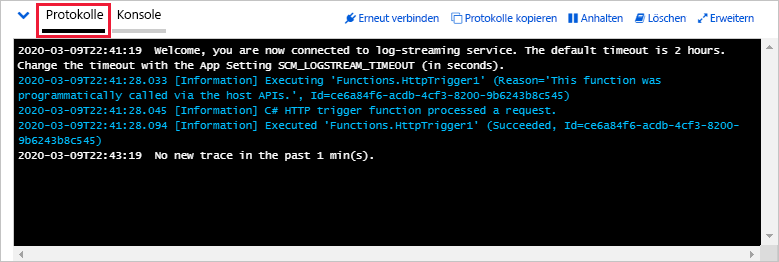

# Erstellen Ihrer ersten Funktion im Azure-Portal

Mit Azure Functions können Sie Code in einer serverlosen Umgebung ausführen, ohne vorher eine VM erstellen oder eine Webanwendung veröffentlichen zu müssen. In diesem Thema erfahren Sie, wie Sie Azure Functions verwenden können, um eine „Hello World“-Funktion im Azure-Portal zu erstellen.

[!INCLUDE [quickstarts-free-trial-note](../../includes/quickstarts-free-trial-note.md)]

## Anmelden an Azure

Melden Sie sich beim [Azure-Portal](https://portal.azure.com/)an.

## Erstellen einer Funktionen-App

Sie müssen über eine Funktionen-App verfügen, die die Ausführung Ihrer Funktionen in Azure hostet. Sie können mit einer Funktionen-App Funktionen zu logischen Einheiten gruppieren. Dies erleichtert die Verwaltung, Bereitstellung und Freigabe von Ressourcen. 

[!INCLUDE [Create function app Azure portal](../../includes/functions-create-function-app-portal.md)]

[!INCLUDE [functions-portal-favorite-function-apps](../../includes/functions-portal-favorite-function-apps.md)]

Erstellen Sie als Nächstes in der neuen Funktionen-App eine Funktion.

## Erstellen einer Funktion mit Auslösung per HTTP

1. Erweitern Sie die neue Funktionen-App, und klicken Sie anschließend auf die Schaltfläche **+** neben **Functions**.

2.  Wählen Sie auf der Seite **Get started quickly** (Schnelleinstieg) die Option **WebHook + API**, **wählen Sie eine Sprache** für die Funktion, und klicken Sie dann auf **Diese Funktion erstellen**. 
   
    

Eine Funktion wird in Ihrer gewählten Sprache anhand der Vorlage für eine Funktion mit Auslösung per HTTP erstellt. Sie können die neue Funktion ausführen, indem Sie eine HTTP-Anforderung senden.

## Testen der Funktion

1. Klicken Sie in der neuen Funktion auf **</> Get function URL**, wählen Sie **default (Function key)** aus, und klicken Sie dann auf **Kopieren**. 

    

2. Fügen Sie die URL der Funktion in die Adressleiste Ihres Browsers ein. Fügen Sie die Abfragezeichenfolge `&name=<yourname>` an die URL an, und betätigen Sie die Taste `Enter` auf Ihrer Tastatur, um die Anforderung auszuführen. Im Folgenden finden Sie ein Beispiel der Antwort, die im Edge-Browser von der Funktion zurückgegeben wird:

    

    Die Anfrage-URL enthält einen Schlüssel, der standardmäßig über HTTP auf Ihre Funktion zugreifen muss.   

3. Wenn Ihre Funktion ausgeführt wird, werden Nachverfolgungsinformationen in die Protokolle geschrieben. Kehren Sie zu Ihrer Funktion im Portal zurück, und klicken Sie auf den Pfeil nach oben am unteren Bildschirmrand, um **Protokolle** zu erweitern. Dann wird Ihnen die Nachverfolgungsausgabe der vorherigen Ausführung angezeigt. 

   

## Bereinigen von Ressourcen

[!INCLUDE [Clean up resources](../../includes/functions-quickstart-cleanup.md)]

## Nächste Schritte

Sie haben eine Funktionen-App mit einer einfachen Funktion mit Auslösung per HTTP erstellt.  

[!INCLUDE [Next steps note](../../includes/functions-quickstart-next-steps.md)]

Weitere Informationen finden Sie unter [HTTP- und Webhookbindungen in Azure Functions](functions-bindings-http-webhook.md).

