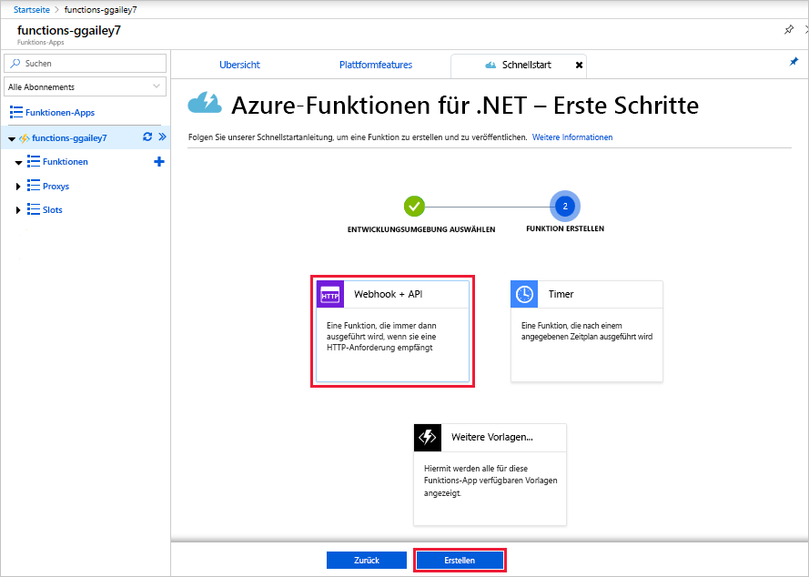

# Erstellen Sie Ihre erste Funktion in Azure Functions
## Übersicht
Azure-Funktionen ist eine ereignisgesteuerte On-Demand-Computeumgebung, mit der die vorhandene Azure-Anwendungsplattform um Funktionen zur Implementierung von Code erweitert wird, der von Ereignissen ausgelöst wird, die in anderen Azure-Diensten, SaaS-Produkten sowie in lokalen Systemen auftreten können. Mit Azure Functions werden Ihre Anwendungen basierend auf dem Bedarf skaliert, und Sie zahlen nur für die Ressourcen, die Sie tatsächlich nutzen. Azure Functions ermöglicht Ihnen das Erstellen von geplanten oder ausgelösten, in verschiedenen Programmiersprachen implementierten Codeeinheiten. Weitere Informationen zu Azure Functions finden Sie in der [Übersicht zu Azure Functions](functions-overview.md).

In diesem Thema erfahren Sie, wie Sie mithilfe des Azure Functions-Schnellstarts im Portal eine einfachen JavaScript-Funktion vom Typ „Hello World“ erstellen, die durch einen HTTP-Trigger aufgerufen wird. Sie können sich auch ein kurzes Video ansehen, das die Ausführung dieser Schritte im Portal zeigt.

## Video ansehen
Das folgende Video zeigt die Ausführung der grundlegenden Schritte in diesem Tutorial. 

> [!VIDEO https://channel9.msdn.com/Series/Windows-Azure-Web-Sites-Tutorials/Create-your-first-Azure-Function-simple/player]
> 
> 

## Erstellen einer Funktion über den Schnellstart
Eine Funktionen-App hostet die Ausführung Ihrer Funktionen in Azure. Führen Sie diese Schritte aus, um eine Funktionen-App mit der neuen Funktion zu erstellen. Die Funktionen-App wird mit einer Standardkonfiguration erstellt. Ein Beispiel für die explizite Erstellung der Funktionen-App finden Sie im [anderen Schnellstart-Tutorial zu Azure Functions](functions-create-first-azure-function-azure-portal.md).

Bevor Sie Ihre erste Funktion erstellen können, müssen Sie über ein aktives Azure-Konto verfügen. Wenn Sie noch kein Azure-Konto haben, [erstellen Sie ein kostenloses Konto](https://azure.microsoft.com/free/).

1. Wechseln Sie zum [Azure Functions-Portal](https://functions.azure.com/signin) , und melden Sie sich mit Ihrem Azure-Konto an.
2. Geben Sie einen eindeutigen **Namen** für Ihre neue Funktionen-App ein, oder übernehmen Sie den automatisch generierten Namen, wählen Sie die bevorzugte **Region** aus, und klicken Sie anschließend auf **Erstellen und erste Schritte durchführen**. Beachten Sie, dass Sie einen gültigen Namen eingeben müssen, der nur Buchstaben, Zahlen und Bindestriche enthalten kann. Unterstriche (**_**) sind nicht zulässig.
3. Klicken Sie auf der Registerkarte **Schnellstart** auf **WebHook + API**, auf **JavaScript** und anschließend auf **Funktion erstellen**. Eine neue vordefinierte JavaScript-Funktion wird erstellt. 
   
    
4. (Optional) Nun können Sie auswählen, ob Sie eine kurze Übersicht über die Features von Azure Functions im Portal erhalten möchten. Nachdem Sie die Schnelleinführung durchlaufen oder übersprungen haben, können Sie Ihre neue Funktion mit dem HTTP-Trigger testen.

## Testen der Funktion
[!INCLUDE [Functions quickstart test](../../includes/functions-quickstart-test.md)]

## Nächste Schritte
[!INCLUDE [Functions quickstart next steps](../../includes/functions-quickstart-next-steps.md)]

[!INCLUDE [Getting Started Note](../../includes/functions-get-help.md)]

<!--HONumber=Feb17_HO2-->

