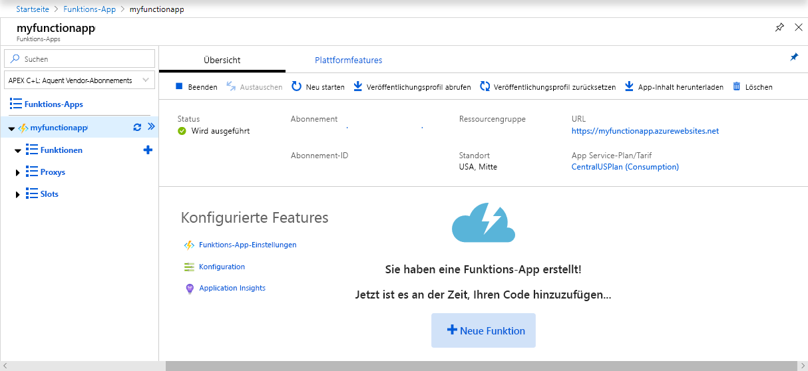

# Erstellen einer Funktion, die durch einen GitHub-Webhook ausgelöst wird

Erfahren Sie, wie Sie eine Funktion erstellen können, die von einer HTTP-Webhookanforderung mit einer GitHub-spezifischen Nutzlast ausgelöst wird.

## Voraussetzungen

+ Ein GitHub-Konto mit mindestens einem Projekt.
+ Ein Azure-Abonnement. Wenn Sie keins besitzen, können Sie ein [kostenloses Konto](https://azure.microsoft.com/free/?WT.mc_id=A261C142F) erstellen, bevor Sie beginnen.

[!INCLUDE [functions-portal-favorite-function-apps](../../includes/functions-portal-favorite-function-apps.md)]

## Erstellen einer Azure Function-App

[!INCLUDE [Create function app Azure portal](../../includes/functions-create-function-app-portal.md)]

Erstellen Sie als Nächstes in der neuen Funktionen-App eine Funktion.

## Erstellen einer Funktion, die durch einen GitHub-Webhook ausgelöst wird

1. Erweitern Sie die Funktionen-App, und klicken Sie auf die Schaltfläche **+** neben **Functions**. Wenn dies die erste Funktion in Ihrer Funktionen-App ist, wählen Sie **Benutzerdefinierte Funktion**. Hiermit wird der vollständige Satz von Funktionsvorlagen angezeigt.

    

2. Geben Sie im Suchfeld `github` ein, und wählen Sie dann Ihre gewünschte Sprache für die GitHub-Webhook-Triggervorlage aus. 

      

2. Geben Sie einen **Namen** für Ihre Funktion ein, und wählen Sie dann die Option **Erstellen**. 

      

3. Klicken Sie in der neuen Funktion auf **</> Funktions-URL abrufen**, kopieren Sie die Werte, und speichern Sie diese. Führen Sie die gleichen Schritte für **</> GitHub-Geheimnis abrufen** aus. Diese Werte benötigen Sie, um den Webhook in GitHub zu konfigurieren.

    

Erstellen Sie als Nächstes einen Webhook in Ihrem GitHub-Repository.

## Konfigurieren des Webhooks

1. Navigieren Sie in GitHub zu einem Repository, das Sie besitzen. Sie können auch ein anderes Repository verwenden, das Sie verzweigt haben. Verwenden Sie <https://github.com/Azure-Samples/functions-quickstart>, wenn Sie ein Repository forken müssen.

1. Klicken Sie auf **Einstellungen** > **Webhooks** > **Webhook hinzufügen**.

    

1. Verwenden Sie die in der Tabelle angegebenen Einstellungen, und klicken Sie anschließend auf **Webhook hinzufügen**.

    

| Einstellung | Empfohlener Wert | BESCHREIBUNG |
|---|---|---|
| **URL der Nutzlast** | Der kopierte Wert | Verwenden Sie den von **</> Abrufen der Funktions-URL** zurückgegebenen Wert. |
| **Inhaltstyp** | Anwendung/json | Die Funktion erwartet eine JSON-Nutzlast. |
| **Geheimnis**   | Der kopierte Wert | Verwenden Sie den von **</> Abrufen des GitHub-Geheimnisses** zurückgegebenen Wert. |
| Ereignistrigger | Auswählen einzelner Ereignisse erlauben | Es sollen nur Problemmeldungsereignisse ausgelöst werden.  |
| | Problembericht |  |

Der Webhook ist nun so konfiguriert, dass Ihre Funktion ausgelöst wird, wenn ein neuer Problembericht hinzugefügt wird.

## Testen der Funktion

1. Öffnen Sie in Ihrem GitHub-Repository die Registerkarte **Probleme** in einem neuen Browserfenster.

1. Klicken Sie in dem neuen Fenster auf **Neues Problem**, geben Sie einen Titel ein, und klicken Sie anschließend auf **Submit new issue** (Neues Problem übermitteln).

1. Geben Sie in die Problemmeldung einen Kommentar ein, und klicken Sie auf **Kommentar**.

    

1. Kehren Sie zum Portal zurück, und schauen Sie sich die Protokolle an. Sie sollten einen Nachverfolgungseintrag mit dem Text der neuen Meldung sehen.

     

## Bereinigen von Ressourcen

[!INCLUDE [Next steps note](../../includes/functions-quickstart-cleanup.md)]

## Nächste Schritte

Sie haben eine Funktion erstellt, die ausgelöst wird, wenn eine Anforderung von einem GitHub-Webhook empfangen wurde.

[!INCLUDE [Next steps note](../../includes/functions-quickstart-next-steps.md)]

Weitere Informationen zu Webhooktriggern finden Sie unter [HTTP- und Webhookbindungen in Azure Functions](functions-bindings-http-webhook.md).
