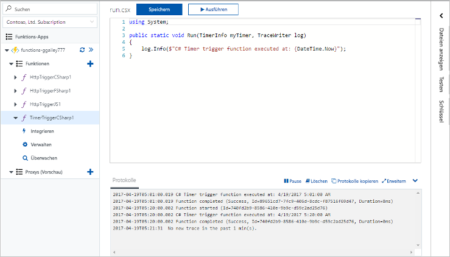
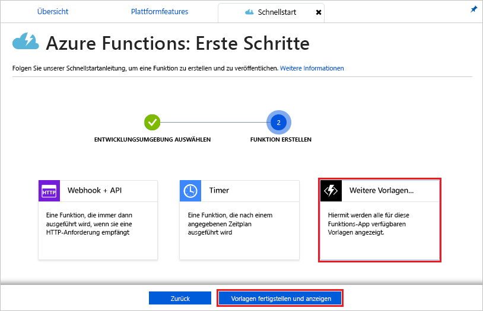
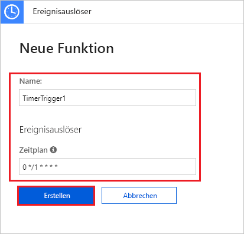
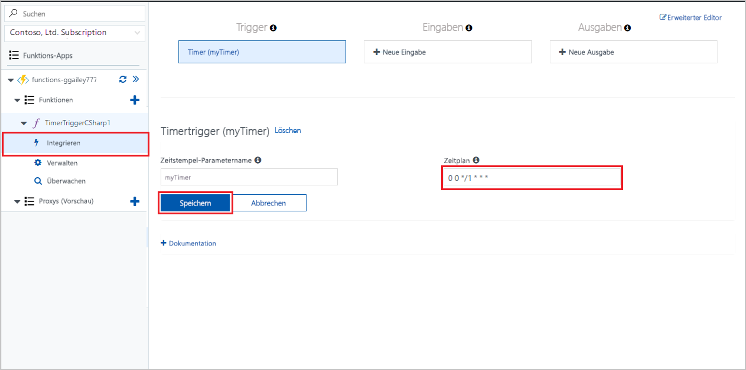

# Erstellen einer Funktion in Azure, die von einem Timer ausgelöst wird

Hier erfahren Sie, wie Sie mithilfe von Azure Functions eine [serverlose](https://azure.microsoft.com/solutions/serverless/) Funktion erstellen, die nach einem von Ihnen definierten Zeitplan ausgeführt wird.

## Voraussetzungen

Für dieses Tutorial benötigen Sie Folgendes:

+ Wenn Sie kein Azure-Abonnement besitzen, erstellen Sie ein [kostenloses Konto](https://azure.microsoft.com/free/?WT.mc_id=A261C142F), bevor Sie beginnen.

## Erstellen einer Azure Function-App

[!INCLUDE [Create function app Azure portal](../../includes/functions-create-function-app-portal.md)]

Erstellen Sie als Nächstes in der neuen Funktionen-App eine Funktion.

## Erstellen einer Funktion mit Auslösung per Timer

1. Erweitern Sie die Funktionen-App, und klicken Sie auf die Schaltfläche **+** neben **Functions**. Wenn dies die erste Funktion in Ihrer Funktions-App ist, wählen Sie **Im Portal** und dann **Weiter**. Fahren Sie andernfalls mit Schritt 3 fort.

   

2. Klicken Sie auf **More templates** (Weitere Vorlagen) und anschließend auf **Finish and view templates** (Fertig stellen und Vorlagen anzeigen).

    

3. Geben Sie im Suchfeld `timer` ein, und konfigurieren Sie den neuen Trigger mit den Einstellungen, die in der Tabelle unter der folgenden Abbildung enthalten sind.

    

    | Einstellung | Vorgeschlagener Wert | BESCHREIBUNG |
    |---|---|---|
    | **Name** | Standard | Definiert den Namen der Funktion mit Auslösung per Timer |
    | **Zeitplan** | 0 \*/1 \* \* \* \* | Ein sechs Felder umfassender [CRON-Ausdruck](functions-bindings-timer.md#ncrontab-expressions), der die minütliche Ausführung der Funktion festlegt. |

4. Klicken Sie auf **Erstellen**. Eine im Minutentakt ausgeführte Funktion wird in der gewählten Sprache erstellt.

5. Überprüfen Sie, ob die Funktion ausgeführt wird, indem Sie sich die Nachverfolgungsinformationen in den Protokollen ansehen.

    

Nun ändern Sie den Zeitplan der Funktion so, dass sie nicht mehr einmal pro Minute sondern einmal pro Stunde ausgeführt wird.

## Aktualisieren des Timerzeitplans

1. Erweitern Sie die Funktion, und klicken Sie auf **Integrieren**. Hier können Sie Eingabe- und Ausgabebindungen für Ihre Funktion definieren und den Zeitplan festlegen. 

2. Geben Sie einen neuen Stundenwert für den **Zeitplan** ein (`0 0 */1 * * *`), und klicken Sie anschließend auf **Speichern**.  

Eine im Stundentakt ausgeführte Funktion wird in der gewählten Sprache erstellt.

## Bereinigen von Ressourcen

[!INCLUDE [Next steps note](../../includes/functions-quickstart-cleanup.md)]

## Nächste Schritte

Sie haben eine Funktion erstellt, die nach einem Zeitplan ausgeführt wird. Weitere Informationen zu Triggern mit Timern finden Sie unter [Planen der Ausführung von Code mit Azure Functions](functions-bindings-timer.md).

[!INCLUDE [Next steps note](../../includes/functions-quickstart-next-steps.md)]
