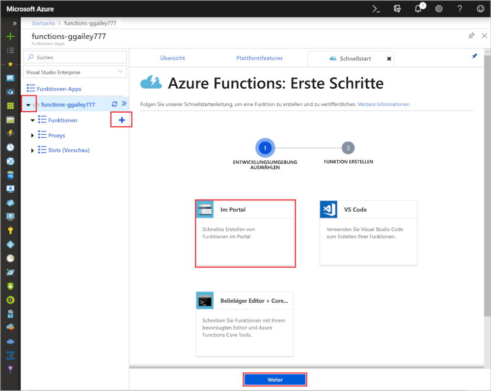
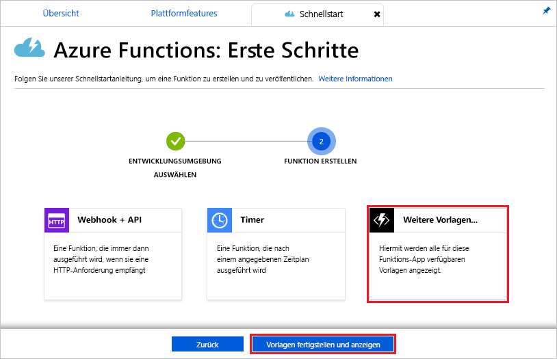
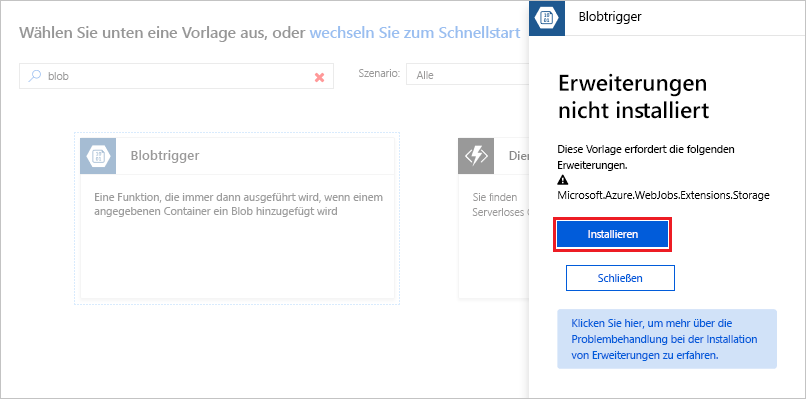
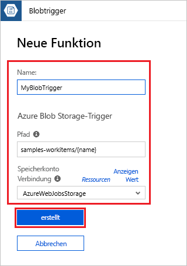

# Erstellen einer Funktion, die durch Azure Blob Storage ausgelöst wird

Erfahren Sie, wie Sie eine Funktion erstellen, die ausgelöst wird, wenn Dateien in Azure Blob Storage hochgeladen oder aktualisiert werden.

## Voraussetzungen

+ Laden Sie den [Microsoft Azure Storage-Explorer](https://storageexplorer.com/) herunter, und installieren Sie ihn.
+ Ein Azure-Abonnement. Wenn Sie keins besitzen, können Sie ein [kostenloses Konto](https://azure.microsoft.com/free/?WT.mc_id=A261C142F) erstellen, bevor Sie beginnen.

## Erstellen einer Azure Function-App

[!INCLUDE [Create function app Azure portal](../../includes/functions-create-function-app-portal.md)]

Erstellen Sie als Nächstes in der neuen Funktionen-App eine Funktion.

## Erstellen einer Funktion, die durch Blob Storage ausgelöst wird

1. Erweitern Sie die Funktionen-App, und klicken Sie auf die Schaltfläche **+** neben **Functions**. Wenn dies die erste Funktion in Ihrer Funktions-App ist, wählen Sie **Im Portal** und dann **Weiter**. Fahren Sie andernfalls mit Schritt 3 fort.

   

1. Klicken Sie auf **More templates** (Weitere Vorlagen) und anschließend auf **Finish and view templates** (Fertig stellen und Vorlagen anzeigen).

    

1. Geben Sie `blob` in das Suchfeld ein, und wählen Sie dann die Vorlage **Blobtrigger** aus.

1. Klicken Sie auf **Installieren**, wenn Sie dazu aufgefordert werden, um die Azure Storage-Erweiterung sowie alle Abhängigkeiten in der Funktions-App zu installieren. Klicken Sie nach erfolgreichem Abschluss der Installation auf **Weiter**.

    

1. Verwenden Sie die Einstellungen, die in der Tabelle unter der Abbildung angegeben sind.

    

    | Einstellung | Empfohlener Wert | Beschreibung |
    |---|---|---|
    | **Name** | Eindeutig in Ihrer Funktionen-App | Der Name dieser durch Blobs ausgelösten Funktion. |
    | **Path**   | samples-workitems/{name}    | Der Speicherort in Blob Storage, der überwacht wird. Der Dateiname des Blobs wird in der Bindung als _name_-Parameter übergeben.  |
    | **Speicherkontoverbindung** | AzureWebJobsStorage | Sie können die Speicherkontoverbindung verwenden, die bereits von Ihrer Funktionen-App verwendet wird, oder eine neue erstellen.  |

1. Klicken Sie auf **Erstellen**, um die Funktion zu erstellen.

Als Nächstes stellen Sie eine Verbindung mit Ihrem Azure Storage-Konto her und erstellen den Container **samples-workitems**.

## Erstellen des Containers

1. Klicken Sie in Ihrer Funktion auf **Integrieren**, erweitern Sie **Dokumentation**, und kopieren Sie **Kontoname** und **Kontoschlüssel**. Diese Anmeldeinformationen benötigen Sie für die Verbindung mit dem Speicherkonto. Wenn Sie bereits eine Verbindung zu Ihrem Speicherkonto hergestellt haben, fahren Sie mit Schritt 4 fort.

    

1. Führen Sie das Tool [Microsoft Azure Storage-Explorer](https://storageexplorer.com/) aus, klicken Sie auf das Verbindungssymbol auf der linken Seite, wählen Sie **Use a storage account name and key** (Name und Schlüssel eines Speicherkontos verwenden) aus, und klicken Sie anschließend auf **Weiter**.

    

1. Geben Sie den **Kontonamen** und den **Kontoschlüssel** aus Schritt 1 ein, klicken Sie auf **Weiter** und dann auf **Verbinden**. 

    

1. Erweitern Sie das angefügte Speicherkonto, klicken Sie mit der rechten Maustaste auf **Blob-Container**, und klicken Sie dann auf **Blob-Container erstellen**. Geben Sie `samples-workitems` ein, und drücken Sie dann die EINGABETASTE.

    

Nun verfügen Sie über einen Blob-Container und können die Funktion durch Hochladen einer Datei in den Container testen.

## Testen der Funktion

1. Gehen Sie zurück zum Azure-Portal, navigieren Sie zu Ihrer Funktion, erweitern Sie die **Protokolle** am unteren Rand der Seite, und stellen Sie sicher, dass das Protokollstreaming nicht angehalten ist.

1. Erweitern Sie im Storage-Explorer Ihr Speicherkonto, **Blob-Container** und **samples-workitems**. Klicken Sie auf **Hochladen** und dann auf **Dateien hochladen**.

    

1. Klicken Sie im Dialogfeld **Dateien hochladen** auf das Feld **Dateien**. Navigieren Sie zu einer Datei auf dem lokalen Computer, z.B. zu einer Bilddatei, und wählen Sie sie aus. Klicken Sie auf **Öffnen** und dann auf **Hochladen**.

1. Gehen Sie zurück zu den Funktionsprotokollen, und überprüfen Sie, ob das Blob gelesen wurde.

   

    >[!NOTE]
    > Wenn Ihre Funktionen-App im Standardverbrauchsplan ausgeführt wird, kann es zwischen dem Hinzufügen oder Aktualisieren des Blobs und dem Auslösen der Funktion zu einer Verzögerung von bis zu einigen Minuten kommen. Wenn Sie die Latenzzeit bei Ihren durch Blobs ausgelösten Funktionen gering halten möchten, können Sie die Funktionen-App in einem App Service-Plan ausführen.

## Bereinigen von Ressourcen

[!INCLUDE [Next steps note](../../includes/functions-quickstart-cleanup.md)]

## Nächste Schritte

Sie haben eine Funktion erstellt, die ausgeführt wird, wenn ein Blob in Blob Storage hinzugefügt oder aktualisiert wird. 

[!INCLUDE [Next steps note](../../includes/functions-quickstart-next-steps.md)]

Weitere Informationen zu Blob Storage-Auslösern finden Sie unter [Azure Functions – Blob Storage-Bindungen](functions-bindings-storage-blob.md).
