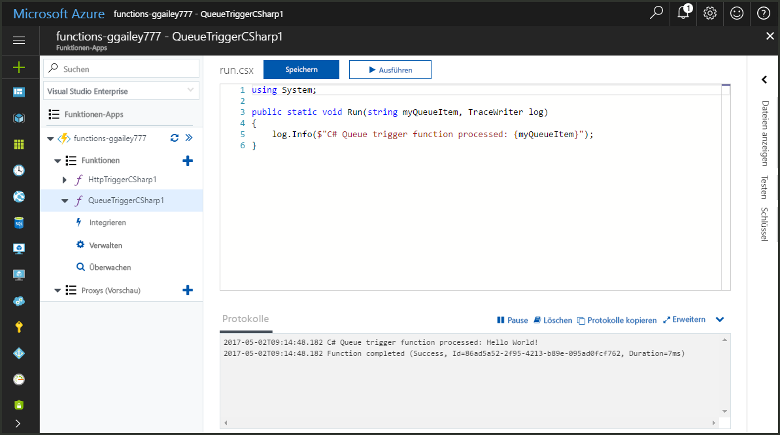
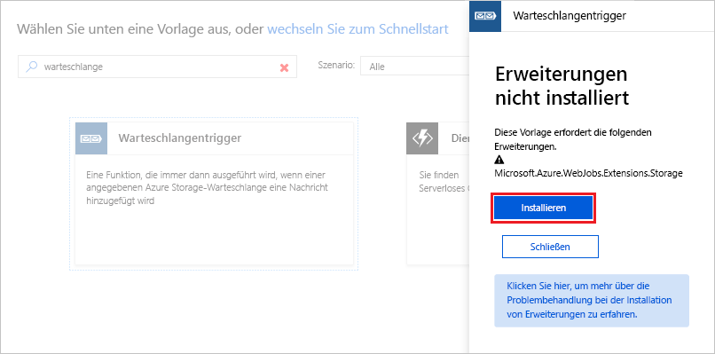
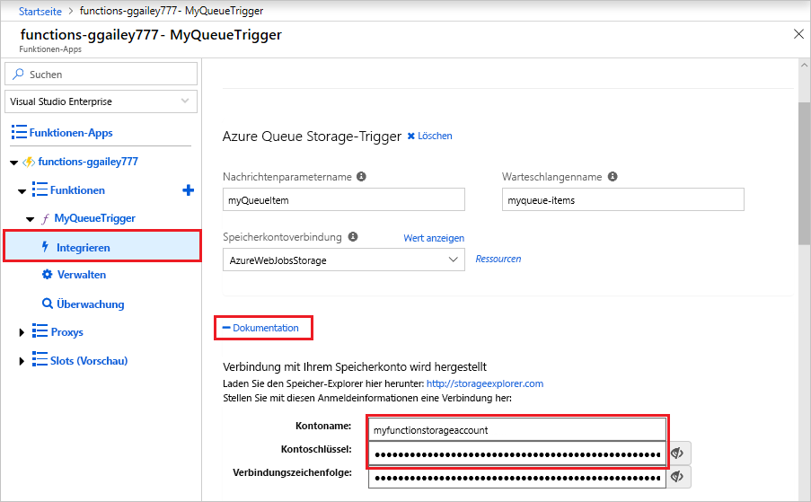
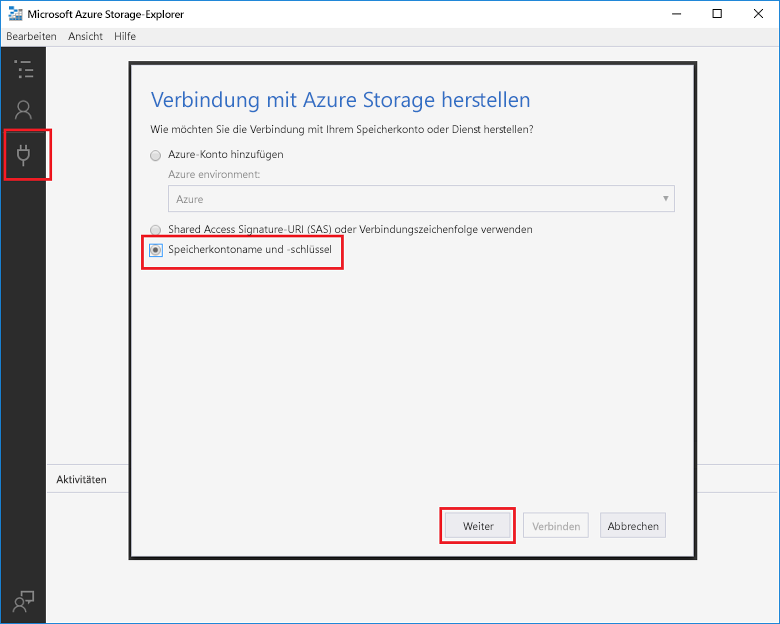
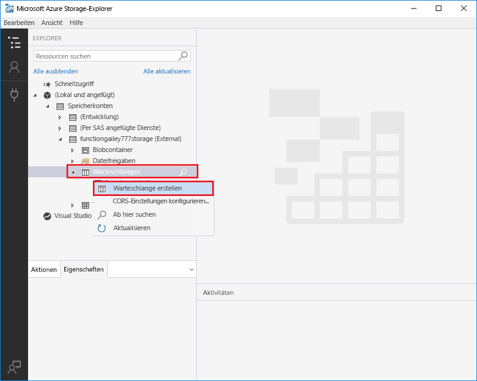
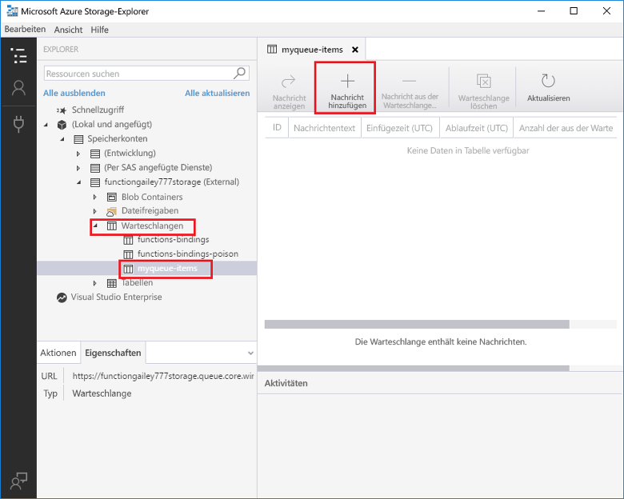

# Erstellen einer Funktion, die durch Azure Queue Storage ausgelöst wird

Erfahren Sie, wie Sie eine Funktion erstellen, die ausgelöst wird, wenn Meldungen an eine Azure Storage-Warteschlange gesendet werden.

## Voraussetzungen

- Laden Sie den [Microsoft Azure Storage-Explorer](https://storageexplorer.com/) herunter, und installieren Sie ihn.

- ein Azure-Abonnement Sollten Sie kein Abonnement besitzen, können Sie ein [kostenloses Konto](https://azure.microsoft.com/free/?WT.mc_id=A261C142F) erstellen, bevor Sie beginnen.

## Erstellen einer Azure Function-App

[!INCLUDE [Create function app Azure portal](../../includes/functions-create-function-app-portal.md)]

Erstellen Sie als Nächstes in der neuen Funktionen-App eine Funktion.

## Erstellen einer Funktion mit Auslösung durch Warteschlange

1. Erweitern Sie die Funktionen-App, und klicken Sie auf die Schaltfläche **+** neben **Functions**. Wenn dies die erste Funktion in Ihrer Funktions-App ist, wählen Sie **Im Portal** und dann **Weiter**. Fahren Sie andernfalls mit Schritt 3 fort.

   

1. Klicken Sie auf **More templates** (Weitere Vorlagen) und anschließend auf **Finish and view templates** (Fertig stellen und Vorlagen anzeigen).

    

1. Geben Sie `queue` in das Suchfeld ein, und wählen Sie dann die Vorlage **Warteschlangentrigger** aus.

1. Klicken Sie auf **Installieren**, wenn Sie dazu aufgefordert werden, um die Azure Storage-Erweiterung sowie alle Abhängigkeiten in der Funktions-App zu installieren. Klicken Sie nach erfolgreichem Abschluss der Installation auf **Weiter**.

    

1. Verwenden Sie die Einstellungen, die in der Tabelle unter der Abbildung angegeben sind.

    

    | Einstellung | Vorgeschlagener Wert | BESCHREIBUNG |
    |---|---|---|
    | **Name** | Eindeutig in Ihrer Funktionen-App | Der Name dieser Funktion mit Auslösung durch Warteschlange. |
    | **Warteschlangenname**   | myqueue-items    | Der Name der zu verknüpfenden Warteschlange in Ihrem Speicherkonto. |
    | **Speicherkontoverbindung** | AzureWebJobsStorage | Sie können die Speicherkontoverbindung verwenden, die bereits von Ihrer Funktionen-App verwendet wird, oder eine neue erstellen.  |    

1. Klicken Sie auf **Erstellen**, um die Funktion zu erstellen.

Als Nächstes stellen Sie eine Verbindung zu Ihrem Azure Storage-Konto her und erstellen die **myqueue-items**-Speicherwarteschlange.

## Erstellen der Warteschlange

1. Klicken Sie in Ihrer Funktion auf **Integrieren**, erweitern Sie **Dokumentation**, und kopieren Sie **Kontoname** und **Kontoschlüssel**. Diese Anmeldeinformationen benötigen Sie für die Verbindung mit dem Speicherkonto im Azure Storage-Explorer. Wenn Sie bereits eine Verbindung zu Ihrem Speicherkonto hergestellt haben, fahren Sie mit Schritt 4 fort.

    

1. Führen Sie das Tool [Microsoft Azure Storage-Explorer](https://storageexplorer.com/) aus, klicken Sie auf das Verbindungssymbol auf der linken Seite, wählen Sie **Use a storage account name and key** (Name und Schlüssel eines Speicherkontos verwenden) aus, und klicken Sie anschließend auf **Weiter**.

    

1. Geben Sie den **Kontonamen** und den **Kontoschlüssel** aus Schritt 1 ein, klicken Sie auf **Weiter** und dann auf **Verbinden**.

    

1. Erweitern Sie das angefügte Speicherkonto, klicken Sie mit der rechten Maustaste auf **Warteschlangen**, und klicken Sie dann auf **Warteschlange erstellen**. Geben Sie `myqueue-items` ein, und drücken Sie dann die EINGABETASTE.

    

Nun verfügen Sie über eine Speicherwarteschlange und können die Funktion durch Hinzufügen einer Meldung in die Warteschlange testen.

## Testen der Funktion

1. Gehen Sie zurück zum Azure-Portal, navigieren Sie zu Ihrer Funktion, erweitern Sie die **Protokolle** am unteren Rand der Seite, und stellen Sie sicher, dass das Protokollstreaming nicht angehalten ist.

1. Erweitern Sie im Storage-Explorer Ihr Speicherkonto, **Warteschlangen** und **myqueue-items**, und klicken Sie dann auf **Meldung hinzufügen**.

    

1. Geben Sie die Meldung "Hello World!" in den **Meldungstext** ein, und klicken Sie auf **OK**.

1. Warten Sie einige Sekunden, wechseln Sie dann zurück zu den Funktionsprotokollen, und stellen Sie sicher, dass die neue Meldung aus der Warteschlange gelesen wurde.

    

1. Gehen Sie zurück zum Storage-Explorer, klicken Sie auf **Aktualisieren**, und stellen Sie sicher, dass die Meldung verarbeitet wurde und sich nicht mehr in der Warteschlange befindet.

## Bereinigen von Ressourcen

[!INCLUDE [Next steps note](../../includes/functions-quickstart-cleanup.md)]

## Nächste Schritte

Sie haben eine Funktion erstellt, die ausgeführt wird, wenn eine Meldung in eine Speicherwarteschlange hinzugefügt wird. Weitere Informationen zu Queue Storage-Auslösern finden Sie unter [Azure Storage-Warteschlangenbindungen in Azure Functions](functions-bindings-storage-queue.md).

Sie haben Ihre erste Funktion erstellt. Fügen Sie ihr nun eine Ausgabebindung hinzu, die eine Meldung in eine andere Warteschlange schreibt.

> [!div class="nextstepaction"]
> [Hinzufügen von Meldungen in eine Azure Storage-Warteschlange mithilfe von Functions](functions-integrate-storage-queue-output-binding.md)
