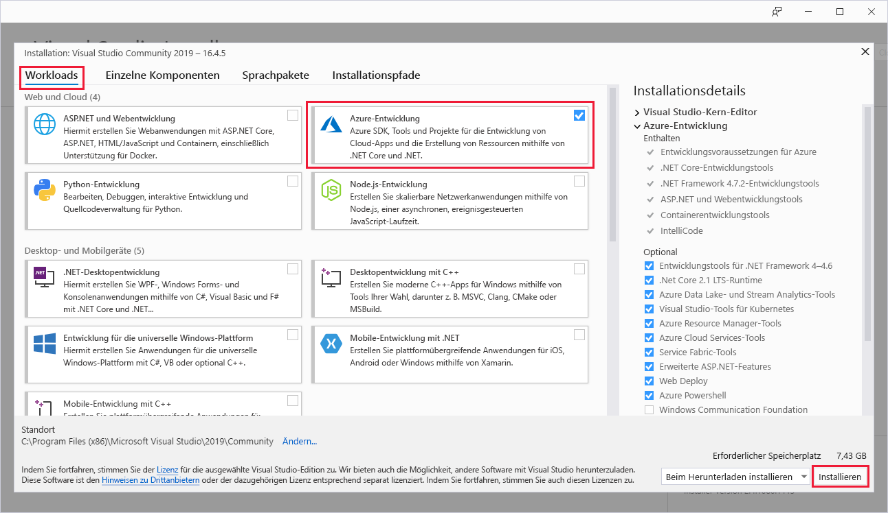

# Erstellen Ihrer ersten Funktion mit Visual Studio

Mit Azure Functions können Sie Code in einer [serverlosen](https://azure.microsoft.com/overview/serverless-computing/) Umgebung ausführen, ohne vorher eine VM erstellen oder eine Webanwendung veröffentlichen zu müssen.

In diesem Thema erfahren Sie, wie Sie die Visual Studio 2017-Tools für Azure Functions verwenden, um eine „hello world“-Funktion lokal zu erstellen und zu testen. Anschließend veröffentlichen Sie den Funktionscode in Azure. Diese Tools sind als Teil der Azure-Entwicklungsworkload in Visual Studio 2017 Version 15.3 oder höher verfügbar.

## Voraussetzungen

Installieren Sie für dieses Tutorial Folgendes:

* [Visual Studio 2017, Version 15.4](https://www.visualstudio.com/vs/) oder eine höhere Version, einschließlich der Workload **Azure-Entwicklung**

    
    
[!INCLUDE [quickstarts-free-trial-note](../../includes/quickstarts-free-trial-note.md)] 

## Erstellen eines Azure Functions-Projekts in Visual Studio

[!INCLUDE [Create a project using the Azure Functions template](../../includes/functions-vstools-create.md)]

Nachdem Sie das Projekt erstellt haben, können Sie Ihre erste Funktion erstellen.

## Erstellen der Funktion

1. Klicken Sie im **Projektmappen-Explorer** mit der rechten Maustaste auf den Projektknoten, und wählen Sie **Hinzufügen** > **Neues Element**. Wählen Sie **Azure-Funktion**, geben Sie `HttpTriggerCSharp.cs` für **Name** ein, und klicken Sie auf **Hinzufügen**.

2. Klicken Sie auf **HttpTrigger**, wählen Sie unter **Zugriffsrechte** die Option **Anonym**, und klicken Sie auf **OK**. Auf die erstellte Funktion wird von Clients aus per HTTP-Anforderung zugegriffen. 

    

    Ihrem Projekt wird eine Codedatei mit einer Klasse hinzugefügt, die den Funktionscode implementiert. Dieser Code basiert auf einer Vorlage, die einen Wert für den Namen empfängt und zurücksendet. Das Attribut **FunctionName** legt den Namen Ihrer Funktion fest. Das Attribut **HttpTrigger** gibt die Nachricht an, die die Funktion auslöst. 

    

Nachdem Sie nun eine per HTTP ausgelöste Funktion erstellt haben, können Sie sie auf Ihrem lokalen Computer testen.

## Lokales Testen der Funktion

Mit Azure Functions Core-Tools können Sie ein Azure Functions-Projekt auf dem lokalen Entwicklungscomputer ausführen. Sie werden beim ersten Starten einer Funktion in Visual Studio zum Installieren dieser Tools aufgefordert.  

1. Drücken Sie F5, um Ihre Funktion zu testen. Akzeptieren Sie die entsprechende Aufforderung von Visual Studio zum Herunterladen und Installieren der Azure Functions Core (CLI)-Tools.  Sie müssen möglicherweise auch eine Firewallausnahme aktivieren, damit die Tools HTTP-Anforderungen verarbeiten können.

2. Kopieren Sie die URL Ihrer Funktion aus der Azure Functions-Laufzeitausgabe.  

    

3. Fügen Sie die URL der HTTP-Anforderung in die Adresszeile des Browsers ein. Hängen Sie anschließend die Abfragezeichenfolge `?name=<yourname>` an diese URL an, und führen Sie die Anforderung aus. Hier ist die Antwort des Browsers auf die von der Funktion zurückgegebene lokale GET-Anforderung abgebildet: 

    

4. Klicken Sie zum Beenden des Debuggens in der Visual Studio-Symbolleiste auf die Schaltfläche **Beenden**.

Nachdem Sie sichergestellt haben, dass die Funktion auf Ihrem lokalen Computer richtig ausgeführt wird, können Sie das Projekt in Azure veröffentlichen.

## Veröffentlichen des Projekts in Azure

Sie müssen in Ihrem Azure-Abonnement über eine Funktions-App verfügen, bevor Sie Ihr Projekt veröffentlichen können. Sie können eine Funktions-App direkt in Visual Studio erstellen.

[!INCLUDE [Publish the project to Azure](../../includes/functions-vstools-publish.md)]

## Testen der Funktion in Azure

1. Kopieren Sie die Basis-URL der Funktions-App von der Seite „Veröffentlichungsprofil“. Ersetzen Sie den Teil `localhost:port` der URL, die Sie beim lokalen Testen der Funktion verwendet haben, durch die neue Basis-URL. Stellen Sie wie zuvor sicher, dass Sie die Abfragezeichenfolge `?name=<yourname>` an diese URL anhängen und die Anforderung ausführen.

    Die URL, über die Ihre per HTTP ausgelöste Funktion aufgerufen wird, sieht wie folgt aus:

        http://<functionappname>.azurewebsites.net/api/<functionname>?name=<yourname> 

2. Fügen Sie diese neue URL für die HTTP-Anforderung in die Adresszeile des Browsers ein. Hier ist die Antwort des Browsers auf die von der Funktion zurückgegebene GET-Remoteanforderung abgebildet: 

    
 
## Nächste Schritte

Sie haben Visual Studio genutzt, um eine C#-Funktions-App mit einer einfachen Funktion zu erstellen, die per HTTP ausgelöst wird. 

+ Informationen zum Konfigurieren Ihres Projekts für die Unterstützung anderer Arten von Triggern und Bindungen finden Sie unter [Azure Functions-Tools für Visual Studio](functions-develop-vs.md) im Abschnitt [Konfigurieren des Projekts für die lokale Entwicklung](functions-develop-vs.md#configure-the-project-for-local-development).
+ Weitere Informationen zum lokalen Testen und Debuggen mit den Azure Functions Core-Tools finden Sie unter [Lokales Codieren und Testen von Azure-Funktionen](functions-run-local.md). 
+ Weitere Informationen zum Entwickeln von Funktionen wie .NET-Klassenbibliotheken finden Sie unter [Using .NET class libraries with Azure Functions](functions-dotnet-class-library.md) (Verwenden von .NET-Klassenbibliotheken mit Azure Functions). 

