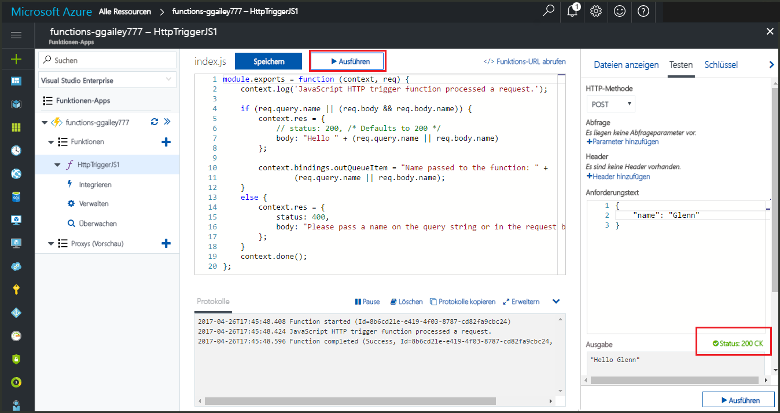
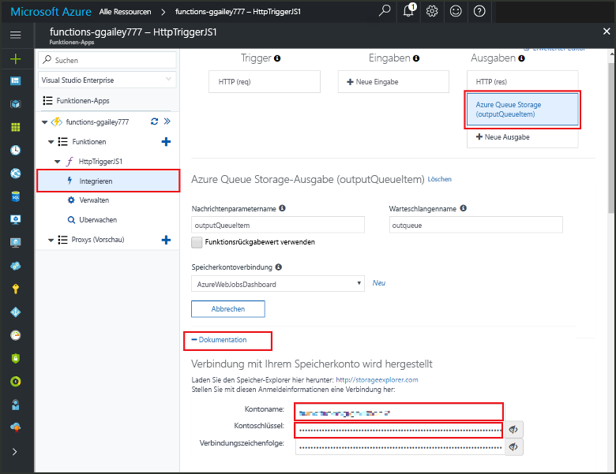
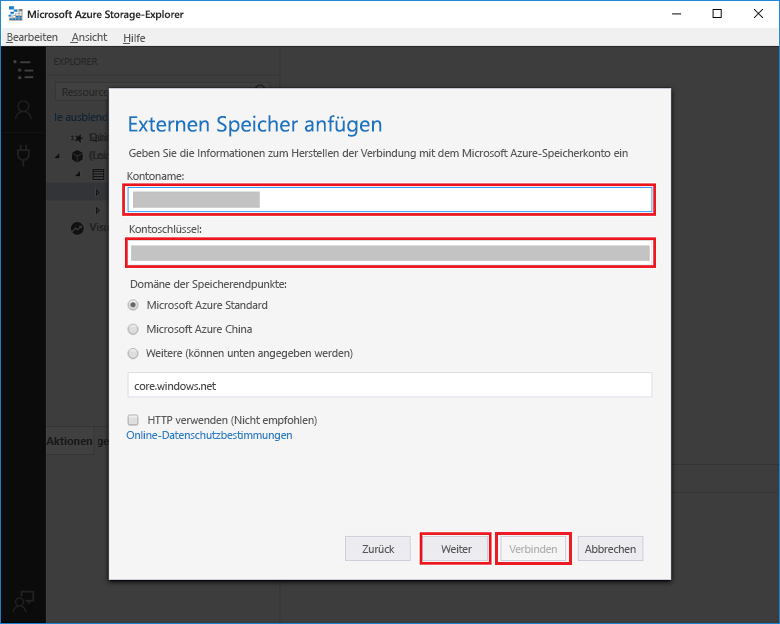

# <a name="add-messages-to-an-azure-storage-queue-using-functions"></a>Hinzufügen von Meldungen in die Warteschlange von Azure Storage mithilfe von Functions

Mithilfe von Eingabe- und Ausgabebindungen in Azure Functions können Sie Daten aus externen Diensten deklarativ für Ihren Code verfügbar machen. In dieser Schnellstartanleitung verwenden Sie eine Ausgabebindung, um eine Meldung in einer Warteschlange zu erstellen, wenn eine Funktion durch eine HTTP-Anforderung ausgelöst wird. Die von Ihrer Funktion erstellten Warteschlangenmeldungen zeigen Sie mithilfe des Azure Storage-Explorers an:


## <a name="prerequisites"></a>Voraussetzungen 

So führen Sie diesen Schnellstart durch:

* Folgen Sie der Anleitung unter [Erstellen Ihrer ersten Funktion im Azure-Portal](functions-create-first-azure-function.md), lassen Sie dabei aber den Schritt **Bereinigen von Ressourcen** weg. In dieser Schnellstartanleitung werden die Funktions-App und die Funktion erstellt, die hier verwendet werden.

* Installieren Sie den [Microsoft Azure Storage-Explorer](http://storageexplorer.com/). Mit diesem Tool können Sie Warteschlangenmeldungen untersuchen, die Ihre Ausgabebindung erstellt.

## <a name="add-binding"></a>Ausgabebindung hinzufügen

In diesem Abschnitt verwenden Sie die Benutzeroberfläche des Portals, um der zuvor erstellten Funktion eine Queue Storage-Ausgabebindung hinzuzufügen. Durch diese Bindung können Sie mit minimalem Programmieraufwand eine Meldung in einer Warteschlange erstellen. Sie müssen keinen Code für Aufgaben wie das Öffnen einer Speicherverbindung, das Erstellen einer Warteschlange oder das Abrufen eines Verweises auf eine Warteschlange schreiben. Die Azure Functions-Laufzeit und die Warteschlangen-Ausgabebindung nehmen Ihnen diese Aufgaben ab.

1. Öffnen Sie im Azure-Portal die Seite „Funktions-App“ für die Funktions-App, die Sie in [Erstellen Ihrer ersten Funktion im Azure-Portal](functions-create-first-azure-function.md) erstellt haben. Klicken Sie hierzu auf **Alle Dienste > Funktionen-Apps**, und wählen Sie dann Ihre Funktions-App aus.

2. Wählen Sie die Funktion aus, die Sie im Rahmen der vorherigen Schnellstartanleitung erstellt haben.

1. Klicken Sie auf **Integrieren > Neue Ausgabe > Azure Queue Storage**.

1. Klicken Sie auf **Auswählen**.
    
    

3. Verwenden Sie unter **Azure Queue Storage output** (Azure Queue Storage-Ausgabe) die Einstellungen aus der Tabelle nach dem folgenden Screenshot: 

    

    | Einstellung      |  Empfohlener Wert   | BESCHREIBUNG                              |
    | ------------ |  ------- | -------------------------------------------------- |
    | **Name des Meldungsparameters** | outputQueueItem | Der Name des Ausgabebindungsparameters | 
    | **Speicherkontoverbindung** | AzureWebJobsStorage | Sie können die Speicherkontoverbindung verwenden, die bereits von Ihrer Funktionen-App verwendet wird, oder eine neue erstellen.  |
    | **Warteschlangenname**   | outqueue    | Der Name der zu verknüpfenden Warteschlange in Ihrem Speicherkonto. |

4. Klicken Sie auf **Speichern**, um die Bindung hinzuzufügen.
 
Nachdem Sie eine Ausgabebindung definiert haben, müssen Sie den Code aktualisieren, um die Bindung zum Hinzufügen von Meldungen in eine Warteschlange verwenden zu können.  

## <a name="add-code-that-uses-the-output-binding"></a>Hinzufügen von Code, der die Ausgabebindung verwendet

In diesem Abschnitt fügen Sie Code hinzu, der eine Meldung in die Ausgabewarteschlange schreibt. Die Meldung enthält den Wert, der an den HTTP-Trigger in der Abfragezeichenfolge übergeben wird. Wenn die Abfragezeichenfolge also beispielsweise `name=Azure` enthält, lautet die Warteschlangenmeldung *Name passed to the function: Azure*.

1. Wählen Sie die Funktion, um den Funktionscode im Editor anzuzeigen. 

2. Fügen Sie für eine C#-Funktion einen Methodenparameter für die Bindung ein, und schreiben Sie Code, um sie zu verwenden:

   Fügen Sie der Methodensignatur einen Parameter vom Typ **outputQueueItem** hinzu, wie im folgenden Beispiel zu sehen. Der Parametername entspricht Ihrer Eingabe für **Name des Meldungsparameters** beim Erstellen der Bindung.

   ```cs   
   public static async Task<HttpResponseMessage> Run(HttpRequestMessage req, 
       ICollector<string> outputQueueItem, TraceWriter log)
   {
       ...
   }
   ```

   Fügen Sie im Text der C#-Funktion kurz vor der `return`-Anweisung Code hinzu, der unter Verwendung des Parameters eine Warteschlangenmeldung erstellt.

   ```cs
   outputQueueItem.Add("Name passed to the function: " + name);     
   ```

3. Fügen Sie für eine JavaScript-Funktion Code hinzu, der die Ausgabebindung für das `context.bindings`-Objekt verwendet, um eine Warteschlangenmeldung zu erstellen. Fügen Sie diesen Code vor der `context.done`-Anweisung hinzu.

   ```javascript
   context.bindings.outputQueueItem = "Name passed to the function: " + 
               (req.query.name || req.body.name);
   ```

4. Klicken Sie zum Speichern der Änderungen auf **Speichern**.
 
## <a name="test-the-function"></a>Testen der Funktion 

1. Nachdem die Codeänderungen gespeichert wurden, klicken Sie auf **Ausführen**. 

    

   Beachten Sie, dass der **Anforderungstext** den `name`-Wert *Azure* enthält. Dieser Wert erscheint in der Warteschlangenmeldung, die erstellt wird, wenn die Funktion aufgerufen wird.

   Anstatt auf **Ausführen** zu klicken, können Sie die Funktion auch aufrufen, indem Sie eine URL in einen Browser eingeben und den `name`-Wert in der Abfragezeichenfolge angeben. Die Browsermethode wird in der [vorherigen Schnellstartanleitung](functions-create-first-azure-function.md#test-the-function) gezeigt.

2. Überprüfen Sie die Protokolle, um sicherzustellen, dass die Funktion erfolgreich durchgeführt wurde. 

Eine neue Warteschlange mit dem Namen **outqueue** wird in Ihrem Speicherkonto von der Laufzeit von Azure Functions erstellt, wenn die Ausgabebindung zum ersten Mal verwendet wird. Sie vergewissern sich mithilfe des Storage-Explorers, dass die Warteschlange und eine Meldung darin erstellt wurden.

### <a name="connect-storage-explorer-to-your-account"></a>Herstellen einer Storage-Explorer-Verbindung mit Ihrem Konto

Überspringen Sie diesen Abschnitt, wenn Sie den Storage-Explorer bereits installiert und bereits eine Verbindung mit dem Speicherkonto hergestellt haben, das Sie in dieser Schnellstartanleitung verwenden.

2. Führen Sie das Tool [Microsoft Azure Storage-Explorer](http://storageexplorer.com/) aus, klicken Sie auf das Verbindungssymbol auf der linken Seite, und wählen Sie **Use a storage account name and key** (Name und Schlüssel eines Speicherkontos verwenden) aus. Klicken Sie anschließend auf **Weiter**.

    

1. Wählen Sie im Azure-Portal auf der Seite „Funktions-App“ Ihre Funktion aus, und klicken Sie anschließend auf **Integrieren**.

1. Wählen Sie die Ausgabebindung **Azure Queue Storage** aus, die Sie in einem vorherigen Schritt hinzugefügt haben.

1. Erweitern Sie den Abschnitt **Dokumentation** am unteren Seitenrand. 

   Das Portal zeigt Anmeldeinformationen an, die Sie im Storage-Explorer zum Herstellen der Verbindung mit dem Speicherkonto verwenden können.

   

1. Kopieren Sie den Namen für **Kontoname** aus dem Portal, und fügen Sie ihn im Storage-Explorer in das Feld **Kontoname** ein.
 
1. Klicken Sie neben **Kontoschlüssel** auf das Symbol zum Ein-/Ausblenden, um den Wert anzuzeigen. Kopieren Sie dann den Wert für **Kontoschlüssel**, und fügen Sie ihn im Storage-Explorer in das Feld **Kontoschlüssel** ein.
  
3. Klicken Sie auf **Weiter > Verbinden**.

   

### <a name="examine-the-output-queue"></a>Überprüfen der Ausgabewarteschlange

4. Wählen Sie im Storage-Explorer das Speicherkonto aus, das Sie im Rahmen dieser Schnellstartanleitung verwenden.

1. Erweitern Sie den Knoten **Warteschlangen**, und wählen Sie die Warteschlange mit dem Namen **outqueue** aus. 

   Die Warteschlange enthält die Meldung, die die Warteschlangen-Ausgabebindung erstellt hat, als Sie die per HTTP ausgelöste Funktion ausgeführt haben. Wenn Sie die Funktion mit dem `name`-Standardwert *Azure* aufgerufen haben, lautet die Warteschlangenmeldung *Name passed to the function: Azure*.

    

2. Führen Sie die Funktion erneut aus. Daraufhin erscheint eine weitere Meldung in der Warteschlange.  

## <a name="clean-up-resources"></a>Bereinigen von Ressourcen

[!INCLUDE [Clean up resources](../../includes/functions-quickstart-cleanup.md)]

## <a name="next-steps"></a>Nächste Schritte

In dieser Schnellstartanleitung haben Sie einer vorhandenen Funktion eine Ausgabebindung hinzugefügt. Weitere Informationen zu Bindungen an Queue Storage finden Sie unter [Azure Storage-Warteschlangenbindungen in Azure Functions](functions-bindings-storage-queue.md). 

[!INCLUDE [Next steps note](../../includes/functions-quickstart-next-steps.md)]
