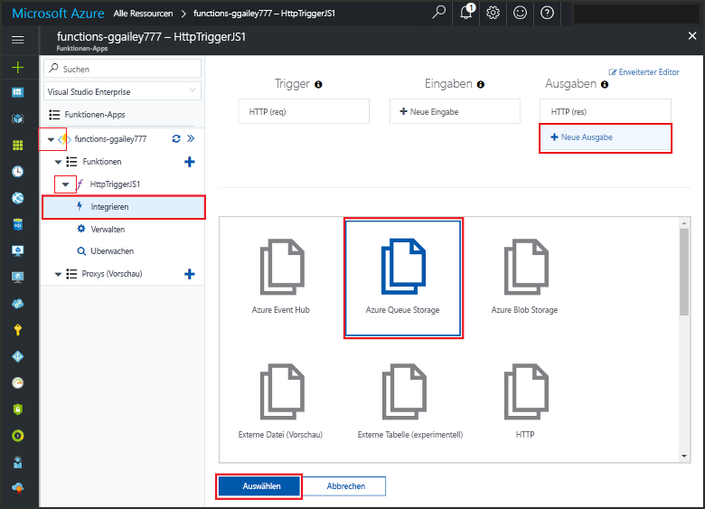
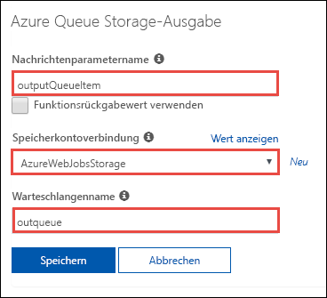

# <a name="add-messages-to-an-azure-storage-queue-using-functions"></a>Hinzufügen von Meldungen in die Warteschlange von Azure Storage mithilfe von Functions

Eingabe- und Ausgabebindungen bieten in Azure Functions eine deklarative Möglichkeit, eine Verbindung mit externen Dienstdaten Ihrer Funktion herzustellen. Erfahren Sie in diesem Thema, wie Sie eine vorhandene Funktion aktualisieren können, indem Sie eine Ausgabebindung hinzufügen, die Meldungen an Azure Queue Storage sendet.  


Für die Schritte in diesem Thema werden in der Regel weniger als fünf Minuten benötigt.

## <a name="prerequisites"></a>Voraussetzungen 

[!INCLUDE [Previous topics](../../includes/functions-quickstart-previous-topics.md)]

Außerdem müssen Sie den [Microsoft Azure Storage-Explorer](http://storageexplorer.com/) herunterladen und installieren. 

[!INCLUDE [functions-portal-favorite-function-apps](../../includes/functions-portal-favorite-function-apps.md)] 

## <a name="add-binding"></a>Ausgabebindung hinzufügen
 
1. Erweitern Sie sowohl Ihre Funktionen-App als auch Ihre Funktion.

2. Klicken Sie auf **Integrieren** und **+ Neue Ausgabe**, und klicken Sie anschließend auf **Azure Queue Storage** und **Auswählen**.
    
    

3. Verwenden Sie dann die in der Tabelle angegebenen Einstellungen, und klicken Sie anschließend auf **Speichern**: 

    

    | Einstellung      |  Empfohlener Wert   | Beschreibung                              |
    | ------------ |  ------- | -------------------------------------------------- |
    | **Warteschlangenname**   | myqueue-items    | Der Name der zu verknüpfenden Warteschlange in Ihrem Speicherkonto. |
    | **Speicherkontoverbindung** | AzureWebJobStorage | Sie können die Speicherkontoverbindung verwenden, die bereits von Ihrer Funktionen-App verwendet wird, oder eine neue erstellen.  |
    | **Name des Meldungsparameters** | outQueueItem | Der Name des Ausgabebindungsparameters | 

Nachdem Sie eine Ausgabebindung definiert haben, müssen Sie den Code aktualisieren, um die Bindung zum Hinzufügen von Meldungen in eine Warteschlange verwenden zu können.  

## <a name="update-the-function-code"></a>Aktualisieren des Funktionscodes

1. Klicken Sie auf die Funktion, um den Funktionscode im Editor anzuzeigen. 

2. Aktualisieren Sie für eine C#-Funktion die Definition der Funktion wie folgt, um den Speicherbindungsparameter **outQueueItem** hinzuzufügen. Überspringen Sie diesen Schritt bei einer JavaScript-Funktion.

    ```cs   
    public static async Task<HttpResponseMessage> Run(HttpRequestMessage req, 
        ICollector<string> outQueueItem, TraceWriter log)
    {
        ....
    }
    ```

3. Fügen Sie folgenden Code der Funktion hinzu, kurz bevor die Methode zurückgibt. Verwenden Sie den Ausschnitt, der der Sprache der Funktion entspricht.

    ```javascript
    context.bindings.outQueueItem = "Name passed to the function: " + 
                (req.query.name || req.body.name);
    ```

    ```cs
    outQueueItem.Add("Name passed to the function: " + name);     
    ```

4. Klicken Sie zum Speichern der Änderungen auf **Speichern**.

Der an den HTTP-Trigger übergebene Wert ist in einer Meldung beinhaltet, die der Warteschlange hinzugefügt wird.
 
## <a name="test-the-function"></a>Testen der Funktion 

1. Nachdem die Änderungen des Codes gespeichert wurden, klicken Sie auf **Ausführen**. 

    

2. Überprüfen Sie die Protokolle, um sicherzustellen, dass die Funktion erfolgreich durchgeführt wurde. Eine neue Warteschlange mit dem Namen **outqueue** wird in Ihrem Speicherkonto von der Laufzeit von Azure Functions erstellt, wenn die Ausgabebindung zum ersten Mal verwendet wird.

Als Nächstes können Sie Ihr Speicherkonto verknüpfen, um die neue Warteschlange und die von Ihnen hinzugefügte Meldung zu überprüfen. 

## <a name="connect-to-the-queue"></a>Herstellen einer Verbindung mit der Warteschlange

Überspringen Sie die ersten drei Schritte, wenn Sie Storage-Explorer bereits installiert und mit Ihrem Speicherkonto verbunden haben.    

1. Klicken Sie in der Funktion auf **Integrieren** und auf die neue Ausgabebindung von **Azure Queue Storage**, und erweitern Sie anschließend die **Dokumentation**. Notieren Sie sich sowohl den **Kontonamen** als auch den **Kontoschlüssel**. Diese Anmeldeinformationen benötigen Sie für die Verbindung mit dem Speicherkonto.
 
    

2. Führen Sie das Tool [Microsoft Azure Storage-Explorer](http://storageexplorer.com/) aus, klicken Sie auf das Verbindungssymbol auf der linken Seite, wählen Sie **Use a storage account name and key** (Name und Schlüssel eines Speicherkontos verwenden) aus, und klicken Sie anschließend auf **Weiter**.

    
    
3. Geben Sie den **Kontonamen** und den **Kontoschlüssel** aus Schritt 1 ein, klicken Sie auf **Weiter** und dann auf **Verbinden**. 
  
    

4. Erweitern Sie das angefügte Speicherkonto, klicken Sie mit der rechten Maustaste auf **Warteschlangen**, und stellen Sie sicher, dass die Warteschlange **myqueue-items** vorhanden ist. Außerdem sollten Sie bereits eine Meldung in der Warteschlange sehen.  
 
    
 

## <a name="clean-up-resources"></a>Bereinigen von Ressourcen

[!INCLUDE [Next steps note](../../includes/functions-quickstart-cleanup.md)]

## <a name="next-steps"></a>Nächste Schritte

Sie haben eine Ausgabebindung in eine vorhandene Funktion hinzugefügt. 

[!INCLUDE [Next steps note](../../includes/functions-quickstart-next-steps.md)]

Weitere Informationen zu Bindungen an Queue Storage finden Sie unter [Azure Storage-Warteschlangenbindungen in Azure Functions](functions-bindings-storage-queue.md). 


