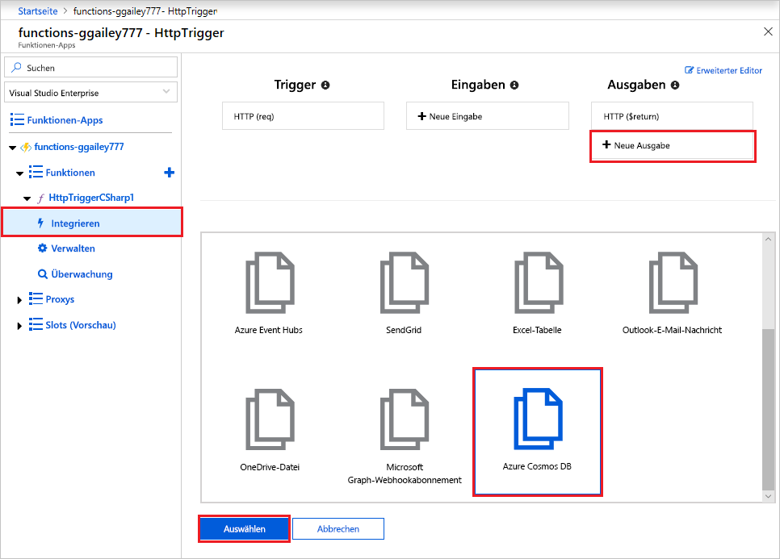

# <a name="store-unstructured-data-using-azure-functions-and-cosmos-db"></a>Speichern von unstrukturierten Daten mit Azure Functions und Cosmos DB

Azure Cosmos DB eignet sich hervorragend zum Speichern von unstrukturierten Daten und JSON-Daten. In Kombination mit Azure Functions ermöglicht Cosmos DB das schnelle und einfache Speichern von Daten. Dabei ist viel weniger Code erforderlich als beim Speichern von Daten in einer relationalen Datenbank.

In diesem Tutorial wird ausführlich erläutert, wie Sie mit dem Azure-Portal eine Azure-Funktion erstellen, die unstrukturierte Daten in einem Cosmos DB-Dokument speichert. 

## <a name="prerequisites"></a>Voraussetzungen

[!INCLUDE [Previous quickstart note](../../includes/functions-quickstart-previous-topics.md)]

[!INCLUDE [functions-portal-favorite-function-apps](../../includes/functions-portal-favorite-function-apps.md)]

## <a name="create-a-function"></a>Erstellen einer Funktion

Erstellen Sie einen neuen generischen C#-Webhook mit dem Namen `MyTaskList`.

1. Erweitern Sie die vorhandene Liste der Funktionen, und klicken Sie zum Erstellen einer neuen Funktion auf das Pluszeichen (+).
1. Wählen Sie „GenericWebHook-CSharp“, und geben Sie der App den Namen `MyTaskList`.


## <a name="add-an-output-binding"></a>Hinzufügen einer Ausgabebindung

Eine Azure-Funktion kann über einen Trigger und eine beliebige Anzahl von Eingabe- oder Ausgabebindungen verfügen. In diesem Beispiel verwenden wir einen HTTP-Anforderungstrigger und das Cosmos DB-Dokument als Ausgabebindung.

1. Klicken Sie auf die Registerkarte *Integrieren* der Funktion, um den Trigger und die Bindungen der Funktion anzuzeigen oder zu ändern.
1. Wählen Sie oben rechts auf der Seite den Link *Neue Ausgabe*.

Hinweis: Der HTTP-Anforderungstrigger ist bereits konfiguriert, Sie müssen jedoch die Cosmos DB-Dokumentbindung hinzufügen.



1. Geben Sie die erforderlichen Informationen ein, um die Bindung zu erstellen. Bestimmen Sie die Werte anhand der folgenden Tabelle.


|  Feld | Wert  |
|---|---|
| Dokumentparametername | Name, der auf das Cosmos DB-Objekt im Code verweist |
| Datenbankname | Name der Datenbank zum Speichern von Dokumenten |
| Sammlungsname | Name der Gruppierung von Cosmos DB-Datenbanken |
| Would you like the Cosmos DB and collection created for you (Sollen die Cosmos DB-Datenbank und die Sammlung für Sie erstellt werden?) | Ja oder nein |
| Cosmos DB account connection (Cosmos DB-Kontoverbindung) | Verbindungszeichenfolge, die auf die Cosmos DB-Datenbank verweist |

Darüber hinaus müssen Sie die Verbindung mit der Cosmos DB-Datenbank konfigurieren.

1. Klicken Sie neben dem Feld „Cosmos DB document connection“ (Cosmos DB-Dokumentverbindung) auf den Link „Neu“.
1. Füllen Sie die Felder aus, und wählen Sie die zum Erstellen des Cosmos DB-Dokuments erforderlichen Optionen aus.


|  Feld | Wert  |
|---|---|
| ID | Eindeutige ID für die Cosmos DB-Datenbank  |
| NoSQL-API | Cosmos DB oder MongoDB  |
| Abonnement | MSDN-Abonnement  |
| Ressourcengruppe  | Erstellen Sie eine neue Gruppe, oder wählen Sie eine vorhandene Gruppe aus.  |
| Ort  | Europa, Westen  |

1. Klicken Sie auf die Schaltfläche *OK* . Unter Umständen müssen Sie einige Minuten warten, während die Ressourcen von Azure erstellt werden.
1. Klicken Sie auf die Schaltfläche *Save* .

## <a name="update-the-function-code"></a>Aktualisieren des Funktionscodes

Ersetzen Sie den Vorlagencode der Funktion durch den folgenden Code.

Beachten Sie, dass der Code für dieses Beispiel nur in C# geschrieben ist.

```csharp
using System.Net;

public static HttpResponseMessage Run(HttpRequestMessage req, out object taskDocument, TraceWriter log)
{
    string name = req.GetQueryNameValuePairs()
        .FirstOrDefault(q => string.Compare(q.Key, "name", true) == 0)
        .Value;

    string task = req.GetQueryNameValuePairs()
        .FirstOrDefault(q => string.Compare(q.Key, "task", true) == 0)
        .Value;

    string duedate = req.GetQueryNameValuePairs()
        .FirstOrDefault(q => string.Compare(q.Key, "duedate", true) == 0)
        .Value;

    taskDocument = new {
        name = name,
        duedate = duedate.ToString(),
        task = task
    };

    if (name != "" && task != "") {
        return req.CreateResponse(HttpStatusCode.OK);
    }
    else {
        return req.CreateResponse(HttpStatusCode.BadRequest);
    }
}

```

Dieses Codebeispiel liest die Abfragezeichenfolgen der HTTP-Anforderung und weist sie als Mitglieder eines `taskDocument`-Objekts zu. Das `taskDocument`-Objekt speichert die Daten automatisch in der Cosmos DB-Datenbank und erstellt die Datenbank sogar bei der ersten Verwendung.

## <a name="test-the-function-and-database"></a>Testen der Funktion und der Datenbank

1. Klicken Sie auf der Registerkarte der Funktion rechts im Portal auf den Link *Testen*, und geben Sie die folgenden HTTP-Abfragezeichenfolgen ein:

| Abfragezeichenfolge | Wert |
|---|---|
| Name | Chris P. Bacon |
| task | Make a BLT sandwich |
| duedate | 05/12/2017 |

1. Klicken Sie auf den Link *Ausführen*.
1. Stellen Sie sicher, dass die Funktion den Antwortcode *HTTP 200 OK* zurückgegeben hat.


Vergewissern Sie sich, dass in der Cosmos DB-Datenbank ein Eintrag erstellt wurde.

1. Suchen Sie Ihre Datenbank im Azure-Portal, und wählen Sie sie aus.
1. Wählen Sie die Option *Daten-Explorer*.
1. Erweitern Sie die Knoten, bis die Einträge des Dokuments angezeigt werden.
1. Überprüfen Sie den Datenbankeintrag. Neben Ihren Daten werden zusätzliche Metadaten in der Datenbank angezeigt.


Wenn die Daten im Dokument enthalten sind, haben Sie eine Azure-Funktion erstellt, die unstrukturierte Daten in einer Cosmos DB-Datenbank speichert.

## <a name="clean-up-resources"></a>Bereinigen von Ressourcen

[!INCLUDE [Next steps note](../../includes/functions-quickstart-cleanup.md)]

## <a name="next-steps"></a>Nächste Schritte

Weitere Informationen zu Azure Functions finden Sie in den folgenden Themen:

[!INCLUDE [Getting help note](../../includes/functions-get-help.md)]

[!INCLUDE [functions-quickstart-next-steps](../../includes/functions-quickstart-next-steps.md)]
